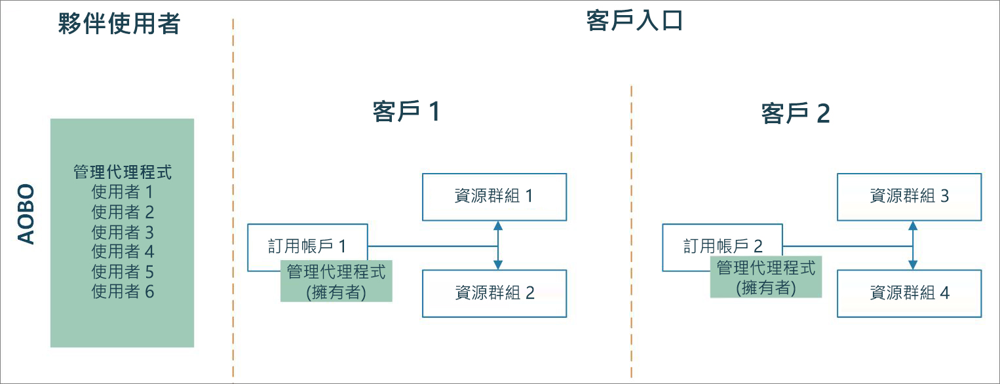
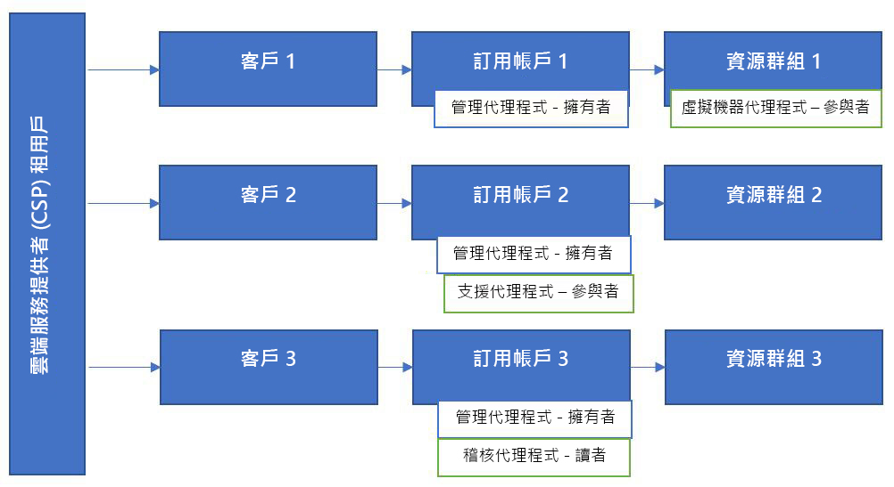

# Azure Lighthouse 與雲端解決方案提供者計畫

如果您是 [CSP (雲端解決方案提供者)](https://docs.microsoft.com/partner-center/csp-overview) 合作夥伴，您可以使用[管理代表 (AOBO)](https://channel9.msdn.com/Series/cspdev/Module-11-Admin-On-Behalf-Of-AOBO) \(英文\) 功能，存取透過 CSP 計畫為您客戶建立的 Azure 訂用帳戶。 此存取權可讓您直接支援、設定及管理客戶的訂用帳戶。

AOBO 機制會授與客戶環境的完整存取權。 搭配使用 Azure 委派的資源管理和 AOBO，可讓您透過為使用者啟用更細部的權限，來減少不必要的存取，進而改善安全性。 

## 管理代表 (AOBO)

若使用 AOBO，則您租用戶中有[系統管理代理人](https://docs.microsoft.com/partner-center/permissions-overview#manage-commercial-transactions-in-partner-center-azure-ad-and-csp-roles)角色的任何使用者，都能使用 AOBO 來存取您透過 CSP 計畫建立的 Azure 訂用帳戶。 需要存取任何客戶訂用帳戶的任何使用者，都必須是此群組的成員。 AOBO 不允許建立搭配不同客戶來使用的不同群組，或為群組或使用者建立不同角色的彈性設定。

## Azure 委派的資源管理

若使用 Azure 委派的資源管理，您可以將不同群組指派至不同客戶或角色，如下列圖表所示。 因為使用 Azure 委派的資源管理，使用者會有適當層級的存取權，所以您可減少有「系統管理代理人」角色 (因此有完整 AOBO 存取權) 的使用者數目。 這樣可透過限制對您客戶資源的不必要存取，而提供更好的安全性。 此外，這也讓您能更有彈性地大規模管理多個客戶。

依照[將訂用帳戶上線至 Azure 委派的資源管理](../how-to/onboard-customer.md) \(英文\) 中所描述的步驟，將您透過 CSP 計畫所建立的訂用帳戶上線。 您租用戶中有「系統管理代理人」角色的任何使用者都能執行此上線作業。

請注意，透過 CSP 計畫建立的租用戶，只能由服務提供者租用戶中有「系統管理代理人」角色的使用者產生支援要求。 透過 Azure 委派的資源管理加入的使用者，無法針對這些訂用帳戶中的委派資源建立支援要求。

## 合作夥伴管理連結

您可以將您的 Microsoft 合作夥伴網路 (MPN) 識別碼與您發佈的供應項目建立關聯，以追蹤您對客戶參與整體的影響。

如果您[將受控服務供應項目發佈至 Azure Marketplace](../how-to/publish-managed-services-offers.md)，則您的 MPN 識別碼會與您的發行者設定檔相關聯，並且自動與供應項目相關聯。 Azure 資源透過此供應項目所產生收益，將會歸於您的組織。 在合作夥伴中心或 MPN 中，歸屬會顯示為夥伴系統管理連結 (PAL)。

如果您[使用 Azure Resource Manager 將客戶上線至 Azure 委派的資源管理](../how-to/onboard-customer.md)，您仍然可為您的 MPN 識別碼建立關聯，以接收您對客戶參與影響的表彰，但您無法手動這麼做。 如需詳細資訊，請參閱[將合作夥伴識別碼連結到您的 Azure 帳戶](https://docs.microsoft.com/azure/billing/billing-partner-admin-link-started) \(部分機器翻譯\)。 

## 後續步驟

- 了解[跨租用戶管理體驗](cross-tenant-management-experience.md)。
- 了解[雲端解決方案提供者計畫](https://docs.microsoft.com/partner-center/csp-overview)。
