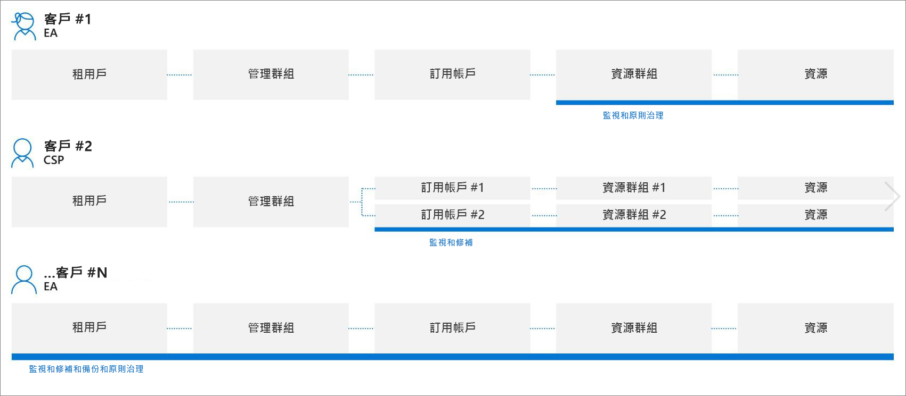
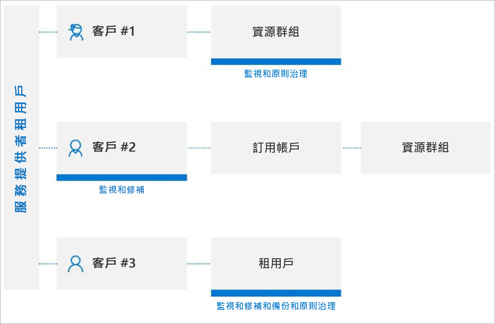

# 跨租用戶管理體驗

此文章說明身為服務提供者的您可以搭配 [Azure 委派的資源管理](../concepts/azure-delegated-resource-management.md)來從您位於 [Azure 入口網站](https://portal.azure.com)的租用戶內管理多個客戶的 Azure 資源的案例。

> [!NOTE]
> Azure 委派的資源管理也可以用於擁有多個租用戶的企業內，以簡化跨租用戶管理。

## 了解客戶租用戶

Azure Active Directory (Azure AD) 租用戶是組織的代表。 它是組織會在註冊 Azure、Microsoft 365 或其他服務，並與 Microsoft 建立關聯性時接收到的 Azure AD 專用執行個體。 每個 Azure AD 租用戶都不同，並與其他 Azure AD 租用戶分開，且具有自己的租用戶識別碼 (GUID)。 如需詳細資訊，請參閱[什麼是 Azure Active Directory？](https://docs.microsoft.com/azure/active-directory/fundamentals/active-directory-whatis)

通常，服務提供者若要為客戶管理 Azure 資源，便必須使用與該客戶的租用戶相關聯的帳戶登入 Azure 入口網站，這要求客戶租用戶中的系統管理員必須為服務提供者建立並管理使用者帳戶。

透過使用 Azure 委派的資源管理，上線程序會在服務提供者的租用戶中指定能存取並管理客戶租用戶中的訂用帳戶、資源群組與資源的使用者。 這些使用者接著便可以使用自己的認證登入 Azure 入口網站。 在 Azure 入口網站內，他們可以管理屬於所有客戶，且其具有存取權的資源。 若要這樣做，請瀏覽 Azure 入口網站中的[我的客戶](../how-to/view-manage-customers.md)頁面，或是在 Azure 入口網站中或透過 API 直接在該客戶的訂用帳戶內容中工作。

Azure 委派的資源管理能為管理多個客戶的資源提供更具彈性的方式，使您不需要在不同的租用戶中登入不同的帳戶。 例如，某個服務提供者可能有三個客戶，並針對他們都具有不同的責任和存取層級，如這裡所示：

透過使用 Azure 委派的資源管理，已授權的使用者便可以登入服務提供者的租用戶以存取這些資源，如這裡所示：

## 支援的服務與案例

目前，跨租用戶管理體驗支援搭配委派之客戶資源的下列案例：

[Azure 自動化](https://docs.microsoft.com/azure/automation/)：

- 使用自動化帳戶來存取及處理委派的客戶資源

[Azure 備份](https://docs.microsoft.com/azure/backup/)：

- 備份及還原客戶租用戶中的客戶資料

[Azure Kubernetes Service (AKS)](https://docs.microsoft.com//azure/aks/) \(部分機器翻譯\)：

- 管理託管的 Kubernetes 環境並部署及管理客戶租用戶內的容器化應用程式

[Azure 監視器](https://docs.microsoft.com/azure/azure-monitor/)：

- 在 Azure 入口網站中或透過 REST API 呼叫以程式設計方式來檢視委派之訂用帳戶的警示，同時能夠檢視所有訂用帳戶上的警示
- 檢視委派之訂用帳戶的活動記錄詳細資料
- 記錄分析：來自多個租用戶中的遠端客戶工作區的查詢資料
- 在客戶租用戶中建立警示，以透過 Webhook 在服務提供者租用戶中觸發自動化 (例如 Azure 自動化 Runbook 或 Azure Functions)

[Azure 原則](https://docs.microsoft.com/azure/governance/policy/) \(部分機器翻譯\)：

- 顯示委派之訂用帳戶內的已指派原則詳細資料的合規性快照集
- 在委派的訂用帳戶內建立及編輯原則定義
- 在委派的訂用帳戶內指派客戶所定義的原則定義
- 客戶會看到由服務提供者所撰寫的原則，以及他們自己撰寫的所有原則
- 可以[補救 deployIfNotExists 或修改客戶租用戶內的指派](../how-to/deploy-policy-remediation.md)

[Azure Resource Graph](https://docs.microsoft.com/azure/governance/resource-graph/) \(部分機器翻譯\)：

- 現在會在傳回的查詢結果中包含租用戶識別碼，以讓您識別某個訂用帳戶是否屬於客戶租用戶或服務提供者租用戶

[Azure 資訊安全中心](https://docs.microsoft.com/azure/security-center/)：

- 跨租用戶可見性
  - 監視安全性原則的合規性，並確保安全性涵蓋範圍會涵蓋所有租用戶的資源
  - 在單一檢視中針對多個客戶進行持續性的法規合規性監視
  - 透過安全分數計算對可採取動作的安全性建議進行監視、分級和設定優先權
- 跨租用戶安全性狀態管理
  - 管理安全性原則
  - 透過可採取動作的安全性建議對不符合規範的資源採取動作
  - 收集及儲存安全性相關的資料
- 跨租用戶威脅偵測和保護
  - 偵測租用戶資源上的威脅
  - 套用進階威脅防護控制措施，例如 Just-In-Time (JIT) VM 存取
  - 透過自適性網路強化來強化網路安全性群組設定
  - 透過自適性應用程式控制來確保伺服器只會執行適當的應用程式與處理序
  - 透過檔案完整性監視 (FIM) 來監視對重要檔案與登錄的變更

[Azure Sentinel](https://docs.microsoft.com/azure/sentinel/multiple-tenants-service-providers)：

- 管理客戶租用戶中的 Azure Sentinel 資源

[Azure 服務健康情況](https://docs.microsoft.com/azure/service-health/)：

- 透過 Azure 資源健康情況來監視客戶資源的健康情況
- 追蹤客戶所使用之 Azure 服務的健康情況

[Azure Site Recovery](https://docs.microsoft.com/azure/site-recovery/)：

- 管理客戶租用戶中 Azure 虛擬機器的災害復原選項 (請注意，您無法使用 RunAs 帳戶來複製 VM 擴充功能)

[Azure 虛擬機器](https://docs.microsoft.com/azure/virtual-machines/) \(部分機器翻譯\)：

- 使用虛擬機器擴充功能來在客戶租用戶中的 Azure VM 上提供部署後設定及自動化工作
- 使用開機診斷來針對客戶租用戶中的 Azure VM 進行疑難排解
- 透過客戶租用戶中的序列主控台來存取 VM
- 請注意，您無法使用 Azure Active Directory 來從遠端登入 VM，且您無法將 VM 與 Key Vault 整合以取得用於磁碟加密的密碼、祕密或密碼編譯金鑰

[Azure 虛擬網路](https://docs.microsoft.com/azure/virtual-network/)：

- 部署及管理客戶租用戶內的虛擬網路與虛擬網路介面卡 (vNIC)

支援要求：

- 從 Azure 入口網站中的 [說明 + 支援]  刀鋒視窗開啟委派資源的支援要求 (選取可供委派範圍使用的支援方案)

## 目前的限制
在所有案例中，請留意下列目前限制：

- 由 Azure Resource Manager 所處理的要求可以使用 Azure 委派的資源管理來執行。 這些要求的作業 URI 會以 `https://management.azure.com` 作為開頭。 不過，由某個資源類型 (例如 KeyVault 祕密存取或儲存體資料存取) 的執行個體所處理的要求，並不支援 Azure 委派的資源管理。 這些要求的作業 URI 通常會以您執行個體特有的位址作為開頭，例如 `https://myaccount.blob.core.windows.net` 或 `https://mykeyvault.vault.azure.net/`。 此外，後者通常是資料作業，而非管理作業。 
- 角色指派必須使用角色型存取控制 (RBAC) [內建角色](https://docs.microsoft.com/azure/role-based-access-control/built-in-roles) \(部分機器翻譯\)。 除了「擁有者」、「使用者存取系統管理員」，或是具有 [DataActions](https://docs.microsoft.com/azure/role-based-access-control/role-definitions#dataactions) \(部分機器翻譯\) 權限的任何內建角色以外，所有內建角色目前都支援 Azure 委派的資源管理。 此外，也不支援自訂角色與[傳統訂用帳戶管理員角色](https://docs.microsoft.com/azure/role-based-access-control/classic-administrators) \(部分機器翻譯\)。
- 目前，如果訂用帳戶是使用 Azure Databricks，您便無法將該訂用帳戶 (或資源群組內的訂用帳戶) 上線以用於 Azure 委派的資源管理。 同樣地，如果已透過 **Microsoft.ManagedServices** 資源提供者來註冊某個訂用帳戶以進行上線，您目前將無法為該訂用帳戶建立 Databricks 工作區。

## 搭配跨租用戶管理使用 API 與管理工具

針對以上所列的支援服務與案例，您可以直接在入口網站中，或是使用 API 與管理工具 (例如 Azure CLI 和 Azure PowerShell) 來執行管理工作。 處理委派的資源時，將可以 (針對所支援的服務) 使用所有現有的 API。

此外還有專門用來執行 Azure 委派的資源管理工作的 API。 如需詳細資訊，請參閱**參考**一節。

## 後續步驟

- 將客戶上線至 Azure 委派的資源管理，方法是透過[使用 Azure Resource Manager 範本](../how-to/onboard-customer.md)或[將私人或公開受控服務供應項目發佈至 Azure Marketplace](../how-to/publish-managed-services-offers.md)。
- 前往 Azure 入口網站中的 [我的客戶]  ，來[檢視和管理客戶](../how-to/view-manage-customers.md)。
