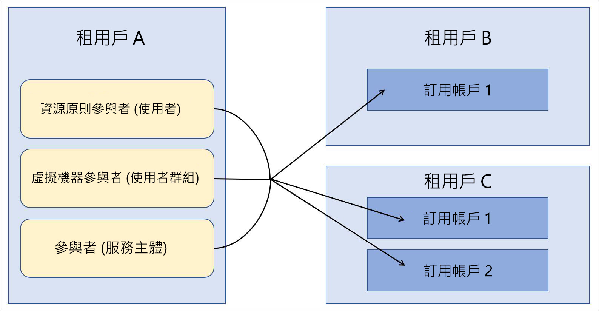

# Azure Lighthouse 在企業案例中的運用

Azure Lighthouse 最常見的案例是在其客戶的 Azure Active Directory (Azure AD) 租用戶中管理資源的服務提供者。 不過，Azure Lighthouse 的功能也可在使用多個 Azure AD 租用戶的企業內用來簡化跨租用戶管理。

## 單一與多個租用戶的比較

對於大部分的組織而言，單一 Azure AD 租用戶的管理比較輕鬆。 讓一個租用戶內的所有資源，都可由指定的使用者、使用者群組，或該租用戶內的服務主體集中進行管理工作。 我們建議盡可能讓貴組織使用一個租用戶。

同時，在某些情況下，組織可能需要維護多個 Azure AD 租用戶。 在某些案例中，這可能是暫時性情況，像是在進行收購時，需要一些時間來定義長期租用戶彙總策略。 組織可能也需要持續維護多個租用戶 (因為完全獨立的子公司、地理或法律需求等等)。 在需要多租用戶架構的情況下，可以使用 Azure 委派的資源管理來集中處理及簡化管理作業。 您可將來自多個租用戶的訂用帳戶上架，以進行 [Azure 委派的資源管理](azure-delegated-resource-management.md)，讓管理租用戶中指定的使用者以集中且可調整的方式執行[跨租用戶管理功能](cross-tenant-management-experience.md)。

## 租用戶管理架構

集中進行跨多個租用戶的管理作業時，您必須判斷哪個租用戶將包含對其他租用戶執行管理作業的使用者。 換句話說，您必須判斷哪個租用戶會是其他租用戶的管理租用戶。

例如，假設貴組織有一個我們會稱之為「租用戶 A」  的租用戶。貴組織接著會取得兩個額外的租用戶 (「租用戶 B」  和「租用戶 C」  )，而您有需要將其當作個別租用戶維護的商務理由。

貴組織想要在所有租用戶中使用相同的原則定義、備份做法和安全性程序。 由於您已經有負責在租用戶 A 中執行這些工作的使用者 (包括使用者群組和服務主體)，因此您可以將租用戶 B 和租用戶 C 內的所有訂用帳戶上架，讓租用戶 A 中的這些使用者可以執行這些作業。

## 安全性和存取考量

在大部分的企業案例中，您會想要針對 Azure 委派的資源管理委派完整訂用帳戶，但您也可以只委派訂用帳戶內的特定資源群組。

無論如何，[在定義哪些使用者可存取資源時，請務必遵循最低權限的準則](recommended-security-practices.md#assign-permissions-to-groups-using-the-principle-of-least-privilege)。 這麼做有助於確保使用者只擁有執行必要工作所需的權限，並可減少意外錯誤的機會。

Azure Lighthouse 和 Azure 委派的資源管理只會提供管理租用戶與受控租用戶之間的邏輯連結，而不會實際移動資料或資源。 此外，存取一律只限單一方向：從管理租用戶到受控租用戶。  管理租用戶中的使用者和群組在對受控租用戶資源執行管理作業時，應繼續使用多重要素驗證。

具有內部或外部治理和合規性防護的企業可以使用 [Azure 活動記錄](https://docs.microsoft.com/azure/azure-monitor/platform/activity-logs-overview)來符合其透明度需求。 當企業租用戶已建立管理和受控租用戶關聯性時，每個租用戶中的使用者均可藉由檢視已記錄的活動，監視及看見另一個租用戶中使用者所採取的動作。

## 上架程序考慮

訂用帳戶 (或訂用帳戶內的資源群組) 可藉由部署 Azure Resource Manager 範本，或透過發佈至 Azure Marketplace 的受控服務供應項目 (私下或公開) 上架至 Azure 委派的資源管理。

由於企業使用者通常能夠直接存取企業的租用戶，因此不需要行銷或推廣管理供應項目，而直接透過 Azure Resource Manager 範本進行部署通常更快速且更直接。 雖然我們在[上架指引](../how-to/onboard-customer.md)中提及服務提供者和客戶，但企業可以使用相同的程序。

如果您想要，[將受控服務供應項目發佈至 Azure Marketplace](../how-to/publish-managed-services-offers.md)，即可在企業內將租用戶上架。 若要確保供應項目僅適用於適當的租用戶，請確定您的方案已標示為私人。 有了私人方案，您就可以為您打算上架的每個租用戶提供訂用帳戶識別碼，而其他人便無法取得您的供應項目。

## 術語注意事項

對於企業內的跨租用戶管理，可理解 Azure Lighthouse 文件中服務提供者的參考會套用至企業內的管理租用戶，也就是包含將透過 Azure 委派的資源管理來管理其他租用戶內資源的租用戶。 同樣地，也可理解客戶的參考會套用至委派資源要透過管理租用戶中的使用者進行管理的租用戶。

例如，在上述範例中，可以將租用戶 A 視為服務提供者租用戶 (管理租用戶)，而租用戶 B 和租用戶 C 則被視為客戶租用戶。

在該範例中，具有適當權限的租用戶 A 使用者可以在 Azure 入口網站的 [我的客戶]  頁面中，[檢視和管理委派的資源](../how-to/view-manage-customers.md)。 同樣地，具有適當權限的租用戶 B 和租用戶 C 使用者可以在 Azure 入口網站的 [服務提供者]  頁面中，[檢視和管理已被委派的資源](../how-to/view-manage-service-providers.md)。

## 後續步驟

- 了解[跨租用戶管理體驗](cross-tenant-management-experience.md)。
- 了解 [Azure 委派的資源管理](azure-delegated-resource-management.md)。