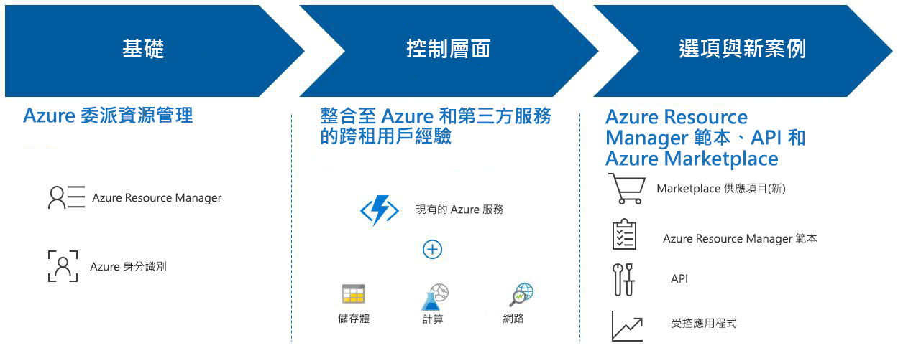

# 什麼是 Azure Lighthouse ？

Azure Lighthouse 可讓服務提供者在單一控制平面中，以較高的自動化、較大的規模和加強的治理性，檢視及管理所有客戶的 Azure。 透過 Azure Lighthouse，服務提供者可以使用內建於 Azure 平台、完整且強大的管理工具來傳遞受控服務。 此供應項目也能為跨多個租用戶管理資源的企業 IT 組織帶來好處。

## 優點

Azure Lighthouse 可協助您以符合成本效益且有效的方式，為客戶建置並傳遞受控服務。 其優點包括：

- **大規模管理**：客戶業務開發和用來管理客戶資源的生命週期作業，已變得更加簡易且可調整。
- **客戶能取得更高的可見度和精確度**：您所管理之資源的客戶將能對您的動作取得更高的可見度，以及針對其所委派的管理範圍取得更精確的控制，同時將能保留您的 IP。
- **完整且整合的平台工具**：我們的工具體驗能解決重要的服務提供者案例，其中包括多個授權模型 (例如 EA、CSP 和隨用隨付)。 新的功能將能搭配現有的工具和 API、授權模型，以及如[雲端解決方案提供者計畫 (CSP)](https://docs.microsoft.com/partner-center/csp-overview) 之類的合作夥伴計畫使用。 您所選擇的 Azure Lighthouse 選項可整合到您的現有工作流程與應用程式中，而且您可以透過[連結您的合作夥伴識別碼](https://docs.microsoft.com/azure/billing/billing-partner-admin-link-started) \(部分機器翻譯\) 來追蹤您對客戶業務開發的影響。

使用 Azure Lighthouse 來管理您客戶的 Azure 資源並不會產生額外的費用。

## 功能

Azure Lighthouse 包含多種方法，可協助簡化客戶業務開發及管理：

- **Azure 委派的資源管理**：從您自己的租用戶內安全地管理客戶的 Azure 資源，而不需要切換內容和控制平面。 如需詳細資訊，請參閱 [Azure 委派的資源管理](./concepts/azure-delegated-resource-management.md) \(英文\)。
- **新的 Azure 入口網站體驗**：在 [Azure 入口網站](https://portal.azure.com)的新 [我的客戶]  頁面中檢視跨租用戶資訊。 相對應的 [服務提供者]  刀鋒視窗能讓您的客戶檢視及管理服務提供者存取權。 如需詳細資訊，請參閱[檢視和管理客戶](./how-to/view-manage-customers.md)與[檢視和管理服務提供者](./how-to/view-manage-service-providers.md)。
- **Azure Resource Manager 範本**：更輕鬆地執行管理工作，包括針對 Azure 委派的資源管理對客戶進行上線。 如需詳細資訊，請參閱我們的[範例存放庫](https://github.com/Azure/Azure-Lighthouse-samples/tree/master/Azure-Delegated-Resource-Management/templates) \(英文\)，以及[讓客戶在 Azure 委派的資源管理中上線](how-to/onboard-customer.md)。
- **Azure Marketplace 中的受控服務供應項目**：透過私人或公用供應項目來將服務提供給客戶，並讓系統將他們自動上線至 Azure 委派的資源管理，作為使用 Azure Resource Manager 範本進行上線的替代方案。 如需詳細資訊，請參閱 [Azure Marketplace 中的受控服務供應項目](./concepts/managed-services-offers.md)。
- **Azure 受控應用程式**：封裝並交付客戶能輕鬆部署，並用於其訂用帳戶的應用程式。 應用程式會被部署至您可從自己的租用戶存取的資源群組中，這能讓您以和整體 Azure Lighthouse 體驗整合在一起的形式來管理該服務。 如需詳細資訊，請參閱 [Azure 受控應用程式概觀](https://docs.microsoft.com/azure/managed-applications/overview)。

> [!NOTE]
> 上述功能目前已在公用雲端中提供。 針對個別服務的區域可用性，請參閱[依區域提供的產品](https://azure.microsoft.com/global-infrastructure/services/)。

## 後續步驟

- 了解 [Azure 委派的資源管理](concepts/azure-delegated-resource-management.md)。
- 了解[跨租用戶管理體驗](concepts/cross-tenant-management-experience.md)。
