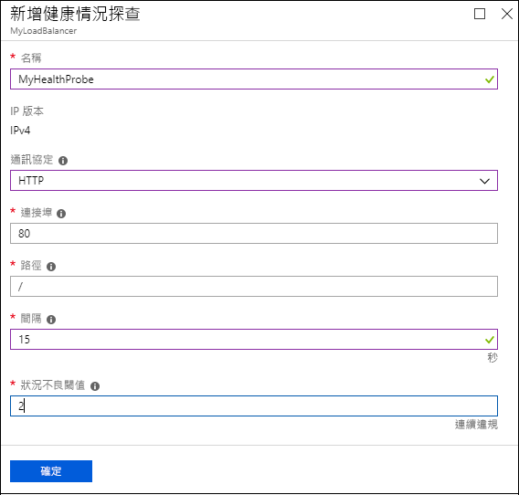
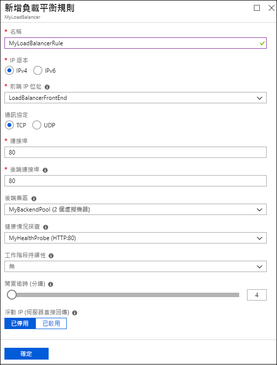

# 快速入門：使用 Azure 入口網站建立公用基本負載平衡器

負載平衡會將傳入要求分散於多部虛擬機器 (VM)，藉此提供高可用性和範圍。 您可使用 Azure 入口網站建立負載平衡器，以平衡虛擬機器的負載。 本快速入門示範如何建立網路資源、後端伺服器，以及基本定價層的負載平衡器。

如果您沒有 Azure 訂用帳戶，請在開始前建立 [免費帳戶](https://azure.microsoft.com/free/?WT.mc_id=A261C142F) 。 

## 登入 Azure 入口網站

若要進行本快速入門中的所有工作，請登入 [Azure 入口網站](http://portal.azure.com)。

## 建立基本負載平衡器

在本節中，您會使用入口網站建立公用基本負載平衡器。 當您使用入口網站建立公用 IP 和負載平衡器資源時，系統會將公用 IP 位址自動設定為負載平衡器的前端。 前端的名稱是 **myLoadBalancer**。

1. 在入口網站的左上方，選取 [建立資源] > [網路] > [負載平衡器]。
2. 在 [建立負載平衡器] 窗格中，輸入下列值：
   - [myLoadBalancer] 作為負載平衡器的名稱
   - [公用] 作為負載平衡器的類型 
   - [myPublicIP] 作為您必須建立的公用 IP，其 [SKU] 設定為 [基本]，而 [指派] 設定為 [動態]
   - **myResourceGroupLB** 作為新資源群組的名稱
3. 選取 [建立] 。
   

## 建立後端伺服器

本節中，您會建立一個虛擬網路，以及針對基本負載平衡器的後端集區建立兩部虛擬機器。 然後在虛擬機器上安裝 Internet Information Services (IIS)，協助測試負載平衡器。

### 建立虛擬網路
1. 在入口網站的左上方，選取 [建立資源] > [網路] > [負載平衡器]。
2. 在 [建立虛擬網路] 窗格中輸入下列值，然後選取 [建立]：
   - **myVnet** 作為虛擬網路的名稱
   - [myResourceGroupLB] 作為現有資源群組的名稱
   - [myBackendSubnet] 作為子網路名稱

   

### 建立虛擬機器

1. 在入口網站的左上方，選取 [新增] > [計算] > [Windows Server 2016 資料中心]。 
2. 針對虛擬機器輸入下列值，然後選取 [確定]：
   - [myVM1] 作為虛擬機器的名稱。        
   - [azureuser] 作為系統管理員使用者名稱。    
   - [myResourceGroupLB] 作為資源群組。 (在 [資源群組] 之下，選取 [使用現有的]，然後選取 [myResourceGroupLB]。)   
3. 選取 [DS1_V2] 作為虛擬機器的大小，然後按一下 [選取]。
4. 輸入 VM 設定的下列值：
   - [myAvailabilitySet] 作為您建立的新可用性設定組名稱。
   - [myVnet] 作為虛擬網路的名稱。 (確定已選取。)
   - [myBackendSubnet] 作為子網路名稱。 (確定已選取。)
   - [myVM1-ip] 作為公用 IP 位址。
   - [myNetworkSecurityGroup] 作為您必須建立之新網路安全性群組 (NSG，一種防火牆類型) 的名稱。
5. 選取 [停用] 來停用開機診斷。
6. 選取 [確定]，檢閱 [摘要] 頁面上的設定，然後選取 [建立]。
7. 使用步驟 1 到 6，建立名為 **VM2** 的第二個 VM，並以：
   - [myAvailabilityset] 作為可用性設定組
   - [myVnet] 作為虛擬網路。
   - [myBackendSubnet] 作為子網路。
   - [myNetworkSecurityGroup] 作為網路安全性群組。 

### 建立 NSG 規則

在本節中，您會建立 NSG 規則，以允許使用 HTTP 與 RDP 的輸入連線。

1. 在左側功能表上，選取 [所有資源]。 從資源清單，選取 **myResourceGroupLB** 資源群組中的 **myNetworkSecurityGroup**。
2. 在 [設定] 下，選取 [輸入安全性規則]，然後選取 [新增]。
3. 針對名為 **myHTTPRule** 的輸入安全性規則輸入下列值，以允許使用連接埠 80 的輸入 HTTP 連線。 然後選取 [確定]。
   - [服務標記] 作為 [來源]
   - [網際網路] 作為 [來源服務標記]
   - [80] 作為 [目的地連接埠範圍]
   - [TCP] 作為 [通訊協定]
   - [允許] 作為 [動作]
   - 100 作為 [優先順序]
   - [myHTTPRule] 作為 [名稱]
   - [允許 HTTP] 作為 [描述]
 
   
4. 重複步驟 2 到 3 來建立另一個名為 myRDPRule 的規則，以允許透過連接埠 3389 的輸入 RDP 連線。 輸入下列值：
   - [服務標記] 作為 [來源]
   - [網際網路] 作為 [來源服務標記]
   - [3389] 作為 [目的地連接埠範圍]
   - [TCP] 作為 [通訊協定]
   - [允許] 作為 [動作]
   - 200 作為 [優先順序]
   - [myRDPRule] 作為 [名稱]
   - [允許 RDP] 作為 [描述]

   

### 安裝 IIS

1. 在左側功能表上，選取 [所有資源]。 從資源清單，選取 **myResourceGroupLB** 資源群組中的 **myVM1**。
2. 在 [概觀] 頁面上，選取 [連線] 以透過 RDP 連入 VM。
3. 以使用者名稱 azureuser 和密碼 Azure123456! 登入 VM。
4. 在伺服器桌面上，瀏覽至 [Windows 系統管理工具] > [伺服器管理員]。
5. 在 [伺服器管理員] 中，選取 [管理]，然後選取 [新增角色及功能]。
   
6. 在 [新增角色及功能精靈] 中，使用下列值：
   - 在 [選取安裝類型] 頁面中，選取 [角色型或功能型安裝]。
   - 在 [選取目的地伺服器] 頁面上，選取 [myVM1]。
   - 在 [選取伺服器角色] 頁面上，按一下 [網頁伺服器 (IIS)]。
   - 依照指示完成精靈的其餘部分。 
7. 針對虛擬機器 myVM2 重複步驟 1 到 6。

## 建立基本負載平衡器的資源

在本節中，您會設定後端位址集區和健康狀態探查的負載平衡器設定。 您也可以指定負載平衡器和 NAT 規則。

### 建立後端位址集區

若要將流量分散至 VM，後端位址集區包含已連線至負載平衡器之虛擬 NIC 的 IP 位址。 建立後端位址集區 myBackendPool 以納入 VM1 和 VM2。

1. 選取左側功能表上的 [所有資源]，然後從資源清單中選取 [myLoadBalancer]。
2. 在 [設定] 底下選取 [後端集區]，然後選取 [新增]。
3. 在 [新增後端集區] 頁面上，執行下列操作，然後選取 [確定]：
   - 針對 [名稱] 中，輸入 **myBackEndPool**。
   - 針對 [關聯對象]，從下拉式功能表中選取 [可用性設定組]。
   - 針對 [可用性設定組]，選取 [myAvailabilitySet]。
   - 選取 [新增目標網路 IP 組態]，將您建立的每部虛擬機器 (myVM1 和 **myVM2**) 新增至後端集區。

   

3. 確定負載平衡器的後端集區設定顯示 **VM1** 和 **VM2** 這兩個 VM。

### 建立健康狀態探查

若要讓基本負載平衡器監視您應用程式的狀態，請使用健康狀態探查。 健康狀態探查會根據 VM 對健康狀態檢查的回應，以動態方式從負載平衡器輪替中新增或移除 VM。 建立名為 myHealthProbe 的健康狀態探查，以監視 VM 的健康狀態。

1. 選取左側功能表上的 [所有資源]，然後從資源清單中選取 [myLoadBalancer]。
2. 在 [設定] 底下選取 [健康狀態探查]，然後選取 [新增]。
3. 使用下列值，然後選取 [確定]：
   - [myHealthProbe] 作為健康狀態探查的名稱
   - [HTTP] 作為通訊協定類型
   - [80] 作為連接埠號碼
   - [15]作為 [間隔]，探查嘗試之間的秒數
   - [2] 作為 [狀況不良閾值]，或將 VM 視為狀況不良之前，必須達到的連續探查失敗次數

   

### 建立負載平衡器規則

您可以使用負載平衡器規則來定義如何將流量分散至 VM。 您可定義連入流量的前端 IP 組態及後端 IP 集區來接收流量，以及所需的來源和目的地連接埠。 

建立名為 **myLoadBalancerRuleWeb** 的負載平衡器規則，以便接聽前端 **LoadBalancerFrontEnd** 中的連接埠 80。 此規則也適用於將負載平衡的網路流量傳送到後端位址集區 **myBackEndPool**，也可藉由使用連接埠 80。 

1. 選取左側功能表上的 [所有資源]，然後從資源清單中選取 [myLoadBalancer]。
2. 在 [設定] 下選取 [負載平衡規則]，然後選取 [新增]。
3. 使用下列值，然後選取 [確定]：
   - [myHTTPRule] 作為負載平衡器規則的名稱
   - [TCP] 作為通訊協定類型
   - [80] 作為連接埠號碼
   - [80] 作為後端連接埠
   - [myBackendPool] 作為後端集區的名稱
   - [myHealthProbe] 作為健康狀態探查的名稱
    
   

## 測試負載平衡器
1. 在 [概觀] 畫面上尋找負載平衡器的公用 IP 位址。 選取 [所有資源]，然後選取 [myPublicIP]。

2. 將公用 IP 位址複製並貼到您瀏覽器的網址列。 IIS 網頁伺服器的預設頁面會顯示在瀏覽器中。

   

## 清除資源

您可以刪除不再需要的資源群組、負載平衡器和所有相關資源。 選取包含負載平衡器的資源群組，然後選取 [刪除]。

## 後續步驟

在本快速入門中，您已建立資源群組、網路資源和後端伺服器。 接著，您可以使用這些資源來建立基本負載平衡器。 若要深入了解 Azure Load Balancer，請繼續 Azure Load Balancer 的教學課程。

> [!div class="nextstepaction"]
> [Azure Load Balancer 教學課程](tutorial-load-balancer-basic-internal-portal.md)
