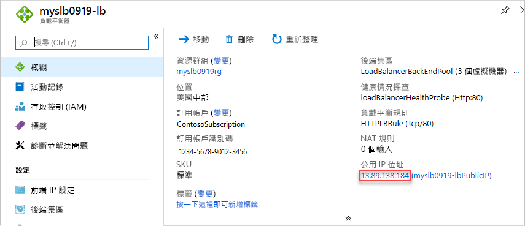

# <a name="quickstart-create-a-standard-load-balancer-to-load-balance-vms-by-using-azure-resource-manager-template"></a>快速入門：使用 Azure Resource Manager 範本建立 Standard 負載平衡器以平衡 VM 的負載

負載平衡會將傳入要求分散於多部虛擬機器 (VM)，藉此提供高可用性和範圍。 本快速入門會示範如何部署 Azure Resource Manager 範本，以建立標準負載平衡器來平衡 VM 的負載。 相較於其他部署方法，使用 Resource Manager 範本所需的步驟比較少。

[Resource Manager 範本](../azure-resource-manager/template-deployment-overview.md)是一個 JavaScript 物件標記法 (JSON) 檔案，定義了專案的基礎結構和組態。 範本會使用宣告式語法，可讓您陳述您要部署的項目，而不需要撰寫一連串程式設計命令來加以建立。 如果您要深入了解如何開發 Resource Manager 範本，請參閱 [Resource Manager 文件](/azure/azure-resource-manager/)和[範本參考](/azure/templates/microsoft.network/loadbalancers)。

如果您沒有 Azure 訂用帳戶，請在開始前建立[免費帳戶](https://azure.microsoft.com/free/?WT.mc_id=A261C142F)。

## <a name="create-a-standard-load-balancer"></a>建立標準負載平衡器

Standard Load Balancer 只支援標準公用 IP 位址。 當您建立標準負載平衡器時，您也必須建立新的標準公用 IP 位址，而該 IP 位址會設定為標準負載平衡器的前端。

本快速入門中使用的範本是[快速入門範本](https://raw.githubusercontent.com/Azure/azure-quickstart-templates/master/101-load-balancer-standard-create/azuredeploy.json)。

[!code-json[<Azure Resource Manager template create standard load balancer>](~/quickstart-templates/101-load-balancer-standard-create/azuredeploy.json)]

範本中已定義多個 Azure 資源：

- **Microsoft.Network/loadBalancers**
- **Microsoft.Network/publicIPAddresses**：適用於負載平衡器。
- **Microsoft.Network/networkSecurityGroups**
- **Microsoft.Network/virtualNetworks**
- **Microsoft.Compute/virutalMachines** (其中 3 個)
- **Microsoft.Network/publicIPAddresses** (其中 3 個)：適用於這三部虛擬機器。
- **Microsoft.Network/networkInterfaces** (其中 3 個)
- **Microsoft.Compute/virtualMachine/extensions** (其中 3 個)：用來設定 IIS 和網頁

若要尋找更多有關 Azure Load Balancer 的範本，請參閱 [Azure 快速入門範本](https://azure.microsoft.com/resources/templates/?resourceType=Microsoft.Network&pageNumber=1&sort=Popular)。

1. 選取以下程式碼區塊的 [試用]  以開啟 Azure Cloud Shell，然後遵循指示登入 Azure。

   ```azurepowershell-interactive
   $projectName = Read-Host -Prompt "Enter a project name with 12 or less letters or numbers that is used to generate Azure resource names"
   $location = Read-Host -Prompt "Enter the location (i.e. centralus)"
   $adminUserName = Read-Host -Prompt "Enter the virtual machine administrator account name"
   $adminPassword = Read-Host -Prompt "Enter the virtual machine administrator password" -AsSecureString

   $resourceGroupName = "${projectName}rg"
   $templateUri = "https://raw.githubusercontent.com/Azure/azure-quickstart-templates/master/101-load-balancer-standard-create/azuredeploy.json"

   New-AzResourceGroup -Name $resourceGroupName -Location $location
   New-AzResourceGroupDeployment -ResourceGroupName $resourceGroupName -TemplateUri $templateUri -projectName $projectName -location $location -adminUsername $adminUsername -adminPassword $adminPassword

   Write-Host "Press [ENTER] to continue."
   ```

   等候直到您看見主控台的提示字元。

1. 從先前的程式碼區塊選取 [複製]  以複製 PowerShell 指令碼。

1. 以滑鼠右鍵按一下殼層主控台窗格，然後選取 [貼上]  。

1. 輸入這些值。

   範本部署會建立三個可用性區域。 只有[特定的區域](../availability-zones/az-overview.md)支援可用性區域。 使用其中一個支援區域。 如果您不確定，請輸入 **centralus**。

   資源群組名稱是附加 **rg** 的專案名稱。 您會在下一節中用到資源群組名稱。

部署範本需要約 10 分鐘。 完成時，輸出如下：


Azure PowerShell 用於部署範本。 除了 Azure PowerShell 以外，您也可以使用 Azure 入口網站、Azure CLI 和 REST API。 若要了解其他部署方法，請參閱[部署範本](../azure-resource-manager/resource-group-template-deploy-portal.md)。

## <a name="test-the-load-balancer"></a>測試負載平衡器

1. 登入 [Azure 入口網站](https://portal.azure.com)。

1. 選取左側面板中的 [資源群組]  。

1. 選取您在上一節中建立的資源群組。 預設的資源群組名稱是附加 **rg** 的專案名稱。

1. 選取負載平衡器。 其預設名稱是附加 **-lb** 的專案名稱。

1. 僅將公用 IP 位址中 IP 位址的部分複製並貼到您瀏覽器的網址列。

   

    瀏覽器會顯示 Internet Information Services (IIS) Web 伺服器的預設頁面。

   

若要查看負載平衡器如何將流量分散於所有三部 VM，您可以從用戶端機器中強制重新整理您的網頁瀏覽器。

## <a name="clean-up-resources"></a>清除資源

您可以刪除不再需要的資源群組、負載平衡器和所有相關資源。 若要這樣做，請移至 Azure 入口網站，選取包含負載平衡器的資源群組，然後選取 [刪除資源群組]  。

## <a name="next-steps"></a>後續步驟

在本快速入門中，您已建立標準負載平衡器、將 VM 連線到標準負載平衡器、設定負載平衡器流量規則、進行健康情況探查，然後測試負載平衡器。

若要深入了解，請繼續進行 Load Balancer 的教學課程。

> [!div class="nextstepaction"]
> [Azure Load Balancer 教學課程](tutorial-load-balancer-standard-public-zone-redundant-portal.md)
