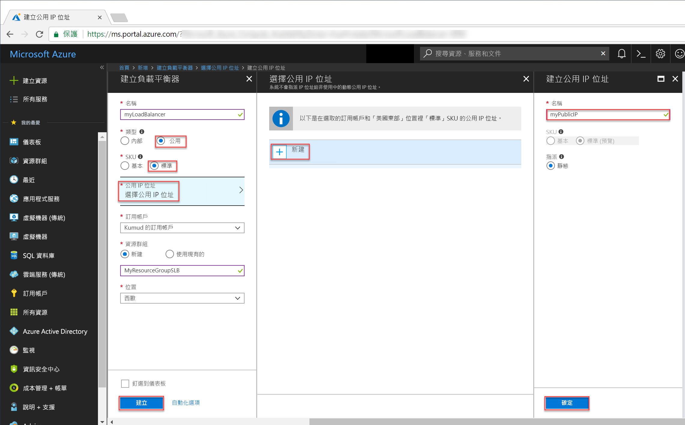

# <a name="tutorial-configure-port-fowarding-in-load-balancer-using-the-azure-portal"></a>教學課程：使用 Azure 入口網站在負載平衡器中設定連接埠轉送

使用 Azure 負載平衡器的連接埠轉送，可讓您使用負載平衡器的公用 IP 位址透過連接埠號碼從遠端連線至 Azure 虛擬網路中的 VM。 在本教學課程中，您將了解如何在 Azure 負載平衡器中設定連接埠轉送，並了解如何：


> [!div class="checklist"]
> * 建立 Azure Load Balancer
> * 建立負載平衡器健全狀況探查
> * 建立負載平衡器流量規則
> * 建立虛擬機器並安裝 IIS 伺服器
> * 將虛擬機器連結至負載平衡器
> * 建立負載平衡器輸入 NAT 規則
> * 檢視實際運作的連接埠轉送


如果您沒有 Azure 訂用帳戶，請在開始前建立 [免費帳戶](https://azure.microsoft.com/free/?WT.mc_id=A261C142F) 。 

## <a name="log-in-to-azure"></a>登入 Azure

在 [http://portal.azure.com](http://portal.azure.com) 上登入 Azure 入口網站。

## <a name="create-a-standard-load-balancer"></a>建立標準負載平衡器

在本節中，您會建立公用負載平衡器，協助平衡虛擬機器的負載。 標準負載平衡器只支援標準公用 IP 位址。 當您建立標準負載平衡器時，您也必須建立新的標準公用 IP 位址，而該 IP 位址會設定為標準負載平衡器的前端 (預設的名稱為 LoadBalancerFrontend)。 

1. 在畫面的左上方，按一下 [建立資源] > [網路] > [負載平衡器]。
2. 在 [建立負載平衡器] 頁面中輸入負載平衡器的下列值：
    - myLoadBalancer - 作為負載平衡器的名稱。
    - **標準** - 作為負載平衡器的 SKU 版本。
    - Public - 作為負載平衡器的類型。
    - myPublicIP - 作為您建立之**新的**公用 IP。
    - myResourceGroupSLB - 作為您選擇建立之**新的** 資源群組名稱。
    - westeurope - 作為位置。
3. 按一下 [建立] 以建立負載平衡器。


   
## <a name="create-load-balancer-resources"></a>建立負載平衡器資源

在本節中，您會設定後端位址集區和健康狀態探查的負載平衡器設定，並指定負載平衡器規則。

### <a name="create-a-backend-address-pool"></a>建立後端位址集區

若要將流量分散至 VM，後端位址集區包含已連線至負載平衡器之虛擬 (NIC) 的 IP 位址。 建立後端位址集區 myBackendPool 以納入 VM1 和 VM2。

1. 按一下左側功能表中的 [所有資源]，然後從資源清單按一下 [myLoadBalancer]。
2. 在 [設定] 之下，依序按一下 [後端集區] 和 [新增]。
3. 在 [新增後端集區] 頁面上，針對名稱輸入 *myBackEndPool*，作為您後端集區的名稱，然後按一下 [確定]。

### <a name="create-a-health-probe"></a>建立健康狀態探查

若要讓負載平衡器監視您應用程式的狀態，請使用健康狀態探查。 健康狀態探查會根據 VM 對健康狀態檢查的回應，以動態方式從負載平衡器輪替中新增或移除 VM。 建立健康狀態探查 myHealthProbe 以監視 VM 的健康狀態。

1. 按一下左側功能表中的 [所有資源]，然後從資源清單按一下 [myLoadBalancer]。
2. 在 [設定] 之下，依序按一下 [健康狀態探查] 和 [新增]。
3. 使用下列值來建立健康狀態探查：
    - myHealthProbe - 作為健康狀態探查的名稱。
    - HTTP - 作為通訊協定類型。
    - 80 - 作為連接埠號碼。
    - 15 - 探查嘗試的 [間隔] 秒數。
    - 2 - 作為 [狀況不良閾值]，或將 VM 視為狀況不良之前，必須達到的連續探查失敗次數。
4. 按一下 [確定]。

   

### <a name="create-a-load-balancer-rule"></a>建立負載平衡器規則

負載平衡器規則用來定義如何將流量分散至 VM。 您可定義連入流量的前端 IP 組態及後端 IP 集區來接收流量，以及所需的來源和目的地連接埠。 建立負載平衡器規則 myLoadBalancerRuleWeb，用來接聽前端 FrontendLoadBalancer 中的連接埠 80，以及用來將負載平衡的網路流量傳送到後端位址集區 myBackEndPool (也是使用連接埠 80)。 

1. 按一下左側功能表中的 [所有資源]，然後從資源清單按一下 [myLoadBalancer]。
2. 在 [設定] 之下，按一下 [負載平衡規則]，然後按一下 [新增]。
3. 使用下列值來設定負載平衡規則：
    - myHTTPRule - 作為負載平衡器規則的名稱。
    - TCP - 作為通訊協定類型。
    - 80 - 作為連接埠號碼。
    - 80 - 作為後端連接埠。
    - myBackendPool - 作為後端集區的名稱。
    - myHealthProbe - 作為健康狀態探查的名稱。
4. 按一下 [確定]。
    
## <a name="create-backend-servers"></a>建立後端伺服器

本節中，您會建立一個虛擬網路、針對負載平衡器的後端集區建立兩部虛擬機器，然後在虛擬機器上安裝 IIS，以利使用負載平衡器測試連接埠轉送。

### <a name="create-a-virtual-network"></a>建立虛擬網路
1. 在螢幕的左上方，按一下 [新增] > [網路] > [虛擬網路]，然後輸入虛擬網路的下列值：
    - myVnet - 作為虛擬網路的名稱。
    - myResourceGroupSLB - 作為現有資源群組的名稱
    - myBackendSubnet - 作為子網路名稱。
2. 按一下 [建立] 以建立虛擬網路。

    

### <a name="create-virtual-machines"></a>建立虛擬機器

1. 在螢幕的左上方，按一下 [新增] > [計算] > [Windows Server 2016 Datacenter]，然後輸入虛擬網路的下列值：
    - myVM1 - 作為虛擬機器的名稱。        
    - azureuser - 作為系統管理員使用者名稱。    
    - myResourceGroupSLB - 針對 [資源群組]，選取 [使用現有的]，然後選取 myResourceGroupSLB。
2. 按一下 [確定]。
3. 選取 [DS1_V2] 作為虛擬機器的大小，然後按一下 [選取]。
4. 輸入 VM 設定的下列值：
    -  myVNet - 確保已選取作為虛擬網路。
    - myBackendSubnet - 確保已選取作為子網路。
    - myNetworkSecurityGroup - 作為您必須建立之新網路安全性群組 (防火牆) 的名稱。
5. 按一下 [停用] 來停用開機診斷。
6. 按一下 [確定]，檢閱 [摘要] 頁面上的設定，然後按一下 [建立]。
7. 使用步驟 1-6，建立名為 VM2 的另一個 VM，其虛擬網路為 myVnet、子網路為 myBackendSubnet，而其網路安全性群組為 *myNetworkSecurityGroup。 

### <a name="create-nsg-rules"></a>建立 NSG 規則

在本節中，您會建立 NSG 規則，以允許使用 HTTP 與 RDP 的輸入連線。

1. 按一下左側功能表中的 [所有資源]，然後從資源清單按一下 **myNetworkSecurityGroup**，其位於 **myResourceGroupSLB** 資源群組中。
2. 在 [設定] 底下，按一下 [輸入安全性規則]，然後按一下 [新增]。
3. 輸入輸入安全性規則 (名為 myHTTPRule) 的下列值，以允許使用連接埠 80 的輸入 HTTP 連線：
    - 服務標記 - 作為 [來源]。
    - 網際網路 - 作為 [來源服務標記]
    - 80 - 作為 [目的地連接埠範圍]
    - TCP - 作為 [通訊協定]
    - 允許 - 作為 [動作]
    - 100 作為 [優先順序]
    - myHTTPRule 作為名稱
    - 允許 HTTP - 作為描述
4. 按一下 [確定]。
 
 
5. 重複步驟 2 到 4 來建立另一個名為 myRDPRule 的規則，以允許使用連接埠 3389 的輸入 RDP 連線，其具有下列值：
    - 服務標記 - 作為 [來源]。
    - 網際網路 - 作為 [來源服務標記]
    - 3389 - 作為 [目的地連接埠範圍]
    - TCP - 作為 [通訊協定]
    - 允許 - 作為 [動作]
    - 200 作為 [優先順序]
    - myRDPRule 作為名稱
    - 允許 RDP - 作為描述

### <a name="install-iis-on-vms"></a>在 VM 上安裝 IIS

1. 按一下左側功能表中的 [所有資源]，然後從資源清單按一下 **myVM1**，其位於 myResourceGroupSLB 資源群組中。
2. 在 [概觀] 頁面上，按一下 [連線] 以透過 RDP 連入 VM。
3. 以使用者名稱 azureuser 登入 VM。
4. 在伺服器桌面上，瀏覽至 [Windows 系統管理工具]>[Windows PowerShell]。
5. 在 PowerShell 視窗中，執行下列命令以安裝 IIS 伺服器、移除預設 iisstart.htm 檔案，然後新增會顯示 VM 名稱的 iisstart.htm 檔案：

   ```azurepowershell-interactive
    
    # install IIS server role
    Install-WindowsFeature -name Web-Server -IncludeManagementTools
    
    # remove default htm file
     remove-item  C:\inetpub\wwwroot\iisstart.htm
    
    # Add a new htm file that displays server name
     Add-Content -Path "C:\inetpub\wwwroot\iisstart.htm" -Value $("Hello World from" + $env:computername)
   ```
6. 使用 myVM1 關閉 RDP 工作階段。
7. 重複步驟 1 到 6，在 myVM2 上安裝 IIS 和更新的 iisstart.htm 檔案。

## <a name="add-vms-to-the-backend-address-pool"></a>將 VM 新增至後端位址集區

若要將流量分散到各個 VM，請將虛擬機器 VM1 和 VM2 新增至先前建立的後端位址集區 myBackendPool。 後端集區會包含已連線至負載平衡器之虛擬 (NIC) 的 IP 位址。

1. 按一下左側功能表中的 [所有資源]，然後從資源清單按一下 [myLoadBalancer]。
2. 在 [設定] 下按一下 [後端集區]，然後在後端集區的清單中，按一下 [myBackendPool]。
3. 在 [myBackendPool] 頁面上，執行下列動作：
    - 按一下 [新增目標網路 IP 組態]，將您建立的每個虛擬機器 (myVM1 和 myVM2) 新增至後端集區。
    - 按一下 [確定]。
4. 確認負載平衡器後端集區設定將 **VM1** 和 **VM2** 這兩個 VM 都顯示出來。

## <a name="create-inbound-nat-rules"></a>建立輸入 NAT 規則
透過負載平衡器，您可以建立輸入 NAT 規則，將前端 IP 位址特定連接埠的流量，從連接埠轉送到虛擬網路內的後端執行個體的特定連接埠。

建立輸入 NAT 規則，將連接埠的流量從負載平衡器的前端連接埠轉送到後端 VM 的連接埠 3389。

1. 按一下左側功能表中的 [所有資源]，然後從資源清單按一下 [myLoadBalancer]。
2. 在 [設定] 下按一下 [輸入 NAT 規則]，然後在後端集區的清單中，按一下 [myBackendPool]。
3. 在 [新增輸入 NAT 規則] 頁面中，輸入下列值：
    - 針對 NAT 規則的名稱，輸入 *myNATRuleRDPVM1*。
    - 針對連接埠，輸入 *4221*。
    - 針對 [目標虛擬機器]，從下拉式清單中選取 [myVM1]。
    - 針對 [連接埠對應] 按一下 [自訂]，然後輸入 **3389** 作為 [目標連接埠]。
    - 按一下 [確定]。
4. 重複步驟 2 和 3，使用前端連接埠 4222 為虛擬機器 myVM2 建立名為 myNATRuleRDPVM2 的輸入 NAT 規則。

## <a name="test-the-load-balancer"></a>測試負載平衡器
1. 在 [概觀] 畫面上尋找負載平衡器的公用 IP 位址。 按一下 [所有資源]，然後按一下 [myPublicIP]。

2. 將公用 IP 位址複製並貼到您瀏覽器的網址列。 IIS Web 伺服器的預設頁面會顯示在瀏覽器上。

      

若要查看負載平衡器如何將流量分散於執行您應用程式的這三部 VM，您可以強制重新整理您的 Web 瀏覽器。

## <a name="test-port-forwarding"></a>測試連接埠轉送
透過連接埠轉送，您可以使用負載平衡器的 IP 位址和先前的步驟中所定義的前端連接埠值，對後端位址集區中的 VM 建立遠端桌面連線。

1. 在 [概觀] 畫面上尋找負載平衡器的公用 IP 位址。 按一下 [所有資源]，然後按一下 [myPublicIP]。
2. 使用下列命令，從您的本機電腦建立 myVM2 VM 的遠端桌面工作階段。 請將 `<publicIpAddress>` 取代為先前的步驟傳回的 IP 位址。

    ```
    mstsc /v:<publicIpAddress>:4222
    ```
  
3. 開啟所下載的 RDP 檔案。 如果出現提示，請選取 [連接]。

4. 輸入您在建立虛擬機器時指定的使用者名稱和密碼 (您可能需要選取 [更多選擇]，然後選取 [使用不同的帳戶] 以指定您在建立虛擬機器時輸入的認證)，然後選取 [確定]。 您可能會在登入過程中收到憑證警告。 選取 [是] 以繼續進行連線。
 
   RDP 連線成功，根據輸入 NAT 規則 myNATRuleRDPVM2，從負載平衡器的前端連接埠 **4222** 傳入的流量，依設定會重新導向至虛擬機器 myVM2 的連接埠 3389。

## <a name="clean-up-resources"></a>清除資源

若不再需要，可刪除資源群組、負載平衡器和所有相關資源。 若要這樣做，請選取包含負載平衡器的資源群組，然後按一下 [刪除]。

## <a name="next-steps"></a>後續步驟

在本教學課程中，您已建立標準負載平衡器、將 VM 連結至該處、設定負載平衡器流量規則、健康狀態探查，接著測試負載平衡器。 您也已從負載平衡集中移除 VM，並重新將該 VM 新增至後端位址集區。 若要深入了解 Azure Load Balancer，請繼續 Azure Load Balancer 的教學課程。

> [!div class="nextstepaction"]
> [Azure Load Balancer 教學課程](tutorial-load-balancer-standard-public-zone-redundant-portal.md)
