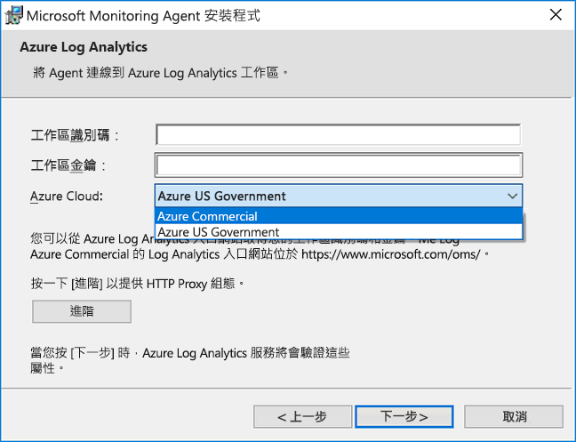
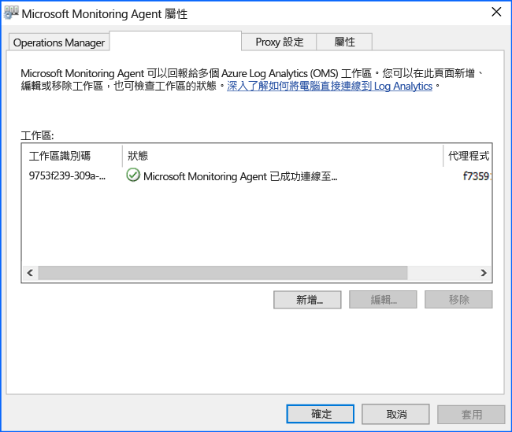

# <a name="connect-windows-computers-to-the-log-analytics-service-in-azure"></a>將 Windows 電腦連接到 Azure 中的 Log Analytics 服務

若要監視及管理虛擬機器或實體電腦，您的本機資料中心或其他記錄分析的雲端環境中，您需要部署 Microsoft Monitoring Agent (MMA)，並將它設定為回報給一或多個記錄分析工作區。  代理程式也支援 Azure 自動化 Hybrid Runbook Worker 角色。  

在受監視的 Windows 電腦上的代理程式會列為 Microsoft Monitoring Agent 服務。 Microsoft Monitoring Agent 服務會從記錄檔和 Windows 事件記錄檔、 效能資料，與其他遙測收集事件。 即使 「 代理程式 」 無法向它報告的記錄分析服務與通訊，代理程式會繼續執行，而且佇列在受監視電腦的磁碟上收集的資料。 當連線恢復後時，Microsoft Monitoring Agent 服務會收集的資料傳送至服務。

使用下列方法之一，可能會安裝代理程式。 大部分安裝安裝不同組的電腦，視需要使用這些方法的組合。

* 手動安裝。 安裝程式手動使用安裝精靈，從命令列，在電腦上執行，或使用現有的軟體發佈工具部署。
* Azure 自動化所需狀態設定 (DSC)。 使用 DSC 在 Azure 自動化中的指令碼已在您的環境中部署的 Windows 電腦。  
* PowerShell 指令碼。
* 執行 Windows 內部 Azure 堆疊中的虛擬機器的資源管理員範本。  

若要了解部署 Windows 代理程式的網路和系統需求，檢閱[收集資料，從您的環境與 Azure Log Analytics](log-analytics-concept-hybrid.md#prerequisites)。

## <a name="obtain-workspace-id-and-key"></a>取得工作區識別碼和金鑰
安裝適用於 Windows 的 Microsoft Monitoring Agent 之前，您必須有 Log Analytics 工作區的工作區識別碼和金鑰。  這是必要資訊的正確設定代理程式，並確定與記錄分析可順利進行通訊的每個安裝方法安裝期間。  

1. 在 Azure 入口網站中，按一下左下角的 [更多服務]。 在資源清單中輸入 **Log Analytics**。 當您開始輸入時，清單會根據您輸入的文字進行篩選。 選取 [Log Analytics]。
2. 在清單中的記錄分析工作區，選取您要設定代理程式回報給工作區。
3. 選取 [進階設定]。<br><br> <br><br>  
4. 選取 [連接的來源]，然後選取 [Windows 伺服器]。   
5. [工作區識別碼] 和 [主要金鑰] 右邊的值。 將兩者複製並貼到您最愛的編輯器。   
   
## <a name="install-the-agent-using-setup"></a>使用安裝程式安裝代理程式
下列步驟會在您的電腦上，使用 Microsoft Monitoring Agent 的安裝程式來安裝並設定適用於 Azure 和 Azure Government Cloud 中 Log Analytics 的代理程式。  代理程式的安裝程式會包含在下載的檔案，而必須以解壓縮 

1. 在 [Windows 伺服器] 頁面上，根據 Windows 作業系統的處理器架構，選取適當的 [下載 Windows 代理程式] 版本來下載。
2. 執行安裝程式以在您的電腦上安裝代理程式。
2. 在 [歡迎] 頁面中按 [下一步]。
3. 閱讀 [授權條款] 頁面上的授權，然後按一下 [我接受]。
4. 在 [目的資料夾] 頁面上，變更或保留預設的安裝資料夾，然後按 [下一步]。
5. 在 [代理程式安裝選項] 頁面上，選擇將代理程式連線到 Azure Log Analytics (OMS)，然後按 [下一步]。   
6. 在 [Azure Log Analytics] 頁面上，執行下列操作：
   1. 貼上您先前複製的**工作區識別碼**和**工作區金鑰 (主要金鑰)**。  如果電腦應該向 Azure Government Cloud 中的 Log Analytics 工作區回報，請從 [Azure 雲端] 下拉式清單中選取 [Azure 美國政府]。  
   2. 如果電腦需要透過 Proxy 伺服器與 Log Analytics 服務進行通訊，請按一下 [進階]，然後提供 Proxy 伺服器的 URL 和連接埠號碼。  如果您的 Proxy 伺服器會要求驗證，請輸入要向 Proxy 伺服器進行驗證的使用者名稱和密碼，然後按 [下一步]。  
7. 提供完必要的組態設定之後，按 [下一步]。<br><br> <br><br>
8. 在 [安裝準備就緒] 頁面上，檢閱您的選擇，然後按一下 [安裝]。
9. 在 [設定成功完成] 頁面上，按一下 [完成]。

完成時，[Microsoft 監視代理程式] 會出現在 [控制台] 中。 若要確認報告到記錄分析，請檢閱[確認代理程式連線至記錄分析](#verify-agent-connectivity-to-log-analytics)。 

## <a name="install-the-agent-using-the-command-line"></a>使用命令列安裝代理程式
代理程式下載的檔案是使用 IExpress 建立獨立的安裝套件。  代理程式和支援檔案的安裝程式包含封裝中，而且需要以適當地使用下列範例所示的命令列安裝中擷取。  這個方法支援代理程式設定為向 Azure 商業和美國政府雲端報告。  

>[!NOTE]
>如果您想要升級代理程式，您需要使用 Log Analytics 指令碼 API。 請參閱主題[管理和維護適用於 Windows 和 Linux 的記錄分析代理程式](log-analytics-agent-manage.md)以取得詳細資訊。

下表說明安裝程式支援的代理程式，包括使用 Automation DSC 部署時的特定記錄分析參數。

|MMA 專屬選項                   |注意         |
|---------------------------------------|--------------|
|ADD_OPINSIGHTS_WORKSPACE               | 1 = 將代理程式設定為向工作區報告                |
|OPINSIGHTS_WORKSPACE_ID                | 要新增之工作區的工作區識別碼 (guid)                    |
|OPINSIGHTS_WORKSPACE_KEY               | 用來向工作區進行初始驗證的工作區金鑰 |
|OPINSIGHTS_WORKSPACE_AZURE_CLOUD_TYPE  | 指定工作區所在的雲端環境 <br> 0 = Azure 商業雲端 (預設值) <br> 1 = Azure Government |
|OPINSIGHTS_PROXY_URL               | 要使用的 Proxy URI |
|OPINSIGHTS_PROXY_USERNAME               | 要存取已驗證 Proxy 的使用者名稱 |
|OPINSIGHTS_PROXY_PASSWORD               | 要存取已驗證 Proxy 的密碼 |

1. 若要擷取代理程式安裝檔案中，從提升權限的命令提示字元執行`extract MMASetup-<platform>.exe`它就會提示您將檔案解壓縮至的路徑。  或者，您可以指定路徑所傳遞的引數`extract MMASetup-<platform>.exe /c:<Path> /t:<Path>`。  如需有關命令列的 swtiches IExpress 所支援的詳細資訊，請參閱[IExpress 的命令列參數](https://support.microsoft.com/help/197147/command-line-switches-for-iexpress-software-update-packages)然後更新以符合您需求的範例。
2. 以無訊息方式安裝代理程式，並設定它，以回報至 Azure 的商業雲端中的工作區資料夾解壓縮安裝檔案，輸入： 
   
     ```dos
    setup.exe /qn ADD_OPINSIGHTS_WORKSPACE=1 OPINSIGHTS_WORKSPACE_AZURE_CLOUD_TYPE=0 OPINSIGHTS_WORKSPACE_ID=<your workspace id> OPINSIGHTS_WORKSPACE_KEY=<your workspace key> AcceptEndUserLicenseAgreement=1
    ```

   或若要設定要向 Azure 美國政府雲端報告代理程式，請輸入： 

     ```dos
    setup.exe /qn ADD_OPINSIGHTS_WORKSPACE=1 OPINSIGHTS_WORKSPACE_AZURE_CLOUD_TYPE=1 OPINSIGHTS_WORKSPACE_ID=<your workspace id> OPINSIGHTS_WORKSPACE_KEY=<your workspace key> AcceptEndUserLicenseAgreement=1
    ```

## <a name="install-the-agent-using-dsc-in-azure-automation"></a>使用 Azure 自動化中的 DSC 安裝代理程式

若要安裝代理程式使用 Azure 自動化 DSC，您可以使用下列指令碼範例。   如果您沒有自動化帳戶，請參閱[開始使用 Azure 自動化](../automation/automation-offering-get-started.md)了解需求和建立自動化帳戶使用 Automation DSC 之前所需的步驟。  如果您不熟悉自動化 DSC，請檢閱[入門 Automation DSC](../automation/automation-dsc-getting-started.md)。

下列範例會安裝 64 位元代理程式時，由`URI`值。 您也可以取代 URI 值改為使用 32 位元版本。 這兩個版本的 URI 分別是︰

- Windows 64 位元代理程式 - https://go.microsoft.com/fwlink/?LinkId=828603
- Windows 32 位元代理程式 - https://go.microsoft.com/fwlink/?LinkId=828604


>[!NOTE]
>此程序和指令碼範例不支援升級代理程式已經部署到 Windows 電腦。

代理程式封裝的 32 位元和 64 位元版本具有不同的產品代碼和新發行的版本具有唯一值。  產品代碼是 GUID，主要用來識別應用程式或產品，並代表 Windows installer **ProductCode**屬性。  `ProductId value`中**MMAgent.ps1**指令碼必須符合從 32 位元或 64 位元代理程式安裝程式套件的產品程式碼。

若要直接從代理程式安裝封裝擷取的產品程式碼，您可以使用從 Orca.exe [Windows SDK 元件的 Windows Installer Developers](https://msdn.microsoft.com/library/windows/desktop/aa370834%27v=vs.85%28.aspx)也就是 Windows 軟體開發套件的元件或使用下列 PowerShell[範例指令碼](http://www.scconfigmgr.com/2014/08/22/how-to-get-msi-file-information-with-powershell/)寫入由 Microsoft 有價值專家 (MVP)。

1. 從 [http://www.powershellgallery.com/packages/xPSDesiredStateConfiguration](http://www.powershellgallery.com/packages/xPSDesiredStateConfiguration) 將 xPSDesiredStateConfiguration DSC 模組匯入 Azure 自動化。  
2.  建立 Azure 自動化的 *OPSINSIGHTS_WS_ID* 和 *OPSINSIGHTS_WS_KEY* 變數資產。 設定*OPSINSIGHTS_WS_ID*至您的記錄分析工作區識別碼，並將*OPSINSIGHTS_WS_KEY*工作區的主索引鍵。
3.  複製指令碼，並將它儲存為 MMAgent.ps1

    ```PowerShell
    Configuration MMAgent
    {
        $OIPackageLocalPath = "C:\Deploy\MMASetup-AMD64.exe"
        $OPSINSIGHTS_WS_ID = Get-AutomationVariable -Name "OPSINSIGHTS_WS_ID"
        $OPSINSIGHTS_WS_KEY = Get-AutomationVariable -Name "OPSINSIGHTS_WS_KEY"

        Import-DscResource -ModuleName xPSDesiredStateConfiguration

        Node OMSnode {
            Service OIService
            {
                Name = "HealthService"
                State = "Running"
                DependsOn = "[Package]OI"
            }

            xRemoteFile OIPackage {
                Uri = "https://go.microsoft.com/fwlink/?LinkId=828603"
                DestinationPath = $OIPackageLocalPath
            }

            Package OI {
                Ensure = "Present"
                Path  = $OIPackageLocalPath
                Name = "Microsoft Monitoring Agent"
                ProductId = "8A7F2C51-4C7D-4BFD-9014-91D11F24AAE2"
                Arguments = '/C:Deploy"setup.exe /qn ADD_OPINSIGHTS_WORKSPACE=1 OPINSIGHTS_WORKSPACE_ID=' + $OPSINSIGHTS_WS_ID + ' OPINSIGHTS_WORKSPACE_KEY=' + $OPSINSIGHTS_WS_KEY + ' AcceptEndUserLicenseAgreement=1"'
                DependsOn = "[xRemoteFile]OIPackage"
            }
        }
    }

    ```

4. [匯入 MMAgent.ps1 組態指令碼](../automation/automation-dsc-getting-started.md#importing-a-configuration-into-azure-automation)到您的自動化帳戶。 
5. [將 Windows 電腦或節點指派](../automation/automation-dsc-getting-started.md#onboarding-an-azure-vm-for-management-with-azure-automation-dsc)組態。 15 分鐘內，節點會檢查其組態和代理程式推送到節點。

## <a name="verify-agent-connectivity-to-log-analytics"></a>確認代理程式連線至記錄分析

Instalaltion 的代理程式完成之後，已成功連接進行驗證和報告可以達成兩種方式。  

從電腦中**控制台**，尋找的項目**Microsoft Monitoring Agent**。  選取它並在**Azure 記錄分析 (OMS)**索引標籤上，代理程式應該會顯示訊息指出： **Microsoft Monitoring Agent 已順利連接至 Microsoft Operations Management Suite 服務。**<br><br> 

您也可以在 Azure 入口網站執行簡單的記錄搜尋。  

1. 在 Azure 入口網站中，按一下左下角的 [更多服務]。 在資源清單中輸入 **Log Analytics**。 當您開始輸入時，清單會根據您輸入的文字進行篩選。 選取 [Log Analytics]。  
2. 記錄分析工作區在頁面上，選取 [目標] 工作區，然後選取**記錄搜尋**磚。 
2. 在記錄搜尋 窗格中的查詢欄位類型：  

    ```
    search * 
    | where Type == "Heartbeat" 
    | where Category == "Direct Agent" 
    | where TimeGenerated > ago(30m)  
    ```

在搜尋結果中傳回，您應該會看到活動訊號指出它已連線，並且回報給服務之電腦的記錄。   

## <a name="next-steps"></a>後續步驟

檢閱[管理和維護適用於 Windows 和 Linux 的記錄分析代理程式](log-analytics-agent-manage.md)若要了解如何在您的電腦上其部署生命週期管理代理程式。  