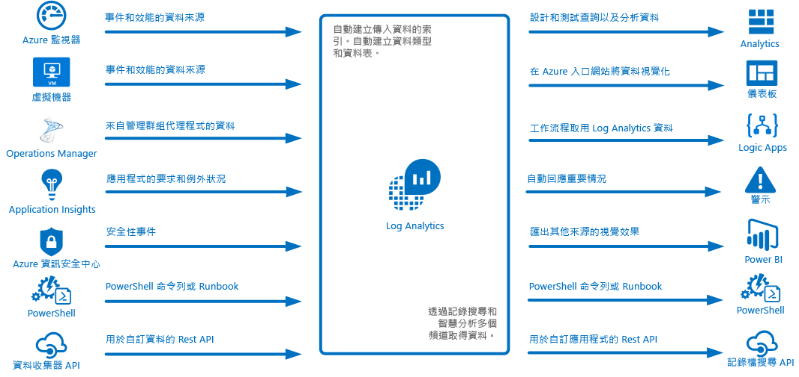
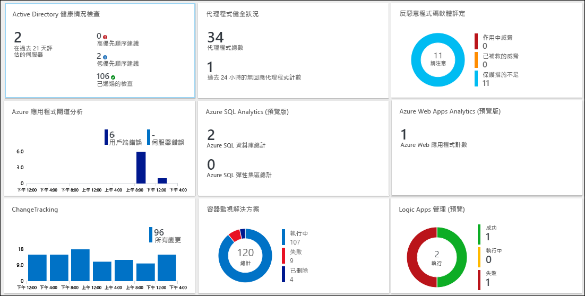
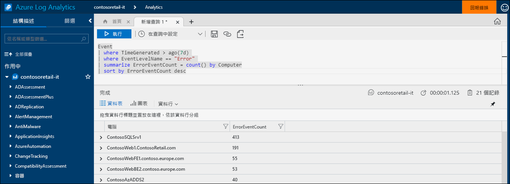
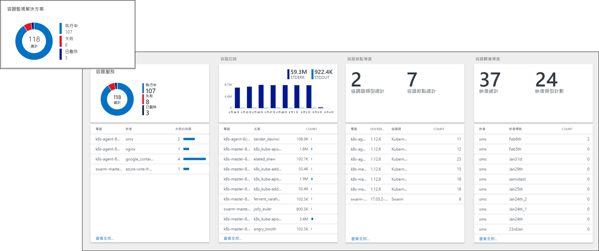
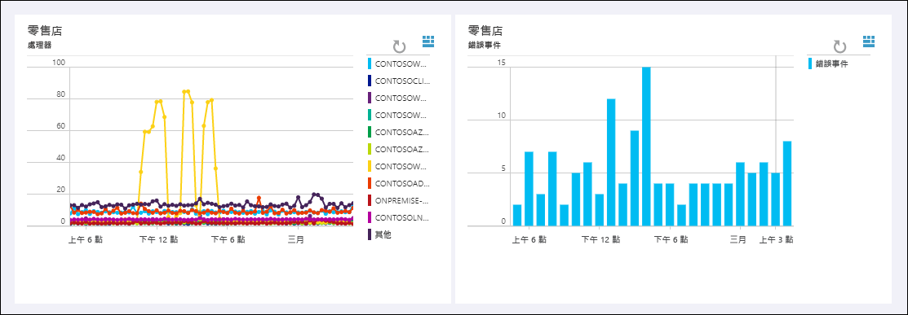
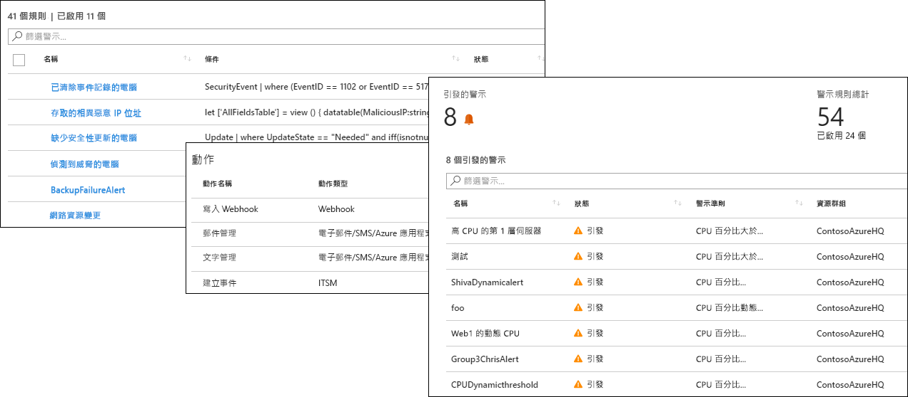
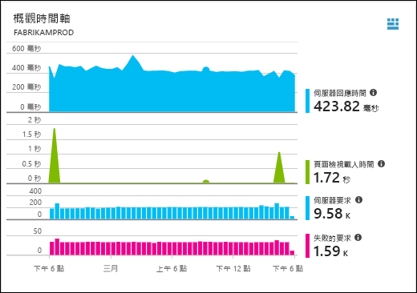
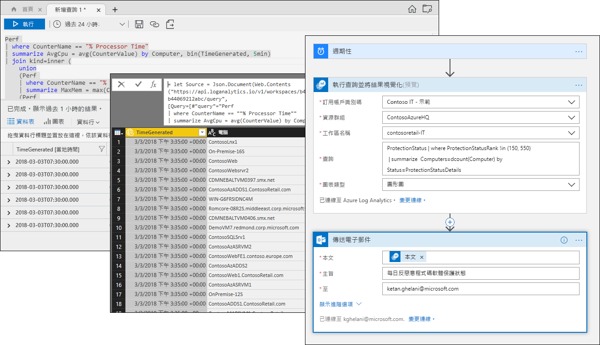

# 什麼是 Azure Log Analytics？
Log Analytics 在 Azure 管理中扮演主要角色，其可從各種來源收集遙測和其他資料，並提供查詢語言和分析引擎，讓您得以深入了解應用程式和資源的運作。  您可以透過記錄搜尋和檢視直接與 Log Analytics 資料互動，也可以在其他 Azure 服務中使用分析工具 (例如 Application Insights 或 Azure 資訊安全中心)，將其資料儲存在 Log Analytics 中。  

Log Analytics 需要進行最基本的設定，而且已經與其他 Azure 服務整合。  您只需要建立工作區即可啟用收集功能。  您可以接著在虛擬機器上安裝代理程式，將它們包含在工作區中，並啟用管理解決方案，其中包含可提供不同應用程式其他見解的邏輯。  在幕後，資料類型會在收集資料時預先定義或自動建立。

## 監視角色

[監視 Azure 應用程式和資源](../monitoring-and-diagnostics/monitoring-overview.md)會說明 Azure 中不同的監視服務。  Log Analytics 扮演主要角色，其可合併來自不同來源的監視資料，並提供強大的查詢語言以便進行彙總和分析。  

Log Analytics 並不限於監視 Azure 資源。  它可以從內部部署環境或其他雲端中的資源收集資料，以建立混合式監視環境，而且可以直接連線至 System Center Operations Manager，以從現有的代理程式收集遙測資料。  Log Analytics 中的分析工具 (例如記錄搜尋、檢視和管理解決方案) 可處理所有收集的資料，進而為您提供集中分析整個環境的功能。

## 資料收集
Log Analytics 可以從各種來源收集資料。  所收集的資料會針對每種資料類型組織成個別的資料表，以便一起分析所有的資料 (不論其原始來源為何)。

將資料收集到 Log Analytics 中的方法包括：

- 設定 Azure 監視器，以複製它從 Azure 資源收集的[計量和記錄](../monitoring/monitoring-data-collection.md#types-of-monitoring-data)。
- 收集寫入 [Azure 儲存體](log-analytics-azure-storage-iis-table.md)的遙測資料。
- [Windows](log-analytics-windows-agent.md) 和 [Linux](log-analytics-linux-agents.md) 虛擬機器上的代理程式會根據您設定的[資料來源](log-analytics-data-sources.md)，從將遙測資料從客體作業系統和應用程式傳送到 Log Analytics。 您可以直接連線代理程式、透過 [OMS 閘道](log-analytics-oms-gateway.md)連線 (當他們無法存取防火牆時)，或透過 [System Center Operations Manager 管理群組](log-analytics-om-agents.md)連線。
- 不需進行任何設計，[Application Insights](https://docs.microsoft.com/azure/application-insights/) 和 [Azure 資訊安全中心](https://docs.microsoft.com/azure/security-center/)等 Azure 服務會將其資料直接儲存在 Log Analytics 中。
- 使用 Log Analytics Cmdlet，從 PowerShell 命令列或 [Azure 自動化 Runbook](../automation/automation-runbook-types.md) 寫入資料。
- 如果您有自訂需求，則可以使用 [HTTP 資料收集器 API](log-analytics-data-collector-api.md)，將資料從任何 REST API 用戶端寫入 Log Analytics，或使用 [Azure Logic App](https://docs.microsoft.com/azure/logic-apps/)，從自訂工作流程將資料寫入。

## 透過管理解決方案新增功能
[管理解決方案](log-analytics-add-solutions.md)會針對特定產品或案例提供預先封裝的邏輯。  它們可以將額外資料蒐集到 Log Analytics 中，或處理已收集的資料。  通常會包含一個檢視，可協助您分析此額外資料。  有些解決方案適用於各種功能，而其他解決方案則會以一致的方式新增。  您可以輕鬆地瀏覽可用的解決方案，並從 Azure Marketplace [將它們新增至工作區](log-analytics-add-solutions.md)。  

## 查詢語言

Log Analytics 包含[豐富查詢語言](http://docs.loganalytics.io)，可用於快速擷取、彙總及分析所收集的資料。  您可以使用[記錄搜尋或進階分析入口網站](log-analytics-log-search-portals.md)來建立和測試查詢，然後使用這些工具直接分析資料，或儲存查詢以便使用於視覺效果、警示，或匯出到其他工具 (例如 Power BI或 Excel)。

Log Analytics 查詢語言適合用於簡單記錄搜尋，但也包含進階的功能，例如彙總、聯結和智慧分析。 您可以使用可用的[多個教學課程](https://docs.loganalytics.io/docs/Learn/Tutorials)，快速了解查詢語言。  我們會為已經熟悉 [SQL](https://docs.loganalytics.io/docs/Learn/References/SQL-to-Azure-Log-Analytics) 和 [Splunk](https://docs.loganalytics.io/docs/Learn/References/Splunk-to-Azure-Log-Analytics) 的使用者提供特別指引。

## 將 Log Analytics 資料視覺化

[Log Analytics 中的檢視](log-analytics-view-designer.md)會以視覺化方式呈現記錄搜尋中的資料。  每個檢視都包含視覺效果的組合，例如長條圖和折線圖 (彙總重要資料的清單除外)。  [管理解決方案](#add-functionality-with-management-solutions)包含可概述特定應用程式資料的檢視，而且您可以建立自己的檢視，以呈現來自任何 Log Analytics 記錄搜尋的資料。

您也可以將 Log Analytics 查詢的結果釘選到 [Azure 儀表板](../azure-portal/azure-portal-dashboards.md)，讓您結合來自不同 Azure 服務的圖格。  您甚至可以將 Log Analytics 檢視釘選到儀表板。

## 從 Log Analytics 資料建立警示

使用 [Azure 警示](../monitoring-and-diagnostics/monitoring-overview-unified-alerts.md)主動通知您在 Log Analytics 資料中對您很重要的狀況。  系統會在排定的間隔自動執行查詢，而如果結果符合特定準則，則會建立警示。  這可讓您結合來自 Log Analytics 與其他來源的警示，例如接近即時的警示 [Azure 監視器](../monitoring-and-diagnostics/monitoring-near-real-time-metric-alerts.md)和應用程式例外狀況 [Application Insights](../application-insights/app-insights-alerts.md)、共用[動作群組](../monitoring-and-diagnostics/monitoring-action-groups.md)以便回應警示狀況。

## 在其他服務中使用 Log Analytics 資料
Application Insights 和 Azure 資訊安全中心等服務會將其資料儲存在 Log Analytics 中。  您通常會與這些服務所提供的豐富分析工具進行互動，但是您也可以使用 Log Analytics 查詢來存取其資料，並可能將它與其他服務的資料結合。  

例如，下列檢視來自 Application Insights。  如果您按一下右上方的圖示，它會啟動 Log Analytics 分析主控台，內含圖形所用的查詢。

## 匯出 Log Analytics 資料

Log Analytics 也會讓其資料可用於 Azure 外部。  您可以將 [Power BI](log-analytics-powerbi.md) 設定為在排定的間隔匯入查詢結果，以便運用其功能，例如可合併不同來源的資料，以及在網路和行動裝置上共用報告。  您也可以利用 [記錄搜尋 API](log-analytics-log-search-api.md) 建置運用 Log Analytics 資料的自訂方案，或與其他系統整合。

您可以在 Azure 中使用 [Logic Apps](../logic-apps/logic-apps-overview.md)，建立以 Logic Apps 資料為基礎的自訂工作流程。  對於以 PowerShell 為基礎的更複雜邏輯，您可以使用 [Azure 自動化中的 Runbook](../automation/automation-runbook-types.md)。

## 後續步驟
- 首先[從 Azure VM 收集資料](log-analytics-quick-collect-azurevm.md)。
- 逐步進行[利用簡單查詢來分析 Log Analytics 資料的教學課程](log-analytics-tutorial-viewdata.md)。
* [瀏覽可用的方案](log-analytics-add-solutions.md)，將功能新增至 Log Analytics。

