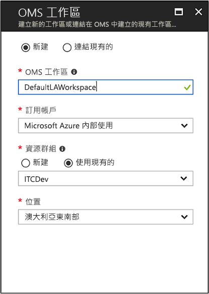
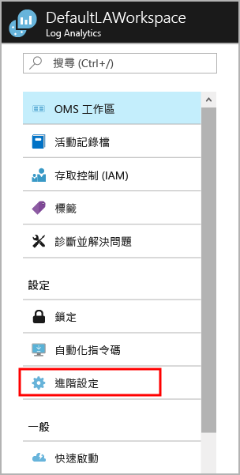
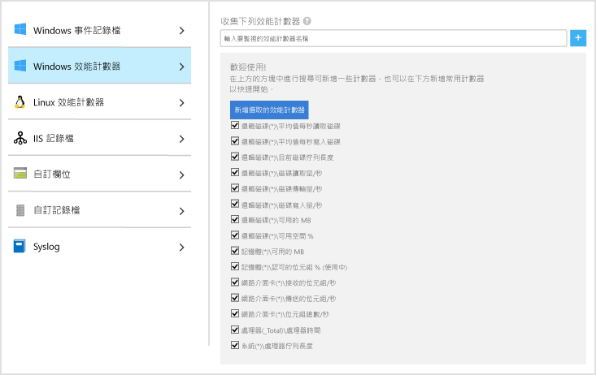
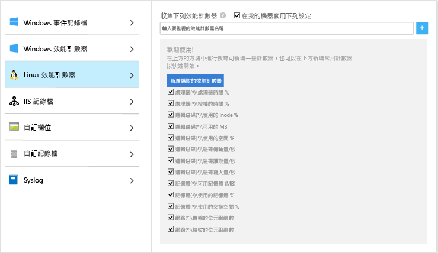
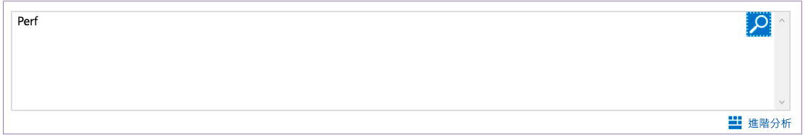
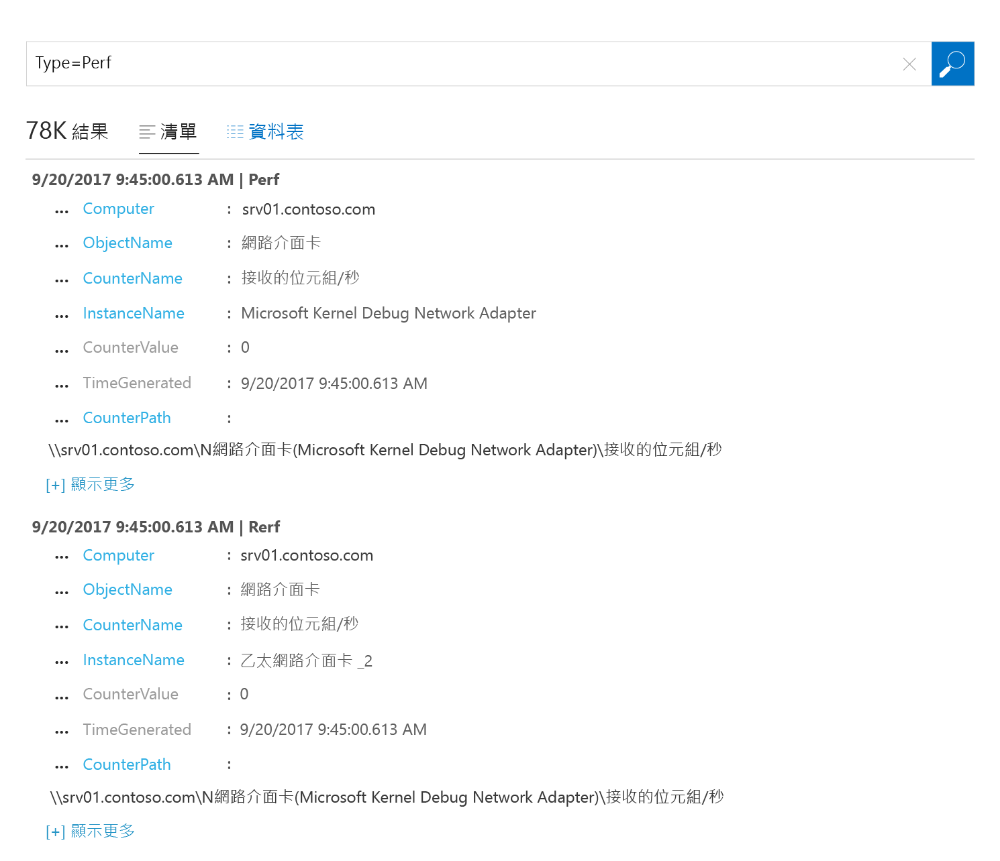
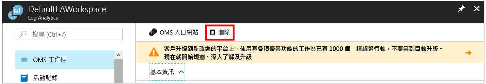

# 收集關於 Azure 虛擬機器的資料
[Azure Log Analytics](log-analytics-overview.md) 可將環境中 Azure 虛擬機器和其他資源的資料直接收集到單一存放庫，以供詳細分析和相互關聯。  本快速入門向您示範如何以幾個簡單步驟來設定和收集 Azure Linux 或 Windows VM 的資料。  
 
本快速入門假設您有現有的 Azure 虛擬機器。 如果沒有，您可以遵循 VM 快速入門來[建立 Windows VM](../virtual-machines/windows/quick-create-portal.md) 或[建立 Linux VM](../virtual-machines/linux/quick-create-cli.md)。

## 登入 Azure 入口網站
在 [https://portal.azure.com](https://portal.azure.com) 上登入 Azure 入口網站。 

## 建立工作區
1. 在 Azure 入口網站中，按一下 [所有服務]。 在資源清單中輸入 **Log Analytics**。 當您開始輸入時，清單會根據您輸入的文字進行篩選。 選取 [Log Analytics]。

       

2. 按一下 [建立]，然後選取下列項目的選項：

  * 為新的 [OMS 工作區] 提供名稱，例如，*DefaultLAWorkspace*。 
  * 如果選取的預設值不合適，請從下拉式清單中選取要連結的 [訂用帳戶]。
  * 對於 [資源群組]，選取包含一或多個 Azure 虛擬機器的現有資源群組。  
  * 選取要部署 VM 的 [位置]。  如需詳細資訊，請查看 [Log Analytics 的可用區域](https://azure.microsoft.com/regions/services/)。
  * 如果您要在 2018 年 4 月 2 之後建立的新訂用帳戶中建立工作區，系統會自動使用「每 GB」定價方案和選項來選取將無法使用的定價層。  如果您要為在 4 月 2 日之前建立的現有訂用帳戶，或已繫結至現有 EA 註冊的訂用帳戶建立工作區，請選取您偏好的定價層。  如需特定層的詳細資訊，請參閱 [Log Analytics 價格詳細資料](https://azure.microsoft.com/pricing/details/log-analytics/)。
  
         

3. 在 [OMS 工作區] 窗格上提供必要資訊之後，按一下 [確定]。  

在驗證資訊及建立工作區時，您可以在功能表的 [通知] 底下追蹤其進度。 

## 啟用 Log Analytics VM 延伸模組
對於已部署在 Azure 中的 Windows 和 Linux 虛擬機器，您可以使用 Log Analytics VM 延伸模組來安裝 Log Analytics 代理程式。  使用擴充可以簡化安裝程序，並自動設定代理程式將資料傳送到您指定的 Log Analytics 工作區。 代理程式也會自動升級，以確保您擁有最新的功能和修正程式。

>[!NOTE]
>OMS agent for Linux 無法設定為回報多個 Log Analytics 工作區。 

1. 在 Azure 入口網站中，按一下左上角的 [所有服務]。 在資源清單中輸入 **Log Analytics**。 當您開始輸入時，清單會根據您輸入的文字進行篩選。 選取 [Log Analytics]。
2. 在 Log Analytics 工作區清單中，選取稍早建立的 *DefaultLAWorkspace*。
3. 在左側功能表的 [工作區資料來源] 下方，按一下 [虛擬機器]。  
4. 在 [虛擬機器] 清單中，選取要在上面安裝代理程式的虛擬機器。 請注意，VM 的 [OMS 連接狀態] 會指出它是 [未連接] 狀態。
5. 在虛擬機器的詳細資訊中，選取 [連接]。 隨即會為 Log Analytics 工作區自動安裝和設定代理程式。 這個程序需要幾分鐘的時間，在這段期間的 [狀態] 是 [正在連接中]。
6. 安裝並連接代理程式之後，[OMS 連接狀態] 會更新為 [此工作區]。

## 收集事件和效能資料
Log Analytics 可以從 Windows 事件記錄檔或 Linux Syslog 收集事件，和收集您指定要用於較長期分析和報告的效能計數器，並在偵測到特定條件時採取動作。  請遵循下列步驟來開始設定收集 Windows 系統記錄檔和 Linux Syslog 的事件以及數個常用的效能計數器。  

### 從 Windows VM 收集資料
1. 選取 [進階設定]。

    

3. 選取 [資料]，然後選取 [Windows 事件記錄檔]。  
4. 您可以輸入記錄檔的名稱，來新增事件記錄檔。  輸入 **System**，然後按一下加號 **+**。  
5. 在表格中，檢查 [錯誤] 和 [警告] 嚴重性。   
6. 按一下頁面頂端的 [儲存] 來儲存設定。
7. 選取 [Windows 效能資料] 以啟用收集 Windows 電腦上的效能計數器。 
8. 當您第一次為新的 Log Analytics 工作區設定 Windows 效能計數器時，系統會提供選項，讓您快速建立數個常用的計數器。 這些計數器旁邊皆會列出核取方塊。

    

    按一下 [新增選定的效能計數器]。  隨即會新增且收集取樣間隔時間的預設值為 10 秒。
  
9. 按一下頁面頂端的 [儲存] 來儲存設定。

### 從 Linux VM 收集資料

1. 選取 [Syslog]。  
2. 您可以輸入記錄檔的名稱，來新增事件記錄檔。  輸入 **Syslog**，然後按一下加號 **+**。  
3. 在表格中，取消選取 [資訊]、[注意] 和 [偵錯] 嚴重性。 
4. 按一下頁面頂端的 [儲存] 來儲存設定。
5. 選取 [Linux 效能資料] 以啟用 Linux 電腦上的效能計數器收集。 
6. 當您第一次為新的 Log Analytics 工作區設定 Linux 效能計數器時，系統會提供選項，讓您快速建立數個常用的計數器。 這些計數器旁邊皆會列出核取方塊。

    

    按一下 [新增選定的效能計數器]。  隨即會新增且收集取樣間隔時間的預設值為 10 秒。  

7. 按一下頁面頂端的 [儲存] 來儲存設定。

## 檢視收集的資料
現在您已啟用資料收集，可以執行簡單的記錄搜尋範例，查看來自目標 VM 的一些資料。  

1. 在 Azure 入口網站中，瀏覽至 Log Analytics 並選取稍早建立的工作區。
2. 按一下 [記錄搜尋] 圖格，然後在 [記錄搜尋] 窗格的查詢欄位中輸入 `Perf`，再按 Enter 鍵，或按一下查詢欄位右邊的搜尋按鈕。

     

例如，下圖中的查詢會傳回 735 筆效能記錄。  結果將會大幅減少。 

## 清除資源
不再需要 Log Analytics 工作區時，請予以刪除。 若要這樣做，請選取您稍早建立的 Log Analytics 工作區，然後在資源頁面上，按一下 [刪除]。

## 後續步驟
現在您正在從 Windows 或 Linux 虛擬機器收集作業和效能資料，您可以輕鬆地針對收集的資料「免費」開始探索、分析及採取行動。  

若要了解如何檢視和分析資料，請繼續進行本教學課程。   

> [!div class="nextstepaction"]
> [在 Log Analytics 中檢視或分析資料](log-analytics-tutorial-viewdata.md)
