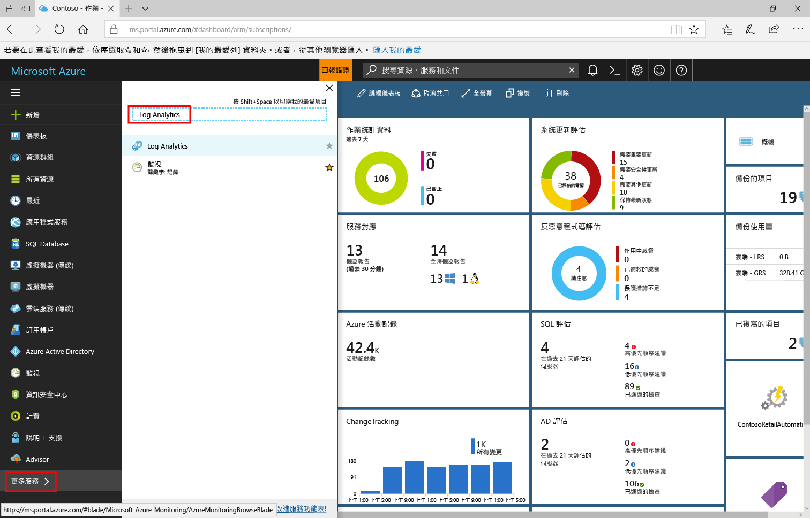

# 在 Log Analytics 中分析資料使用量

> [!NOTE]
> 本文說明如何在 Log Analytics 中分析資料使用量。  請參閱下列文章以了解相關資訊。
> - [藉由控制 Log Analytics 中的資料量與保留期來管理成本](log-analytics-manage-cost-storage.md)說明如何藉由變更資料保留期限來控制成本。
> - [監視使用量和估計成本](../monitoring-and-diagnostics/monitoring-usage-and-estimated-costs.md)說明如何針對不同的定價模型，檢視多項 Azure 監視功能的使用量和估計成本。 其中也會說明如何變更定價模型。

Log Analytics 包含下列資訊：收集的資料量、傳送資料的來源，以及傳送的不同資料類型。  使用 [Log Analytics 使用量] 儀表板來檢閱和分析資料使用量。 此儀表板會顯示每個解決方案所收集的資料量，以及您的電腦正在傳送的資料量。

## 了解使用量儀表板
[Log Analytics 使用量] 儀表板會顯示下列資訊：

- 資料量
    - 一段時間 (根據您目前的時間範圍) 的資料量
    - 依方案分類的資料量
    - 與電腦不相關的資料
- 電腦
    - 傳送資料的電腦
    - 過去 24 小時內沒有資料的電腦
- 供應項目
    - 深入解析和分析節點
    - 自動化和控制節點
    - 安全性節點  
- 效能
    - 收集資料和編制索引所花費的時間  
- 查詢清單

 
)

### 處理使用量資料
1. 登入 [Azure 入口網站](https://portal.azure.com)。
2. 在 Azure 入口網站中，按一下 [所有服務]。 在資源清單中輸入 **Log Analytics**。 當您開始輸入時，清單會根據您輸入的文字進行篩選。 選取 [Log Analytics]。       
3. 在 Log Analytics 工作區清單中，選取工作區。
4. 從左窗格中的清單選取 [使用量和估計成本]。
5. 在 [使用量和估計成本] 儀表板上，您可以選取 [時間：過去 24 小時] 並變更時間間隔以修改時間範圍。     
6. 檢視顯示您感興趣之領域的使用量類別刀鋒視窗。 選擇刀鋒視窗，然後在其中按一下某個項目以在 [記錄檔搜尋](log-analytics-log-searches.md) 中檢視詳細資料。     
7. 在 [記錄檔搜尋] 儀表板中，檢閱搜尋傳回的結果。   

## 當資料收集高於預期時建立警示
本節說明在下列情況下如何建立警示：
- 資料量超出指定的數量。
- 資料量預計會超出指定的數量。

Azure 警示支援使用搜尋查詢的[記錄警示](../monitoring-and-diagnostics/monitor-alerts-unified-log.md)。 

在過去 24 小時收集超過 100GB 的資料時，下列查詢的結果：

`union withsource = $table Usage | where QuantityUnit == "MBytes" and iff(isnotnull(toint(IsBillable)), IsBillable == true, IsBillable == "true") == true | extend Type = $table | summarize DataGB = sum((Quantity / 1024)) by Type | where DataGB > 100`

下列查詢會使用簡單的公式來預測在一天中何時會傳送超過 100GB 的資料： 

`union withsource = $table Usage | where QuantityUnit == "MBytes" and iff(isnotnull(toint(IsBillable)), IsBillable == true, IsBillable == "true") == true | extend Type = $table | summarize EstimatedGB = sum(((Quantity * 8) / 1024)) by Type | where EstimatedGB > 100`

若要針對不同的資料量顯示警示，請將查詢中的 100 變更為您要顯示警示的 GB 數。

使用[建立新記錄警示](../monitoring-and-diagnostics/monitor-alerts-unified-usage.md)中所述的步驟，可在資料收集高於預期時收到通知。

建立第一個查詢的警示時 - 在 24 小時內有超過 100GB 的資料時，請：  

- **定義警示條件**：將您的 Log Analytics 工作區指定為資源目標。
- **警示準則**：指定下列項目：
   - **訊號名稱**：選取 [自訂記錄搜尋]
   - 將 [搜尋查詢] 設定為 `union withsource = $table Usage | where QuantityUnit == "MBytes" and iff(isnotnull(toint(IsBillable)), IsBillable == true, IsBillable == "true") == true | extend Type = $table | summarize DataGB = sum((Quantity / 1024)) by Type | where DataGB > 100`
   - [警示邏輯] 為 [根據結果數目]，而 [條件] 為 [大於臨界值 0]
   - [時間週期] 為 1440 分鐘，而 [警示頻率] 設定為 60 分鐘，因為使用量資料每小時只會更新一次。
- **定義警示詳細資料**：指定下列項目：
   - 將 [名稱] 設定為「在 24 小時內大於 100GB 的資料量」
   - 將 [嚴重性] 設定為「警告」

指定現有或建立新的[動作群組](../monitoring-and-diagnostics/monitoring-action-groups.md)，以便在記錄警示符合準則時收到通知。

建立第二個查詢的警示時 - 預計在 24 小時內會有超過 100GB 的資料時，請：

- **定義警示條件**：將您的 Log Analytics 工作區指定為資源目標。
- **警示準則**：指定下列項目：
   - **訊號名稱**：選取 [自訂記錄搜尋]
   - 將 [搜尋查詢] 設定為 `union withsource = $table Usage | where QuantityUnit == "MBytes" and iff(isnotnull(toint(IsBillable)), IsBillable == true, IsBillable == "true") == true | extend Type = $table | summarize EstimatedGB = sum(((Quantity * 8) / 1024)) by Type | where EstimatedGB > 100`
   - [警示邏輯] 為 [根據結果數目]，而 [條件] 為 [大於臨界值 0]
   - [時間週期] 為 180 分鐘，而 [警示頻率] 設定為 60 分鐘，因為使用量資料每小時只會更新一次。
- **定義警示詳細資料**：指定下列項目：
   - 將 [名稱] 設定為「預計在 24 小時內大於 100GB 的資料量」
   - 將 [嚴重性] 設定為「警告」

指定現有或建立新的[動作群組](../monitoring-and-diagnostics/monitoring-action-groups.md)，以便在記錄警示符合準則時收到通知。

當您收到警示時，請使用下一節中的步驟，針對使用量高於預期的原因進行疑難排解。

## 針對使用量高於預期的原因進行疑難排解
使用量儀表板可協助您找出使用量 (且因而成本) 高於預期的原因。

較高的使用量是由下列一個或兩個原因所造成：
- 傳送到 Log Analytics 的資料比預期更多
- 比預期更多的節點將資料傳送到 Log Analytics

### 檢查是否有比預期更多的資料 
[使用量] 頁面有兩個重要區段，有助於識別收集最多資料的電腦。

「一段時間的資料量」圖表會顯示已傳送的資料總量和傳送最多資料的電腦。 頂端的圖表可讓您查看整體資料使用量為成長中、保持穩定或減少中。 電腦清單會顯示傳送最多資料的 10 部電腦。

「依方案分類的資料量」圖表可顯示每個解決方案所傳送的資料量，以及傳送最多資料的解決方案。 頂端的圖表會顯示每個解決方案在一段時間內傳送的資料總量。 此資訊可讓您識別解決方案在一段時間內傳送更多資料、大約相同數量的資料或較少的資料。 解決方案清單會顯示 10 個傳送大部分資料的解決方案。 

這兩個圖表顯示了所有資料。 某些資料已可計費，其他資料則為免費。 若要僅顯示可計費的資料，請將搜尋頁面上的查詢修改為包括 `IsBillable=true`。  

查看「一段時間的資料量」圖表。 若要查看針對特定電腦傳送最多資料的解決方案和資料類型，請按一下電腦的名稱。 按一下清單中第一部電腦的名稱。

在下列螢幕擷取畫面中，「記錄管理/效能」資料類型針對此電腦傳送最多資料。     

接下來，回到「使用量」儀表板並查看「依解決方案的資料磁碟區」圖表。 若要查看針對某個解決方案傳送最多資料的電腦，請按一下清單中的解決方案名稱。 按一下清單中第一個解決方案的名稱。 

在下列螢幕擷取畫面中，它會確認 mycon 電腦針對記錄管理解決方案傳送最多資料。     

如有需要，請執行其他分析，找出解決方案或資料類型中的大型磁碟區。 查詢範例包括：

+ **安全性**解決方案
  - `SecurityEvent | summarize AggregatedValue = count() by EventID`
+ **記錄管理**解決方案
  - `Usage | where Solution == "LogManagement" and iff(isnotnull(toint(IsBillable)), IsBillable == true, IsBillable == "true") == true | summarize AggregatedValue = count() by DataType`
+ **Perf** 資料類型
  - `Perf | summarize AggregatedValue = count() by CounterPath`
  - `Perf | summarize AggregatedValue = count() by CounterName`
+ **Event** 資料類型
  - `Event | summarize AggregatedValue = count() by EventID`
  - `Event | summarize AggregatedValue = count() by EventLog, EventLevelName`
+ **Syslog** 資料類型
  - `Syslog | summarize AggregatedValue = count() by Facility, SeverityLevel`
  - `Syslog | summarize AggregatedValue = count() by ProcessName`
+ **AzureDiagnostics** 資料類型
  - `AzureDiagnostics | summarize AggregatedValue = count() by ResourceProvider, ResourceId`

使用下列步驟來減少所收集的記錄數量：

| 高資料量的來源 | 如何縮減資料量 |
| -------------------------- | ------------------------- |
| 安全性事件            | 選取[一般或最小安全性事件](https://blogs.technet.microsoft.com/msoms/2016/11/08/filter-the-security-events-the-oms-security-collects/)   變更安全性稽核原則為只收集所需事件。 特別檢閱下列原則是否需要收集事件：   - [a稽核篩選平台](https://technet.microsoft.com/library/dd772749(WS.10).aspx)   - [稽核登錄](https://docs.microsoft.com/previous-versions/windows/it-pro/windows-server-2008-R2-and-2008/dd941614(v%3dws.10))  - [稽核檔案系統](https://docs.microsoft.com/previous-versions/windows/it-pro/windows-server-2008-R2-and-2008/dd772661(v%3dws.10))  - [稽核核心物件](https://docs.microsoft.com/previous-versions/windows/it-pro/windows-server-2008-R2-and-2008/dd941615(v%3dws.10))  - [稽核控制代碼操作](https://docs.microsoft.com/previous-versions/windows/it-pro/windows-server-2008-R2-and-2008/dd772626(v%3dws.10))  - 稽核抽取式存放裝置 |
| 效能計數器       | 變更[效能計數器組態](log-analytics-data-sources-performance-counters.md)以：   - 減少收集頻率   - 減少效能計數器的數目 |
| 事件記錄檔                 | 變更[事件記錄組態](log-analytics-data-sources-windows-events.md)以：   - 減少所收集的事件記錄數目   - 只收集必要的事件層級。 例如，不要收集「資訊」層級事件 |
| syslog                     | 變更 [Syslog 組態](log-analytics-data-sources-syslog.md)以：   - 減少所收集的設施數目   - 只收集必要的事件層級。 例如，不要收集「資訊」和「偵錯」層級事件 |
| AzureDiagnostics           | 變更資源記錄集合：   - 減少會將記錄傳送至 Log Analytics 的資源數目   - 只收集必要的記錄 |
| 電腦中不需要解決方案的方案資料 | 使用[方案目標](../operations-management-suite/operations-management-suite-solution-targeting.md)，只從必要的電腦群組收集資料。 |

### 檢查是否有比預期更多的節點
如果您是在「每節點 (OMS)」定價層上，系統便會根據您使用的節點和解決方案數目來向您收費。 您可以在使用量儀表板的 [供應項目] 區段中，查看每個供應項目目前使用的節點數。     

按一下 [查看所有...] 以檢視針對所選供應項目傳送資料的完整電腦清單。

使用[方案目標](../operations-management-suite/operations-management-suite-solution-targeting.md)，只從必要的電腦群組收集資料。

## 後續步驟
* 請參閱 [Log Analytics 中的記錄搜尋](log-analytics-log-searches.md)，以了解如何使用搜尋語言。 您可以使用搜尋查詢，對使用量資料執行額外的分析。
* 使用[建立新的記錄警示](../monitoring-and-diagnostics/monitor-alerts-unified-usage.md)中所述的步驟，可在符合搜尋條件時收到通知。
* 使用[方案目標](../operations-management-suite/operations-management-suite-solution-targeting.md)，只從必要的電腦群組收集資料。
* 若要設定有效的安全性事件收集原則，請檢閱 [Azure 資訊安全中心篩選原則](../security-center/security-center-enable-data-collection.md)。
* 變更[效能計數器組態](log-analytics-data-sources-performance-counters.md)。
* 若要修改事件收集設定，請檢閱[事件記錄組態](log-analytics-data-sources-windows-events.md)。
* 若要修改 syslog 收集設定，請檢閱 [Syslog 組態](log-analytics-data-sources-syslog.md)。
