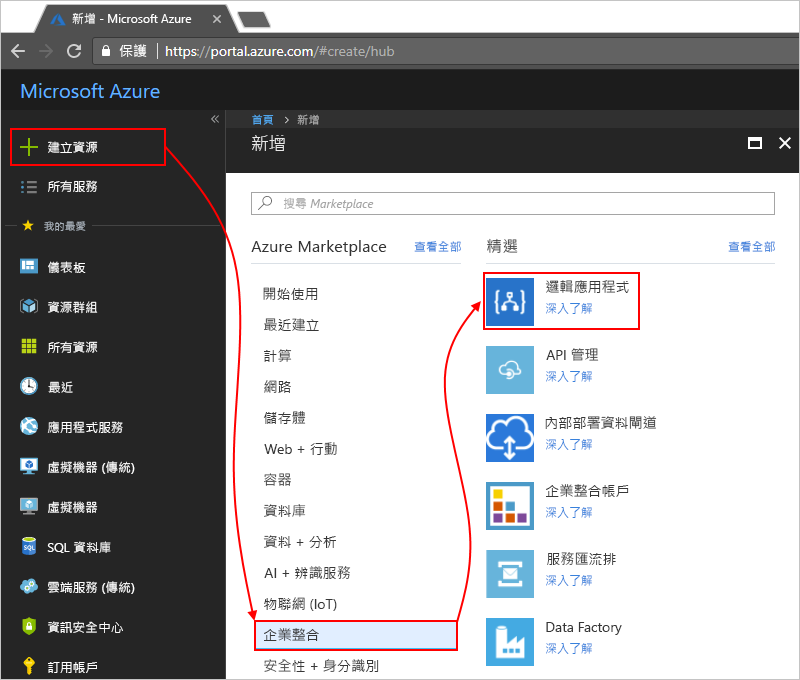

# 透過 Log Analytics 監視邏輯應用程式執行並取得深入解析

如需監視和更豐富的偵錯資訊，您可以在建立邏輯應用程式時，同時開啟 Log Analytics。 Log Analytics 會透過 Azure 入口網站，為邏輯應用程式執行提供診斷記錄和監視功能。 當您新增 Logic Apps 管理解決方案時，您會取得邏輯應用程式執行的彙總狀態，以及狀態、執行時間、重新提交狀態和相互關聯識別碼等特定詳細資料。

本文說明如何開啟 Log Analytics，讓您能夠檢視邏輯應用程式執行的執行階段事件和資料。

 > [!TIP]
 > 若要監視現有的 Logic Apps，請遵循下列步驟以[開啟診斷記錄，並將邏輯應用程式執行階段資料傳送至 Log Analytics](../logic-apps/logic-apps-monitor-your-logic-apps.md#azure-diagnostics)。

## 需求

開始之前，您需要有 Log Analytics 工作區。 了解[如何建立 Log Analytics 工作區](../log-analytics/log-analytics-quick-create-workspace.md)。 

## 建立 Logic Apps 時開啟診斷記錄

1. 在 [Azure 入口網站](https://portal.azure.com)中，建立一個邏輯應用程式。 選擇 [建立資源] > [整合] > [邏輯應用程式]。

   

1. 在 [建立邏輯應用程式] 下，執行下列工作：

   1. 為您的邏輯應用程式命名並選取您的 Azure 訂用帳戶。 

   1. 建立或選取一個 Azure 資源群組。

   1. 將 [Log Analytics] 設定為 [開啟]。 

   1. 在列出的 Log Analytics 工作區清單中，選取您要傳送邏輯應用程式執行相關資料的工作區。 

      

      完成此步驟之後，Azure 會建立您的邏輯應用程式，此應用程式現在會與您的 Log Analytics 工作區建立關聯。 
      此外，此步驟也會在您的工作區中自動安裝 Logic Apps 管理解決方案。

   1. 完成之後，請選擇 [建立]。

1. 若要檢視您的邏輯應用程式執行，請[繼續進行這些步驟](#view-logic-app-runs-oms)。

## 安裝 Logic Apps 管理解決方案

如果您在建立邏輯應用程式時已開啟 Log Analytics，請略過此步驟。 您已安裝 Logic Apps 管理解決方案。

1. 在 [Azure 入口網站](https://portal.azure.com)中，選取 [所有服務]。 在搜尋方塊中，輸入「log analytics」作為篩選條件，然後選取 [Log Analytics]。

   ![選取 [Log Analytics]](./media/logic-apps-monitor-your-logic-apps-oms/find-log-analytics.png)

1. 在 [Log Analytics] 下，尋找並選取 Log Analytics 工作區。 

   

1. 在 [設定監視解決方案] 下，選擇 [檢視解決方案]。

   ![選擇 [檢視解決方案]](media/logic-apps-monitor-your-logic-apps-oms/log-analytics-workspace.png)

1. 在 [概觀] 頁面上，選擇 [新增] 以開啟 [管理解決方案] 清單。 從該清單中，選取 [Logic Apps 管理]。 

   ![選擇 [Logic Apps 管理]](./media/logic-apps-monitor-your-logic-apps-oms/add-logic-apps-management-solution.png)

   如果找不到該解決方案，請在清單底部選擇 [載入更多] 直到解決方案出現。

1. 選擇 [建立] 開始安裝解決方案。

   ![針對 [Logic Apps Management] \(Logic Apps 管理) 選擇 [新增]](./media/logic-apps-monitor-your-logic-apps-oms/create-logic-apps-management-solution.png)

## 在 Log Analytics 工作區中檢視邏輯應用程式執行

1. 若要檢視邏輯應用程式執行的計數和狀態，請前往 [Log Analytics 工作區]，並開啟 [概觀] 頁面。 

   邏輯應用程式執行的相關細節會顯示在 [Logic Apps Management] \(Logic Apps 管理\) 磚。 若要檢視含有邏輯應用程式執行之更多詳細資料的摘要，請選擇 [Logic Apps Management] \(Logic Apps 管理) 磚。 

   

   在這裡，您的邏輯應用程式執行會依名稱或執行狀態分組。 
   此頁面也將同時顯示邏輯應用程式執行動作或觸發程序失敗的相關詳細資料。

   
   
1. 若要檢視特定邏輯應用程式或狀態的執行，請選取邏輯應用程式或狀態的資料列。

   以下範例顯示特定邏輯應用程式的所有執行：

   

   此頁面包含以下進階選項：

   * **追蹤的屬性：**

     此欄顯示邏輯應用程式的追蹤屬性，並依照依動作分組。 若要檢視追蹤屬性，請選擇 [檢視]。 
     請可以使用資料行篩選來搜尋追蹤屬性。
   
     

     初次顯示任何新增的追蹤屬性可能需費時 10-15 分鐘。 深入了解[如何將追蹤屬性新增至應用程式邏輯](logic-apps-monitor-your-logic-apps.md#azure-diagnostics-event-settings-and-details)。

   * **重新提交：** 您可以重新提交一個或多個已失敗、已成功或仍在執行的邏輯應用程式執行。 針對您要重新提交的執行選取核取方塊，然後選擇 [重新提交]。 

     

1. 若要篩選這些結果，您可以執行用戶端和伺服器端篩選。

   * **用戶端篩選**：針對每個資料行，選擇您想要的篩選條件，例如：

     

   * **伺服器端篩選**：若要選擇特定時間範圍或限制出現的執行次數，請使用頁面頂端的範圍控制項。 根據預設，一次只能出現 1,000 筆記錄。
   
     
 
1. 若要檢視特定執行的所有動作及其詳細資料，請選取邏輯應用程式執行的資料列。

   以下範例顯示特定邏輯應用程式執行的所有動作：

   
   
1. 若要在任何結果頁面上檢視結果背後的查詢，或查看所有結果，請選擇 [檢視全部] 來開啟 [記錄搜尋] 頁面。
   
   
   
   在 [記錄搜尋] 頁面上，

   * 若要在表格中檢視查詢結果，請選擇 [表格]。

   * 若要變更查詢，您可以編輯搜尋列中的查詢字串。 
   若要獲得更佳的體驗，請選擇 [進階分析]。

     
     
     在 [Azure Log Analytics] 頁面上，您可以更新查詢並透過表格檢視結果。 此查詢使用 [Kusto 查詢語言](https://aka.ms/LogAnalyticsLanguageReference)，如果您想要檢視不同的結果，可予以編輯。 

     

## 後續步驟

* [監視 B2B 訊息](../logic-apps/logic-apps-monitor-b2b-message.md)