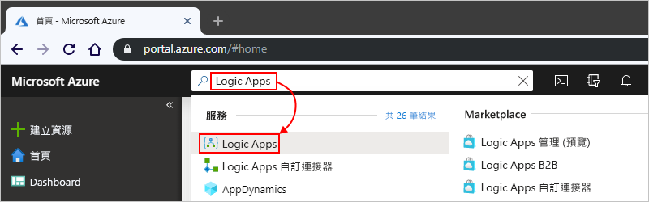
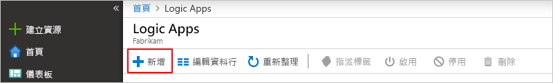
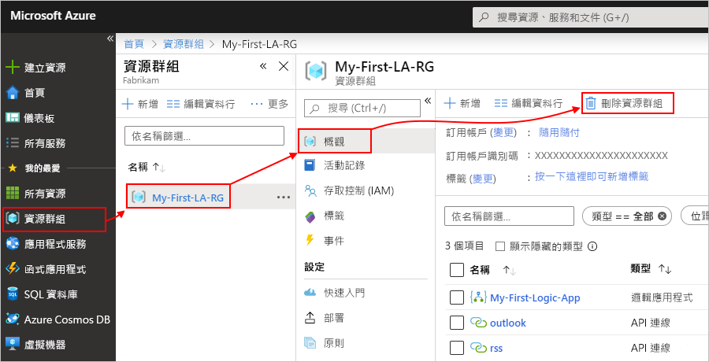

# 快速入門：使用 Azure Logic Apps 建立第一個工作流程 - Azure 入口網站

本快速入門介紹如何使用 [Azure Logic Apps](../logic-apps/logic-apps-overview.md) 建置第一個工作流程的一般基本概念，例如建立空白邏輯應用程式、新增觸發程序和動作，然後測試邏輯應用程式。 在本快速指南中，您要建置一個邏輯應用程式，定期檢查網站的 RSS 摘要中是否有新項目。 如果存在新的項目，邏輯應用程式會針對每個項目傳送電子郵件。 當您完成時，邏輯應用程式大致如下列工作流程所示︰

對於此案例，您需要一個電子郵件帳戶，而該電子郵件帳戶來自 Azure Logic Apps 所支援的服務，例如 Office 365 Outlook、Outlook.com 或 Gmail。 對於其他支援的電子郵件服務，[檢閱此處的連接器清單](https://docs.microsoft.com/connectors/)。 在此範例中，邏輯應用程式使用 Office 365 Outlook。 如果您使用不同的電子郵件服務，整體的一般步驟會相同，但您的使用者介面可能會稍有不同。

此外，如果您沒有 Azure 訂用帳戶，請先[註冊一個免費的 Azure 帳戶](https://azure.microsoft.com/free/)。

## 登入 Azure 入口網站

使用您的 Azure 帳戶認證登入 [Azure 入口網站](https://portal.azure.com)。

## 建立邏輯應用程式

1. 從 Azure 首頁的搜尋方塊中，尋找並選取 [邏輯應用程式]  。

   

1. 在 [邏輯應用程式]  頁面上，選取 [新增]  。

   

1. 在 [邏輯應用程式]  窗格上，提供有關邏輯應用程式的詳細資訊，如下所示。 在完成作業後，選取 [建立]  。

   

   | 屬性 | 值 | 描述 |
   |----------|-------|-------------|
   | **名稱** | <*logic-app-name*> | 您的邏輯應用程式名稱，其中只能包含字母、數字、連字號 (`-`)、底線 (`_`)、括弧(`(`、`)`) 和句點 (`.`)。 此範例使用 "My-First-Logic-App"。 |
   | **訂用帳戶** | <*Azure-subscription-name*> | 您的 Azure 訂用帳戶名稱 |
   | **資源群組** | <*Azure-resource-group-name*> | 用來組織相關資源之 [Azure 資源群組](../azure-resource-manager/management/overview.md)的名稱。 此範例使用 "My-First-LA-RG"。 |
   | **位置** | <*Azure-region*> | 用來存放邏輯應用程式資訊的區域。 此範例使用「美國西部」。 |
   | **Log Analytics** | 關閉 | 保留診斷記錄的 [關閉]  設定。 |
   ||||

1. 在 Azure 部署您的應用程式之後，請在 Azure 工具列上針對您部署的邏輯應用程式選取 [通知]   > [移至資源]  。

   

   或者，您可以在搜尋方塊中輸入名稱，以尋找並選取您的邏輯應用程式。

   Logic Apps 設計工具會開啟並顯示含有簡介影片和常用觸發程序的頁面。 在 [範本]  底下，選取 [空白邏輯應用程式]  。

   

接下來，新增可在新的 RSS 摘要項目出現時引發的[觸發程序](../logic-apps/logic-apps-overview.md#logic-app-concepts)。 每個邏輯應用程式都必須使用觸發程序啟動，而該觸發程序會在特定事件發生或符合特定條件時引發。 每次引發觸發程序時，Azure Logic Apps 引擎都會建立一個可啟動並執行您工作流程的邏輯應用程式執行個體。

## 新增 RSS 觸發程序

1. 在 [邏輯應用程式設計工具]  的 [搜尋] 方塊底下，選取 [全部]  。

1. 在 [搜尋] 方塊中，輸入 `rss` 以尋找 RSS 連接器。 從觸發程序清單中，選取 [摘要項目發佈時]  觸發程序。

   ![選取 [摘要項目發佈時] 觸發程序](./media/quickstart-create-first-logic-app-workflow/add-rss-trigger-new-feed-item.png)

1. 為您的觸發程序提供這項資訊，如下所說明：

   

   | 屬性 | 值 | 描述 |
   |----------|-------|-------------|
   | **RSS 摘要 URL** | `http://feeds.reuters.com/reuters/topNews` | 您想要監視的 RSS 摘要連結 |
   | **間隔** | 1 | 在檢查之間所要等待的間隔數目 |
   | **頻率** | Minute | 在檢查之間每個間隔的時間單位  |
   ||||

   時間間隔和頻率可一起為邏輯應用程式的觸發程序定義排程。 此邏輯應用程式會每分鐘檢查摘要。

1. 若要立即摺疊觸發程序的詳細資料，按一下觸發程序的標題列內部。

   

1. 儲存您的邏輯應用程式。 在設計工具的工具列上，選取 [儲存]  。

邏輯應用程式目前啟用中，但是不會執行檢查 RSS 摘要以外的任何其他作業。 因此，新增會在觸發程序引發時回應的動作。

## 新增 [傳送電子郵件] 動作

現在請新增一個[動作](../logic-apps/logic-apps-overview.md#logic-app-concepts)，在 RSS 摘要中出現新項目時傳送電子郵件。

1. 在 [摘要項目發佈時]  觸發程序下方，選取 [新增步驟]  。

   ![在觸發程序下方，選取 [新增步驟]](./media/quickstart-create-first-logic-app-workflow/add-new-step-under-trigger.png)

1. 在 [選擇動作]  和搜尋方塊中，選取 [全部]  。

1. 在 [搜尋] 方塊中，輸入 `send an email` 來尋找可提供此動作的連接器。 從動作清單中，為您想要使用的電子郵件服務選取 [傳送電子郵件] 動作。 此範例使用 Office 365 Outlook 連接器，其具有 [傳送電子郵件]  動作。

   ![選取適用於 Office 365 Outlook 的 [傳送電子郵件] 動作](./media/quickstart-create-first-logic-app-workflow/add-action-send-email.png)

   若要篩選特定應用程式或服務的動作清單，您可以先選取該應用程式或服務：

   * 對於 Azure 工作或學校帳戶，選取 Office 365 Outlook。
   * 對於個人 Microsoft 帳戶，選取 Outlook.com。

1. 如果您選取的電子郵件連接器提示您驗證您的身分識別，請立即完成該步驟，以建立邏輯應用程式與電子郵件服務之間的連線。

   > [!NOTE]
   > 在這個此特定的範例中，您要手動驗證您的身分識別。 不過，需要驗證的連接器會因其支援的驗證類型而有所不同。 您也可以選擇設定您想要處理驗證的方式。 例如，當您使用 Azure Resource Manager 範本進行部署時，可以將您想要經常或輕鬆變更的輸入 (例如連線資訊) 參數化並保護其安全。 如需詳細資訊，請參閱下列主題：
   >
   > * [部署的範本參數](../logic-apps/logic-apps-azure-resource-manager-templates-overview.md#template-parameters)
   > * [授權 OAuth 連接](../logic-apps/logic-apps-deploy-azure-resource-manager-templates.md#authorize-oauth-connections)
   > * [使用受控識別驗證存取權](../logic-apps/create-managed-service-identity.md)
   > * [驗證邏輯應用程式部署的連線](../logic-apps/logic-apps-azure-resource-manager-templates-overview.md#authenticate-connections)

1. 在 [傳送電子郵件]  動作中，指定您要包含在電子郵件中的資料。

   1. 在 [收件者]  方塊中，輸入收件者的電子郵件地址。 為了測試用途，您可以使用自己的電子郵件地址。

      現在，請忽略出現的 [新增動態內容]  清單。 當您按一下某些編輯方塊內部時，這份清單隨即出現，並顯示上一個步驟中可在工作流程中納為輸入的任何可用參數。

   1. 在 [主旨]  方塊中，輸入以下文字且尾端加上一個空格：`New RSS item: `

      ![在 [主旨] 屬性中，輸入您的電子郵件主旨](./media/quickstart-create-first-logic-app-workflow/add-action-send-email-subject.png)

   1. 從 [新增動態內容]  清單中，選取 [摘要標題]  以包含 RSS 項目標題。

      ![從動態內容清單中，選取 [摘要標題] 屬性](./media/quickstart-create-first-logic-app-workflow/add-action-send-email-subject-dynamic-content.png)

      當您完成時，電子郵件主旨看起來如下列範例：

      

      如果 "For each" 迴圈出現在設計工具上，表示您選取了陣列的權杖，例如 **categories-item** 權杖。 對於這類權杖，設計工具會自動對參考該權杖的動作新增此迴圈。 如此一來，邏輯應用程式會在每個陣列項目上執行相同動作。 若要移除迴圈，請選取迴圈標題列上的**省略符號** ( **...** )，然後選取 [刪除]  。

   1. 在 [內文]  方塊中輸入此文字，然後為電子郵件內文選取這些權杖。 若要在編輯方塊中新增空白的行，請按 Shift + Enter。

      

      | 屬性 | 描述 |
      |----------|-------------|
      | **摘要標題** | 項目的標題 |
      | **摘要發佈時間** | 項目的發佈日期和時間 |
      | **主要摘要連結** | 項目的 URL |
      |||

1. 儲存您的邏輯應用程式。

接下來，測試邏輯應用程式。

## 執行邏輯應用程式

若要手動啟動邏輯應用程式，請在設計工具的工具列上選取 [執行]  。 或者，等候邏輯應用程式依照您指定的排程 (每分鐘) 檢查 RSS 摘要。 如果 RSS 摘要有新的項目，邏輯應用程式會針對每個新的項目傳送電子郵件。 否則，邏輯應用程式會等到下一個間隔，再檢查一次。 如果您沒有得到任何電子郵件，請檢查垃圾郵件資料夾。

例如，以下是此邏輯應用程式傳送的範例電子郵件。

技術上，當觸發程序檢查 RSS 摘要並尋找新項目時，觸發程序會引發，而 Azure Logic Apps 引擎會建立邏輯應用程式工作流程的執行個體，以便在工作流程中執行動作。 如果觸發程序找不到新項目，觸發程序並不會引發，而且會「略過」具現化工作流程。

恭喜，您現在已透過 Azure 入口網站成功建置並執行您的第一個邏輯應用程式。

## 清除資源

如果不再需要此範例，請刪除包含邏輯應用程式的資源群組和相關資源。

1. 在主要 Azure 功能表上，選取 [資源群組]  ，然後選取邏輯應用程式的資源群組。 在 [概觀]  窗格上，選取 [刪除資源群組]  。

   

1. 當 [確認] 窗格出現時，輸入資源群組名稱，然後選取 [刪除]  。

   ![若要確認篩除，請選取 [刪除]](./media/quickstart-create-first-logic-app-workflow/delete-resource-group-2.png)

> [!NOTE]
> 當您刪除邏輯應用程式後，就不會具現化新的執行。 所有進行中和擱置的執行都會取消。 如果您有數千個執行，加以取消可能需要很長的時間。

## 後續步驟

在本快速入門中，您已建立第一個邏輯應用程式，以便檢查以您指定的排程 (每分鐘) 為基礎的 RSS 更新，並且在有更新時採取動作 (傳送電子郵件)。 若要深入了解，請繼續執行本教學課程，以建立更多以排程為基礎的進階工作流程：

> [!div class="nextstepaction"]
> [使用以排程為基礎的邏輯應用程式檢查流量](../logic-apps/tutorial-build-schedule-recurring-logic-app-workflow.md)
