# <a name="quickstart-create-your-first-automated-workflow-with-azure-logic-apps---azure-portal"></a>快速入門：使用 Azure Logic Apps 建立第一個自動化工作流程 - Azure 入口網站

本快速入門介紹如何使用 [Azure Logic Apps](../logic-apps/logic-apps-overview.md) 建立第一個自動化工作流程。 在本文中，您會建立一個邏輯應用程式，以定期檢查網站的 RSS 摘要中是否有新項目。 如果存在新的項目，邏輯應用程式會針對每個項目傳送電子郵件。 當您完成時，邏輯應用程式大致如下列工作流程所示︰


若要依照本快速入門執行，您需有一個電子郵件帳戶，而該電子郵件帳戶來自 Logic Apps 所支援的提供者 (例如 Office 365 Outlook、Outlook.com 或 Gmail)。 對於其他提供者，請[檢閱這裡的連接器清單](https://docs.microsoft.com/connectors/)。 本邏輯應用程式會使用 Office 365 Outlook 帳戶。 如果您使用另一個電子郵件帳戶，則整體步驟相同，但您的 UI 可能稍有不同。 

此外，如果您沒有 Azure 訂用帳戶，請先<a href="https://azure.microsoft.com/free/" target="_blank">註冊一個免費的 Azure 帳戶</a>。

## <a name="sign-in-to-the-azure-portal"></a>登入 Azure 入口網站

使用您的 Azure 帳戶認證登入 <a href="https://portal.azure.com" target="_blank">Azure 入口網站</a>。

## <a name="create-your-logic-app"></a>建立邏輯應用程式 

1. 在主要 Azure 功能表中，選擇 [建立資源] > [整合] > [邏輯應用程式]。

   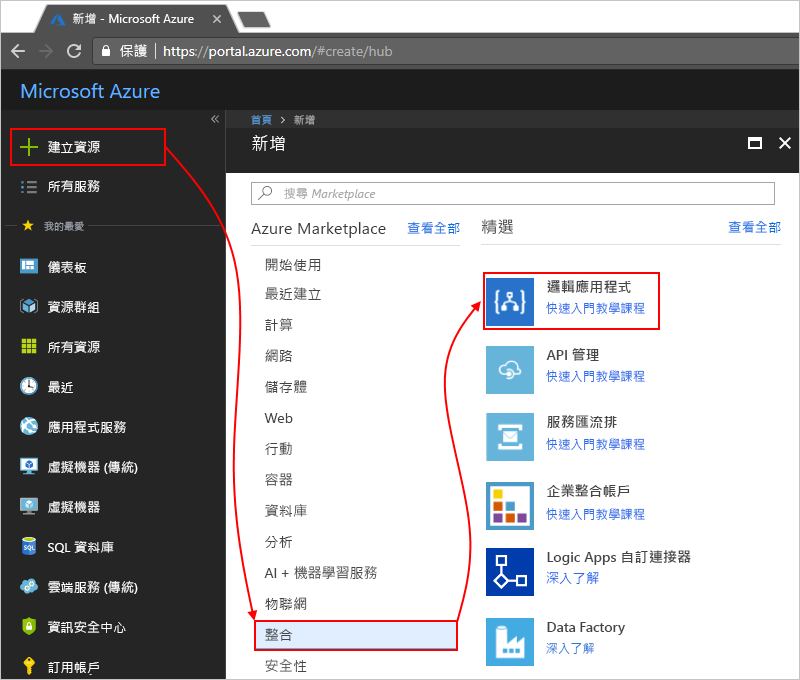

3. 在 [建立邏輯應用程式] 底下，提供有關邏輯應用程式的詳細資訊，如下所示。 完成之後，請選擇 [釘選到儀表板] > [建立]。

   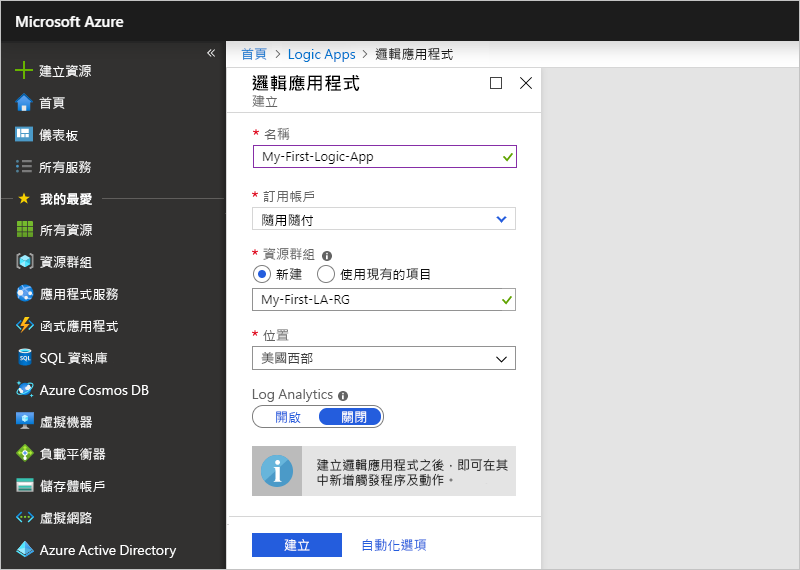

   | 屬性 | 值 | 說明 | 
   |----------|-------|-------------| 
   | **名稱** | MyFirstLogicApp | 邏輯應用程式的名稱 | 
   | **訂用帳戶** | <your-Azure-subscription-name> | Azure 訂用帳戶的名稱 | 
   | **資源群組** | My-First-LA-RG | 用來組織相關資源之 [Azure 資源群組](../azure-resource-manager/resource-group-overview.md)的名稱 | 
   | **位置** | 美國西部 | 用來存放邏輯應用程式資訊的區域 | 
   | **Log Analytics** | 關閉 | 保留診斷記錄的 [關閉] 設定。 | 
   |||| 

3. 在 Azure 部署您的應用程式之後，Logic Apps 設計工具隨即開啟，並顯示含有簡介影片和常用觸發程序的頁面。 在 [範本] 底下，選擇 [空白邏輯應用程式]。

   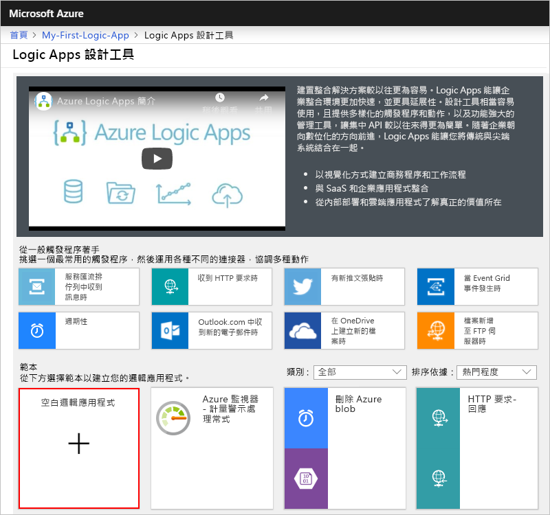

接下來，新增可在新的 RSS 摘要項目出現時引發的[觸發程序](../logic-apps/logic-apps-overview.md#logic-app-concepts)。 每個邏輯應用程式都必須使用觸發程序啟動，而該觸發程序會在特定事件發生或符合特定條件時引發。 每次引發觸發程序時，Logic Apps 引擎會建立邏輯應用程式執行個體，啟動並執行您的工作流程。

<a name="add-rss-trigger"></a>

## <a name="check-rss-feed-with-a-trigger"></a>使用觸發程序檢查 RSS 摘要

1. 在設計工具的搜尋方塊中輸入 "rss"。 選取此觸發程序︰**RSS - 摘要項目發佈時**

   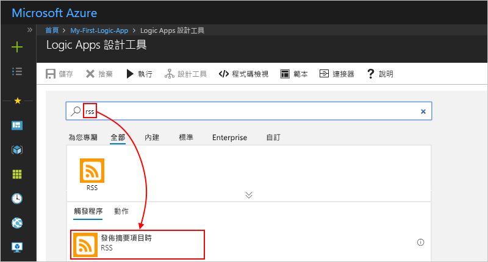

2. 為您的觸發程序提供此資訊，如下所示和描述： 

   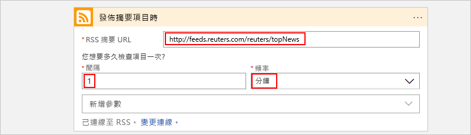

   | 屬性 | 值 | 說明 | 
   |----------|-------|-------------| 
   | **RSS 摘要 URL** | ```http://feeds.reuters.com/reuters/topNews``` | 您想要監視的 RSS 摘要連結 | 
   | **間隔** | 1 | 在檢查之間所要等待的間隔數目 | 
   | **頻率** | 分鐘 | 在檢查之間每個間隔的時間單位  | 
   |||| 

   時間間隔和頻率可一起為邏輯應用程式的觸發程序定義排程。 
   此邏輯應用程式會每分鐘檢查摘要。

3. 若要立即隱藏觸發程序的詳細資料，按一下觸發程序的標題列內部。

   

4. 儲存您的邏輯應用程式。 在設計工具的工具列上，選擇 [儲存]。 

邏輯應用程式目前啟用中，但是不會執行檢查 RSS 摘要以外的任何其他作業。 因此，新增會在觸發程序引發時回應的動作。

## <a name="send-email-with-an-action"></a>使用動作傳送電子郵件

現在請新增一個[動作](../logic-apps/logic-apps-overview.md#logic-app-concepts)，以在 RSS 摘要中出現新項目時傳送電子郵件。 

1. 在 [摘要項目發佈時] 觸發程序下方，選擇 [+ 新增步驟] > [新增動作]。

   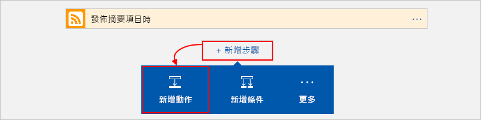

2. 在 [選擇動作] 下方，輸入「傳送電子郵件」作為篩選條件。 在動作清單中，為您想要的電子郵件提供者選取 [傳送電子郵件] 動作。 

   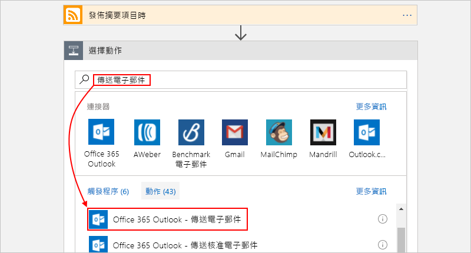

   若要篩選特定應用程式或服務的動作清單，您可以先選取該應用程式或服務：

   * 對於 Azure 工作或學校帳戶，選取 Office 365 Outlook。 
   * 對於個人 Microsoft 帳戶，選取 Outlook.com。

3. 如果系統要求提供認證，請登入您的電子郵件帳戶，以便 Logic Apps 建立您的電子郵件帳戶連線。

4. 在 [傳送電子郵件] 動作中，指定您要包含在電子郵件中的資料。 

   1. 在 [收件者] 方塊中，輸入收件者的電子郵件地址。 
   為了測試用途，您可以使用自己的電子郵件地址。

      現在，請忽略出現的 [新增動態內容] 清單。 
      當您按一下某些編輯方塊內部時，這份清單隨即出現，並顯示上一個步驟中可在工作流程中納為輸入的任何可用參數。 

   2. 在 [主旨] 方塊中，輸入以下文字且尾端加上一個空格：```New RSS item: ```

      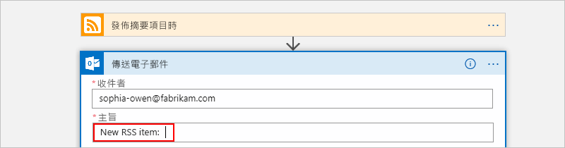
 
   3. 從 [新增動態內容] 清單中，選取 [摘要標題] 以包含 RSS 項目標題。

      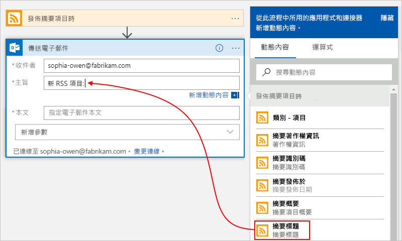

      當您完成時，電子郵件主旨看起來如下列範例：

      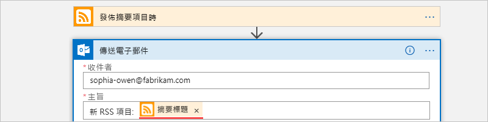

      如果 "For each" 迴圈出現在設計工具上，表示您選取了陣列的權杖，例如 **categories-item** 權杖。 
      對於這類權杖，設計工具會自動對參考該權杖的動作新增此迴圈。 
      如此一來，邏輯應用程式會在每個陣列項目上執行相同動作。 
      若要移除迴圈，請選擇迴圈標題列上的**省略符號** (**...**)，然後選擇 [刪除]。

   4. 在 [內文] 方塊中輸入此文字，然後為電子郵件內文選取這些權杖。 
   若要在編輯方塊中新增空白的行，請按 Shift + Enter。 

      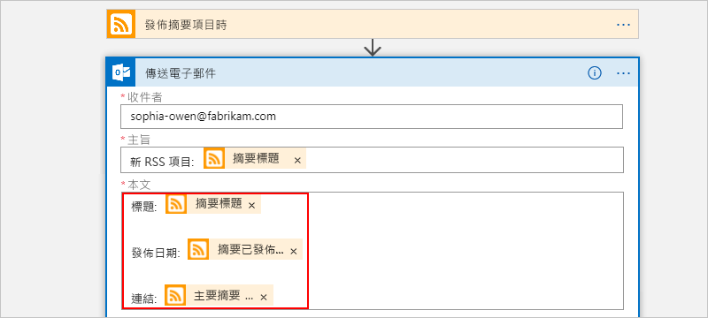

      | 屬性 | 說明 | 
      |----------|-------------| 
      | **摘要標題** | 項目的標題 | 
      | **摘要發佈時間** | 項目的發佈日期和時間 | 
      | **主要摘要連結** | 項目的 URL | 
      ||| 
   
5. 儲存您的邏輯應用程式。

接下來，測試邏輯應用程式。

## <a name="run-your-logic-app"></a>執行邏輯應用程式

若要手動啟動邏輯應用程式，在設計工具工具列上，選擇 [執行]。 或者，等候邏輯應用程式依照您指定的排程 (每分鐘) 檢查 RSS 摘要。 如果 RSS 摘要有新的項目，邏輯應用程式會針對每個新的項目傳送電子郵件。 否則，邏輯應用程式會等到下一個間隔，再檢查一次。 

例如，以下是此邏輯應用程式傳送的範例電子郵件。 如果您沒有得到任何電子郵件，請檢查垃圾郵件資料夾。

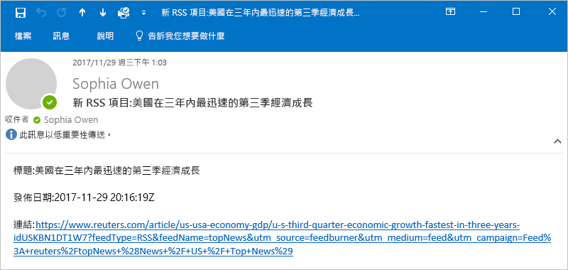

技術上，當觸發程序檢查 RSS 摘要並尋找新項目時，觸發程序會引發，而 Logic Apps 引擎會建立邏輯應用程式工作流程的執行個體，以在工作流程中執行動作。
如果觸發程序找不到新項目，觸發程序並不會引發，而且會「略過」具現化工作流程。

恭喜，您現在已透過 Azure 入口網站成功建置並執行您的第一個邏輯應用程式！

## <a name="clean-up-resources"></a>清除資源

如果不再需要此範例，請刪除包含邏輯應用程式的資源群組和相關資源。 

1. 在主要 Azure 功能表上，移至 [資源群組]，然後選取邏輯應用程式的資源群組。 在 [概觀] 頁面上，選擇 [刪除資源群組]。 

   ![[資源群組] > [概觀] > [刪除資源群組]](./media/quickstart-create-first-logic-app-workflow/delete-resource-group.png)

2. 輸入資源群組名稱作為確認，然後選擇 [刪除]。

   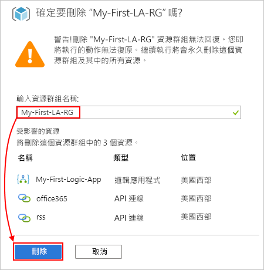

> [!NOTE]
> 當您刪除邏輯應用程式後，就不會具現化新的執行。 所有進行中和擱置的執行都會取消。 如果您有數千個執行，加以取消可能需要很長的時間。

## <a name="get-support"></a>取得支援

* 如有問題，請瀏覽 [Azure Logic Apps 論壇](https://social.msdn.microsoft.com/Forums/en-US/home?forum=azurelogicapps)。
* 若要提交或票選功能構想，請造訪 [Logic Apps 使用者意見反應網站](http://aka.ms/logicapps-wish)。

## <a name="next-steps"></a>後續步驟

在本快速入門中，您已建立第一個邏輯應用程式，以便檢查以您指定的排程 (每分鐘) 為基礎的 RSS 更新，並且在有更新時採取動作 (傳送電子郵件)。 若要深入了解，請繼續執行本教學課程，以建立更多以排程為基礎的進階工作流程：

> [!div class="nextstepaction"]
> [使用以排程為基礎的邏輯應用程式檢查流量](../logic-apps/tutorial-build-schedule-recurring-logic-app-workflow.md)
