# <a name="quickstart-create-and-manage-logic-app-workflow-definitions-by-using-visual-studio-code"></a>快速入門：使用 Visual Studio Code 來建立及管理邏輯應用程式工作流程定義

使用 [Azure Logic Apps](../logic-apps/logic-apps-overview.md) 與 Visual Studio Code，您可以建立及管理有助於自動化工作、工作流程與程序的邏輯應用程式，以便整合各組織與企業的應用程式、資料、系統與服務。 此快速入門示範如何透過以程式碼為基礎的體驗，為邏輯應用程式建立及編輯基礎工作流程定義 (使用 JavaScript 物件標記法 (JSON))。 您也可以使用已部署至 Azure 的現有邏輯應用程式。

雖然您可以在 [Azure 入口網站](https://portal.azure.com)與 Visual Studio 中執行這些相同的工作，但當您已經熟悉邏輯應用程式定義且想要直接用於程式碼時，在 Visual Studio Code 中可更快開始使用。 例如，您可以停用、啟用、刪除及重新整理已建立的邏輯應用程式。 此外，您也可以從 Visual Studio Code 執行所在的任何開發平台 (例如 Linux、Windows、和 Mac) 來處理邏輯應用程式和整合帳戶。

針對本文，您可以從這個[快速入門](../logic-apps/quickstart-create-first-logic-app-workflow.md)建立相同的邏輯應用程式；該快速入門較著重於基本概念。 在 Visual Studio Code 中，邏輯應用程式看起來會像以下範例：

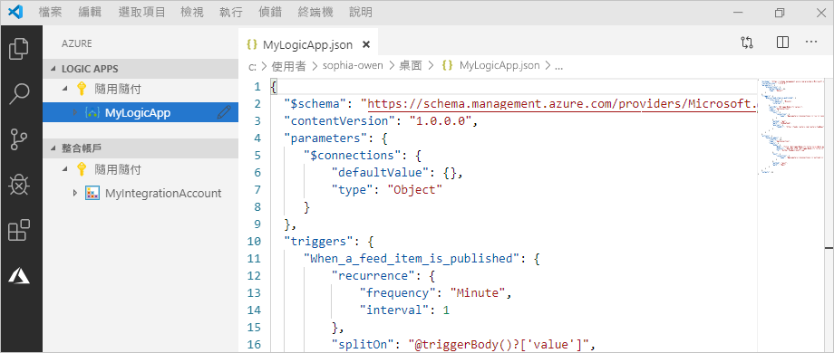

開始之前，請確定您具有下列項目：

* 如果您沒有 Azure 訂用帳戶和訂用帳戶，請先[註冊免費的 Azure 帳戶](https://azure.microsoft.com/free/)。

* [邏輯應用程式工作流程定義](../logic-apps/logic-apps-workflow-definition-language.md)與其結構 (以 JSON 描述) 的基本知識

  如果您不熟悉 Logic Apps，請嘗試這個[快速入門](../logic-apps/quickstart-create-first-logic-app-workflow.md)，它會在 Azure 入口網站中建立您的第一個邏輯應用程式，並較著重於基本概念。

* 可存取網路以登入 Azure 與您的 Azure 訂用帳戶

* 如果您還沒有以下這些工具，請加以下載並安裝：

  * [Visual Studio Code 1.25.1 版或更新版本](https://code.visualstudio.com/) (免費)

  * 適用於 Azure Logic Apps 的 Visual Studio Code 延伸模組

    您可以從 [Visual Studio Marketplace](https://marketplace.visualstudio.com/items?itemName=ms-azuretools.vscode-logicapps) 或直接從 Visual Studio Code 內下載並安裝此擴充功能。 務必在安裝之後重新載入 Visual Studio Code。

    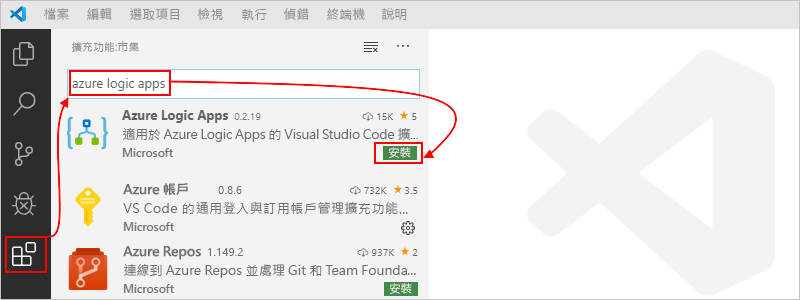

    選取在 Visual Studio Code 工具列中顯示的 Azure 圖示，來確認擴充功能已正確安裝。

    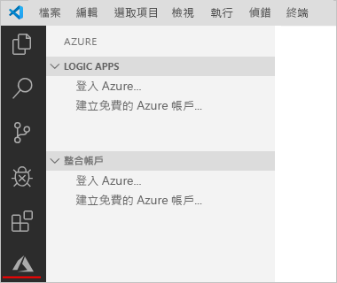

    如需詳細資訊，請參閱[延伸模組市集](https://code.visualstudio.com/docs/editor/extension-gallery) \(英文\)。 若要對此擴充功能的開放原始碼版本做出貢獻，請造訪 [GitHub 上適用於 Visual Studio Code 的 Azure Logic Apps 擴充功能](https://github.com/Microsoft/vscode-azurelogicapps) \(英文\)。

<a name="sign-in-azure"></a>

## <a name="sign-in-to-azure"></a>登入 Azure

1. 開啟 Visual Studio Code。 在 Visual Studio Code 工具列上，選取 Azure 圖示。

   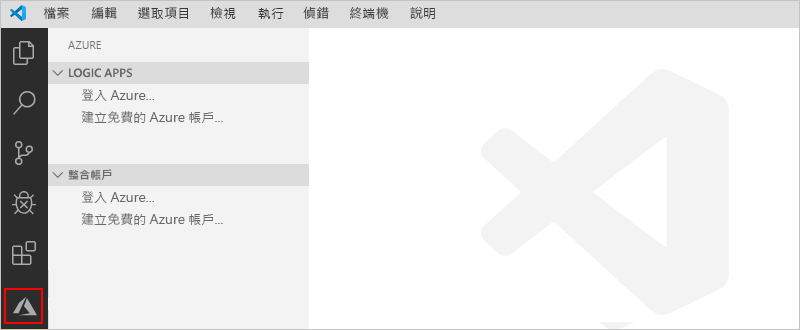

1. 在 Azure 視窗的 [Logic Apps]  下，選取 [登入 Azure]  。 當 Microsoft 登入頁面提示您時，請使用您的 Azure 帳戶登入。

   ![選取 [登入 Azure]](./media/quickstart-create-logic-apps-visual-studio-code/sign-in-azure-visual-studio-code.png)

   1. 如果登入所花費的時間比平時長，Visual Studio Code 會提供裝置程式碼，以提示您透過 Microsoft 驗證網站登入。 若要改為使用程式碼登入，請選取 [使用裝置程式碼]  。

      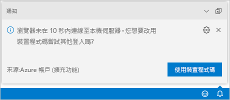

   1. 若要複製程式碼，請選取 [複製並開啟]  。

      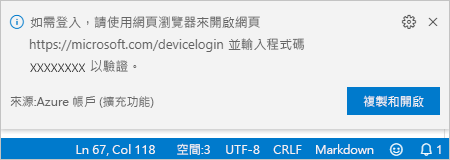

   1. 若要開啟新的瀏覽器視窗並繼續前往驗證網站，請選取 [開啟連結]  。

      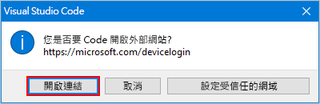

   1. 在 [登入您的帳戶]  頁面上輸入您的驗證碼，然後選取 [下一步]  。

      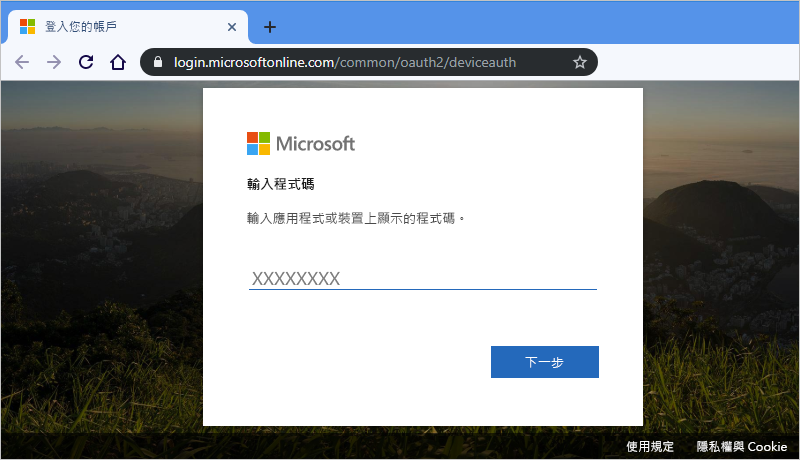

1. 選取您的 Azure 帳戶。 登入之後，您可以關閉瀏覽器，然後返回 Visual Studio Code。

   在 [Azure] 窗格中，[Logic Apps]  和 [整合帳戶]  區段現在會顯示與您的帳戶相關聯的 Azure 訂用帳戶。 不過，若未看到您預期的訂用帳戶，或區段顯示過多訂用帳戶，請執行下列步驟：

   1. 將指標移至 **Logic Apps** 標籤上方。 在工具列出現時，選取 [選取訂用帳戶]  (篩選圖示)。

      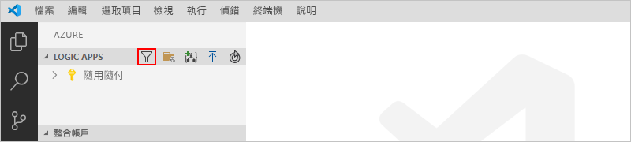

   1. 從顯示的清單中，選取您要顯示的訂用帳戶。

1. 在 [Logic Apps]  底下，選取您要的訂用帳戶。 訂用帳戶節點會展開，並顯示任何存在於該訂用帳戶中的邏輯應用程式。

   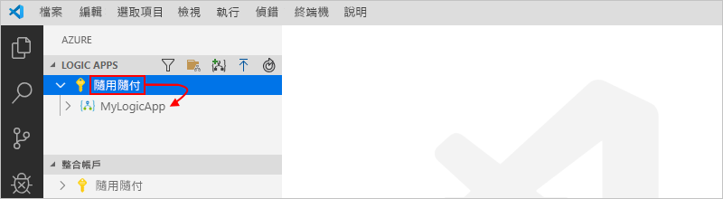

   > [!TIP]
   > 在 [整合帳戶]  底下選取您的訂用帳戶後，會顯示任何存在於該訂用帳戶中的整合帳戶。

<a name="create-logic-app"></a>

## <a name="create-new-logic-app"></a>建立新的邏輯應用程式

1. 如果您未從 Visual Studio Code 中登入 Azure 帳戶和訂用帳戶，請依照[先前的步驟立即登入](#sign-in-azure)。

1. 在 Visual Studio Code 中的 **Logic Apps** 底下，開啟訂用帳戶的捷徑功能表，然後選取 [建立邏輯應用程式]  。

   ![從訂用帳戶功能表中，選取 [建立邏輯應用程式]](./media/quickstart-create-logic-apps-visual-studio-code/create-logic-app-visual-studio-code.png)

   此時會出現一份清單，顯示您訂用帳戶中的任何 Azure 資源群組。

1. 在資源群組清單中，選取 [建立新的資源群組]  或現有的資源群組。 在此範例中，請建立新的資源群組。

   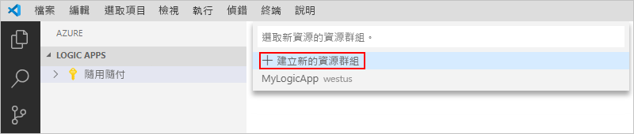

1. 提供您的 Azure 資源群組名稱，然後按 ENTER 鍵。

   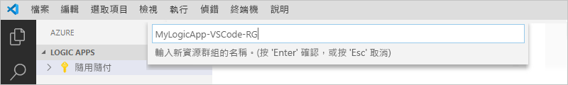

1. 選取要儲存邏輯應用程式中繼資料的 Azure 區域。

   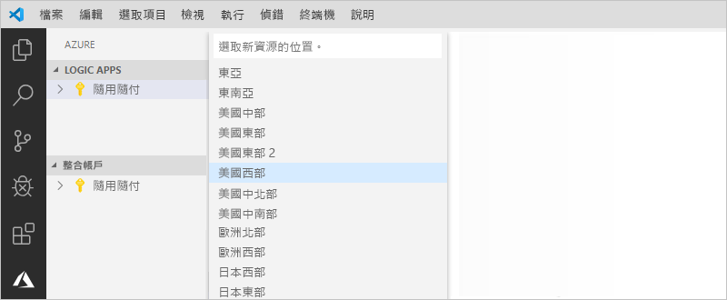

1. 為您的邏輯應用程式提供名稱，然後按 Enter 鍵。

   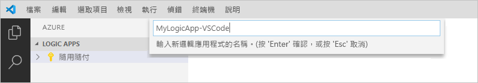

   在您位於 Azure 視窗中的 Azure 訂用帳戶底下，會出現新的和空白的邏輯應用程式。 Visual Studio Code 也會開啟 JSON (.logicapp.json) 檔案，其中包含邏輯應用程式的基本架構工作流程定義。 現在，您可以開始在此 JSON 檔案中手動撰寫邏輯應用程式的工作流程定義。 如需與工作流程定義的結構和語法有關的技術參考，請參閱 [Azure Logic Apps 的工作流程定義語言結構描述](../logic-apps/logic-apps-workflow-definition-language.md)。

   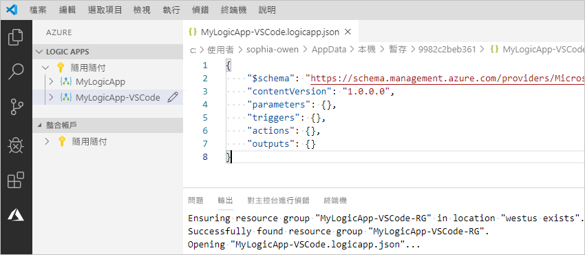

   例如，以下是範例邏輯應用程式工作流程定義，以 RSS 觸發程序和 Office 365 Outlook 動作為開頭。 通常 JSON 元素會在每個區段中依字母順序顯示。 不過，此範例大致上會以邏輯應用程式步驟出現在設計工具中的順序來顯示這些元素。

   > [!IMPORTANT]
   > 如果您想要重複使用此範例邏輯應用程式定義，您必須要有 Office 365 組織帳戶，例如 @fabrikam.com。 請務必將虛構的電子郵件地址取代為您自己的電子郵件地址。 若要使用不同的電子郵件連接器 (例如 Outlook.com 或 Gmail)，請將 `Send_an_email_action` 動作取代為 [Azure Logic Apps 支援的電子郵件連接器](../connectors/apis-list.md)所提供的類似動作。

   ```json
   {
      "$schema": "https://schema.management.azure.com/providers/Microsoft.Logic/schemas/2016-06-01/workflowdefinition.json#",
      "contentVersion": "1.0.0.0",
      "parameters": {
         "$connections": {
            "defaultValue": {},
            "type": "Object"
         }
      },
      "triggers": {
         "When_a_feed_item_is_published": {
            "recurrence": {
               "frequency": "Minute",
               "interval": 1
            },
            "splitOn": "@triggerBody()?['value']",
            "type": "ApiConnection",
            "inputs": {
               "host": {
                  "connection": {
                     "name": "@parameters('$connections')['rss']['connectionId']"
                  }
               },
               "method": "get",
               "path": "/OnNewFeed",
               "queries": {
                  "feedUrl": "http://feeds.reuters.com/reuters/topNews"
               }
            }
         }
      },
      "actions": {
         "Send_an_email_(V2)": {
            "runAfter": {},
            "type": "ApiConnection",
            "inputs": {
               "body": {
                  "Body": "<p>Title: @{triggerBody()?['title']}<br>\n<br>\nDate published: @{triggerBody()?['updatedOn']}<br>\n<br>\nLink: @{triggerBody()?['primaryLink']}</p>",
                  "Subject": "RSS item: @{triggerBody()?['title']}",
                  "To": "sophia-owen@fabrikam.com"
               },
               "host": {
                  "connection": {
                     "name": "@parameters('$connections')['office365']['connectionId']"
                  }
               },
               "method": "post",
               "path": "/v2/Mail"
            }
         }
      },
      "outputs": {}
   }
   ```

1. 完成後，請儲存邏輯應用程式的工作流程定義。 ([檔案] 功能表 > [儲存]，或按 Ctrl+S)

1. 當系統提示您將邏輯應用程式上傳至您的 Azure 訂用帳戶時，請選取 [上傳]  。

   此步驟會將您的邏輯應用程式發佈至 [Azure 入口網站](https://portal.azure.com)，並讓您的邏輯在 Azure 中上線並執行。

   

## <a name="view-logic-app-in-designer"></a>在設計工具中檢視邏輯應用程式

在 Visual Studio Code 中，您可以在唯讀設計檢視中開啟邏輯應用程式。 雖然您無法在設計工具中編輯邏輯應用程式，但您可以使用設計工具檢視，以視覺化方式查看邏輯應用程式的工作流程。

在 Azure 視窗的 [Logic Apps]  底下，開啟邏輯應用程式的捷徑功能表，然後選取 [在設計工具中開啟]  。

唯讀設計工具會在另一個視窗中開啟，並顯示邏輯應用程式的工作流程，例如：

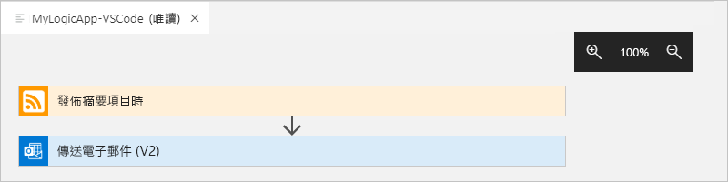

## <a name="view-in-azure-portal"></a>在 Azure 入口網站中檢視

若要在 Azure 入口網站中檢閱您的邏輯應用程式，請執行下列步驟：

1. 使用與邏輯應用程式相關聯的相同 Azure 帳戶和訂用帳戶，登入 [Azure 入口網站](https://portal.azure.com)。

1. 在 Azure 入口網站的搜尋方塊中，輸入您的邏輯應用程式名稱。 從結果清單中，選取您的邏輯應用程式。

   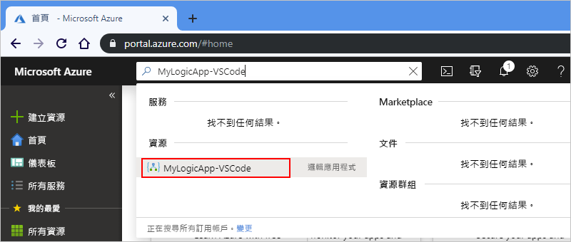

<a name="disable-enable-logic-app"></a>

## <a name="disable-or-enable-logic-app"></a>停用或啟用邏輯應用程式

在 Visual Studio Code 中，如果您編輯已發佈的邏輯應用程式並儲存變更，則會*覆寫*您已部署的應用程式。 若要避免在生產環境中斷邏輯應用程式，並盡可能避免運作中斷，請先停用邏輯應用程式。 之後，您可以在確認邏輯應用程式仍可運作後，再重新啟用邏輯應用程式。

1. 如果您未從 Visual Studio Code 中登入 Azure 帳戶和訂用帳戶，請依照[先前的步驟立即登入](#sign-in-azure)。

1. 在 Azure 視窗中的 [Logic Apps]  底下，展開您的 Azure 訂用帳戶，以便檢視該訂用帳戶中的所有邏輯應用程式。

   1. 若要停用您想要的邏輯應用程式，請開啟邏輯應用程式的功能表，然後選取 [停用]  。

      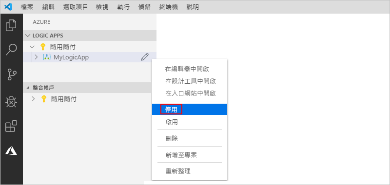

   1. 當您準備好要重新啟用邏輯應用程式時，請開啟邏輯應用程式的功能表，然後選取 [啟用]  。

      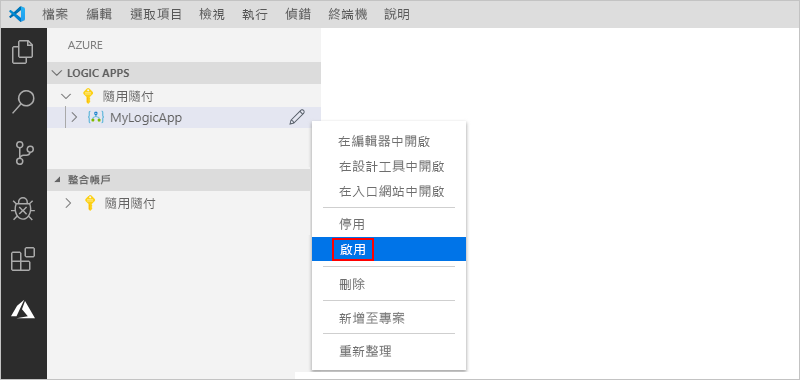

<a name="edit-logic-app"></a>

## <a name="edit-deployed-logic-app"></a>編輯已部署的邏輯應用程式

在 Visual Studio Code 中，您可以開啟並編輯已在 Azure 中部署的邏輯應用程式的工作流程定義。

> [!IMPORTANT] 
> 在生產環境中編輯正在執行的邏輯應用程式之前，請先[停用邏輯應用程式](#disable-enable-logic-app)，以降低中斷該邏輯應用程式的風險，並盡可能避免運作中斷。

1. 如果您未從 Visual Studio Code 中登入 Azure 帳戶和訂用帳戶，請依照[先前的步驟立即登入](#sign-in-azure)。

1. 在 Azure 視窗的 [Logic Apps]  下，展開 Azure 訂用帳戶，並選取您要的邏輯應用程式。

1. 開啟邏輯應用程式的功能表，並選取 [在編輯器中開啟]  。 或者，在邏輯應用程式的名稱旁，選取 [編輯] 圖示。

   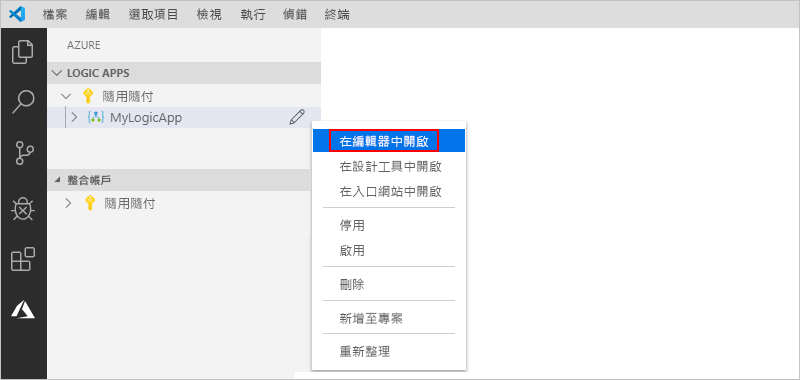

   Visual Studio Code 會在您的本機暫存資料夾中開啟 .logicapp.json 檔案，讓您可以檢視邏輯應用程式的工作流程定義。

   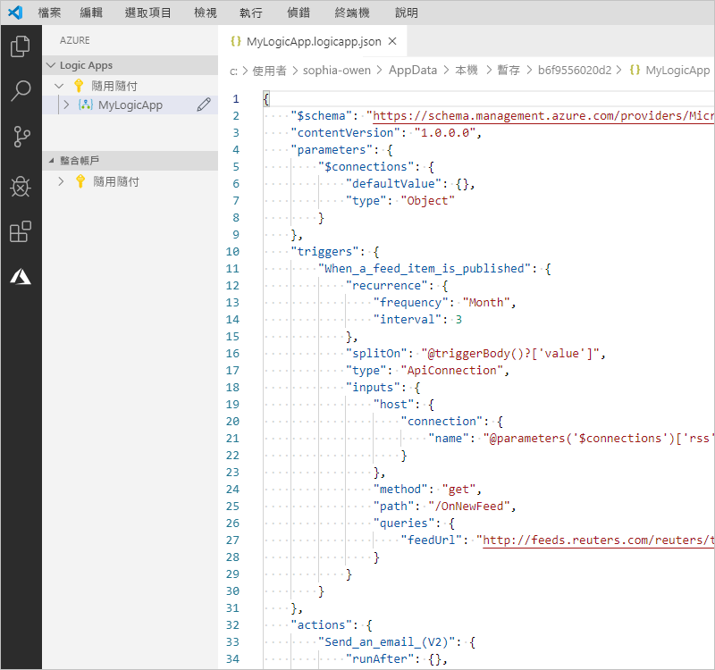

1. 在邏輯應用程式的工作流程定義中進行變更。

1. 完成後，儲存變更。 ([檔案] 功能表 > [儲存]，或按 Ctrl+S)

1. 當系統提示您上傳變更並*覆寫* Azure 入口網站中現有的邏輯應用程式時，請選取 [上傳]  。

   此步驟會將您的更新發佈至 [Azure 入口網站](https://portal.azure.com)中的邏輯應用程式。

   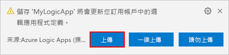

## <a name="view-or-promote-other-versions"></a>檢視或升階其他版本

在 Visual Studio Code 中，您可以開啟並檢閱邏輯應用程式的較舊版本。 您也可以將舊版升階為目前的版本。

> [!IMPORTANT] 
> 在生產環境中變更正在執行的邏輯應用程式之前，請先[停用邏輯應用程式](#disable-enable-logic-app)，以降低中斷該邏輯應用程式的風險，並盡可能避免運作中斷。

1. 在 Azure 視窗中的 [Logic Apps]  底下，展開您的 Azure 訂用帳戶，以便檢視該訂用帳戶中的所有邏輯應用程式。

1. 在您的訂用帳戶底下展開邏輯應用程式，然後展開 [版本]  。

   [版本]  清單會顯示您較早版本的邏輯應用程式 (如果有的話)。

   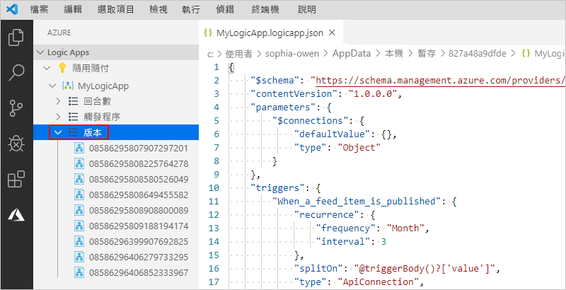

1. 若要檢視較早的版本，請選取下列其中一個步驟：

   * 若要檢視 JSON 定義，請在 [版本]  底下選取該定義的版本號碼。 或者，開啟該版本的捷徑功能表，然後選取 [在編輯器中開啟]  。

     新檔案會在您的本機電腦上開啟，並顯示該版本的 JSON 定義。

   * 若要在唯讀設計工具中檢視版本，請開啟該版本的捷徑功能表，然後選取 [在設計工具中開啟]  。

1. 若要將較早的版本升階為目前的版本，請執行下列步驟：

   1. 在 [版本]  底下開啟較早版本的捷徑功能表，然後選取 [升階]  。

      

   1. 若要在 Visual Studio Code 提示您進行確認後繼續操作，請選取 [是]  。

      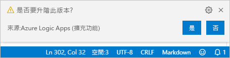

      Visual Studio Code 將選取的版本升階為目前的版本，並將新的號碼指派給升階後的版本。 先前的目前版本此時會出現在升階後的版本底下。

## <a name="next-steps"></a>後續步驟

> [!div class="nextstepaction"]
> [使用 Visual Studio 建立邏輯應用程式](../logic-apps/quickstart-create-logic-apps-with-visual-studio.md)