# 快速入門：使用 Azure Logic Apps 建立和自動執行工作、程序和工作流程 - Visual Studio

使用 [Azure Logic Apps](../logic-apps/logic-apps-overview.md) 和 Visual Studio，您可以建立可自動執行工作和程序的工作流程，以便整合各企業和組織的應用程式、資料、系統和服務。 本快速入門示範如何藉由以下方式設計及建立這些工作流程：在 Visual Studio 中建立邏輯應用程式，並將這些應用程式部署至雲端中的 <a href="https://docs.microsoft.com/azure/guides/developer/azure-developer-guide" target="_blank">Azure</a>。 雖然您可以在 <a href="https://portal.azure.com" target="_blank">Azure 入口網站</a>中執行這些工作，但 Visual Studio 可讓您將邏輯應用程式新增至原始檔控制、發佈不同的版本，並針對不同的部署環境建立 Azure Resource Manager 範本。 

如果您還不熟悉 Azure Logic Apps 而只想要基本概念，請改為嘗試[在 Azure 入口網站中建立邏輯應用程式的快速入門](../logic-apps/quickstart-create-first-logic-app-workflow.md)。 在 Azure 入口網站與 Visual Studio 中，邏輯應用程式設計工具的運作方式類似。 

在此，您會建立與 Azure 入口網站快速入門中相同的邏輯應用程式，但與 Visual Studio 不同。 此邏輯應用程式會監視網站的 RSS 摘要，並針對網站上張貼的每個新項目傳送電子郵件。 完成時，您的邏輯應用程式大致如下列高階工作流程所示︰

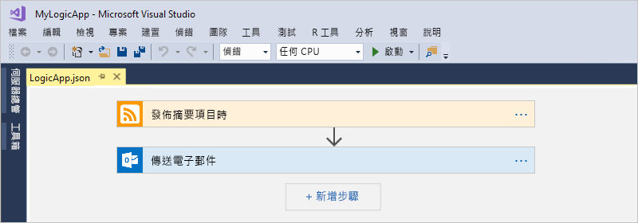

開始之前，請確定您具有下列項目：

* 如果您沒有 Azure 訂用帳戶，請先<a href="https://azure.microsoft.com/free/" target="_blank">註冊一個免費的 Azure 帳戶</a>。

* 如果您還沒有以下這些工具，請加以下載並安裝： 

  * <a href="https://www.visualstudio.com/downloads" target="_blank">Visual Studio 2017 或 Visual Studio 2015 - Community 版本或更高版本</a>。 
  本快速入門使用免費的 Visual Studio Community 2017。

  * <a href="https://azure.microsoft.com/downloads/" target="_blank">Microsoft Azure SDK for .NET (2.9.1 或更新版本)</a> 和 <a href="https://github.com/Azure/azure-powershell#installation" target="_blank">Azure PowerShell</a>。 
  深入了解 <a href="https://docs.microsoft.com/dotnet/azure/dotnet-tools?view=azure-dotnet">Azure SDK for .NET</a>。

  * <a href="https://marketplace.visualstudio.com/items?itemName=VinaySinghMSFT.AzureLogicAppsToolsforVisualStudio-18551" target="_blank">Azure Logic Apps Tools for Visual Studio 2017</a> 或 <a href="https://marketplace.visualstudio.com/items?itemName=VinaySinghMSFT.AzureLogicAppsToolsforVisualStudio" target="_blank">Visual Studio 2015 版本</a>
  
    您可以直接從 Visual Studio Marketplace 下載並安裝 Azure Logic Apps Tools，或了解<a href="https://docs.microsoft.com/visualstudio/ide/finding-and-using-visual-studio-extensions" target="_blank">如何從 Visual Studio 內部安裝此擴充功能</a>。 
    請務必在完成安裝之後重新啟動 Visual Studio。

* Logic Apps 支援的電子郵件帳戶 (例如 Office 365 Outlook、Outlook.com 或 Gmail)。 對於其他提供者，請<a href="https://docs.microsoft.com/connectors/" target="_blank">檢閱這裡的連接器清單</a>。 此邏輯應用程式會使用 Office 365 Outlook。 如果您使用不同的提供者，則整體步驟相同，但您的 UI 可能稍有不同。

* 使用內嵌的邏輯應用程式設計工具時能夠存取 Web

  設計工具需要網際網路連線才能在 Azure 中建立資源，以及從邏輯應用程式中的連接器讀取屬性和資料。 
  例如，如果您使用 Dynamics CRM Online 連接器，則設計工具會檢查您的 CRM 執行個體，以取得可用的預設和自訂屬性。

## 建立 Azure 資源群組專案

若要開始進行，請建立 [Azure 資源群組專案](../azure-resource-manager/vs-azure-tools-resource-groups-deployment-projects-create-deploy.md)。 深入了解 [Azure 資源群組和資源](../azure-resource-manager/resource-group-overview.md)。

1. 啟動 Visual Studio 並以您的 Azure 帳戶登入。

2. 在 [檔案] 功能表上，選取 [新增] > [專案]。 (鍵盤：Ctrl+Shift+N)

   ![在 [檔案] 功能表上，選取 [新增] > [專案]](./media/quickstart-create-logic-apps-with-visual-studio/create-new-visual-studio-project.png)

3. 在 [已安裝] 之下，選取 **Visual C#** 或 **Visual Basic**。 選取 [雲端] > [Azure 資源群組]。 替您的專案命名，例如：

   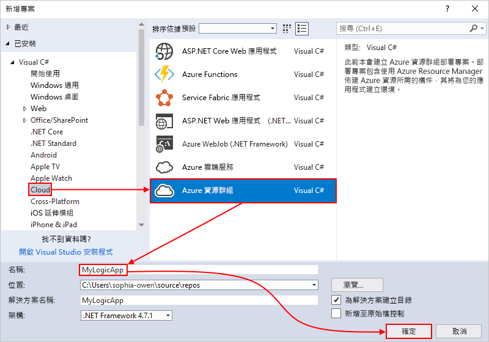

4. 選取 [邏輯應用程式] 範本。 

   ![選取 [邏輯應用程式] 範本](./media/quickstart-create-logic-apps-with-visual-studio/select-logic-app-template.png)

   在 Visual Studio 建立您的專案之後，[方案總管] 隨即開啟並顯示您的方案。 

   ![[方案總管] 會顯示新的邏輯應用程式方案和部署檔案](./media/quickstart-create-logic-apps-with-visual-studio/logic-app-solution-created.png)

   您在方案中，**LogicApp.json** 檔案不只會儲存邏輯應用程式的定義，同時也是您可以設定以供部署的 Azure Resource Manager 範本。

## 建立空白邏輯應用程式

建立 Azure 資源群組專案之後，從 [空白邏輯應用程式] 範本開始建立並建置邏輯應用程式。

1. 在 [方案總管] 中，開啟 LogicApp.json 檔案的捷徑功能表。 選取 [以邏輯應用程式設計工具開啟]。 (鍵盤：Ctrl+L)

   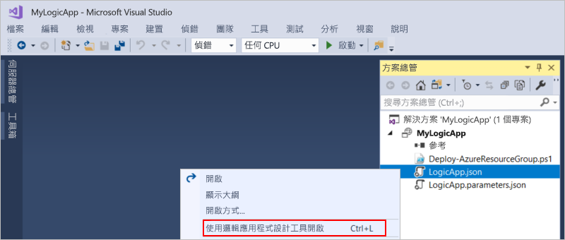

2. 針對 [訂用帳戶]，選取您要使用的 Azure 訂用帳戶。 針對 [資源群組]，選取 [建立新的...] 以建立新的 Azure 資源群組。 

   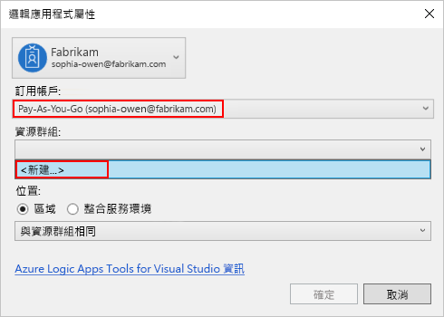

   Visual Studio 需要您的 Azure 訂用帳戶和一個資源群組，以便建立及部署與您的邏輯應用程式相關聯的資源和連線。 

   | 設定 | 範例值 | 說明 | 
   | ------- | ------------- | ----------- | 
   | 使用者設定檔清單 | Contoso   jamalhartnett@contoso.com | 根據預設，用來登入的帳戶 | 
   | **訂用帳戶** | Pay-As-You-Go   (jamalhartnett@contoso.com) | Azure 訂用帳戶的名稱和相關聯的帳戶 |
   | **資源群組** | MyLogicApp-RG   (美國西部) | Azure 資源群組和位置，以供儲存及部署邏輯應用程式的資源 | 
   | **位置** | MyLogicApp-RG2   (美國西部) | 如果您不想要使用資源群組位置，則為不同的位置 |
   ||||

3. Logic Apps 設計工具會開啟並顯示含有簡介影片和常用觸發程序的頁面。 將影片與觸發程序捲動過去。 在 [範本] 底下，選取 [空白邏輯應用程式]。

   ![選取 [空白邏輯應用程式]](./media/quickstart-create-logic-apps-with-visual-studio/choose-blank-logic-app-template.png)

## 建置邏輯應用程式工作流程

接下來，新增可在新的 RSS 摘要項目出現時引發的[觸發程序](../logic-apps/logic-apps-overview.md#logic-app-concepts)。 每個邏輯應用程式都必須使用觸發程序啟動，而該觸發程序會在符合特定條件時引發。 每次引發觸發程序時，Logic Apps 引擎會建立邏輯應用程式執行個體，以執行您的工作流程。

1. 在邏輯應用程式設計工具的搜尋方塊中輸入 "rss"。 選取此觸發程序︰**摘要項目發佈時**

   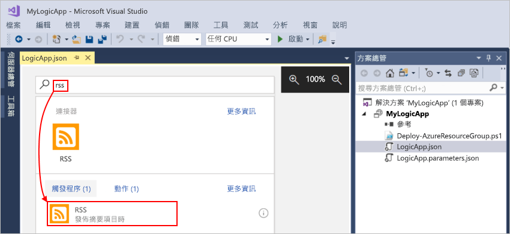

   觸發程序現在會出現在設計工具中：

   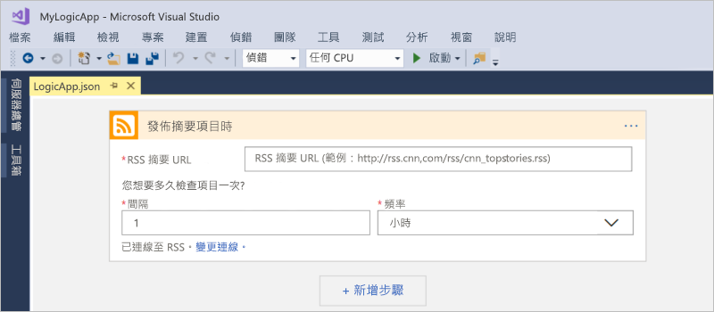

2. 若要完成邏輯應用程式的建置，請遵循 [Azure 入口網站快速入門](../logic-apps/quickstart-create-first-logic-app-workflow.md#add-rss-trigger)中的工作流程步驟，然後回到本文。

   當您完成時，邏輯應用程式如此範例所示︰ 

   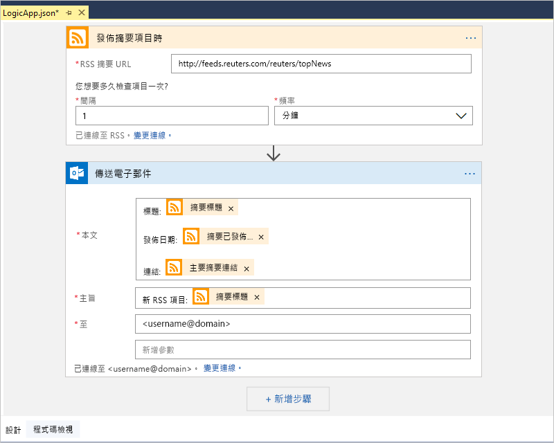

3. 若要儲存邏輯應用程式，請儲存您的 Visual Studio 方案。 (鍵盤：Ctrl + S)

現在，將您的應用程式部署到 Azure，您才能測試邏輯應用程式。

## 將邏輯應用程式部署至 Azure

只需幾個步驟，將應用程式從 Visual Studio 部署至 Azure，您才能執行邏輯應用程式。

1. 在 [方案總管] 中，於您的專案捷徑功能表上，選取 [部署] > [新增]。 如果出現提示，登入您的 Azure 帳戶。

   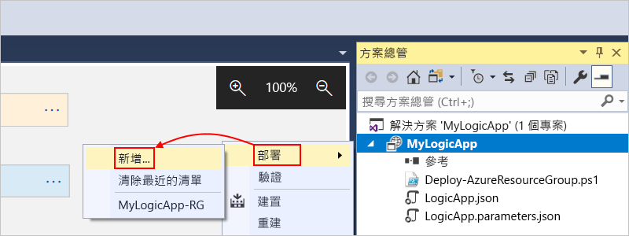

2. 針對此部署，保留 Azure 訂用帳戶、源群組和其他預設設定。 準備就緒時，請選擇 [部署]。 

   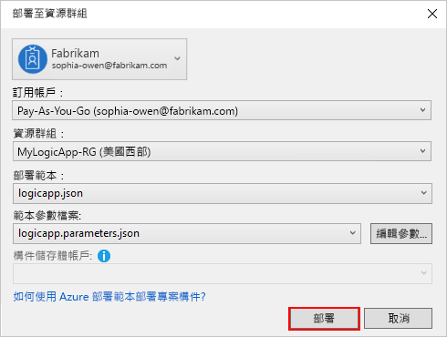

3. 如果 [編輯參數] 方塊出現，請提供邏輯應用程式在部署時所要使用的資源名稱，然後儲存您的設定，例如：

   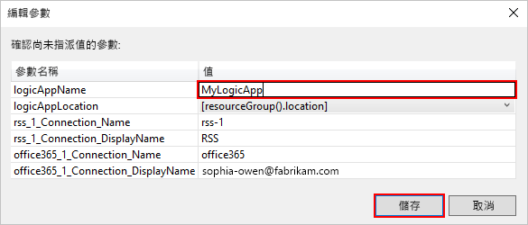

   開始部署時，您應用程式的部署狀態會顯示在 Visual Studio 的 [輸出] 視窗中。 
   如果狀態並未出現，請開啟 [顯示輸出來源] 清單，然後選取您的 Azure 資源群組。

   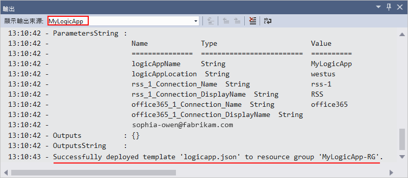

   部署完成之後，應用程式邏輯會存留在 Azure 入口網站中，並根據您指定的排程 (每分鐘) 檢查 RSS 摘要。 
   如果 RSS 摘要有新的項目，邏輯應用程式會針對每個新的項目傳送電子郵件。 
   否則，邏輯應用程式會等到下一個間隔，再檢查一次。 

   例如，以下是此邏輯應用程式傳送的範例電子郵件。 
   如果您沒有得到任何電子郵件，請檢查垃圾郵件資料夾。 

   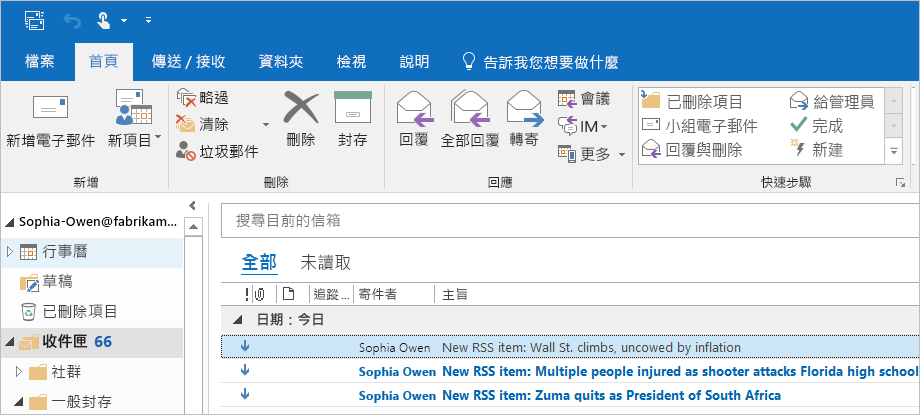

   技術上，當觸發程序檢查 RSS 摘要並尋找新項目時，觸發程序會引發，而 Logic Apps 引擎會建立邏輯應用程式工作流程的執行個體，以在工作流程中執行動作。
   如果觸發程序找不到新項目，觸發程序並不會引發，而且會「略過」具現化工作流程。

恭喜，您現在已透過 Visual Studio 成功建置和部署您的邏輯應用程式！ 若要管理應用程式邏輯並檢閱其執行歷程記錄，請參閱[使用 Visual Studio 管理邏輯應用程式](../logic-apps/manage-logic-apps-with-visual-studio.md)。

## 清除資源

如果不再需要，請刪除包含邏輯應用程式的資源群組和相關資源。

1. 以用來建立應用程式邏輯的相同帳戶登入 <a href="https://portal.azure.com" target="_blank">Azure 入口網站</a>。 

2. 在 Azure 主功能表上，選取 [資源群組]。
選取您邏輯應用程式的資源群組，然後選取 [概觀]。

3. 在 [概觀] 頁面上，選擇 [刪除資源群組]。 輸入資源群組名稱作為確認，然後選擇 [刪除]。

   ![[資源群組] > [概觀] > [刪除資源群組]](./media/quickstart-create-logic-apps-with-visual-studio/delete-resource-group.png)

4. 刪除本機電腦中的 Visual Studio 解決方案。

## 取得支援

* 如有問題，請瀏覽 <a href="https://social.msdn.microsoft.com/Forums/en-US/home?forum=azurelogicapps" target="_blank">Azure Logic Apps 論壇</a>。
* 若要提交或票選功能構想，請造訪 <a href="http://aka.ms/logicapps-wish" target="_blank">Logic Apps 使用者意見反應網站</a>。

## 後續步驟

本文中，您已使用 Visual Studio 建置、部署及執行邏輯應用程式。 若要深入了解如何使用 Visual Studio 來管理及執行邏輯應用程式的進階部署，請參閱下列文章：

> [!div class="nextstepaction"]
> * [使用 Visual Studio 管理邏輯應用程式](../logic-apps/manage-logic-apps-with-visual-studio.md)
> * [透過 Visual Studio 建立邏輯應用程式的部署範本](../logic-apps/logic-apps-create-deploy-template.md)
