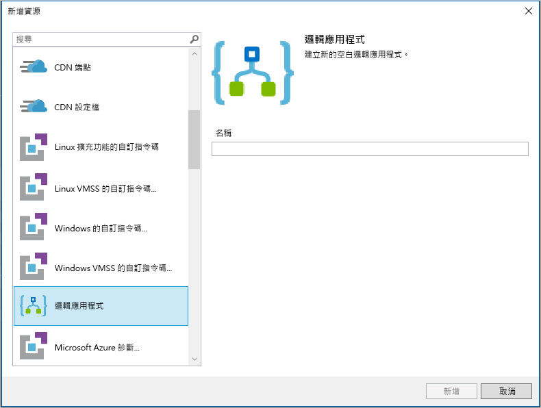

# 快速入門：使用 Azure Logic Apps 建立自動化工作、程序和工作流程 - Visual Studio

使用 [Azure Logic Apps](../logic-apps/logic-apps-overview.md) 和 Visual Studio，您可以建立可自動執行工作和程序的工作流程，以便整合各企業和組織的應用程式、資料、系統和服務。 本快速入門示範如何藉由以下方式設計及建立這些工作流程：在 Visual Studio 中建立邏輯應用程式，並將這些應用程式部署至 Azure。 雖然您可以在 Azure 入口網站中執行這些工作，但 Visual Studio 可讓您將邏輯應用程式新增至原始檔控制、發佈不同的版本，並針對不同的部署環境建立 Azure Resource Manager 範本。

如果您還不熟悉 Azure Logic Apps 而只想要基本概念，請嘗試[在 Azure 入口網站中建立邏輯應用程式的快速入門](../logic-apps/quickstart-create-first-logic-app-workflow.md)。 在 Azure 入口網站與 Visual Studio 中，邏輯應用程式設計工具的運作方式類似。

在本快速入門中，您會使用 Visual Studio 建立與 Azure 入口網站快速入門中相同的邏輯應用程式。 此邏輯應用程式會監視網站的 RSS 摘要，並針對該摘要中的每個新項目傳送電子郵件。 您已完成的邏輯應用程式看起來像以下高階工作流程：

## 必要條件

* Azure 訂用帳戶。 如果您沒有 Azure 訂用帳戶，請先[註冊免費的 Azure 帳戶](https://azure.microsoft.com/free/)。

* 如果您還沒有以下這些工具，請加以下載並安裝：

  * [Visual Studio 2019、2017 或 2015 - Community 版本或更高版本](https://aka.ms/download-visual-studio)。 
  本快速入門使用 Visual Studio Community 2017。

    > [!IMPORTANT]
    > 當您安裝 Visual Studio 2019 或 2017 時，請務必選取 **Azure 開發**工作負載。

  * [Microsoft Azure SDK for .NET (2.9.1 或更新版本)](https://azure.microsoft.com/downloads/)。 
  深入了解 [Azure SDK for .NET](https://docs.microsoft.com/dotnet/azure/dotnet-tools?view=azure-dotnet)。

  * [Azure PowerShell](https://github.com/Azure/azure-powershell#installation)

  * 您想要的 Azure Logic Apps Tools for Visual Studio 版本：

    * [Visual Studio 2019](https://aka.ms/download-azure-logic-apps-tools-visual-studio-2019)

    * [Visual Studio 2017](https://aka.ms/download-azure-logic-apps-tools-visual-studio-2017)

    * [Visual Studio 2015](https://aka.ms/download-azure-logic-apps-tools-visual-studio-2015)
  
    您可以直接從 Visual Studio Marketplace 下載並安裝 Azure Logic Apps Tools，或了解[如何從 Visual Studio 內部安裝此擴充功能](https://docs.microsoft.com/visualstudio/ide/finding-and-using-visual-studio-extensions)。 
    請務必在完成安裝之後重新啟動 Visual Studio。

* 使用內嵌的邏輯應用程式設計工具時能夠存取 Web

  設計工具需要網際網路連線才能在 Azure 中建立資源，以及從邏輯應用程式中的連接器讀取屬性和資料。 
  例如，針對 Dynamics CRM Online 連線，設計工具會檢查 CRM 執行個體的預設和自訂屬性。

* Logic Apps 支援的電子郵件帳戶 (例如 Office 365 Outlook、Outlook.com 或 Gmail)。 對於其他提供者，請[檢閱這裡的連接器清單](https://docs.microsoft.com/connectors/)。 此範例使用 Office 365 Outlook。 如果您使用不同的提供者，則整體步驟相同，但您的 UI 可能稍有不同。

## 建立 Azure 資源群組專案

若要開始進行，請建立 [Azure 資源群組專案](../azure-resource-manager/vs-azure-tools-resource-groups-deployment-projects-create-deploy.md)。 深入了解 [Azure 資源群組和資源](../azure-resource-manager/resource-group-overview.md)。

1. 啟動 Visual Studio。 使用您的 Azure 帳戶進行登入。

1. 在 [檔案]  功能表上，選取 [新增]   > [專案]  。 (鍵盤：Ctrl+Shift+N)

   ![在 [檔案] 功能表上，選取 [新增] > [專案]](./media/quickstart-create-logic-apps-with-visual-studio/create-new-visual-studio-project.png)

1. 在 [已安裝]  之下，選取 **Visual C#** 或 **Visual Basic**。 選取 [雲端]   > [Azure 資源群組]  。 替您的專案命名，例如：

   

   > [!NOTE]
   > 如果 [雲端]  或 [Azure 資源群組]  未出現，請確定您安裝 Azure SDK for Visual Studio。

   如果您使用 Visual Studio 2019，請遵循下列步驟：

   1. 在 [建立新專案]  方塊中，選取適用於 Visual C# 或 Visual Basic 的 [Azure 資源群組]  專案。 選擇 [下一步]  。

   1. 提供您想要使用的 Azure 資源群組名稱和其他專案資訊。 選擇 [建立]  。

1. 從範本清單中選取 [邏輯應用程式]  範本。 選擇 [確定]  。

   ![選取 [邏輯應用程式] 範本](./media/quickstart-create-logic-apps-with-visual-studio/select-logic-app-template.png)

   在 Visual Studio 建立您的專案之後，[方案總管] 隨即開啟並顯示您的方案。 
   在您的解決方案中，**LogicApp.json** 檔案不只會儲存邏輯應用程式定義，同時也是您可以用於部署的 Azure Resource Manager 範本。

   ![[方案總管] 會顯示新的邏輯應用程式方案和部署檔案](./media/quickstart-create-logic-apps-with-visual-studio/logic-app-solution-created.png)

## 建立空白邏輯應用程式

當您有 Azure 資源群組專案時，請使用 [空白邏輯應用程式]  範本建立您的邏輯應用程式。

1. 在 [方案總管] 中，開啟 **LogicApp.json** 檔案的捷徑功能表。 選取 [以邏輯應用程式設計工具開啟]  。 (鍵盤：Ctrl+L)

   

   > [!TIP]
   > 如果您在 Visual Studio 2019 中沒有此命令，請檢查您是否有最新的 Visual Studio 更新。

   Visual Studio 會提示您輸入您的 Azure 訂用帳戶和一個 Azure 資源群組，以便為您的邏輯應用程式和連線建立及部署資源。

1. 針對 [訂用帳戶]  ，選取您的 Azure 訂用帳戶。 針對 [資源群組]  ，選取 [新建]  以建立新的 Azure 資源群組。

   

   | 設定 | 範例值 | 說明 |
   | ------- | ------------- | ----------- |
   | 使用者設定檔清單 | Contoso   jamalhartnett@contoso.com | 根據預設，用來登入的帳戶 |
   | **訂用帳戶** | Pay-As-You-Go   (jamalhartnett@contoso.com) | Azure 訂用帳戶的名稱和相關聯的帳戶 |
   | **資源群組** | MyLogicApp-RG   (美國西部) | Azure 資源群組和位置，以供儲存及部署邏輯應用程式的資源 |
   | **位置** | MyLogicApp-RG2   (美國西部) | 如果您不想要使用資源群組位置，則為不同的位置 |
   ||||

1. Logic Apps 設計工具會開啟一個頁面，其中顯示簡介影片和常用的觸發程序。 向下捲動過影片和觸發程序直至 [範本]  ，然後選取 [空白邏輯應用程式]  。

   ![選取 [空白邏輯應用程式]](./media/quickstart-create-logic-apps-with-visual-studio/choose-blank-logic-app-template.png)

## 建置邏輯應用程式工作流程

接下來，新增可在新摘要項目出現時引發的 RSS [觸發程序](../logic-apps/logic-apps-overview.md#logic-app-concepts)。 每個邏輯應用程式都會以觸發程序啟動，而該觸發程序會在符合特定條件時引發。 每次引發觸發程序時，Logic Apps 引擎會建立邏輯應用程式執行個體，以執行您的工作流程。

1. 在邏輯應用程式設計工具中的搜尋方塊底下，選擇 [全部]  。
在搜尋方塊中，輸入 "rss"。 從觸發程序清單中，選取此觸發程序：**摘要項目發佈時 - RSS**

   

1. 在設計工具中出現觸發程序後，請遵循 [Azure 入口網站快速入門](../logic-apps/quickstart-create-first-logic-app-workflow.md#add-rss-trigger)中的工作流程步驟，完成邏輯應用程式的建置，然後回到本文。 當您完成時，邏輯應用程式如此範例所示︰

   

1. 儲存您的 Visual Studio 解決方案。 (鍵盤：Ctrl + S)

## 將邏輯應用程式部署至 Azure

先從 Visual Studio 將邏輯應用程式部署至 Azure，您才能執行和測試該應用程式。

1. 在 [方案總管] 中，於您的專案捷徑功能表上，選取 [部署]   > [新增]  。 如果出現提示，登入您的 Azure 帳戶。

   

1. 針對此部署，保留預設 Azure 訂用帳戶、源群組和其他設定。 選擇 [部署]  。

   

1. 如果 [編輯參數]  方塊出現，請提供邏輯應用程式的資源名稱。 儲存您的設定。

   

   開始部署時，您應用程式的部署狀態會顯示在 Visual Studio 的 [輸出]  視窗中。 如果狀態並未出現，請開啟 [顯示輸出來源]  清單，然後選取您的 Azure 資源群組。

   

   如果您選取的連接器需要您輸入資料，則 PowerShell 視窗會在背景中開啟，並提示您提供任何必要的密碼或祕密金鑰。 當您輸入這些資訊之後，部署將會繼續。

   

   部署完成之後，邏輯應用程式會存留在 Azure 入口網站中，並依照您指定的排程 (每分鐘) 執行。 如果觸發程序發現新的摘要項目，觸發程序就會引發並建立工作流程執行個體，以執行邏輯應用程式的動作。 邏輯應用程式會針對每個新項目傳送電子郵件。 否則，如果觸發程序找不到新項目，觸發程序並不會引發，而且會「略過」具現化工作流程。 邏輯應用程式會等到下一個間隔，再進行檢查。

   以下是此邏輯應用程式傳送的範例電子郵件。 
   如果您沒有得到任何電子郵件，請檢查垃圾郵件資料夾。

   

恭喜，您已透過 Visual Studio 成功建置和部署您的邏輯應用程式。 若要管理應用程式邏輯並檢閱其執行歷程記錄，請參閱[使用 Visual Studio 管理邏輯應用程式](../logic-apps/manage-logic-apps-with-visual-studio.md)。

## 新增邏輯應用程式

如果您有現有的 Azure 資源群組專案，您可以使用 [JSON 大綱] 視窗將全新的邏輯應用程式新增至該專案。

1. 在方案總管中開啟 `<logic-app-name>.json` 檔案。

1. 從 [檢視]  功能表中，選取 [其他視窗]   > [JSON 大綱]  。

1. 若要將資源新增至範本檔案，請選擇 [JSON 大綱] 視窗頂端的 [新增資源]  。 或在 [JSON 大綱] 視窗中，以滑鼠右鍵按一下 [資源]  ，然後選取 [新增資源]  。

   ![[JSON 大綱] 視窗](./media/quickstart-create-logic-apps-with-visual-studio/jsonoutline.png)

1. 在 [新增資源]  對話方塊中，尋找並選取 [邏輯應用程式]  。 為您的邏輯應用程式命名，然後選擇 [新增]  。

   

## 清除資源

如果處理好邏輯應用程式，請刪除包含邏輯應用程式和相關資源的資源群組。

1. 以用來建立應用程式邏輯的相同帳戶登入 [Azure 入口網站](https://portal.azure.com)。

1. 在 Azure 主功能表上，選取 [資源群組]  。
選取邏輯應用程式的資源群組，然後選取 [概觀]  。

1. 在 [概觀]  頁面上，選擇 [刪除資源群組]  。 輸入資源群組名稱作為確認，然後選擇 [刪除]  。

   ![[資源群組] > [概觀] > [刪除資源群組]](./media/quickstart-create-logic-apps-with-visual-studio/delete-resource-group.png)

1. 刪除本機電腦中的 Visual Studio 解決方案。

## 後續步驟

本文中，您已使用 Visual Studio 建置、部署及執行邏輯應用程式。 若要了解如何使用 Visual Studio 來管理及執行邏輯應用程式的進階部署，請參閱下列文章：

> [!div class="nextstepaction"]
> * [使用 Visual Studio 管理邏輯應用程式](../logic-apps/manage-logic-apps-with-visual-studio.md)