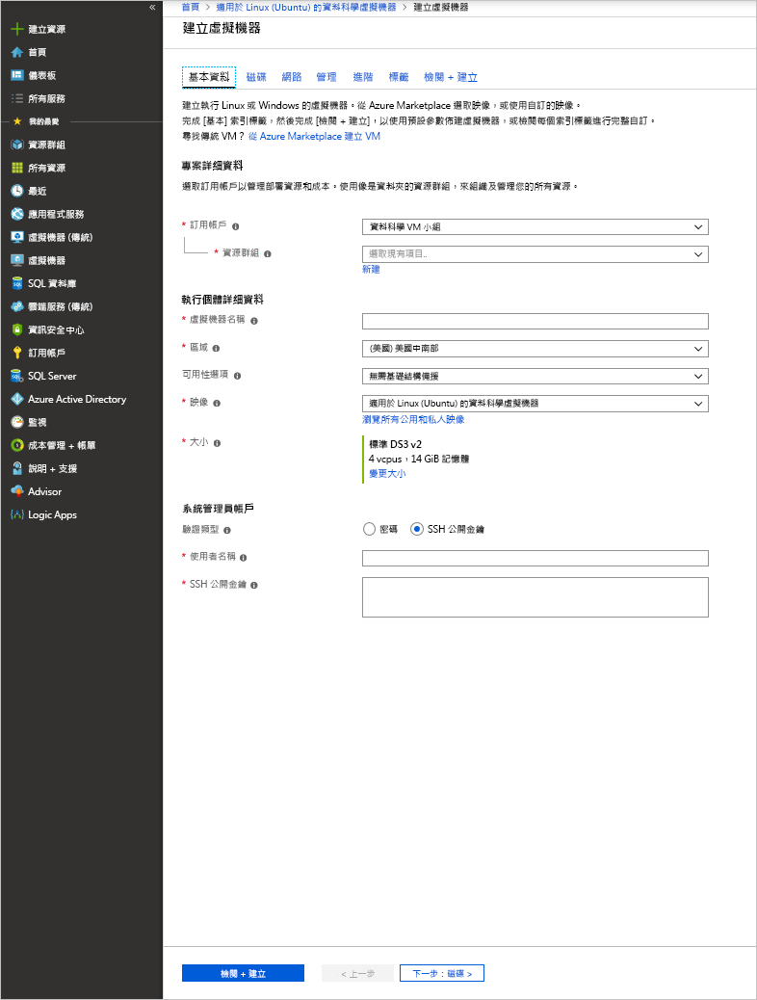

# <a name="provision-the-data-science-virtual-machine-for-linux-ubuntu"></a>佈建適用於 Linux (Ubuntu) 的資料科學虛擬機器

適用於 Linux 的資料科學虛擬機器 (DSVM) 是以 Ubuntu 為基礎的虛擬機器映像，可協助您在 Azure 上輕鬆展開機器學習，包括深度學習。 深入學習工具包含：

* [Caffe](https://caffe.berkeleyvision.org/):一種深度學習架構，講求速度、表現度及模組化。
* [Caffe2](https://github.com/caffe2/caffe2):Caffe 的跨平台版本。
* [Microsoft Cognitive Toolkit](https://github.com/Microsoft/CNTK)：來自 Microsoft Research 的深度學習軟體工具組。
* [H2O](https://www.h2o.ai/)：開放原始碼巨量資料平台和圖形化使用者介面。
* [Keras](https://keras.io/)：以 Python 撰寫、適用於 TensorFlow、Microsoft Cognitive Toolkit 及 Theano 的高階神經網路 API。
* [MXNet](https://mxnet.io/)：彈性、有效率的深度學習程式庫，包含許多語言繫結。
* [NVIDIA DIGITS](https://developer.nvidia.com/digits)：一種圖形化系統，可簡化常見的深度學習工作。
* [PyTorch](https://pytorch.org/)：一種高階 Python 程式庫，可支援動態網路。
* [TensorFlow](https://www.tensorflow.org/)：Google 提供的機器智慧開放原始碼程式庫。
* [Theano](http://deeplearning.net/software/theano/)：一種 Python 程式庫，可定義、最佳化和有效地評估涉及多維陣列的數學運算式。
* [Torch](http://torch.ch/)：廣泛支援機器學習演算法的科學運算架構。
* CUDA、cuDNN 和 NVIDIA 驅動程式。
* 許多範例 Jupyter Notebook。

所有程式庫均為 GPU 版本，但它們也可在 CPU 上執行。

適用於 Linux 的資料科學虛擬機器也包含資料科學和開發活動常用的工具，包括︰

* 使用 Microsoft R Open 的 Microsoft Machine Learning Server。
* Anaconda Python 散發套件 (2.7 版和 3.5 版)，包含常用的資料分析程式庫。
* JuliaPro - 精選散發套件，使用常用科學和資料分析程式庫的 Julia 語言。
* 獨立 Spark 執行個體和單一節點 Hadoop (HDFS、Yarn)。
* JupyterHub，此為多使用者的 Jupyter Notebook 伺服器，支援 R、Python、PySpark 和 Julia 核心。
* Azure 儲存體總管。
* 用來管理 Azure 資源的 Azure CLI。
* 機器學習工具：
  * [Vowpal Wabbit](https://github.com/JohnLangford/vowpal_wabbit)：一個快速的機器學習系統，支援像是線上、雜湊，allreduce、簡化、learning2search、主動和互動式學習等技術。
  * [XGBoost](https://xgboost.readthedocs.org/en/latest/)：此工具可提供快速且正確的推進式決策樹實作。
  * [Rattle](https://togaware.com/rattle/)：一種圖形化工具，可幫助您輕鬆地使用 R 展開資料分析和機器學習。
  * [LightGBM](https://github.com/Microsoft/LightGBM)：一種快速、分散式的高效能梯度提升架構。
* Java、Python、Node.js、Ruby 和 PHP 中的 Azure SDK。
* R 和 Python 語言的程式庫，可用於 Azure Machine Learning 和其他 Azure 服務。
* 開發工具和編輯器 (RStudio、PyCharm、IntelliJ、Emacs、vim)。

執行資料科學涉及反覆進行一連串的工作︰

1. 尋找、載入和前置處理資料
1. 建置和測試模型
1. 部署要在智慧型應用程式中使用的模型

資料科學家使用各種工具來完成這些工作。 尋找適當的軟體版本，然後逐一下載、編譯並安裝，是很耗費時間的工作。

Linux 適用的資料科學虛擬機器可以大幅減輕這樣的負擔。 使用它可以快速啟動分析專案。 它能讓您用各種語言處理工作，包含 R、Python、SQL、Java 與 C++。 VM 中所含的 Azure SDK 可讓您使用適用於 Microsoft 雲端平台之 Linux 上的各種服務，來建置您的應用程式。 此外，您可以存取也已預先安裝好的其他語言，例如 Ruby、Perl、PHP 和 Node.js。

此 DSVM 映像不會產生軟體費用。 您僅需支付 Azure 硬體使用費，這是根據您所佈建的虛擬機器大小來評估。 如需計算費用的詳細資訊，請參閱 [Azure Marketplace 中的 VM 清單頁面](https://azure.microsoft.com/marketplace/partners/microsoft-ads/linux-data-science-vm/)。

## <a name="other-versions-of-the-data-science-virtual-machine"></a>其他版本的資料科學虛擬機器

另提供 [CentOS](linux-dsvm-intro.md) 映像，其中包含許多與 Ubuntu 映像相同的工具。 此外也有 [Windows](provision-vm.md) 映像可供使用。

## <a name="prerequisites"></a>必要條件

您必須先具有 Azure 訂用帳戶，才可以建立 Linux 適用的資料科學虛擬機器。 您可以[取得 Azure 免費試用](https://azure.microsoft.com/free/)。

## <a name="create-your-data-science-virtual-machine-for-linux"></a>建立 Linux 適用的資料科學虛擬機器

建立 Linux 適用的資料科學虛擬機器執行個體的步驟如下：

1. 移至 [Azure 入口網站](https://portal.azure.com/#create/microsoft-dsvm.linux-data-science-vm-ubuntulinuxdsvmubuntu)上的虛擬機器清單。 如果您尚未登入 Azure 帳戶，系統可能會提示您登入。 
1. 選取 [建立]  以顯示精靈。
    
1. 輸入下列資訊以設定精靈的每個步驟：

    1. **基本**：
    
       * 訂用帳戶  ：如果您有多個訂用帳戶，請選取要在其中建立機器及計費的訂用帳戶。 您必須有此訂用帳戶的資源建立權限。
       * **資源群組**：您可以建立新群組或使用現有的群組。
       * **虛擬機器名稱**：輸入您所建立的資料科學伺服器的名稱。
       * **區域**：選取最適合的資料中心。 這通常是擁有您大部分資料的資料中心，或是最接近您的實際位置而可最快速地存取網路的資料中心。
       * **可用性選項**：如果您想要在可用性設定組或區域中使用此 VM，請設定此選項。 否則請保留預設值。
       * **映像**：保留預設值。
       * **大小**：選取符合您的功能需求和成本限制的伺服器類型。 針對 GPU 型 VM 執行個體，選取一部 NC 或 ND 系列的 VM。 
       * **使用者名稱**：輸入系統管理員的使用者名稱。
       * **SSH 公開金鑰**：以單行格式輸入 RSA 公開金鑰。 (您可以使用密碼，而非 SSH 金鑰)。
    
    1. **磁碟**：
    
       * **OS 磁碟類型**：如果您偏好固態硬碟 (SSD)，請選擇 [進階 SSD]  。 否則請選擇 [標準 HDD]  。
    
    1. 針對其餘設定，您可以使用預設值。 若考慮使用非預設值，請將滑鼠停留在資訊連結上方以取得說明。 在完成作業後，選取 [檢閱 + 建立]  。
    
    1. VM 通過驗證後，請確認您輸入的所有資訊都正確無誤。 連結會引導您前往使用規定。 VM 只會對您在 [大小]  輸入中選擇的伺服器大小產生計算資源費用，除此之外不會產生其他費用。 若要開始佈建，請選取 [建立]  。
    
    佈建大約需要 5 分鐘。 狀態會顯示在 Azure 入口網站中。

## <a name="how-to-access-the-data-science-virtual-machine-for-linux"></a>如何存取 Linux 適用的資料科學虛擬機器

您可以使用三種方法來存取 Ubuntu DSVM：

- SSH (如果是終端機工作階段)
- X2Go (如果是圖形化工作階段)
- JupyterHub 和 JupyterLab (如果是 Jupyter 筆記本)

您也可以將資料科學虛擬機器連結至 Azure Notebooks，以在 VM 上執行 Jupyter Notebook，並忽略免費服務層的限制。 如需詳細資訊，請參閱[管理和設定 Azure Notebooks 專案](../../notebooks/configure-manage-azure-notebooks-projects.md#compute-tier)。

### <a name="ssh"></a>SSH

建立 VM 之後，您就可以使用 SSH 登入。 針對文字殼層介面，使用您在步驟 3 的 **基本** 區段中建立的帳戶認證。 您可以在 Windows 上下載 SSH 用戶端工具，例如 [PuTTy](https://www.putty.org)。 如果您偏好圖形化桌面 (X Windows 系統)，可以在 PuTTy 上使用 X11 轉送或安裝 X2Go 用戶端。

> [!NOTE]
> 在測試中，X2Go 用戶端的效能優於 X11 轉寄。 我們建議您使用 X2Go 用戶端作為圖形化桌面介面。

### <a name="x2go"></a>X2Go

Linux VM 已佈建了 X2Go 伺服器，且已可接受用戶端連線。 若要連線到 Linux VM 圖形化桌面，請在用戶端上完成下列程序：

1. 從 [X2Go](https://wiki.x2go.org/doku.php/doc:installation:x2goclient)下載並安裝您用戶端平台適用的 X2Go 用戶端。
1. 執行 X2Go 用戶端，然後選取 [新增工作階段]  。 會開啟具有多個索引標籤的組態視窗。 輸入下列組態參數︰
   * **[工作階段] 索引標籤**：
     * **主機**：輸入 Linux 資料科學虛擬機器的主機名稱或 IP 位址。
     * **登入**：在 Linux VM 上輸入使用者名稱。
     * **SSH 連接埠**：保留預設值 22。
     * **工作階段類型**：將值變更為 **XFCE**。 Linux VM 目前僅支援 XFCE 桌面。
   * **媒體索引標籤**：如果您不需要使用聲音支援和用戶端列印，可關閉這些功能。
   * **共用資料夾**︰如果您想要將來自用戶端機器的目錄掛接在 Linux VM 上，請在此索引標籤上新增要與 VM 共用的用戶端機器目錄。

當您透過 X2Go 用戶端使用 SSH 用戶端或 XFCE 圖形化桌面登入 VM 之後，便可開始使用已安裝並設定於 VM 上的工具。 在 XFCE 上，您可以看到許多工具的應用程式功能表捷徑和桌面圖示。

### <a name="jupyterhub-and-jupyterlab"></a>JupyterHub 和 JupyterLab

Ubuntu DSVM 會執行 [JupyterHub](https://github.com/jupyterhub/jupyterhub)，這是一個多使用者的 Jupyter 伺服器。 若要連線，請在您的筆記型電腦或桌上型電腦上瀏覽至 https:\//your-vm-ip:8000。 請輸入您用來建立 VM 的使用者名稱和密碼，然後登入。 有許多範例筆記本可供您瀏覽和嘗試。

也提供 JupyterLab (新一代的 Jupyter 筆記本) 與 JupyterHub。 若要加以存取，請登入 JupyterHub，然後瀏覽至 URL https:\//your-vm-ip:8000/user/your-username/lab。 您可以在 `/etc/jupyterhub/jupyterhub_config.py` 中加入下面這一行，將 JupyterLab 設定為預設的 Notebook 伺服器：

```python
c.Spawner.default_url = '/lab'
```

## <a name="tools-installed-on-the-data-science-virtual-machine-for-linux"></a>適用於 Linux 的資料科學虛擬機器上所安裝的工具

### <a name="deep-learning-libraries"></a>深度學習程式庫

#### <a name="cntk"></a>CNTK

Microsoft Cognitive Toolkit 是開放原始碼的深度學習工具組。 Python 繫結位於根環境和 py35 Conda 環境中。 它也包含已在路徑中的命令列工具 (CNTK)。

您可以在 JupyterHub 中找到範例 Python 筆記本。 若要於命令列執行基本範例，請在殼層中執行下列命令：

```bash
cd /home/[USERNAME]/notebooks/CNTK/HelloWorld-LogisticRegression
cntk configFile=lr_bs.cntk makeMode=false command=Train
```

如需詳細資訊，請參閱 [GitHub](https://github.com/Microsoft/CNTK) 上的 CNTK 章節以及 [CNTK Wiki](https://github.com/Microsoft/CNTK/wiki)。

#### <a name="caffe"></a>Caffe

Caffe 是 Berkeley Vision and Learning Center 中的一種深入學習架構。 它位於 /opt/caffe 中。 您可以在 /opt/caffe/examples 中找到範例。

#### <a name="caffe2"></a>Caffe2

Caffe2 是來自 Facebook (以 Caffe 為基礎而建置) 的深入學習架構。 它位於 Conda 根環境的 Python 2.7 中。 若要啟動它，請從殼層執行下列命令：

```bash
source /anaconda/bin/activate root
```

您可以在 JupyterHub 找到一些範例筆記本。

#### <a name="h2o"></a>H2O

H2O 是快速、記憶體內的分散式機器學習和預測性分析平台。 Python 封裝同時安裝於根環境和 py35 Anaconda 環境中。 同時也會安裝 R 封裝。 

若要從命令列開啟 H2O，請執行 `java -jar /dsvm/tools/h2o/current/h2o.jar`。 您可以設定多種不同的[命令列選項](http://docs.h2o.ai/h2o/latest-stable/h2o-docs/starting-h2o.html#from-the-command-line)。 您可以先瀏覽至 http://localhost:54321 以存取 Flow Web UI。 您也可以在 JupyterHub 找到範例筆記本。

#### <a name="keras"></a>Keras

Keras 是 Python 中的高階神經網路 API。 它可以在 TensorFlow、Microsoft Cognitive Toolkit 或 Theano 之上執行。 它位於根環境和 py35 Python 環境中。

#### <a name="mxnet"></a>MXNet

MXNet 是兼具效率和彈性的深入學習架構。 它在 DSVM 中包含了 R 和 Python 繫結。 範例筆記本內含在 JupyterHub 中，而範例程式碼則位於 /dsvm/samples/mxnet。

#### <a name="nvidia-digits"></a>NVIDIA DIGITS

NVIDIA 深度學習 GPU 訓練系統 (名為 DIGITS) 是一個可簡化常見深度學習工作的系統。 這些工作包括管理資料、設計和訓練 GPU 系統上的神經網路，以及使用進階視覺效果即時監視效能。

DIGITS 以服務的形式提供 (名為 *digits*)。 啟動此服務並瀏覽至 http://localhost:5000 以開始使用。

DIGITS 也會安裝為 Conda 根環境中的 Python 模組。

#### <a name="tensorflow"></a>TensorFlow

TensorFlow 是 Google 的深入學習程式庫。 它是使用資料流程圖進行數值計算的開放原始碼軟體程式庫。 TensorFlow 位於 py35 Python 環境中，一些範例筆記本則內含在 JupyterHub 中。

#### <a name="theano"></a>Theano

Theano 是能進行高效數值計算的 Python 程式庫。 它位於根環境和 py35 Python 環境中。 

#### <a name="torch"></a>Torch

Torch 是廣泛支援機器學習演算法的科學運算架構。 它位於 /dsvm/tools/torch 中，而 **th** 互動式工作階段和 LuaRocks 套件管理員則是透過命令列叫用。 範例位於 /dsvm/samples/torch。

PyTorch 也位於根 Anaconda 環境中。 範例位於 /dsvm/samples/pytorch。

### <a name="microsoft-machine-learning-server"></a>Microsoft Machine Learning Server

R 是其中一種最受歡迎的資料分析和機器學習語言。 如果您想要將 R 用於分析，VM 的 Microsoft Machine Learning Server 具有 Microsoft R Open 和數學核心程式庫，可供您利用。 數學核心程式庫會將分析演算法中常見的數學運算作業最佳化。 Microsoft R Open 可與 CRAN R 完全相容，且 CRAN 中發佈的任何 R 程式庫都可安裝在 Microsoft R Open 上。 

Machine Learning Server 可讓您在 Web 服務中調整和運作 R 模型。 您可以在其中一個預設編輯器 (如 RStudio、vi 或 Emacs) 中編輯您的 R 程式。 如果您偏好使用 Emacs 編輯器，它已經預先安裝完畢。 Emacs ESS (Emacs Speaks Statistics) 套件能夠簡化在 Emacs 編輯器中處理 R 檔案的程序。

若要開啟 R 主控台，請在殼層中輸入 **R**。 此命令會帶您前往互動式環境。 若要開發 R 程式，在一般情況下，您可以使用編輯器 (例如 Emacs 或 vi)，然後在 R 內執行指令碼。透過 RStudio，您將有完整的圖形化 IDE 可用來開發 R 程式。

如果您想要的話，另外也有 R 指令碼可讓您安裝[最熱門的 20 個 R 套件](https://www.kdnuggets.com/2015/06/top-20-r-packages.html)。 您可以在進入 R 互動式介面後執行此指令碼。 如前所述，您可以在殼層中輸入 **R** 來開啟該介面。  

### <a name="python"></a>Python

Anaconda Python 是隨著 Python 2.7 和 3.5 環境一起安裝。 2\.7 環境稱為 _root_，而 3.5 環境稱為 _py35_。 這個散發套件包含基本的 Python 以及大約 300 個最受歡迎的數學運算、工程設計和資料分析封裝。

py35 環境是預設環境。 若要啟用根 (2.7) 環境，請使用下列命令：

```bash
source activate root
```

若要再次啟用 py35 環境，請使用下列命令：

```bash
source activate py35
```

若要叫用 Python 互動式工作階段，請在殼層中輸入 **python**。 

使用 Conda 或 pip 安裝其他 Python 程式庫。 對於 pip，如果您不想使用預設值，請先啟用正確的環境：

```bash
source activate root
pip install <package>
```

或指定 pip 的完整路徑：

```bash
/anaconda/bin/pip install <package>
```

對於 Conda，您一律應指定環境名稱 (py35 或 root)：

```bash
conda install <package> -n py35
```

如果您位於圖形化介面中，或已設定 X11 轉送，可以輸入 **pycharm** 來開啟 PyCharm Python IDE。 您可以使用預設的文字編輯器。 此外，您也可以使用 Spyder，這是與 Anaconda Python 散發套件配套的 Python IDE。 Spyder 需要圖形化桌面或 X11 轉寄。 圖形化桌面具有 Spyder 的捷徑。

### <a name="jupyter-notebook"></a>Jupyter 筆記本

Jupyter Notebook 中也隨附 Anaconda 散發套件，這是一個共用程式碼與分析的環境。 Jupyter 筆記本是透過 JupyterHub 來存取。 您可以使用本機 Linux 使用者名稱和密碼來登入。

Jupyter 筆記本伺服器已使用 Python 2、Python 3 及 R 核心進行預先設定。 請使用 **Jupyter Notebook** 桌面圖示開啟瀏覽器，並存取 Notebook 伺服器。 如果您透過 SSH 或 X2Go 用戶端進入 VM，您也可以經由 [https://localhost:8000/](https://localhost:8000/) 來存取 Jupyter Notebook 伺服器。

> [!NOTE]
> 如果您收到任何憑證警告，請繼續。

您可以從任何主機存取 Jupyter Notebook 伺服器。 請輸入 **https://\<VM DNS 名稱或 IP 位址\>:8000/** 。

> [!NOTE]
> 在佈建 VM 時，防火牆預設會開啟連接埠 8000。 

我們已封裝範例 Notebook -- 一個用於 Python，另一個用於 R。當您使用本機 Linux 使用者名稱和密碼向 Jupyter Notebook 進行驗證後，您將可在 Notebook 的首頁上看到範例的連結。 選取 [新增]  ，然後選取適當的語言核心，便可建立新的 Notebook。 若未看到 [新增]  按鈕，請選取左上方的 **Jupyter** 圖示，以移至 Notebook 伺服器的首頁。

### <a name="apache-spark-standalone"></a>獨立 Apache Spark

Apache Spark 的獨立執行個體已預先安裝在 Linux DSVM，可協助您先在本機開發 Spark 應用程式，再於大型叢集上進行測試及部署。 

您可以透過 Jupyter 核心執行 PySpark 程式。 當您開啟 Jupyter 時，請選取 [新增]  按鈕，您應該會看到可用核心的清單。 **Spark - Python** 是 PySpark 核心，可讓您使用 Python 語言建置 Spark 應用程式。 您也可以使用像是 PyCharm 或 Spyder 的 Python IDE 來建置 Spark 程式。 

在此獨立執行個體中，Spark 堆疊會在呼叫用戶端程式中執行。 相較於在 Spark 叢集上進行開發，此功能可更輕鬆快速地對問題進行疑難排解。

Jupyter 提供範例 PySpark Notebook。 它位於 Jupyter 主目錄下的 SparkML 目錄中 ($HOME/notebooks/SparkML/pySpark)。 

如果您要以 R 對 Spark 進行程式設計，您可以使用 Microsoft Machine Learning Server、SparkR 或 sparklyr。 

在 Microsoft Machine Learning Server 的 Spark 內容中執行之前，您必須執行一次性設定步驟，以啟用本機單一節點 Hadoop HDFS 和 Yarn 執行個體。 根據預設，Hadoop 服務已安裝但是在 DSVM 上已停用。 若要加以啟用，您在第一次必須以 root 身分執行下列命令︰

```bash
echo -e 'y\n' | ssh-keygen -t rsa -P '' -f ~hadoop/.ssh/id_rsa
cat ~hadoop/.ssh/id_rsa.pub >> ~hadoop/.ssh/authorized_keys
chmod 0600 ~hadoop/.ssh/authorized_keys
chown hadoop:hadoop ~hadoop/.ssh/id_rsa
chown hadoop:hadoop ~hadoop/.ssh/id_rsa.pub
chown hadoop:hadoop ~hadoop/.ssh/authorized_keys
systemctl start hadoop-namenode hadoop-datanode hadoop-yarn
```

不需要 Hadoop 相關服務時，您可以執行 ```systemctl stop hadoop-namenode hadoop-datanode hadoop-yarn``` 以停止這類服務。

/Dsvm/samples/MRS 目錄提供的範例會示範如何在遠端 Spark 內容 (DSVM 上的獨立 Spark 執行個體) 中開發和測試 Microsoft Machine Learning Server。

### <a name="ides-and-editors"></a>IDE 和編輯器

您有數個程式碼編輯器可供選擇，包括 vi/Vim、Emacs、PyCharm、RStudio 和 IntelliJ。 

PyCharm、RStudio 和 IntelliJ 都是圖形化編輯器。 若要加以使用，您必須登入圖形化桌面。 您可以使用桌面和應用程式功能表捷徑加以開啟。

Vim 和 Emacs 是文字型編輯器。 在 Emacs 上，ESS 附加元件套件可讓您更輕鬆地在 Emacs 編輯器中使用 R。 您可以在 [ESS 網站](https://ess.r-project.org/)上找到更多相關資訊。

LaTex 可透過 texlive 套件與名為 [AUCTeX](https://www.gnu.org/software/auctex/manual/auctex/auctex.html) 的 Emacs 附加元件套件一起安裝。 此套件可讓您更容易在 Emacs 中撰寫 LaTex 文件。  

### <a name="databases"></a>資料庫

#### <a name="graphical-sql-client"></a>圖形化 SQL 用戶端

SQuirrel SQL 是一個圖形化 SQL 用戶端，可連線至多種不同的資料庫 (例如 Microsoft SQL Server 及 MySQL)，並執行 SQL 查詢。 您可以使用桌面圖示，從圖形化桌面工作階段 (例如，透過 X2Go 用戶端) 執行 SQuirrel SQL。 或者，您可以在殼層中使用下列命令來執行用戶端：

```bash
/usr/local/squirrel-sql-3.7/squirrel-sql.sh
```

第一次使用之前，請設定驅動程式和資料庫別名。 JDBC 驅動程式位於 /usr/share/java/jdbcdrivers 中。

如需詳細資訊，請參閱 [SQuirrel SQL](http://squirrel-sql.sourceforge.net/index.php?page=screenshots)。

#### <a name="command-line-tools-for-accessing-microsoft-sql-server"></a>存取 Microsoft SQL Server 用的命令列工具

SQL Server 的 ODBC 驅動程式封裝也隨附兩個命令列工具：

- **bcp**︰bcp 工具會在 Microsoft SQL Server 執行個體和使用者指定格式的資料檔之間大量複製資料。 您可以使用 bcp 工具將大量新資料列匯入 SQL Server 資料表中，或是將資料表的資料匯出成資料檔案。 若要將資料匯入資料表中，您必須使用為該資料表建立的格式檔案。 或者，您必須了解資料表的結構，以及適用於其資料行的資料類型。

  如需詳細資訊，請參閱 [連接 bcp](https://msdn.microsoft.com/library/hh568446.aspx)。

- **sqlcmd**︰您可以使用 sqlcmd 工具輸入 Transact-SQL 陳述式。 您也可以在命令提示字元中輸入系統程序和指令檔。 此工具會使用 ODBC 執行 Transact-SQL 批次。

  如需詳細資訊，請參閱 [使用 sqlcmd 連接](https://msdn.microsoft.com/library/hh568447.aspx)。

  > [!NOTE]
  > 此工具在 Linux 和 Windows 平台之間有一些差異。 如需詳細資訊，請參閱上述文件。

#### <a name="database-access-libraries"></a>資料庫存取程式庫

程式庫可在 R 和 Python 中用於資料庫存取：

* 在 R 中，您可以使用 RODBC 套件來查詢資料庫伺服器或在其上執行 SQL 陳述式。
* 在 Python 中，pyodbc 程式庫可讓您存取以 ODBC 作為基礎層的資料庫。  

### <a name="azure-tools"></a>Azure 工具

VM 上安裝了下列 Azure 工具：

* **Azure CLI**：您可以在 Azure 中使用命令列介面，透過殼層命令來建立和管理 Azure 資源。 若要開啟 Azure Tools，請輸入 **azure help**。 如需詳細資訊，請參閱 [Azure CLI 文件頁面](https://docs.microsoft.com/cli/azure/get-started-with-az-cli2)。
* **Azure 儲存體總管**：Azure 儲存體總管是一個圖形化工具，可用來瀏覽您在 Azure 儲存體帳戶中儲存的物件，以及從 Azure Blob 上傳和下載資料。 您可以從桌面捷徑圖示存取儲存體總管。 您也可以輸入 **StorageExplorer**，從殼層提示字元加以開啟。 您必須從 X2Go 用戶端登入，或是已設定 X11 轉寄。
* **Azure 程式庫**：以下是一些預先安裝的程式庫。
  
  * **Python**：Python 中的 Azure 相關程式庫為 *azure*、*azureml*、*pydocumentdb* 和 *pyodbc*。 透過前三個程式庫，您可以存取 Azure 儲存體服務、Azure Machine Learning 和 Azure Cosmos DB (Azure 上的 NoSQL 資料庫)。 第四個程式庫 pyodbc (以及 Microsoft ODBC Driver for SQL Server) 可讓您使用 ODBC 介面，從 Python 中存取 SQL Server、Azure SQL Database 和 Azure SQL 資料倉儲。 輸入 **pip list** 以查看所有列出的程式庫。 請務必在 Python 2.7 和 3.5 的環境中執行此命令。
  * **R**：R 中的 Azure 相關連結庫為 AzureML 和 RODBC。
  * **Java**︰Azure Java 程式庫清單位於 VM 的 /dsvm/sdk/AzureSDKJava 目錄中。 關鍵的程式庫為 Azure 儲存體和管理 API、Azure Cosmos DB 和 JDBC Driver for SQL Server。  

您可以從預先安裝的 Firefox 瀏覽器存取 [Azure 入口網站](https://portal.azure.com) 。 在 Azure 入口網站中，您可以建立、管理和監視 Azure 資源。

### <a name="azure-machine-learning"></a>Azure Machine Learning

Azure Machine Learning 是完全受控的雲端服務，讓您能夠建置、部署及共用預測性分析解決方案。 您可以從 Azure Machine Learning Studio 中建置實驗和模型。 您可以瀏覽 [Microsoft Azure Machine Learning](https://studio.azureml.net)，從資料科學虛擬機器上的網頁瀏覽器加以存取。

當您登入 Azure Machine Learning Studio 之後，您可以使用實驗畫布，建置機器學習演算法的邏輯流程。 您也可以存取裝載於 Azure Machine Learning 的 Jupyter Notebook，並且可以順暢地在 Machine Learning Studio 中使用實驗。 

讓您建置的機器學習模型能夠運作，方法是將它們包裝在 Web 服務介面中。 讓機器學習模型能夠運作，使用任何語言撰寫的用戶端就能夠從這些模型叫用預測。 如需詳細資訊，請參閱 [機器學習文件](https://azure.microsoft.com/documentation/services/machine-learning/)。

您可以也在 VM 上以 R 或 Python 建置模型，然後將其部署在 Azure Machine Learning 的生產環境中。 我們已安裝 R (**AzureML**) 和 Python (**azureml**) 的程式庫來啟用這項功能。

如需如何將 R 和 Python 的模型部署到 Azure Machine Learning 的相關資訊，請參閱[您可以在資料科學虛擬機器上做的十件事](vm-do-ten-things.md)。

> [!NOTE]
> 這些指示是針對 Windows 版的資料科學虛擬機器而撰寫的。 但所提供關於將模型部署到 Azure Machine Learning 的資訊也適用於 Linux VM。

### <a name="machine-learning-tools"></a>機器學習工具

VM 隨附已預先編譯且預先安裝在本機上的機器學習工具和演算法。 其中包含：

* **Vowpal Wabbit**：快速線上學習演算法。
* **xgboost**：提供最佳化推進式決策樹演算法的工具。
* **Rattle**：以 R 為基礎的圖形化工具，可輕鬆地進行資料瀏覽和模組化。
* **Python**：Anaconda Python 會與含有像是 Scikit-learn 的程式庫的機器學習演算法進行配套。 您可以使用 `pip install` 程式庫。
* **LightGBM**：決策樹演算法為基礎的一種快速、分散式的高效能漸層提升架構。
* **R**：有豐富的機器學習函式程式庫可供 R 使用。預先安裝的程式庫包括 lm、glm、randomForest 和 rpart。 您可以執行下列命令來安裝其他程式庫：
  
        install.packages(<lib name>)

以下是一些關於清單中前三個機器學習工具的其他資訊。

#### <a name="vowpal-wabbit"></a>Vowpal Wabbit

Vowpal Wabbit 是一個機器學習系統，其會使用像是線上、雜湊，allreduce、簡化、learning2search、主動和互動式學習的技術。

若要在基本的範例上執行此工具，請使用下列命令：

```bash
cp -r /dsvm/tools/VowpalWabbit/demo vwdemo
cd vwdemo
vw house_dataset
```

該目錄中有其他更大的示範。 如需 Vowpal Wabbit 的詳細資訊，請參閱 [GitHub 的這一節](https://github.com/JohnLangford/vowpal_wabbit)，以及 [Vowpal Wabbit Wiki](https://github.com/JohnLangford/vowpal_wabbit/wiki)。

#### <a name="xgboost"></a>XGBoost

xgboost 是針對促進式決策 (樹) 演算法而設計和最佳化的程式庫。 此程式庫的目標是要將機器的運算限制推到所需的極致，以提供可調整、可攜且精確的大規模樹狀推進式決策。

它是以命令列和 R 程式庫的形式提供的。 若要在 R 中使用此程式庫，您可以啟動互動式 R 工作階段 (在殼層中輸入 **R** ) 並載入程式庫。

以下是您可在 R 提示字元中執行的簡單範例︰

```R
library(xgboost)

data(agaricus.train, package='xgboost')
data(agaricus.test, package='xgboost')
train <- agaricus.train
test <- agaricus.test
bst <- xgboost(data = train$data, label = train$label, max.depth = 2,
                eta = 1, nthread = 2, nround = 2, objective = "binary:logistic")
pred <- predict(bst, test$data)
```

若要執行 xgboost 命令列，請在殼層中執行下列命令︰

```bash
cp -r /dsvm/tools/xgboost/demo/binary_classification/ xgboostdemo
cd xgboostdemo
xgboost mushroom.conf
```

.model 檔案會寫入至指定的目錄。 您可以[在 GitHub 上](https://github.com/dmlc/xgboost/tree/master/demo/binary_classification)找到此示範範例的相關資訊。

如需 xgboost 的詳細資訊，請參閱 [xgboost 文件頁面](https://xgboost.readthedocs.org/en/latest/)及其 [GitHub 存放庫](https://github.com/dmlc/xgboost)。

#### <a name="rattle"></a>Rattle

Rattle (**R** **A**nalytical **T**ool **T**o **L**earn **E**asily) 會使用 GUI 型資料探索和模型化。 它會提供資料的統計和視覺化摘要、轉換已經可以輕易模型化的資料、從資料建置未經指導和經過指導的模型、以圖形方式呈現模型的效能，以及評分新的資料集。 它也會產生 R 程式碼，複寫 UI 中可以直接在 R 中執行的作業，或是作為進一步分析之起點的作業。

若要執行 Rattle，您必須位於圖形化桌面登入工作階段。 在終端機上輸入 **R**，以開啟 R 環境。 在 R 提示字元中輸入下列命令：

```R
library(rattle)
rattle()
```

現在，將會開啟具有一組索引標籤的圖形化介面。 請使用下列快速入門步驟，在 Rattle 中使用範例天氣資料集並建置模型。 在部分步驟中，系統會提示您自動安裝並載入一些系統上還沒有的必要 R 套件。

> [!NOTE]
> 如果您無權存取系統目錄 (預設) 中的套件，您可能會在 R 主控台視窗上看到提示，詢問是否要將套件安裝至您的個人程式庫。 如果您看到這些提示，請回答 「是」  。

1. 選取 [執行]  。
1. 此時會出現一個對話方塊，詢問您是否要使用範例天氣資料集。 請選取 [是]  以載入範例。
1. 選取 [模型]  索引標籤。
1. 選取 [執行]  以建置決策樹。
1. 選取 [繪圖]  以顯示決策樹。
1. 選取 [樹系]  選項，然後選取 [執行]  以建置隨機樹系。
1. 選取 [評估]  索引標籤。
1. 選取 [風險]  選項，然後選取 [執行]  以顯示兩個 [風險 (累積)]  效能繪圖。
1. 選取 [記錄]  索引標籤，以顯示針對先前的作業產生的 R 程式碼。
   (由於目前的 Rattle 版本中有錯誤，您必須在記錄的文字中，於 **Export this log** 前面插入 **#** 字元。)
1. 選取 [匯出]  按鈕，將名為 weather_script.R  的 R 指令碼檔案儲存到主資料夾。

您可以結束 Rattle 和 R。現在，您可以修改產生的 R 指令碼。 或者，您可以照原樣使用，並且隨時執行，以便重複執行在 Rattle UI 中完成的所有動作。 這是特別適合 R 初學者的方法，他們將可在簡單的圖形化介面中快速進行分析和機器學習，同時自動產生 R 程式碼來修改或學習。

## <a name="next-steps"></a>後續步驟

以下是如何繼續進行學習和探索的方式：

* [適用於 Linux 的資料科學虛擬機器上的資料科學](linux-dsvm-walkthrough.md)逐步解說會說明如何使用此處佈建的 Linux DSVM 來執行數項常見的資料科學工作。 
* 試試本文中說明的工具，在 DSVM 上探索各種資料科學工具。 您也可以在虛擬機器內的殼層上執行 `dsvm-more-info`，以獲得與 VM 上安裝的工具有關的基本簡介和詳細資訊指標。  
* 了解如何使用 [Team Data Science Process](https://aka.ms/tdsp)，以系統化方式建置端對端分析方案。
* 瀏覽 [Azure AI 資源庫](https://gallery.azure.ai/)，可取得使用 Azure AI 服務的機器學習和資料分析範例。
