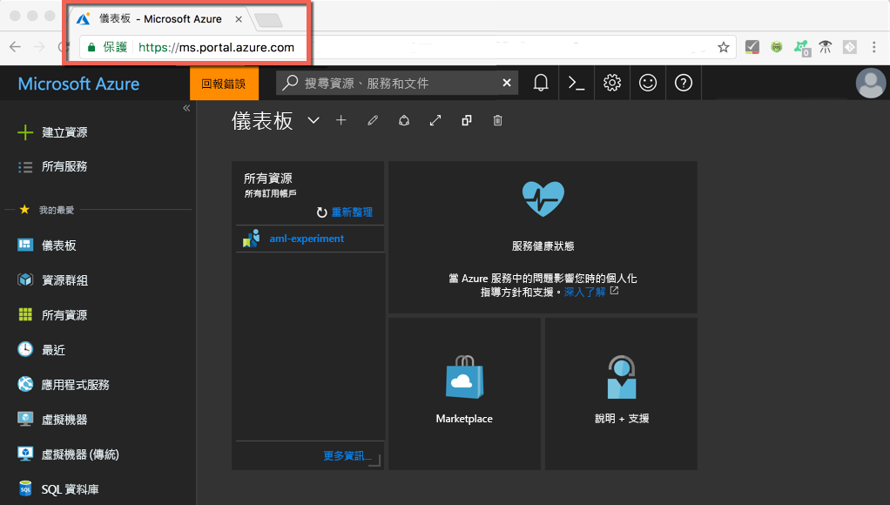
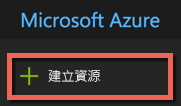
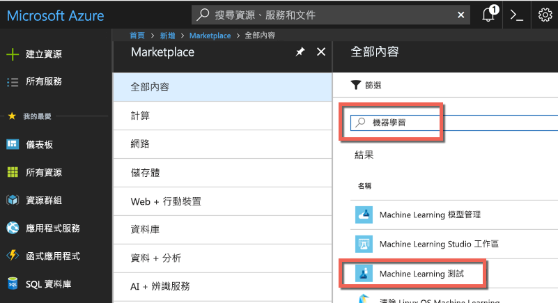
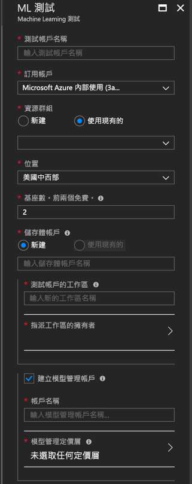
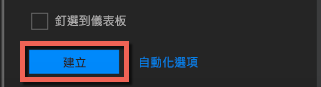
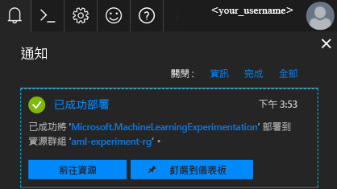
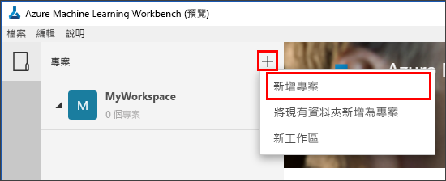
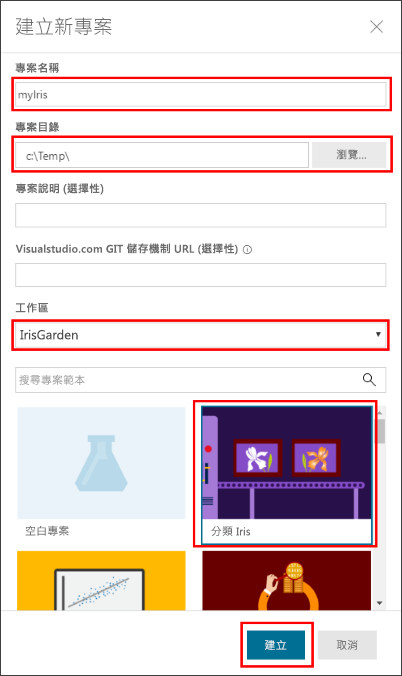
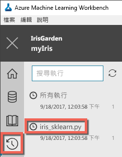
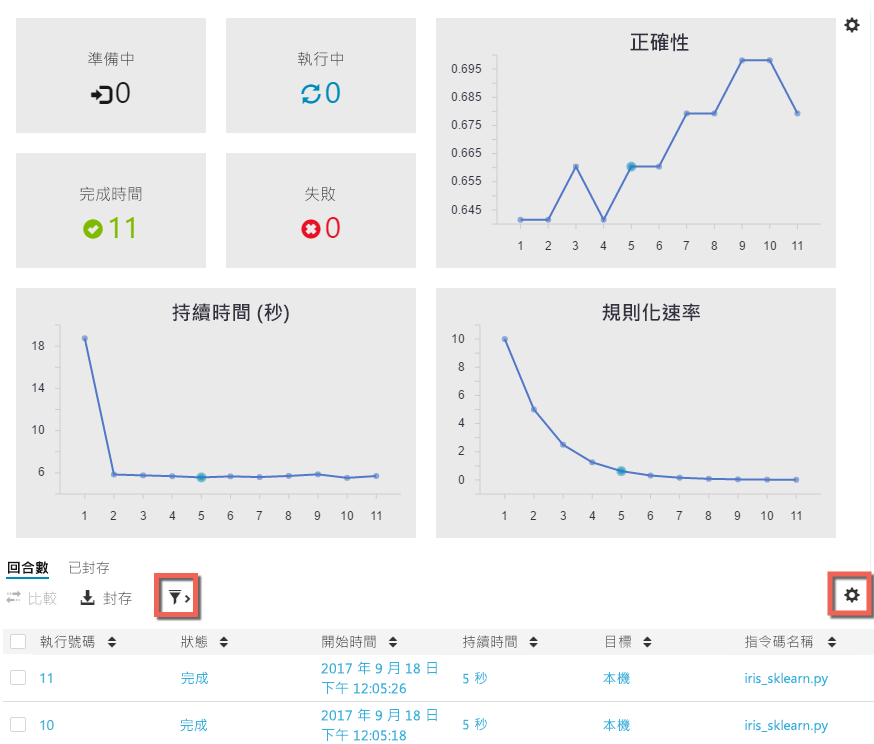

# <a name="quickstart-install-and-get-started-with-azure-machine-learning-service"></a>快速入門：安裝並開始使用 Azure Machine Learning services

[!INCLUDE [workbench-deprecated](../../../includes/aml-deprecating-preview-2017.md)]


Azure Machine Learning services (預覽) 是整合、端對端的資料科學和進階分析解決方案。 它可以協助專業資料科學家以雲端規模準備資料、開發測試及部署模型。

本快速入門示範如何：

* 為 Azure Machine Learning services 建立服務帳戶
* 安裝並登入 Azure Machine Learning Workbench。
* 在 Workbench 中建立專案
* 在該專案中執行指令碼  
* 存取命令列介面 (CLI)


Azure Machine Learning services 是 Microsoft Azure 產品組合的一部分，因此需要 Azure 訂用帳戶。 如果您沒有 Azure 訂用帳戶，請在開始前建立 [免費帳戶](https://azure.microsoft.com/free/?WT.mc_id=A261C142F) 。

此外，您必須具備適當的權限，才能建立「資源群組」、「虛擬機器」等資產。 

<a name="prerequisites"></a>您可以在下列作業系統上安裝 Azure Machine Learning Workbench 應用程式：
- Windows 10 或 Windows Server 2016
- macOS Sierra 或 High Sierra

## <a name="create-azure-machine-learning-service-accounts"></a>建立 Azure Machine Learning services 帳戶
使用 Azure 入口網站來佈建 Azure Machine Learning 帳戶： 
1. 使用您將使用之 Azure 訂用帳戶的認證來登入 [Azure 入口網站](https://portal.azure.com/)。 如果您沒有 Azure 訂用帳戶，請立即建立[免費帳戶](https://azure.microsoft.com/free/?WT.mc_id=A261C142F)。 

   

1. 選取入口網站左上角的 [建立資源] 按鈕 (+)。

   

1. 在搜尋列中輸入「Machine Learning」。 選取名為 **Machine Learning 測試**的搜尋結果。 

   

1. 在 [Machine Learning 測試] 窗格中，捲動到底部並選取 [建立] 即可開始定義您的測試帳戶。  

   

1. 在 [ML 測試] 窗格中，設定您的 Machine Learning 測試帳戶。 

   設定|教學課程的建議值|說明
   ---|---|---
   測試帳戶名稱 | _唯一的名稱_ |輸入可識別您帳戶的唯一名稱。 您可以使用您自己的名稱，或最能識別測試的部門或專案名稱。 這個名稱長度應介於 2 到 32 個字元之間。 應該只包含英數字元及虛線 (-) 字元。 
   訂用帳戶 | _您的訂用帳戶_ |選擇您要用於測試的 Azure 訂用帳戶。 如果您有多個訂用帳戶，請選擇資源計費的適當訂用帳戶。
   資源群組 | _您的資源群組_ | 在您的訂用帳戶中使用現有的資源群組，或輸入一個名稱來為此測試帳戶建立新的資源群組。 
   位置 | _最接近使用者的區域_ | 選擇最接近您的使用者與資料資源的位置。
   基座數目 | 2 | 輸入基座數目。 了解[基座如何影響定價](https://azure.microsoft.com/pricing/details/machine-learning/)。<br/><br/>在本快速入門中，您只需要兩個基座。 您可以視需要在 Azure 入口網站中可以新增或移除基座。
   儲存體帳戶 | _唯一的名稱_ | 選取 [建立新的]，並且提供名稱以建立 [Azure 儲存體帳戶](https://docs.microsoft.com/azure/storage/common/storage-quickstart-create-account?tabs=portal)。 名稱必須為 3 到 24 個字元，且只能包含英數字元。 或者，選取 [使用現有的] ，然後從下拉式清單選取現有的儲存體帳戶。 需要儲存體帳戶，並且是用來儲存專案構件並執行歷程記錄資料。 
   測試帳戶的工作區 | IrisGarden<br/>(教學課程中使用的名稱) | 提供此帳戶的工作區名稱。 這個名稱長度應介於 2 到 32 個字元之間。 應該只包含英數字元及虛線 (-) 字元。 此工作區包含您建立、管理及發行實驗所需的工具。
   指派工作區的擁有者 | _您的帳戶_ | 選取您自己的帳戶作為工作區擁有者。
   建立模型管理帳戶 | **檢查** |立即建立模型管理帳戶，當您想要將您的模型當作即時 Web 服務部署及管理時，即可使用此資源。 <br/><br/>隨為選擇性，但建議您在與測試帳戶的同時建立模型管理帳戶。
   帳戶名稱 | _唯一的名稱_ | 選擇可識別您模型管理員帳戶的唯一名稱。 您可以使用您自己的名稱，或最能識別測試的部門或專案名稱。 這個名稱長度應介於 2 到 32 個字元之間。 應該只包含英數字元及虛線 (-) 字元。 
   模型管理定價層 | **DEVTEST** | 選取 [未選取任何定價層] 來指定新模型管理帳戶的定價層。 為了節省成本，請選取 **DEVTEST** 定價層 (如果在您的訂用帳戶上可用，限量提供)。 否則選取 S1 定價層。 按一下 [選取] 以儲存定價層選取項目。 
   釘選到儀表板 | _檢查_ | 選取 [釘選到儀表板] 選項，在 Azure 入口網站的前儀表板頁面上輕鬆追蹤 Machine Learning 測試帳戶。

   

5. 選取 [建立] 開始建立測試帳戶及模型管理帳戶的程序。

   

   建立帳戶可能需要一些時間。 按一下 Azure 入口網站工具列上的 [通知] 圖示 (鈴鐺)，即可檢查部署程序的狀態。
   
   


## <a name="install-and-log-in-to-workbench"></a>安裝及登入 Workbench

Azure Machine Learning Workbench 適用於 Windows 或 macOS。 請查看[支援的平台](#prerequisites)清單。

>[!WARNING]
>安裝作業可能需要大約 30 分鐘的時間才能完成。 

1. 下載並啟動最新的 Workbench 安裝程式。 
   >[!IMPORTANT]
   >在磁碟上完整下載安裝程式，然後從該處執行它。 不要直接從瀏覽器的下載小工具執行它。

   **在 Windows 上：** 

   &nbsp;&nbsp;&nbsp;&nbsp;A. 下載 [AmlWorkbenchSetup.msi](https://aka.ms/azureml-wb-msi)。  <br/>
   &nbsp;&nbsp;&nbsp;&nbsp;B. 在檔案總管中按兩下所下載的安裝程式。

   **在 macOS 上：** 

   &nbsp;&nbsp;&nbsp;&nbsp;A. 下載 [AmlWorkbench.dmg](https://aka.ms/azureml-wb-dmg)。 <br/>
   &nbsp;&nbsp;&nbsp;&nbsp;B. 在搜尋工具中按兩下所下載的安裝程式。<br/><br/>

1. 請依照安裝程式中畫面上的指示來完成。 

   **安裝作業可能需要大約 30 分鐘的時間才能完成。**  
   
   | |Azure Machine Learning Workbench 的安裝路徑|
   |--------|------------------------------------------------|
   |Windows|C:\Users\\<user\>\AppData\Local\AmlWorkbench|
   |macOS|/Applications/Azure ML Workbench.app|

   安裝程式將會下載並設定所有必要的相依項目，例如 Python、Miniconda 及其他相關程式庫。 此安裝也包括 Azure 跨平台命令列工具或 Azure CLI。

1. 選取安裝程式最後一個畫面上的 [啟動 Workbench] 按鈕以啟用 Workbench。 

   如果您關閉了安裝程式：
   + 在 Windows 上，使用 **Machine Learning Workbench** 桌面捷徑來啟動它。 
   + 在 macOS 上，選取啟動列中的 **Azure ML Workbench**。

1. 在第一個畫面上，選取 [使用 Microsoft 帳戶登入] 以向 Azure Machine Learning Workbench 進行驗證。 使用您在 Azure 入口網站中用來建立測試和模型管理帳戶的相同認證。 

   登入之後，Workbench 會使用它在您的 Azure 訂用帳戶中找到的第一個測試帳戶，並顯示與該帳戶相關聯的所有工作區和專案。 

   >[!TIP]
   > 您可以使用 Workbench 應用程式視窗左下角的圖示，切換為不同的測試帳戶。

## <a name="create-a-project-in-workbench"></a>在 Workbench 中建立專案

在 Azure Machine Learning 中，專案是用來容納為解決問題所進行之所有工作的邏輯容器。 此專案會對應到本機磁碟上的單一資料夾，您可以在其中新增任何檔案或子資料夾。 

在此，我們會使用包含[鳶尾花資料集](https://en.wikipedia.org/wiki/Iris_flower_data_set)的範本，建立新的 Workbench 專案。 遵循本快速入門的教學課程會依賴此資料來建立模型，以便根據其某些實體特性來預測鳶尾花的類型。  

1. 開啟 Azure Machine Learning Workbench 後，在 [專案] 窗格中選取加號 (+)，然後選擇 [新增專案]。  

   

1. 填妥表單欄位並選取 [建立] 按鈕，以在 Workbench 中建立新專案。

   欄位|教學課程的建議值|說明
   ---|---|---
   專案名稱 | myIris |輸入可識別您帳戶的唯一名稱。 您可以使用您自己的名稱，或最能識別測試的部門或專案名稱。 這個名稱長度應介於 2 到 32 個字元之間。 應該只包含英數字元及虛線 (-) 字元。 
   專案目錄 | c:\Temp\ | 指定要在其中建立專案的目錄。
   專案描述 | _保留空白_ | 適合用於描述專案的選擇性欄位。
   Visualstudio.com GIT 存放庫 URL |_保留空白_ | 選擇性欄位。 專案可選擇性地在 Azure DevOps 上與 Git 存放庫相關聯，以便進行原始檔控制和共同作業。 [了解如何進行設定](../desktop-workbench/using-git-ml-project.md#step-3-set-up-a-machine-learning-project-and-git-repo)。 
   選取的工作區 | IrisGarden (如果存在的話) | 選擇您在 Azure 入口網站中針對測試帳戶建立的工作區。 <br/>如果您已遵循快速入門，您應該有名稱為 IrisGarden 的工作區。 如果沒有，請選取您建立測試帳戶時所建立的工作區，或任何您想使用的其他工作區。
   專案範本 | 分類鳶尾花 | 範本包含您可用來瀏覽產品的指令碼和資料。 此範本包含您在本快速入門及此文件網站中的其他教學課程中需要使用的指令碼和資料。 

   
 
 建立新的專案，專案儀表板隨即開啟並顯示該專案。 此時，您可以瀏覽專案首頁、資料來源、筆記本及原始程式檔。 

>[!TIP]
>您可以將 Workbench 設定為使用 Python IDE，以獲得順暢的資料科學開發體驗。 然後，您可以在 IDE 中與您的專案互動。 [了解作法](../desktop-workbench/how-to-configure-your-ide.md)。 

## <a name="run-a-python-script"></a>執行 Python 指令碼

現在，您可以在本機電腦上執行 **iris_sklearn.py** 指令碼。 此指令碼預設隨附於**分類鳶尾花**專案範本。 此指令碼會使用熱門 Python [scikit-learn](http://scikit-learn.org/stable/index.html) 程式庫來建立[羅吉斯迴歸](https://en.wikipedia.org/wiki/Logistic_regression)模型。

1. 在 [專案儀表板] 頁面頂端的命令列中，選取 **local** 作為執行目標，以及選取 **iris_sklearn.py** 作為要執行的指令碼。 預設會預先選取這些值。 

   範例中包含其他檔案，可供您稍後瞧瞧，但是在本快速入門中，我們著重在 **iris_sklearn.py** 。 

   

1. 在 [引數] 文字方塊中輸入 **0.01**。 此數字對應於正則化速率，並使用於指令碼來設定羅吉斯迴歸模型。 

1. 選取 [執行] 以在您的電腦上開始執行指令碼。 **Iris_sklearn.py** 作業會立即出現在右邊的 [作業] 面板上，所以您可以監視指令碼的執行。

   恭喜！ 您已成功在 Azure Machine Learning Workbench 中執行 Python 指令碼。

1. 使用範圍從 **0.001** 至 **10** 的不同引數值 (例如，使用 10 的次方)，重複步驟 2 - 3 數次。 每個執行都會出現在 [作業] 窗格中。

1. 選取 [執行] 檢視，然後選取 [執行] 清單中的 **iris_sklearn.py**，以檢查執行歷程記錄。 

   

   此檢視會顯示在 **iris_sklearn.py** 上執行的每次執行。 執行歷程記錄儀表板也會顯示最上層度量、一組預設圖形和每個執行度量的清單。 

1. 您可以使用齒輪和漏斗圖示，藉由排序、篩選和調整組態來自訂此檢視。

   

3. 選取 [作業] 窗格中已完成的執行，可看到該特定執行的詳細檢視。 詳細資料包括其他計量、它所產生的檔案和其他有用的記錄。

## <a name="start-the-cli"></a>啟動 CLI

Azure Machine Learning 命令列介面 (CLI) 也已安裝。 CLI 介面可讓您使用 `az` 命令來執行端對端資料科學工作流程所需的所有工作，進而存取 Azure Machine Learning services 並與其互動。 [深入了解。](../desktop-workbench/tutorial-iris-azure-cli.md)

您可以使用 [檔案] → [開啟命令提示字元]，從 Workbench 工具列啟動 Azure Machine Learning CLI。

您可以使用 --help 引數，在 Azure Machine Learning CLI 中取得命令的說明。

```az ml --help```

## <a name="clean-up-resources"></a>清除資源

[!INCLUDE [aml-delete-resource-group](../../../includes/aml-delete-resource-group.md)]

## <a name="next-steps"></a>後續步驟
您現在已建立必要的 Azure Machine Learning 帳戶，並已安裝 Azure Machine Learning Workbench 應用程式。 您也已建立專案、執行指令碼，並探索指令碼的執行歷程記錄。

如需此工作流程的更深入體驗，包括如何將鳶尾花模型部署為 Web 服務，請遵循完整的「分類鳶尾花」教學課程。 本教學課程包含[資料準備](../desktop-workbench/tutorial-classifying-iris-part-1.md)、[測試](../desktop-workbench/tutorial-classifying-iris-part-2.md)和[模型管理](../desktop-workbench/tutorial-classifying-iris-part-3.md)的詳細步驟。 

> [!div class="nextstepaction"]
> [教學課程：分類鳶尾花 (第 1 部分)](../desktop-workbench/tutorial-classifying-iris-part-1.md)

>[!NOTE]
> 雖然您已建立模型管理帳戶，但您的環境尚未針對部署 Web 服務而設定。 了解如何設定您的[部署環境](../desktop-workbench/deployment-setup-configuration.md)。
