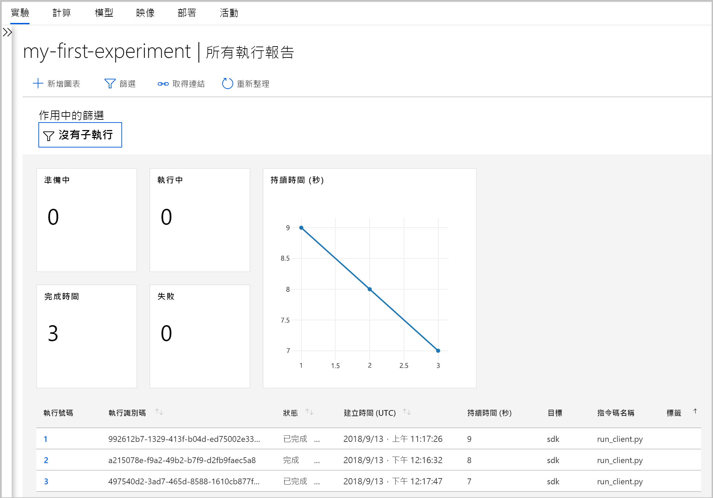

# <a name="what-happened-to-azure-machine-learning-workbench"></a>Azure Machine Learning Workbench 發生什麼事？

Azure Machine Learning Workbench 應用程式和一些其他早期的功能已在 **2018 年 9 月**版本中淘汰並由其他項目取代，以便為改善的[架構](concept-azure-machine-learning-architecture.md)做準備。

為了改善您的體驗，該版本中包含了許多由客戶意見反應所促成的重大更新。 從實驗執行到模型部署的核心功能沒有變更。 但您現在可以使用強固的 <a href="https://docs.microsoft.com/python/api/overview/azure/ml/intro?view=azure-ml-py" target="_blank">Python SDK</a>、R SDK 和 [Azure CLI](reference-azure-machine-learning-cli.md) 來完成機器學習工作和管線。

在舊版 Azure Machine Learning 中建立的大部分成品都儲存在您的本機或雲端儲存體。 這些成品永遠不會消失。

在本文中，您會了解變更的項目為何，以及它們如何影響使用 Azure Machine Learning Workbench 和其 API 的既有工作。

>[!Warning]
>本文適用對象不是 Azure Machine Learning Studio 使用者。 這適用於 Azure Machine Learning 客戶，而這些客戶已安裝 Workbench (預覽) 應用程式及/或具有實驗和模型管理預覽帳戶。


## <a name="what-changed"></a>變更的項目為何？

最新版的 Azure Machine Learning 包括下列功能：
+ [簡化的 Azure 資源模型](concept-azure-machine-learning-architecture.md)。
+ [新的入口網站 UI](how-to-track-experiments.md)，可管理您的實驗和計算目標。
+ 全新且更全面的 Python <a href="https://docs.microsoft.com/python/api/overview/azure/ml/intro?view=azure-ml-py" target="_blank">SDK</a>。
+ 全新且經過擴充的適用於機器學習的 [Azure CLI 擴充功能](reference-azure-machine-learning-cli.md)。

[架構](concept-azure-machine-learning-architecture.md)已經過重新設計，以方便您使用。 您只需要一個 [Azure Machine Learning 工作區](concept-workspace.md)，而不是多個 Azure 資源和帳戶。 您可以在 [Azure 入口網站](how-to-manage-workspace.md)中快速建立工作區。 藉由使用工作區，多個使用者可以儲存定型和部署計算目標、模型實驗、Docker 映像、已部署的模型等等。

雖然目前的版本中有改善的新 CLI 和 SDK 用戶端，但桌面工作區應用程式本身已被淘汰。 您可以在 [Azure Machine Learning Studio 的工作區儀表板](how-to-track-experiments.md#view-the-experiment-in-the-web-portal)中管理實驗。 使用儀表板來取得實驗記錄、管理附加到工作區的計算目標、管理模型和 Docker 映像，甚至可以部署 Web 服務。

<a name="timeline"></a>

## <a name="support-timeline"></a>支援時間表

在 2019 年 1 月 9 日後，Machine Learning Workbench、Azure Machine Learning 測試和模型管理帳戶及其相關 SDK 和 CLI 的支援均已終止。

使用新的 <a href="https://docs.microsoft.com/python/api/overview/azure/ml/intro?view=azure-ml-py" target="_blank">SDK</a>、[CLI](reference-azure-machine-learning-cli.md) 和[入口網站](how-to-manage-workspace.md)即可使用所有最新功能。

## <a name="what-about-run-histories"></a>那麼執行歷程記錄呢？

較舊的執行歷程記錄已無法存取，您如何繼續在最新版本中檢視您的執行。

執行歷程記錄現在稱為**實驗**。 您可以使用 SDK、CLI 或 Azure Machine Learning Studio 來收集模型的實驗並加以探索。

只有在 Microsoft Edge、Chrome 和 Firefox 上才支援入口網站的工作區儀表板：

[](./media/overview-what-happened-to-workbench/image001.png#lightbox)

開始使用新的 CLI 和 SDK 來訓練模型以及追蹤執行歷程記錄。 您可以了解如何使用[教學課程：使用 Azure Machine Learning 訓練模型](tutorial-train-models-with-aml.md)。

## <a name="will-projects-persist"></a>專案是否會保存？

您不會遺失任何程式碼或作品。 在舊版中，專案是具有本機目錄的雲端實體。 在最新版中，您將使用本機設定檔將本機目錄連結到 Azure Machine Learning 工作區。 [請參閱最新架構的圖表](concept-azure-machine-learning-architecture.md)。

大部分專案內容都已經在您的本機電腦上。 因此，您只需要在該目錄中建立設定檔，並在您的程式碼中參照它，就能連線到您的工作區。 若要繼續使用包含您檔案和指令碼的本機目錄，請在 ['experiment.submit'](https://docs.microsoft.com/python/api/azureml-core/azureml.core.experiment.experiment?view=azure-ml-py) Python 命令中或使用 `az ml project attach` CLI 命令指定目錄的名稱。  例如：
```python
run = exp.submit(source_directory=script_folder,
                 script='train.py', run_config=run_config_system_managed)
```

[建立工作區](how-to-manage-workspace.md)即可開始使用。

## <a name="what-about-my-registered-models-and-images"></a>那麼我的註冊模型和映像呢？

如果您要繼續使用在舊模型登錄中註冊的模型，您必須將它們遷移到新工作區。 若要移轉模型，請下載模型並在新的工作區中重新加以註冊。

您在舊映像登錄中建立的映像無法直接遷移到新的工作區。 在大部分情況下，不需建立映像即可部署模型。 如有需要，您可以在新的工作區中建立模型的映像。 如需詳細資訊，請參閱[管理、註冊、部署及監視機器學習模型](concept-model-management-and-deployment.md)。

## <a name="what-about-deployed-web-services"></a>那麼已部署的 Web 服務呢？

現在，舊版 CLI 的支援已終止，您已無法重新部署模型，或管理原本使用模型管理帳戶進行部署的 Web 服務。 不過，只要仍支援 Azure Container Service (ACS)，這些 Web 服務就會繼續運作。

在最新版本中，模型會以 Web 服務形式部署至「Azure 容器執行個體」(ACI) 或 Azure Kubernetes Service (AKS) 叢集。 您也可以部署至 FPGA 或 Azure IoT Edge。

請在下列文章中深入了解：
+ [部署模型的位置和方式](how-to-deploy-and-where.md)
+ [教學課程：使用 Azure Machine Learning 部署模型](tutorial-deploy-models-with-aml.md)

## <a name="next-steps"></a>後續步驟

了解 [Azure Machine Learning 的最新架構](concept-azure-machine-learning-architecture.md)。

如需此服務的概觀，請參閱[什麼是 Azure Machine Learning？](overview-what-is-azure-ml.md)。

使用您慣用的方法建立您的第一個實驗：
  + [使用 Python 筆記本](tutorial-1st-experiment-sdk-setup.md)
  + [使用 R Markdown](tutorial-1st-r-experiment.md) 
  + [使用自動化機器學習](tutorial-designer-automobile-price-train-score.md) 
  + [使用設計工具的拖放功能](tutorial-first-experiment-automated-ml.md) 
  + [使用 CLI 的 ML 擴充功能](tutorial-train-deploy-model-cli.md)
