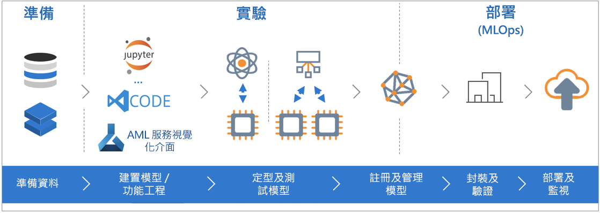

# 什麼是 Azure Machine Learning 服務？

Azure Machine Learning 服務是可用來定型、部署、自動化及管理機器學習模型的雲端服務，而這一切都在雲端所提供的廣泛規模下進行。

## 什麼是機器學習？

機器學習是一項資料科學技術，可讓電腦使用現有資料來預測未來的行為、結果和趨勢。 使用機器學習，電腦不需要明確進行程式設計就能學習。

機器學習的預測可讓應用程式和裝置更聰明。 例如，當您線上購物時，機器學習服務可根據您已經購買的產品，協助推薦其他產品。 或是當您的信用卡被刷過時，機器學習服務可將該筆交易與交易資料庫進行比對，協助偵測詐騙。 而且，當您的吸塵器機器人清潔房間時，機器學習服務可協助它判斷作業是否已完成。

## 什麼是 Azure Machine Learning 服務？

Azure Machine Learning 服務提供雲端架構的環境，可用於開發、定型、測試、部署、管理及追蹤機器學習服務模型。

[  ] (./media/overview-what-is-azure-ml/aml.png#lightbox)

Azure Machine Learning 服務完全支援開放原始碼技術，因此您可以使用數以萬計的開放原始碼 Python 套件，與像是 TensorFlow 與 scikit-learn 等機器學習服務元件。
支援各種工具 (例如 [Jupyter Notebook](http://jupyter.org) 或[適用於 Visual Studio Code 的 Azure Machine Learning](https://marketplace.visualstudio.com/items?itemName=ms-toolsai.vscode-ai#overview) 擴充功能)，可輕鬆地以互動方式瀏覽資料及加以轉換，然後再開發及測試模型。
Azure Machine Learning 服務也包含[自動產生模型與微調](tutorial-auto-train-models.md)的功能，可協助您輕鬆且具效率地正確建立模型。

您可利用 Azure Machine Learning 服務，開始訓練您的本機電腦，然後向外延展到雲端。 透過許多可用的[計算目標](how-to-set-up-training-targets.md) (例如 Azure Machine Learning Compute 和 [Azure Databricks](/azure/azure-databricks/what-is-azure-databricks)) 及[進階的超參數微調服務](how-to-tune-hyperparameters.md)，您可以使用雲端功能更快地建置更好的模型。

當您有正確的模型時，即可輕鬆地將其部署在像是 Docker 等容器中。 這表示很容易即可部署到 Azure Container Instances 或是 Azure Kubernetes Service，或在您自己的部署中，於內部部署或雲端內使用該容器。 如需詳細資訊，請參閱[部署方式及位置](how-to-deploy-and-where.md)文件。
您可管理已部署的模型，並在進行實驗以找出最佳解決方案的過程中，追蹤多次回合。
一旦部署之後，您的模型可[即時](how-to-consume-web-service.md)或[非同步](how-to-run-batch-predictions.md)地傳回大量資料上的預測。

另外，透過進階的[機器學習管線](concept-ml-pipelines.md)，您可以在資料準備、模型訓練與評估和部署的所有步驟上共同作業。

## 可利用 Azure Machine Learning 服務做什麼？

Azure Machine Learning 服務可自動定型模型及自動調整模型。
如需範例，請參閱[教學課程：使用自動化的 Azure Machine Learning 自動將分類模型定型](tutorial-auto-train-models.md)。

使用開放原始碼 Python 套件時，搭配適用於 Python 的 Azure Machine Learning <a href="https://aka.ms/aml-sdk" target="_blank">SDK</a>，即可自行於 Azure Machine Learning 服務工作區中，建置及定型高精確度的機器學習服務與深度學習模型。
您可選擇開放原始碼 Python 套件中所提供的許多機器學習服務元件，如下所示：

- <a href="https://scikit-learn.org/stable/" target="_blank">Scikit-learn</a>
- <a href="https://www.tensorflow.org" target="_blank">Tensorflow</a>
- <a href="https://pytorch.org" target="_blank">PyTorch</a>
- <a href="https://www.microsoft.com/en-us/cognitive-toolkit/" target="_blank">CNTK</a>
- <a href="http://mxnet.io" target="_blank">MXNet</a>

一旦擁有模型後，即可使用此模型來建立容器 (例如 Docker)，並將容器部署在本機以進行測試。 完成測試之後，您就可以在 Azure Container Instances 或 Azure Kubernetes Service 中將模型部署為生產 Web 服務。 如需詳細資訊，請參閱[部署方式及位置](how-to-deploy-and-where.md)文件。

接著，您可以使用[適用於 Python 的 Azure Machine Learning SDK](https://aka.ms/aml-sdk) 或 [Azure 入口網站](https://portal.azure.com/)管理所部署的模型。
您可以評估模型計量、重新定型及重新部署新版本的模型，還能同時追蹤模型的實驗。

若要開始使用 Azure Machine Learning 服務，請參閱以下的[後續步驟](#next-steps)。

## Azure Machine Learning 服務與 Studio 有何不同？

Azure Machine Learning Studio 是可進行共同作業的拖放式視覺化工作區，您可於該處建置、測試及部署機器學習解決方案，而無須撰寫任何程式碼。 其會使用預先建置且預先設定的機器學習演算法，以及資料處理模組。

當您想要快速且輕鬆地實驗機器學習模型，而內建的機器學習演算法即已足夠您用於解決方案時，請使用 Machine Learning Studio。

若在 Python 環境中運作，而想要更充分掌控您的機器學習演算法，或是想要使用開放原始碼機器學習程式庫，請使用 Machine Learning 服務。

> [!NOTE]
> 在 Azure Machine Learning Studio 中所建立的模型，無法由 Azure Machine Learning 服務進行部署或管理。

## 免費試用

如果您沒有 Azure 訂用帳戶，請在開始前建立一個免費帳戶。 立即試用[免費或付費版本的 Azure Machine Learning 服務](http://aka.ms/AMLFree)。

即可取得用於 Azure 服務的點數。 信用額度用完之後，您可以保留帳戶並使用[免費的 Azure 服務](https://azure.microsoft.com/free/)。 除非您明確變更您的設定且同意付費，否則我們絕對不會從您的信用卡收取任何費用。 或者，您也可以[啟用 MSDN 訂閱者權益](https://azure.microsoft.com/pricing/member-offers/msdn-benefits-details/?WT.mc_id=A261C142F)，此服務會每月提供額度，您可以用於 Azure 付費服務。

## 後續步驟

- 使用 [Azure 入口網站](quickstart-get-started.md)或 [Python](quickstart-create-workspace-with-python.md) 建立 Machine Learning 服務工作區以開始作業。

- 遵循完整教學課程：[使用 Azure Machine Learning 定型及部署影像分類模型](tutorial-train-models-with-aml.md)。

- [使用 Azure Machine Learning 來自動產生及自動調整模型](tutorial-auto-train-models.md)。

- 使用 [Azure Machine Learning 資料準備 SDK](https://aka.ms/data-prep-sdk)，以準備資料。

- 了解用來建置、最佳化及管理機器學習案例的[機器學習管線](/azure/machine-learning/service/concept-ml-pipelines)。

- 進一步閱讀 [Azure Machine Learning 服務的架構和概念](concept-azure-machine-learning-architecture.md)一文。

- 如需 Microsoft 其他機器學習產品的詳細資訊，請參閱[其他 Microsoft 機器學習產品](./overview-more-machine-learning.md)。

<!-- 

An intro to AML or an end-to-end quickstart video could go here.

In this 9-minute video, learn how you can benefit your app. You'll learn about key features and what a typical workflow looks like. 

>[!VIDEO https://channel9.msdn.com/Events/Connect/2016/138/player]
 
+ 0-3 minutes covers key features and use-cases.
+ 3-4 minutes covers service provisioning. 
+ 4-6 minutes covers Import Data wizard used to create an index using the built-in real estate dataset.

-->
