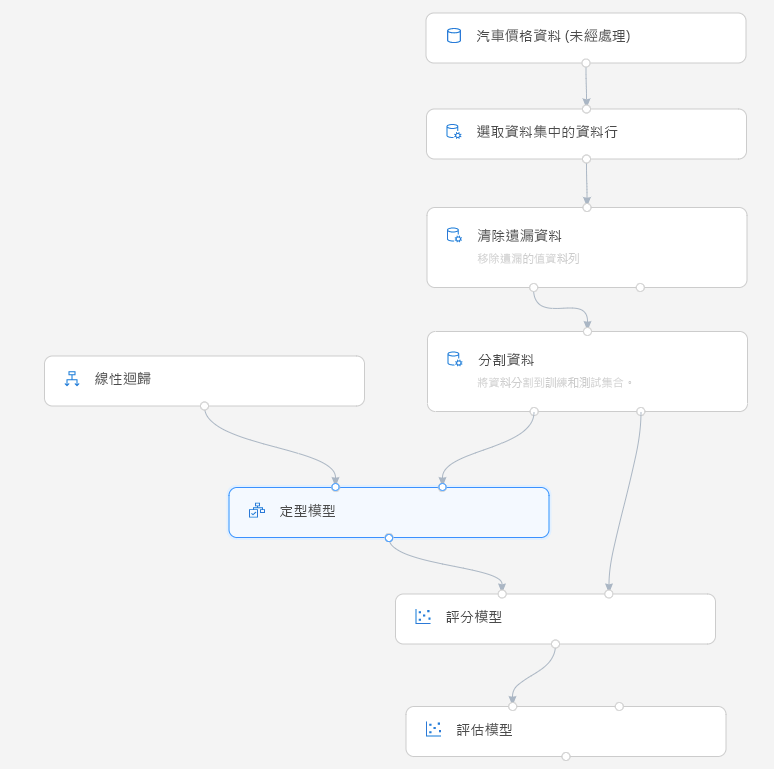

# 什麼是 Azure Machine Learning？

Azure Machine Learning 是用來定型、部署、自動化及管理機器學習模型的雲端服務，而這一切都在雲端所提供的廣泛規模下進行。

## 什麼是機器學習？

機器學習是一項資料科學技術，可讓電腦使用現有資料來預測未來的行為、結果和趨勢。 使用機器學習，電腦不需要明確進行程式設計就能學習。

機器學習的預測可讓應用程式和裝置更聰明。 例如，當您線上購物時，機器學習服務可根據您已經購買的產品，協助推薦其他您可能會想要的產品。 或是當您的信用卡被刷過時，機器學習服務可將該筆交易與交易資料庫進行比對，協助偵測詐騙。 而且，當您的吸塵器機器人清潔房間時，機器學習服務可協助它判斷作業是否已完成。

## 什麼是 Azure Machine Learning？

Azure Machine Learning 提供雲端架構的環境，可用於準備資料、定型、測試、部署、管理及追蹤機器學習服務模型。 開始訓練您的本機電腦，然後向外擴充到雲端。 此服務完全支援開放原始碼技術，例如 PyTorch、TensorFlow 和 scikit-learn，並可用於任何一種機器學習，從傳統 ML 以至深度學習、監督式和非監督式學習。

探索和準備資料、定型和測試模型，以及使用豐富工具加以部署，例如：
+ [視覺化介面](ui-tutorial-automobile-price-train-score.md)，您可以在其中拖放模組來建置您的實驗，然後部署模型
+ [Jupyter Notebook](https://jupyter.org)，您會在其中使用 [SDK](https://docs.microsoft.com/azure/machine-learning) 來撰寫自己的程式碼，例如[這些範例 Notebook](https://aka.ms/aml-notebooks)
+ [Visual Studio Code 擴充功能](how-to-vscode-tools.md) \(英文\)

> [!VIDEO https://channel9.msdn.com/Events/Connect/Microsoft-Connect--2018/D240/player]

## 可利用 Azure Machine Learning 服務做什麼？

您可以使用 <a href="https://docs.microsoft.com/python/api/overview/azure/ml/intro?view=azure-ml-py" target="_blank">Azure Machine Learning Python SDK</a> 搭配開放原始碼 Python 套件，或使用[視覺化介面 (預覽)](ui-tutorial-automobile-price-train-score.md)，在 Azure Machine Learning 服務工作區中自行建置及定型高精確度的機器學習和深度學習模型。

您可選擇開放原始碼 Python 套件中所提供的許多機器學習元件，例如 <a href="https://scikit-learn.org/stable/" target="_blank">Scikit-learn</a>、<a href="https://www.tensorflow.org" target="_blank">Tensorflow</a>、<a href="https://pytorch.org" target="_blank">PyTorch</a> 和 <a href="https://mxnet.io" target="_blank">MXNet</a>。

不論是否撰寫程式碼或使用視覺化介面，都可以在進行實驗以找出最佳解決方案以及管理已部署模型的過程中，追蹤多回個合。

### 程式碼優先體驗

您可使用 <a href="https://docs.microsoft.com/python/api/overview/azure/ml/intro?view=azure-ml-py" target="_blank">Azure Machine Learning Python SDK</a>，開始訓練您的本機電腦，然後向外擴充到雲端。 透過許多可用的[計算目標](how-to-set-up-training-targets.md) (例如 Azure Machine Learning Compute 和 [Azure Databricks](/azure/azure-databricks/what-is-azure-databricks)) 及[進階的超參數微調服務](how-to-tune-hyperparameters.md)，您可以使用雲端功能更快地建置更好的模型。

您也可以使用 SDK，[自動進行模型定型和微調](tutorial-auto-train-models.md)。

### 以 UI 為基礎的低程式碼開發體驗

若要進行無程式碼的訓練和部署，請嘗試：

+ 在便於使用的介面中建立[自動化 ML 實驗](tutorial-first-experiment-automated-ml.md)。
+ [視覺化介面中的拖放實驗](ui-tutorial-automobile-price-train-score.md)。
  

### 運算化 (MLOps)

當您有正確的模型時，您可以在 Web 服務中、在 IoT 裝置上或從 Power BI 輕鬆使用它。 如需詳細資訊，請參閱有關[如何部署和部署位置](how-to-deploy-and-where.md)的文章。

接著，您可以使用[適用於 Python 的 Azure Machine Learning SDK](https://aka.ms/aml-sdk) \(英文\)、[Azure 入口網站](https://portal.azure.com/)或您的[工作區登陸頁面 (預覽)](https://ml.azure.com) \(英文\)，管理所部署的模型。

這些模型可被取用並[即時](how-to-consume-web-service.md)或[非同步](how-to-run-batch-predictions.md)地傳回大量資料的相關預測。

另外，透過進階[機器學習管線](concept-ml-pipelines.md)，您可以在資料準備、模型定型與評估及部署的每個步驟上共同作業。 管線可讓您執行下列作業：

* 自動化雲端中的端對端機器學習程序
* 重複使用元件，並且只在需要時重新執行步驟
* 在每個步驟中使用不同的計算資源
* 執行批次評分工作

若要開始使用 Azure Machine Learning，請參閱以下的[後續步驟](#next-steps)。

## Azure Machine Learning 與 Studio 有何不同？

[Machine Learning Studio](../studio/what-is-ml-studio.md) 是可進行共同作業的拖放式視覺化工作區，您可於該處建置、測試及部署機器學習解決方案，而無須撰寫任何程式碼。 它會使用預先建置且預先設定的機器學習演算法和資料處理模組，以及專屬計算平台。

Azure Machine Learning 同時提供 SDK **與**視覺化介面 (預覽)，可快速準備資料、定型及部署機器學習服務模型。 視覺化介面 (預覽) 對 Studio 提供類似的拖放體驗。 不過，不同於 Studio 的專屬計算平台，視覺化介面會使用您自己的計算資源，且已完全整合到 Azure Machine Learning 中。

以下是快速的比較。

|| Machine Learning Studio | Azure Machine Learning： 視覺化介面|
|---| --- | --- |
|| 正式上市 (GA) | 預覽狀態|
|拖放介面| yes | yes|
|實驗| 調整 (有 10 GB 的訓練資料限制) | 使用計算目標進行調整|
|介面適用的模組| 多種 | 初始的受歡迎模組集合|
|定型計算目標| 專屬計算目標，僅限 CPU|AML 計算 (GPU/CPU)  Notebook 虛擬機器 |
|推斷計算目標| 專屬 Web 服務格式 (不可自訂) | Azure Kubernetes Service (即時推斷)  AML 計算 (批次推斷) |
|ML 管線| 不支援 | 管線撰寫   已發佈的管線   管線端點   [深入了解 ML 管線](concept-ml-pipelines.md)|
|ML Ops| 基本模型管理和部署 | 可設定的部署、模型和管線版本控制|
|模型| 專屬格式。 無法在 Studio 之外使用 | 標準格式 (可能會因為定型作業不同而有所差異)|
|自動化模型定型和超參數調整 | 否 | 尚未在視覺化介面中。   (在Python SDK 和工作區登陸頁面中支援。) |

試用視覺介面 (預覽)，經由[教學課程：透過視覺化介面預測汽車價格](ui-tutorial-automobile-price-train-score.md)。

> [!NOTE]
> 在 Studio 中建立的模型無法由 Azure Machine Learning 進行部署或管理。 不過，可以透過 Azure Machine Learning 工作區管理在服務視覺化介面中建立和部署的模型。

## 免費試用

如果您沒有 Azure 訂用帳戶，請在開始前先建立一個免費帳戶。 立即試用[免費或付費版本的 Azure Machine Learning](https://aka.ms/AMLFree)。

即可取得用於 Azure 服務的點數。 信用額度用完之後，您可以保留帳戶並使用[免費的 Azure 服務](https://azure.microsoft.com/free/)。 除非您明確變更您的設定且同意付費，否則我們絕對不會從您的信用卡收取任何費用。 或是[啟用 MSDN 訂閱者權益](https://azure.microsoft.com/pricing/member-offers/msdn-benefits-details/?WT.mc_id=A261C142F)，此服務每月提供您可以用於 Azure 付費服務的額度。

## 後續步驟

- [建立 Machine Learning 服務工作區](how-to-manage-workspace.md)以開始作業。

- 請遵循完整的教學課程：
  + [建立工作區並定型您的第一個 ML 模型](tutorial-1st-experiment-sdk-setup.md)
  + [使用 Azure Machine Learning 將影像分類模型定型](tutorial-train-models-with-aml.md)

- 了解用來建置、最佳化及管理機器學習案例的[機器學習管線](/azure/machine-learning/service/concept-ml-pipelines)。

- 進一步閱讀 [Azure Machine Learning 的架構和概念](concept-azure-machine-learning-architecture.md)一文。

- 如需詳細資訊，請參閱 [Microsoft 的其他機器學習產品](/azure/architecture/data-guide/technology-choices/data-science-and-machine-learning)。
