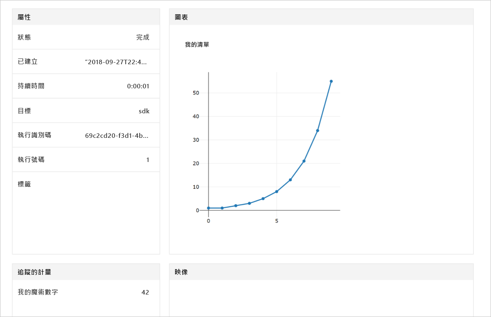

# <a name="quickstart-use-python-to-get-started-with-azure-machine-learning"></a>快速入門：使用 Python 來開始使用 Azure Machine Learning

在此快速入門中，您會使用適用於 Python 的 Azure Machine Learning 來建立及使用 Machine Learning 服務[工作區](concept-azure-machine-learning-architecture.md)。 此工作區是雲端中使用 Machine Learning 來實驗、訓練及部署機器學習模型的基礎區塊。 在本快速入門中，您會先設定自己的 Python 環境和 Jupyter Notebook 伺服器。 若要在無安裝的情況下執行，請參閱[快速入門：利用 Azure 入口網站開始使用 Azure Machine Learning](quickstart-get-started.md)。


> [!VIDEO https://www.microsoft.com/en-us/videoplayer/embed/RE2G9N6]

在本教學課程中，您會安裝 Python SDK，以及：

* 在您的 Azure 訂用帳戶中建立工作區。
* 建立該工作區的組態檔，稍後在其他 Notebook 和指令碼中會用到。
* 撰寫程式碼來記錄工作區內的值。
* 在工作區中檢視記錄的值。

在本快速入門中，您會建立工作區和組態檔。 您可以使用它們作為其他 Azure Machine Learning 教學課程和操作說明文章的必要條件。 如同使用其他 Azure 服務，Machine Learning 也有一些相關限制和配額。 [深入了解配額及如何要求更多配額。](how-to-manage-quotas.md)

下列 Azure 資源可在區域內取得時，就會自動新增至您的工作區：
 
- [Azure Container Registry](https://azure.microsoft.com/services/container-registry/)
- [Azure 儲存體](https://azure.microsoft.com/services/storage/)
- [Azure Application Insights](https://azure.microsoft.com/services/application-insights/) 
- [Azure 金鑰保存庫](https://azure.microsoft.com/services/key-vault/)

>[!NOTE]
> 本文中的程式碼使用 Azure Machine Learning SDK 0.1.74 版進行測試 

如果您沒有 Azure 訂用帳戶，請在開始前建立[免費帳戶](https://aka.ms/AMLfree) 。


## <a name="install-the-sdk"></a>安裝 SDK

*如果您使用 2018 年 9 月 27 日之後建立的資料科學虛擬機器，請略過本節。* 這些資料科學虛擬機器會隨附預先安裝的 Python SDK。

安裝 SDK 之前，我們建議您先建立獨立的 Python 環境。 雖然本快速入門使用 [Miniconda](https://conda.io/docs/user-guide/install/index.html)，但您也可以使用已安裝的完整 [Anaconda](https://www.anaconda.com/) 或 [Python virtualenv](https://virtualenv.pypa.io/en/stable/)。

### <a name="install-miniconda"></a>安裝 Miniconda


[下載](https://conda.io/miniconda.html)並安裝 Miniconda。 選取 Python 3.7 版或更新版本。 請勿選取 Python 2.x 版。

### <a name="create-an-isolated-python-environment"></a>建立獨立的 Python 環境 

開啟命令列視窗。 然後使用 Python 3.6 建立名為 `myenv` 的新 Conda 環境。

```shell
conda create -n myenv -y Python=3.6
```

啟用環境。

  ```shell
  conda activate myenv
  ```

### <a name="install-the-sdk"></a>安裝 SDK

在已啟用的 Conda 環境中安裝 SDK。 下列命令會安裝 Machine Learning SDK 的核心元件。 它也會在 `myenv` conda 環境中安裝 Jupyter Notebook 伺服器。 完成安裝需要幾分鐘的時間，視您的電腦組態而定。

```shell
# install the base SDK and Jupyter Notebook
pip install azureml-sdk[notebooks]
```


## <a name="create-a-workspace"></a>建立工作區

若要啟動 Jupyter Notebook，請輸入下列命令。
```shell
jupyter notebook
```

在瀏覽器視窗中，使用預設 `Python 3` 核心建立新的 Notebook。 

若要顯示 SDK 版本，請在 Notebook 資料格中輸入下列 Python 程式碼並加以執行。

[!code-python[](~/aml-sdk-samples/ignore/doc-qa/quickstart-create-workspace-with-python/quickstart.py?name=import)]

建立新的 Azure 資源群組和新的工作區。

在 [Azure 入口網站的訂用帳戶清單](https://ms.portal.azure.com/#blade/Microsoft_Azure_Billing/SubscriptionsBlade)中尋找 `<azure-subscription-id>` 的值。 使用您在其中是擁有者或參與者角色的任何訂用帳戶。

```python
from azureml.core import Workspace
ws = Workspace.create(name='myworkspace',
                      subscription_id='<azure-subscription-id>',    
                      resource_group='myresourcegroup',
                      create_resource_group=True,
                      location='eastus2' # or other supported Azure region  
                     )
```

執行上述程式碼可能會觸發新的瀏覽器視窗，讓您登入 Azure 帳戶。 登入之後，會在本機快取驗證權杖。

若要查看工作區詳細資料，例如相關聯的儲存體、容器登錄和金鑰保存庫，請輸入下列程式碼。

[!code-python[](~/aml-sdk-samples/ignore/doc-qa/quickstart-create-workspace-with-python/quickstart.py?name=getDetails)]


## <a name="write-a-configuration-file"></a>寫入組態檔

將組態檔中的工作區詳細資料儲存到目前的目錄。 此檔案稱為 'aml_config\config.json'。  

此工作區組態檔可讓您稍後輕鬆地載入這同一個工作區。 您可以使用相同目錄或子目錄中的其他 Notebook 和指令碼來載入它。 

[!code-python[](~/aml-sdk-samples/ignore/doc-qa/quickstart-create-workspace-with-python/quickstart.py?name=writeConfig)]


`write_config()` API 呼叫會在目前的目錄中建立組態檔。 `config.json` 檔案包含下列指令碼。

```json
{
    "subscription_id": "<azure-subscription-id>",
    "resource_group": "myresourcegroup",
    "workspace_name": "myworkspace"
}
```

## <a name="use-the-workspace"></a>使用工作區

撰寫一些使用基本 SDK API 的程式碼來追蹤實驗執行。

[!code-python[](~/aml-sdk-samples/ignore/doc-qa/quickstart-create-workspace-with-python/quickstart.py?name=useWs)]


## <a name="view-logged-results"></a>檢視記錄的值
執行完成時，您可以在 Azure 入口網站中檢視實驗執行。 使用下列程式碼可列印上一個執行結果的 URL。

```python
print(run.get_portal_url())
```

使用此連結，即可透過瀏覽器在 Azure 入口網站中檢視記錄的值。



## <a name="clean-up-resources"></a>清除資源 
>[!IMPORTANT]
>您所建立的資源可用來作為其他 Machine Learning 教學課程和操作說明文章的先決條件。

如果您不打算使用您在此建立的資源，請刪除它們，以免產生任何費用。

[!code-python[](~/aml-sdk-samples/ignore/doc-qa/quickstart-create-workspace-with-python/quickstart.py?name=delete)]


## <a name="next-steps"></a>後續步驟

您已建立了進行實驗和部署模型所需的資源。 您也在 Notebook 中執行了程式碼。 而且在雲端的工作區中探索了該程式碼的執行歷程記錄。

您的環境中需要多一點套件，才能搭配 Machine Learning 教學課程使用該環境：

1. 在瀏覽器中關閉 Notebook。
1. 在命令列視窗中，使用 `Ctrl`+`C` 停止 Notebook 伺服器。
1. 安裝其他套件。

    ```shell
    conda install -y cython matplotlib scikit-learn pandas numpy
    pip install azureml-sdk[automl]

    # install run history widget
    jupyter nbextension install --py --user azureml.train.widgets

    # enable run history widget
    jupyter nbextension enable --py --user azureml.train.widgets
    ```

    您也可以使用其他「額外」關鍵字來安裝 SDK 的其他元件。

    ```shell
    # install the base SDK and auto ml components
    pip install azureml-sdk[automl]

    # install the base SDK and model explainability component
    pip install azureml-sdk[explain]

    # install the base SDK and experimental components
    pip install azureml-sdk[contrib]

    # install the base SDK and automl components in Azure Databricks environment
    # read more at: https://github.com/Azure/MachineLearningNotebooks/tree/master/databricks
    pip install azureml-sdk[databricks]
    ```


安裝這些套件後，請遵循教學課程來定型和部署模型。 

> [!div class="nextstepaction"]
> [教學課程：將影像分類模型定型](tutorial-train-models-with-aml.md)

您也可以探索 [GitHub 上更進階的範例](https://aka.ms/aml-notebooks)。
