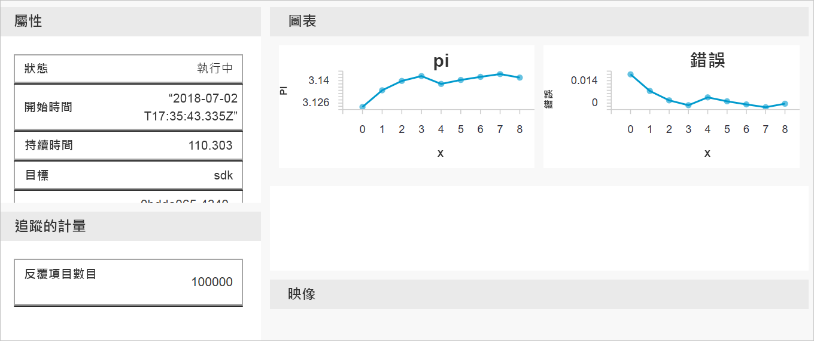

# <a name="quickstart-get-started-with-azure-machine-learning-using-the-cli-extension"></a>快速入門：以 CLI 擴充功能開始使用 Azure Machine Learning

在此快速入門中，您將以機器學習 CLI 擴充功能來開始使用 [Azure Machine Learning 服務](overview-what-is-azure-ml.md) (預覽)。

藉由使用 CLI，您將了解如何：

1. 在您的 Azure 訂用帳戶中建立工作區。 一或多個使用者會使用該工作區來將其計算資源、模型、部署和執行歷程記錄儲存在雲端。
1. 將專案附加到您的工作區。   專案是本機資料夾，其中包含解決機器學習問題的指令碼和設定檔。  
1. 在您的專案中執行會記錄多個反覆項目之間的一些值的 Python 指令碼。
1. 檢視您工作區的執行歷程記錄中所記錄的值。

> [!NOTE]
> 為了方便起見，當下列的 Azure 資源可在區域內取得時，會自動加入至您的工作區：[容器登錄](https://azure.microsoft.com/services/container-registry/)、[儲存體](https://azure.microsoft.com/services/storage/)、[Application Insights](https://azure.microsoft.com/services/application-insights/) 和[金鑰保存庫](https://azure.microsoft.com/services/key-vault/)。

您所建立的資源可用來作為其他 Azure Machine Learning 教學課程和操作說明文章的必要條件。

此 CLI 是以適用於 Azure Machine Learning 服務的 Python 型 <a href="http://aka.ms/aml-sdk" target="_blank">SDK</a> 為基礎而建置。

## <a name="prerequisites"></a>必要條件

請確定您具備下列必要條件，再開始按照快速入門步驟操作：

+ Azure 訂用帳戶。 如果您沒有 Azure 訂用帳戶，請在開始前建立 [免費帳戶](https://azure.microsoft.com/free/?WT.mc_id=A261C142F) 。
+ 已安裝 [Python 3.5 或更新版本](https://www.python.org/)
+ 已安裝 [Azure CLI](https://docs.microsoft.com/cli/azure/install-azure-cli?view=azure-cli-latest)

## <a name="install-the-cli-extension"></a>安裝 CLI 擴充功能

在您的電腦上，開啟命令列編輯器，並將[機器學習服務擴充功能安裝至 Azure CLI](reference-azure-machine-learning-cli.md)。  安裝可能需要幾分鐘才能完成。

```azurecli
az extension add azureml-sdk
```

## <a name="install-the-sdk"></a>安裝 SDK

[!INCLUDE [aml-install-sdk](../../../includes/aml-install-sdk.md)]

## <a name="create-a-resource-group"></a>建立資源群組

資源群組是存放 Azure 方案相關資源的容器。 使用 Azure CLI 來登入 Azure、指定訂用帳戶，以及建立資源群組。

在命令列視窗中，使用 Azure CLI 命令 `az login` 來登入 Azure。 遵循提示以進行互動式登入：
    
   ```azurecli
   az login
   ```

列出可用的 Azure 訂用帳戶，然後指定您要使用的帳戶：
   ```azurecli
   az account list --output table
   az account set --subscription <your-subscription-id>
   az account show
   ```
   其中 \<your-subscription-id\> 是您要使用之訂用帳戶的識別碼值。 請勿包含中括弧。

建立資源群組來保存您的工作區。
在本快速入門中：
   + 資源群組的名稱為 `docs-aml`。
   + 區域為 `eastus2`。 

   ```azurecli
   az group create -n docs-aml -l eastus2
   ```

## <a name="create-a-workspace-and-a-project-folder"></a>建立工作區和專案資料夾

在命令列視窗中，於資源群組下建立 Azure Machine Learning 工作區。


   在本快速入門中：
   + 工作區名稱為 `docs-ws`。
   + 資源群組名稱為 `docs-aml`

   ```azurecli
   az ml workspace create -n docs-ws -g docs-aml
   ```

在命令列視窗中，為您的 Azure Machine Learning 專案在本機電腦上建立資料夾。

   ```
   mkdir docs-prj
   cd docs-prj
   ```

## <a name="create-a-python-script"></a>建立 Python 指令碼

[!INCLUDE [aml-create-script-pi](../../../includes/aml-create-script-pi.md)]

## <a name="run-the-script"></a>執行指令碼

將資料夾附加到工作區作為專案。 `--history` 引數會指定要擷取每次執行的度量之執行歷程記錄檔案的名稱。

   ```azurecli
   az ml project attach --history my_history -w docs-ws -g docs-aml
   ```

在本機電腦上執行指令碼。

   ```azurecli
   az ml run submit -c local pi.py
   ```

   此命令會執行程式碼，並且將網頁連結輸出至主控台。 複製連結並貼上到瀏覽器。

在瀏覽器中，瀏覽至該 URL。 隨即顯示入口網站，其中包含執行的結果。 您可以檢查該次執行的結果或先前執行的結果 (如果有的話)。

只有在 Edge、Chrome 和 Firefox 上才支援入口網站的儀表板。

   

## <a name="clean-up-resources"></a>清除資源

[!INCLUDE [aml-delete-resource-group](../../../includes/aml-delete-resource-group.md)]

## <a name="next-steps"></a>後續步驟
您現在已經建立了開始實驗和部署模型的必要資源。 您也建立了專案、執行指令碼，以及探索指令碼的執行歷程記錄。

如需深入的工作流程體驗，請按照有關建置、定型和部署模型的 Azure Machine Learning 教學課程的步驟來操作。

> [!div class="nextstepaction"]
> [教學課程：建置、定型和部署](tutorial-train-models-with-aml.md)