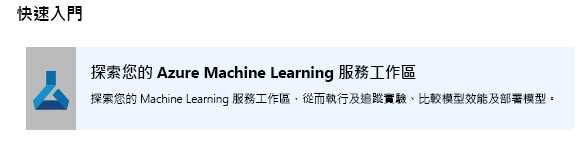
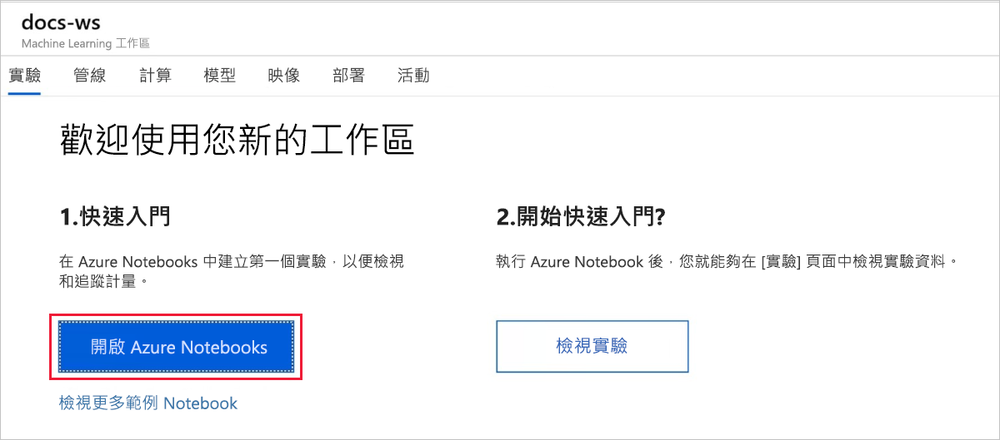
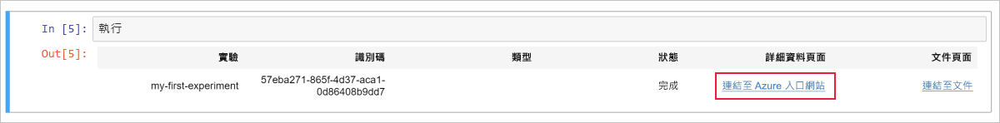
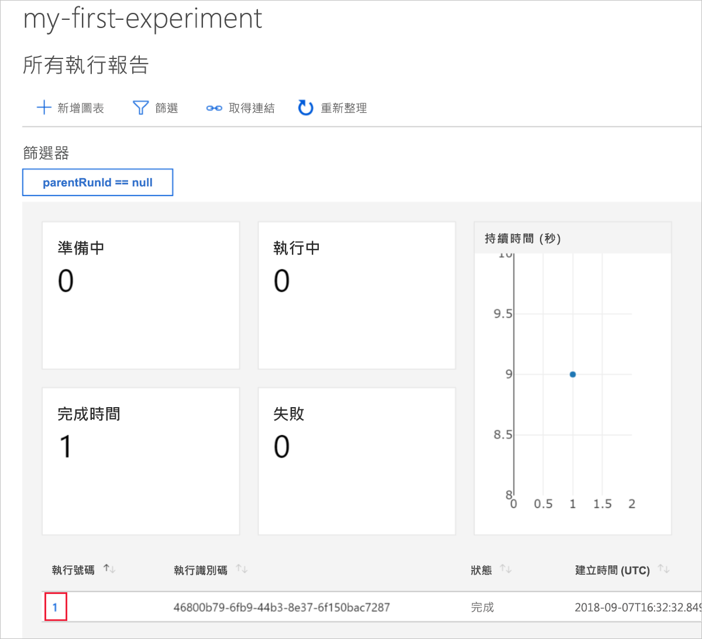
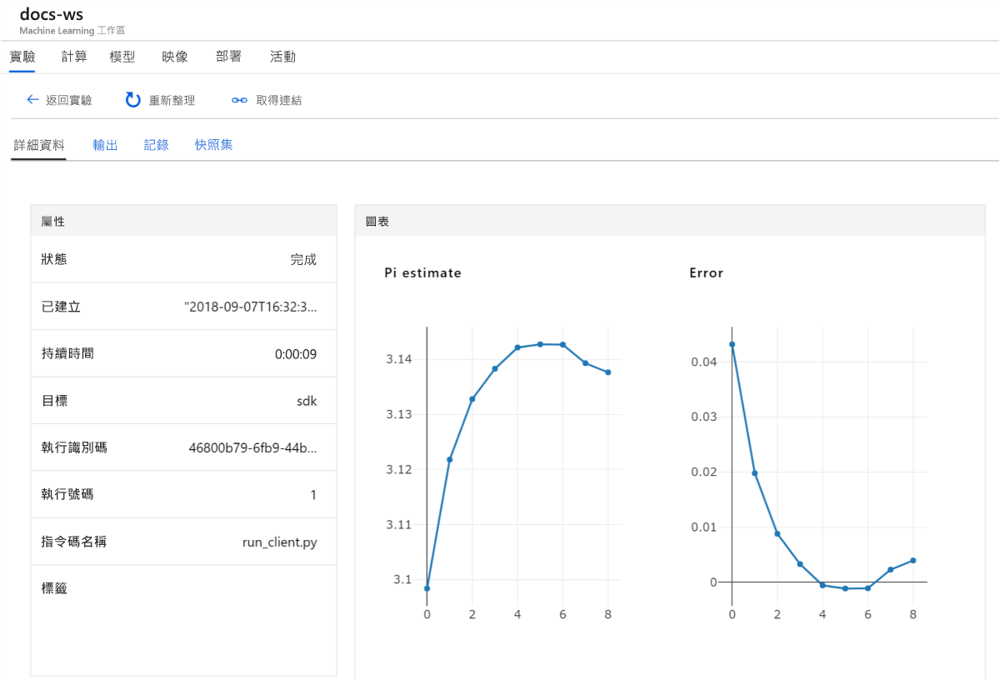

# 快速入門：利用 Azure 入口網站開始使用 Azure Machine Learning

在本快速入門中，您會使用 Azure 入口網站來建立 Azure Machine Learning 工作區。 此工作區是雲端中使用 Machine Learning 來實驗、訓練及部署機器學習模型的基礎區塊。 本快速入門使用雲端資源，因此不需要安裝。 若要改為設定您自己的 Jupyter Notebook 伺服器，請參閱[快速入門：利用 Python 開始使用 Azure Machine Learning](quickstart-create-workspace-with-python.md)。

> [!VIDEO https://www.microsoft.com/en-us/videoplayer/embed/RE2F9Ad]

在本快速入門中，您將：

* 在您的 Azure 訂用帳戶中建立工作區。
* 試著在 Azure Notebook 中使用 Python 並記錄多個反覆項目中的值。
* 在工作區中檢視記錄的值。

下列 Azure 資源可在區域內取得時，就會自動新增至您的工作區：

  - [Azure Container Registry](https://azure.microsoft.com/services/container-registry/)
  - [Azure 儲存體](https://azure.microsoft.com/services/storage/)
  - [Azure Application Insights](https://azure.microsoft.com/services/application-insights/) 
  - [Azure 金鑰保存庫](https://azure.microsoft.com/services/key-vault/)

您所建立的資源可用來作為其他 Machine Learning 服務教學課程和操作說明文章的必要條件。 如同使用其他 Azure 服務，對於與 Machine Learning 相關聯的特定資源有一些限制。 例如，Azure Batch AI 叢集大小。 如需預設限制以及如何增加配額的資訊，請參閱[這篇文章](how-to-manage-quotas.md)。

如果您沒有 Azure 訂用帳戶，請在開始前建立[免費帳戶](https://azure.microsoft.com/free/?WT.mc_id=A261C142F) 。

## 建立工作區 

[!INCLUDE [aml-create-portal](../../../includes/aml-create-in-portal.md)]

在工作區頁面上，選取 `Explore your Azure Machine Learning service workspace`。

 

## 使用工作區

現在會看到工作區如何協助您管理機器學習服務指令碼。 在本節中，您可：

* 在 Azure Notebooks 中開啟 Notebook。
* 執行程式碼來建立一些記錄的值。
* 在工作區中檢視記錄的值。

這個範例示範工作區如何協助您追蹤指令碼中所產生的資訊。 

### 開啟 Notebook 

Azure Notebooks 會為 Jupyter Notebook 提供免費的雲端平台，其會利用您執行 Machine Learning 所需的一切來預先設定。  

選取 `Open Azure Notebooks` 嘗試您的第一個實驗。

 

您的組織可能需要[系統管理員的同意](https://notebooks.azure.com/help/signing-up/work-or-school-account/admin-consent)，您才能登入。

登入之後，即會開啟新索引標籤並出現 `Clone Library` 提示。 選取 `Clone`

### 執行 Notebook

除了兩個 Notebook，您還會看見 `config.json` 檔案。 此組態檔包含您建立的工作區相關資訊。  

選取 `01.run-experiment.ipynb` 來開啟 Notebook。

若要一次執行一個資料格，請使用 `Shift`+`Enter`。 或者選取 `Cells` > `Run All` 來執行整個 Notebook。 當您在資料格旁邊看到 [*] 時，表示它正在執行中。 該資料格的程式碼完成後，就會出現一個數字。 

在 Notebook 中的所有資料格都執行完成後，您可以在工作區中檢視記錄的值。

## 檢視記錄的值

在 Notebook 中執行所有資料格之後，請回到入口網站頁面。  

選取 `View Experiments`。

關閉 `Reports` 快顯。

選取 `my-first-experiment`。

查看您剛執行的執行相關資訊。 向下捲動頁面以找出執行表格。 選取執行號碼連結。

 

您會看到已自動建立所記錄值的繪圖。 每當您使用相同的名稱參數記錄多個值時，系統就會自動為您產生繪圖。

   

用於大致估計 pi 的程式碼會使用隨機值，因此您的圖會顯示不同的值。  

## 清除資源 

[!INCLUDE [aml-delete-resource-group](../../../includes/aml-delete-resource-group.md)]

您也可以保留資源群組，但刪除單一工作區。 顯示工作區屬性，然後選取 [刪除]。

## 後續步驟

您已建立了進行實驗和部署模型所需的資源。 您也在 Notebook 中執行了一些程式碼。 而且在雲端的工作區中探索了該程式碼的執行歷程記錄。

如需深入的工作流程體驗，請按照 Machine Learning 教學課程來定型和部署模型。  

> [!div class="nextstepaction"]
> [教學課程：將影像分類模型定型](tutorial-train-models-with-aml.md)
