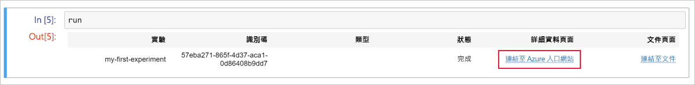
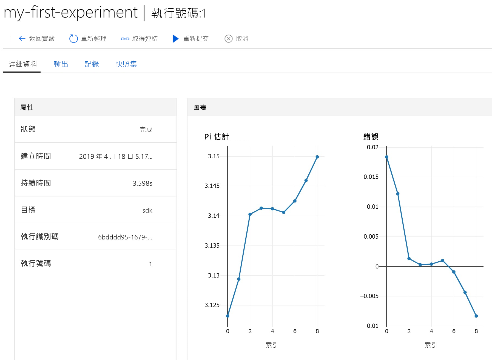

# 快速入門：使用雲端式 Notebook 伺服器開始使用 Azure Machine Learning

建立雲端式 Notebook 伺服器，然後使用它。  在本快速入門中，您會執行 Python 程式碼，以在 [Azure Machine Learning 服務工作區](concept-azure-machine-learning-architecture.md)中記錄值。 此工作區是雲端中使用 Machine Learning 來實驗、訓練及部署機器學習模型的基礎。 

本快速入門示範如何在 Azure Machine Learning 工作區 (已設定執行 Azure Machine Learning 所需的 Python 環境) 中建立雲端資源。 若要改為使用您自己的環境，請參閱[快速入門：使用您自有的 Notebook 伺服器來開始使用 Azure Machine Learning](quickstart-run-local-notebook.md)。  
 
在本快速入門中，您會執行下列動作：

* 在您的工作區中建立新的雲端式 Notebook 伺服器。
* 啟動 Jupyter Web 介面。
* 開啟包含程式碼的 Notebook，以估計每個反覆項目的 pi 和記錄錯誤。
* 執行 Notebook。
* 在工作區中檢視記錄錯誤的值。 這個範例示範工作區如何協助您追蹤指令碼中所產生的資訊。 

如果您沒有 Azure 訂用帳戶，請在開始前先建立一個免費帳戶。 立即試用[免費或付費版本的 Azure Machine Learning 服務](https://aka.ms/AMLFree)。

## 必要條件

- Azure Machine Learning 工作區。  立即[建立您的工作區](setup-create-workspace.md#portal) (如果您沒有工作區)。

## 建立雲端式 Notebook 伺服器

 從您的工作區建立雲端資源，以開始使用 Jupyter Notebook。 這項資源為您提供雲端式平台，其已預先設定執行 Azure Machine Learning 服務所需的一切。

1. 在 [Azure 入口網站](https://portal.azure.com/)中開啟工作區。  如果您不確定如何在入口網站中找出您的工作區，請參閱如何[尋找您的工作區](how-to-manage-workspace.md#view)。

1. 在 Azure 入口網站中您的工作區頁面上，選取左側的 [Notebook VM]。

1. 選取 [+新增] 以建立 Notebook VM。

     

1. 為您的 VM 提供名稱。 然後選取 [建立]。

    > [!NOTE]
    > Notebook 虛擬機器名稱長度必須介於 2 到 16 個字元之間。 有效字元包含字母、數字及 - 字元。  名稱在 Azure 訂用帳戶中必須是唯一的。

    

1. 等待約 4-5 分鐘，直到狀態變更為**執行中**。

## 啟動 Jupyter Web 介面

在您的 VM 執行之後，使用 [Notebook VM] 區段來啟動 Jupyter Web 介面。

1. 在您 VM 的 [URI] 資料行中選取 [Jupyter]。  

    

    此連結會啟動 Notebook 伺服器，並且在新的瀏覽器索引標籤中開啟 Jupyter Notebook 網頁。此連結只適用於建立 VM 的人員。

1. 在 Jupyter Notebook 網頁上，上方的資料夾名稱即為您的使用者名稱。  選取此資料夾。

1. 範例資料夾名稱包含版本號碼，例如 **範例 1.0.33.1**。  選取範例資料夾。

1. 選取**快速入門** Notebook。

## 執行 Notebook

執行 Notebook，以評估 pi 並將錯誤記錄至您的工作區。

1. 選取 **01.run-experiment.ipynb** 以開啟 Notebook。

1. 在第一個程式碼儲存格中按一下，然後選取 [執行]。

    > [!NOTE]
    > 程式碼儲存格的前面有方括號。 如果方括號是空的 (__[  ]__)，則尚未執行程式碼。 執行程式碼時，您會看到一個星號 (__[*]__)。 程式碼完成後，隨即出現一個數字 **[1]**。  此數字會告訴您儲存格的執行順序。
    >
    > 使用 **Shift-Enter** 作為執行儲存格的快速鍵。

    

1. 執行第二個程式碼儲存格。 如果您看到進行驗證的指示，請複製程式碼並遵循連結進行登入。 在您登入後，您的瀏覽器會記住這項設定。  

    

1. 完成時，儲存格編號 __[2]__ 隨即出現。  如果您必須登入，則會看到成功的驗證狀態訊息。   如果您不必登入，則不會看到此儲存格的任何輸出，只會出現顯示儲存格執行成功的數字。

    

1. 執行剩餘的程式碼儲存格。  當每個資料格執行完成時，您會看到其資料格編號出現。 只有最後一個資料格會顯示任何其他輸出。  

    在最大程式碼儲存格中，您會看到 `run.log` 使用於多個地方。 每個 `run.log` 會將其值新增至您的工作區。

## 檢視記錄的值

1. `run` 資料格的輸出包含連回 Azure 入口網站的連結，可讓您在工作區中檢視實驗結果。 

    

1. 按一下 [連結至 Azure 入口網站]，在您的工作區中檢視執行的相關資訊。  此連結會在 Azure 入口網站中開啟您的工作區。

1. 您看到的記錄值繪圖已自動建立於工作區中。 每當您使用相同的名稱參數記錄多個值時，系統就會自動為您產生繪圖。

   

用於大致估計 pi 的程式碼會使用隨機值，因此您的圖會顯示不同的值。  

## 清除資源 

### 停止 Notebook VM

當您不使用 Notebook VM 來降低成本時，請將它停止。  

1. 在您的工作區中，選取 [Notebook VM]。

   

1. 從清單中選取 VM。

1. 選取 [停止]。

1. 當您準備好再次使用伺服器時，請選取 [啟動]。

### 刪除所有內容

[!INCLUDE [aml-delete-resource-group](../../../includes/aml-delete-resource-group.md)]

您也可以保留資源群組，但刪除單一工作區。 顯示工作區屬性，然後選取 [刪除]。

## 後續步驟

在本快速入門中，您已完成下列工作：

* 建立 Notebook 虛擬機器。
* 啟動 Jupyter Web 介面。
* 開啟包含程式碼的 Notebook，以估計每個反覆項目的 pi 和記錄錯誤。
* 執行 Notebook。
* 在工作區中檢視記錄錯誤的值。  這個範例示範工作區如何協助您追蹤指令碼中所產生的資訊。 

在 Jupyter Notebook 網頁的範例資料夾中瀏覽其他 Notebook，進一步了解 Azure Machine Learning 服務。

如需深入的工作流程體驗，請按照 Machine Learning 教學課程來定型和部署模型：  

> [!div class="nextstepaction"]
> [教學課程：將影像分類模型定型](tutorial-train-models-with-aml.md)
