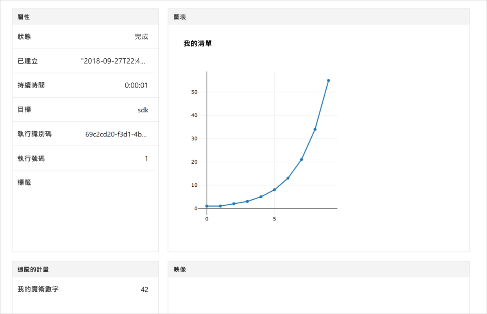

# <a name="quickstart-use-your-own-notebook-server-to-get-started-with-azure-machine-learning"></a>快速入門：使用您自有的 Notebook 伺服器來開始使用 Azure Machine Learning

使用您自有的 Python 環境和 Jupyter Notebook 伺服器，開始使用 Azure Machine Learning 服務。  如需不安裝 SDK 的快速入門，請參閱[快速入門：使用雲端式 Notebook 伺服器開始使用 Azure Machine Learning](quickstart-run-cloud-notebook.md)。

本快速入門顯示您可以如何使用 [Azure Machine Learning 服務工作區](concept-azure-machine-learning-architecture.md)來追蹤您的機器學習實驗。 您將會執行將值記錄到工作區中的 Python 程式碼。

檢視本快速入門的影片版本：

> [!VIDEO https://www.microsoft.com/videoplayer/embed/RE2G9N6]

如果您沒有 Azure 訂用帳戶，請在開始前先建立一個免費帳戶。 立即試用[免費或付費版本的 Azure Machine Learning 服務](https://aka.ms/AMLFree)。

## <a name="prerequisites"></a>必要條件

* 已安裝 Azure Machine Learning SDK 的 Python 3.6 Notebook 伺服器
* Azure Machine Learning 服務工作區
* 工作區設定檔 ( **.azureml/config.json**)。

從[建立 Azure Machine Learning 服務工作區](setup-create-workspace.md#sdk)取得上述所有必要條件。


## <a name="use-the-workspace"></a>使用工作區

在與工作區設定檔 ( **.azureml/config.json**) 相同的目錄中建立指令碼或啟動 Notebook。

### <a name="attach-to-workspace"></a>連結到工作區

此程式碼會從設定檔讀取資訊以連結到工作區。

```
from azureml.core import Workspace

ws = Workspace.from_config()
```

### <a name="log-values"></a>記錄值

執行使用基本 SDK API 的程式碼以追蹤實驗執行。

1. 在工作區中建立實驗。
1. 將單一值記錄到實驗中。
1. 將值清單記錄到實驗中。

[!code-python[](~/aml-sdk-samples/ignore/doc-qa/quickstart-create-workspace-with-python/quickstart.py?name=useWs)]

## <a name="view-logged-results"></a>檢視記錄的值

執行完成時，您可以在 Azure 入口網站中檢視實驗執行。 若要列印會瀏覽至前次執行結果的 URL，請使用下列程式碼：

```python
print(run.get_portal_url())
```

在瀏覽器中，此程式碼會傳回連結供您用來檢視 Azure 入口網站中的記錄值。



## <a name="clean-up-resources"></a>清除資源 

>[!IMPORTANT]
>您可以使用在此處建立的資源，作為其他 Machine Learning 教學課程和操作說明文章的必要條件。

如果您不打算繼續使用您在本文中建立的資源，請加以刪除，以避免產生費用。

[!code-python[](~/aml-sdk-samples/ignore/doc-qa/quickstart-create-workspace-with-python/quickstart.py?name=delete)]

## <a name="next-steps"></a>後續步驟

在本文中，您已建立進行實驗和部署模型所需的資源。 您在 Notebook 中執行了程式碼，並且在雲端的工作區中探索了該程式碼的執行歷程記錄。

> [!div class="nextstepaction"]
> [教學課程：將影像分類模型定型](tutorial-train-models-with-aml.md)

您也可以探索 [GitHub 上更進階的範例](https://aka.ms/aml-notebooks)或檢視 [SDK 使用者指南](https://docs.microsoft.com/python/api/overview/azure/ml/intro?view=azure-ml-py)。
