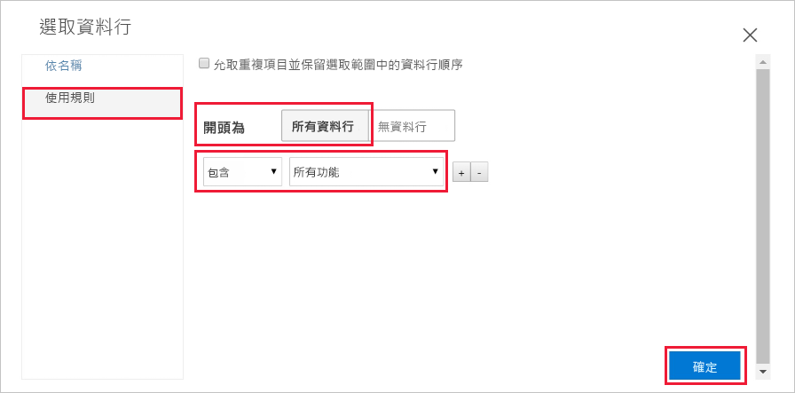
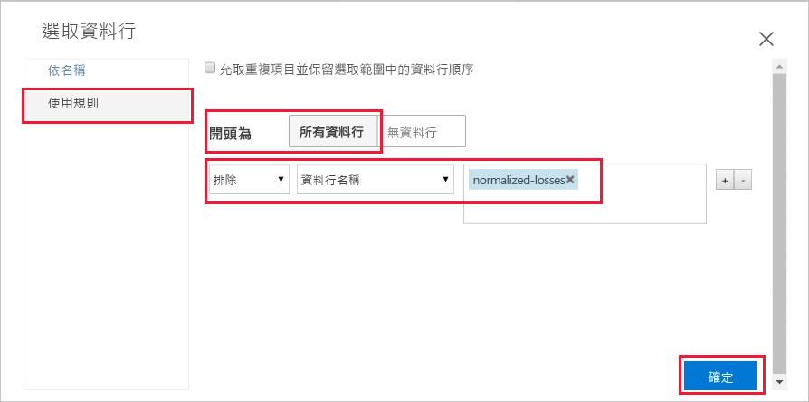
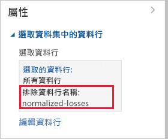
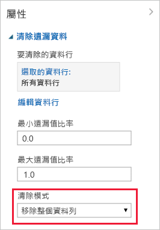

# 快速入門：準備資料並加以視覺化，不需在 Azure Machine Learning 中撰寫程式碼

在具備拖放功能的 Azure Machine Learning 介面中準備資料並加以視覺化。 您將使用的資料包含許多個別汽車的項目，包括製造、模型、技術規格和價格等資訊。  

在本快速入門中，您將瀏覽並準備資料：

- 建立您的第一個實驗以新增和預覽資料
- 移除遺漏的值以準備資料
- 執行實驗
- 將產生的資料視覺化

如果您之前未曾接觸過機器學習，[適用於初學者的資料科學](https://docs.microsoft.com/azure/machine-learning/studio/data-science-for-beginners-the-5-questions-data-science-answers)影片系列將可帶領您認識機器學習。

## 必要條件

如果您沒有 Azure 訂用帳戶，請在開始前先建立一個免費帳戶。 立即試用[免費或付費版本的 Azure Machine Learning 服務](https://aka.ms/AMLFree)。

### 建立工作區

如果您有 Azure Machine Learning 服務工作區，請跳至[下一節](#start)。 否則，請建立此工作區。

[!INCLUDE [aml-create-portal](../../../includes/aml-create-in-portal.md)]

## 開啟視覺化介面網頁

1. 在 [Azure 入口網站](https://portal.azure.com/)中開啟工作區。  

1. 在您的工作區中，選取 [視覺化介面]。  然後，選取 [啟動視覺化介面]。  
 
    

    介面網頁會在新的瀏覽器頁面中開啟。  

## 建立您的第一個實驗

視覺化介面工具提供互動式的視覺化位置，讓您輕鬆建置、測試和反覆運算預測分析模型。 您可以將資料集和分析模組拖放到互動式畫布，將它們連接在一起以構成「實驗」。  現在請建立您的第一個實驗。

1. 在左下角，選取 [新增]。

1. 選取 [空白實驗]。

1. 您的實驗會獲得預設名稱。 選取這段文字，並將其重新命名為「快速入門 - 探索資料」。 此名稱不必是唯一的。

1. 畫面底部的**縮圖**可用來檢視大型實驗。  您在本快速入門中不需使用縮圖，因此請按一下頂端的箭號將其最小化。  

    

## 加入資料

要執行機器學習，首先您必須要有資料。 此介面附有多個範例資料集供您使用，或者，您可以從許多來源匯入資料。 在此範例中，您將使用範例資料集**汽車價格資料 (原始)**。 

1. 實驗畫布左側是資料集和模組的調色盤。 選取 [儲存的資料集]，然後選取 [範例] 以檢視可用的範例資料集。

1. 選取資料集**汽車價格資料 (原始)**，並將其拖曳到畫布上。

   

## Select columns

選取要使用的資料行。  首先，請設定要顯示所有可用資料行的模組。

> [!TIP]
> 如果您知道所需資料或模組的名稱，請使用選擇區頂端的搜尋列以快速尋找。  本快速入門的其餘部分將使用此捷徑。

1. 在 [搜尋] 方塊中輸入**選取**，以尋找**選取資料集中的資料行**模組。

1. 按住**選取資料集中的資料行**，並將其拖曳到畫布上。 將模組放在您先前新增的資料集下。

1. 若要將資料集連線至**選取資料集中的資料行**：按住資料集的輸出連接埠，並拖曳到**選取資料集中的資料行**的輸入連接埠，然後放開滑鼠按鈕。 即使您在畫布上移動資料集或模組，這兩者仍會保持連線。

    > [!TIP]
    > 資料集和模組以小圓圈代表輸入和輸出連接埠，輸入連接埠位在頂端，輸出連接埠在底端。 將某個模組的輸出連接埠連線至另一個模組的輸入連接埠時，您會透過實驗建立資料流程。
    >
    > 如果連線模組時發生問題，請嘗試直接拖曳到您連線的節點中。

     

    紅色驚嘆號標示表示您尚未設定該模組的屬性。 您接下來將執行該作業。
   
1. 選取**選取資料集中的資料行**模組。

1. 在畫布右側的 [屬性] 窗格中，選取 [啟動資料行選取器]。

    在 [選取資料行] 對話方塊中選取 [所有資料行]，並包含 [所有功能]。 對話方塊應該會看起來如下：

     

1. 在右下方選取核取記號 ([確定]) 按鈕，以關閉資料行選取器。

## 執行實驗

您隨時可以按一下資料集或模組的輸出連接埠，以查看資料於該時間點在資料流程中的型態。  如果 [視覺化] 選項已停用，則必須先執行實驗。  您接下來將執行該作業。

[!INCLUDE [aml-ui-create-training-compute](../../../includes/aml-ui-create-training-compute.md)]

有可用的計算目標之後，便會執行實驗。 執行完成時，每個模組上會出現綠色的核取記號。

## 預覽資料

現在您已執行初始實驗，接下來可以將資料視覺化，以深入了解您必須處理的相關資訊。

1. 選取位於**選取資料集中的資料行**底部的輸出連接埠，然後選取 [視覺化]。

1. 按一下 [資料] 視窗中的不同資料行，以檢視該資料行的相關資訊。  

    在此資料集中，每個資料列分別代表一款汽車，而與每款汽車相關聯的變數會顯示為資料行。    此資料集中有 205 個資料列和 26 個資料行。

     每當您按一下資料的資料行時，該資料行的 [統計資料] 資訊和 [視覺效果] 影像就會出現在左側。  例如，當您按一下**車門數**時，您會看到它有 2 個唯一值和 2 個遺漏值。  向下捲動可查看其值：雙門和四門。

     

1. 按一下每個資料行以深入了解您的資料集。

## 準備資料

資料集通常必須先經過某些前置處理，才能進行分析。 您可能已經注意到在各種不同資料列的資料行中有遺漏的值。 必須清除這些遺漏的值，讓模型才能正確地分析資料。 您將移除含有遺漏值的所有資料列。 此外，**自負虧損**資料行含有比例很高的遺漏值，因此您會將該資料行從模型中完全排除。

> [!TIP]
> 在使用大部分的模組時，都必須從輸入資料中清除遺漏值。  

### 移除資料行

首先，完全移除**自負虧損**資料行。

1. 選取**選取資料集中的資料行**模組。

1. 在畫布右側的 [屬性] 窗格中，選取 [啟動資料行選取器]。

    * 保留 [套用規則] 和 [所有資料行] 的選取狀態。

    * 在下拉式清單中，選取 [排除] 和 [資料行名稱]，然後按一下文字方塊內部。 輸入**自負虧損**。

    * 在右下方選取核取記號 ([確定]) 按鈕，以關閉資料行選取器。

    
        
    現在，[選取資料集中的資料行] 的屬性窗格指出它會傳遞資料集中的所有資料行，但 [自負虧損] 除外。
        
    [屬性] 窗格顯示 [自負虧損] 資料行已排除。
        
    
        
    您可以按兩下模組並輸入文字，為模組新增註解。 這有助於您快速檢視模組在您實驗中的執行情況。 

1. 按兩下**選取資料集中的資料行**模組，然後輸入註解「排除自負虧損」。 
    
    輸入註解後，請按一下該模組外部。  此時會出現向下箭號，以顯示該模組包含註解。

1. 按一下向下箭號以顯示註解。

    模組此時會顯示向上箭號以隱藏註解。
        
    

### 清除遺漏的資料

現在，再新增一個將任何含有遺漏資料的其餘資料列移除的模組。

1. 在搜尋方塊中輸入**清除**，以尋找**清除遺漏的資料**模組。

1. 將**清除遺漏的資料**模組拖曳到實驗畫布，然後將其連線至**選取資料集中的資料行**模組。 

1. 在 [屬性] 窗格中，選取 [清除模式] 下方的 [移除整個資料列]。

    這些選項會指示**清除遺漏的資料**藉由移除含任何遺漏值的資料列來清除資料。

1. 按兩下模組，並輸入註解「移除遺漏值資料列」。
 
    

    您的實驗目前看起來如下：
    
    

## 將結果視覺化

由於您對實驗中的模組進行了變更，狀態已變更為 [草稿]。  若要將全新的資料視覺化，您必須先再次執行實驗。

1. 選取底部的 [執行] 以執行實驗。

    這次您可以重複使用先前建立的計算目標。  

1. 在對話方塊中選取 [執行]。

   

1. 執行完成時，以滑鼠右鍵按一下**清除遺漏的資料**模組，將全新的資料視覺化。  

    

1. 按一下 [已清除的資料] 視窗中的不同資料行，以查看資料變更的情形。  

    

    現在有 193 個資料列和 25 個資料行。

    當您按一下**車門數**時，您會看到現在仍有 2 個唯一值，但已沒有遺漏值。  

## 清除資源

[!INCLUDE [aml-ui-cleanup](../../../includes/aml-ui-cleanup.md)]

## 後續步驟

在此快速入門中，您已了解如何：

- 建立您的第一個實驗以新增和預覽資料
- 移除遺漏的值以準備資料
- 將產生的資料視覺化

繼續進行教學課程，以使用這項資料預測汽車的價格。

> [!div class="nextstepaction"]
> [教學課程：透過視覺化介面預測汽車價格](ui-tutorial-automobile-price-train-score.md)
