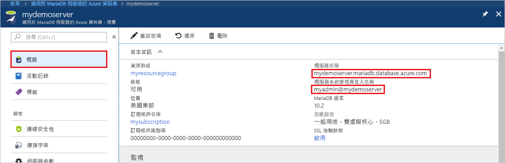
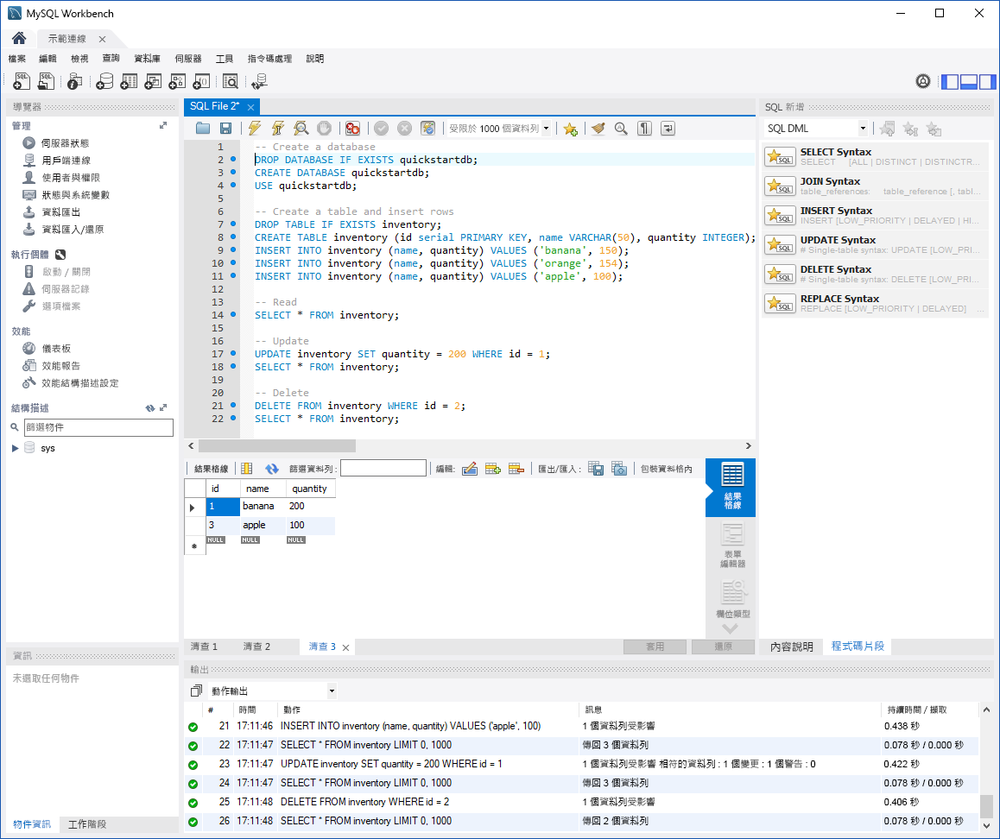

# <a name="azure-database-for-mariadb-use-mysql-workbench-to-connect-and-query-data"></a>適用於 MariaDB 的 Azure 資料庫︰使用 MySQL Workbench 來連線及查詢資料

本快速入門示範如何使用 MySQL Workbench 連線到適用於 MariaDB 的 Azure 資料庫執行個體。 

## <a name="prerequisites"></a>必要條件

本快速入門使用在以下任一指南中建立的資源作為起點：

- [使用 Azure 入口網站建立適用於 MariaDB 的 Azure 資料庫伺服器](./quickstart-create-mariadb-server-database-using-azure-portal.md)
- [使用 Azure CLI 建立適用於 MariaDB 的 Azure 資料庫伺服器](./quickstart-create-mariadb-server-database-using-azure-cli.md)

## <a name="install-mysql-workbench"></a>安裝 MySQL Workbench

[下載 MySQL Workbench](https://dev.mysql.com/downloads/workbench/) 並將其安裝於電腦上。

## <a name="get-connection-information"></a>取得連線資訊

取得連線到適用於 MariaDB 的 Azure 資料庫執行個體所需的連線資訊。 您需要完整的伺服器名稱和登入認證。

1. 登入 [Azure 入口網站](https://portal.azure.com/)。

2. 在 Azure 入口網站的左側功能表中，選取 [所有資源]。 搜尋您所建立的伺服器 (例如 **mydemoserver**)。

3. 選取伺服器名稱。

4. 在伺服器的 [概觀] 頁面上，記下 [伺服器名稱] 和 [伺服器管理員登入名稱] 的值。 如果您忘記密碼，您也可以在此頁面上重設密碼。

 

## <a name="connect-to-the-server-by-using-mysql-workbench"></a>使用 MySQL Workbench 來連線到伺服器

若要使用 MySQL Workbench 連線到適用於 MariaDB 的 Azure 資料庫伺服器：

1.  在電腦上開啟 MySQL Workbench。 

2.  在 [設定新連線] 對話方塊的 [參數] 索引標籤上，輸入下列資訊︰

    | 設定 | 建議的值 | 欄位描述 |
    |---|---|---|
    |   連線名稱 | **示範連線** | 指定此連線的標籤。 |
    | 連線方式 | **標準 (TCP/IP)** | 標準 (TCP/IP) 就足夠了。 |
    | 主機名稱 | 伺服器名稱 | 指定您建立適用於 MariaDB 的 Azure 資料庫執行個體時所使用的伺服器名稱值。 範例伺服器是 **mydemoserver.mariadb.database.azure.com**。 使用完整網域名稱 (\*.mariadb.database.azure.com)，如範例所示。 如果您不記得伺服器名稱，請完成上一節中的步驟以取得連線資訊。  |
    | Port | **3306** | 連線到適用於 MariaDB 的 Azure 資料庫時，請一律使用連接埠 3306。 |
    | 使用者名稱 |  伺服器管理員登入名稱 | 輸入您建立適用於 MariaDB 的 Azure 資料庫執行個體時所使用的伺服器管理員登入使用者名稱。 我們的範例使用者名稱為 **myadmin@mydemoserver**。 如果您不記得伺服器管理員登入名稱，請完成上一節中的步驟以取得連線資訊。 格式為 *username@servername*。
    | 密碼 | *您的密碼* | 若要儲存密碼，請選取 [儲存在保存庫]。 |

    

3.   若要確認所有參數均已正確設定，請選取 [測試連線]。 

4.   選取 [確定] 以儲存連線。 

5.   在 [MySQL 連線] 下方，選取與您的伺服器相對應的圖格。 等候連線建立。

    新的 SQL 索引標籤隨即開啟並出現空白的編輯器，可供您輸入查詢。
    
    > [!NOTE]
    > 依預設將需要 SSL 連線安全性，且會在適用於 MariaDB 的 Azure 資料庫伺服器上強制執行。 一般而言，您雖然不需要對 SSL 憑證進行其他設定，就能讓 MySQL Workbench 連線到您的伺服器，但還是建議您將 SSL CA 憑證繫結到 MySQL Workbench。 如果您需要停用 SSL，請在 Azure 入口網站中的伺服器概觀頁面上，從功能表中選取 [連線安全性]。 針對 [強制執行 SSL 連線]，選取 [已停用]。

## <a name="create-table-and-insert-read-update-and-delete-data"></a>建立資料表，並插入、讀取、更新和刪除資料

1. 將下列範例 SQL 程式碼複製並貼到空白 SQL 索引標籤的頁面中，以說明某些範例資料。

    此程式碼會建立名為 **quickstartdb** 的空白資料庫。 然後，它會建立名為 **inventory** 的範例資料表。 此程式碼會插入一些資料列，然後讀取資料列。 它會使用 update 陳述式進行資料變更，然後再次讀取資料列。 最後，程式碼會刪除資料列，然後再次讀取資料列。
    
    ```sql
    -- Create a database
    -- DROP DATABASE IF EXISTS quickstartdb;
    CREATE DATABASE quickstartdb;
    USE quickstartdb;
    
    -- Create a table and insert rows
    DROP TABLE IF EXISTS inventory;
    CREATE TABLE inventory (id serial PRIMARY KEY, name VARCHAR(50), quantity INTEGER);
    INSERT INTO inventory (name, quantity) VALUES ('banana', 150);
    INSERT INTO inventory (name, quantity) VALUES ('orange', 154);
    INSERT INTO inventory (name, quantity) VALUES ('apple', 100);
    
    -- Read
    SELECT * FROM inventory;
    
    -- Update
    UPDATE inventory SET quantity = 200 WHERE id = 1;
    SELECT * FROM inventory;
    
    -- Delete
    DELETE FROM inventory WHERE id = 2;
    SELECT * FROM inventory;
    ```

    下列螢幕擷取畫面顯示 SQL Workbench 中的 SQL 程式碼範例，及其執行後的輸出：
    
    

2. 若要執行範例 SQL 程式碼，請在 [SQL 檔案] 索引標籤上的工具列中選取閃電圖示。
3. 請注意頁面中間的 [結果方格] 區段中的三個索引標籤式結果。 
4. 請注意頁面底部的 [輸出] 清單。 隨即顯示每個命令的狀態。 

在本快速入門中，您已使用 MySQL Workbench 連線到適用於 MariaDB 的 Azure 資料庫，並使用 SQL 語言查詢資料。

<!--
## Next steps
> [!div class="nextstepaction"]
> [Migrate your database using Export and Import](./concepts-migrate-import-export.md)
-->