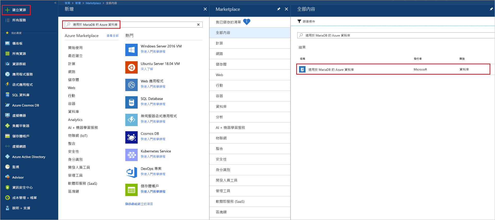
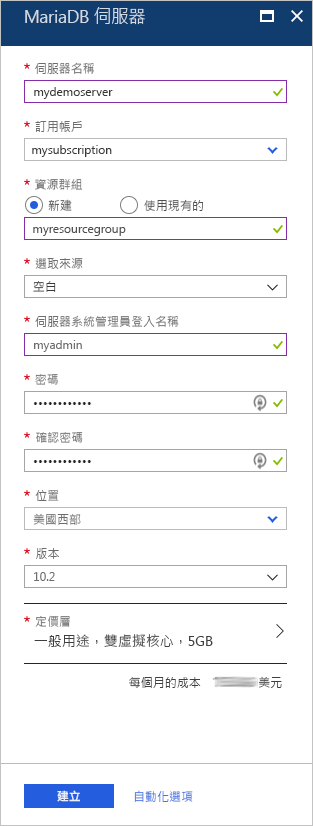
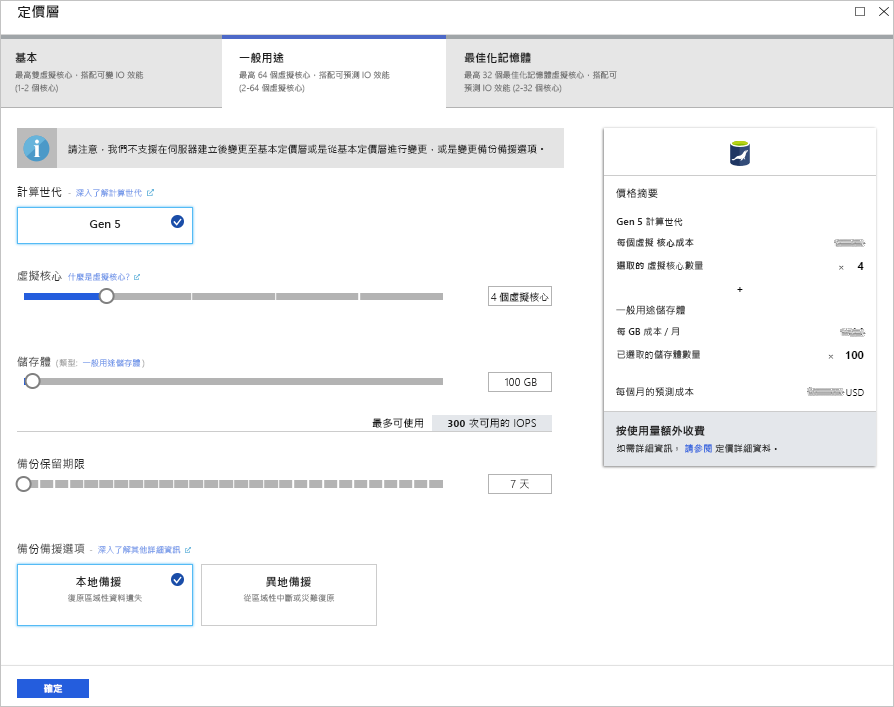
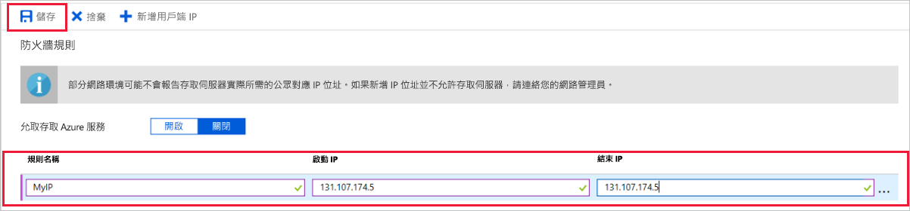
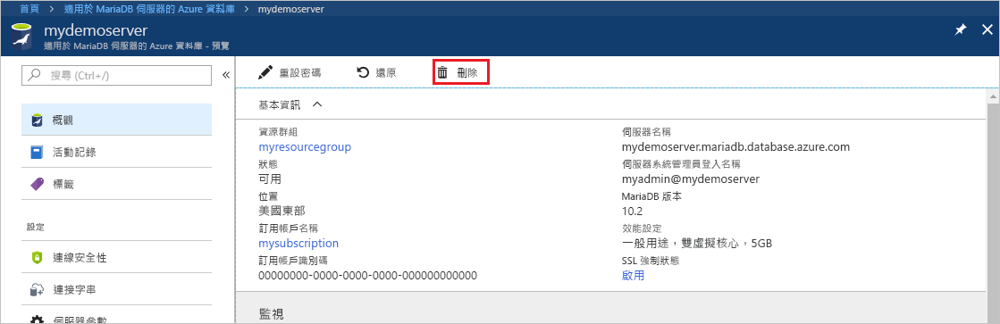

# <a name="create-an-azure-database-for-mariadb-server-by-using-the-azure-portal"></a>使用 Azure 入口網站建立適用於 MariaDB 的 Azure 資料庫伺服器

適用於 MariaDB 的 Azure 資料庫是一個受控服務，您可用來在雲端執行、管理及調整高可用性 MariaDB 資料庫。 本快速入門說明如何使用 Azure 入口網站，在大約五分鐘內建立適用於 MariaDB 的 Azure 資料庫伺服器。  

如果您沒有 Azure 訂用帳戶，請在開始前建立[免費 Azure 帳戶](https://azure.microsoft.com/free/)。

## <a name="sign-in-to-the-azure-portal"></a>登入 Azure 入口網站

在網頁瀏覽器中，移至 [Azure 入口網站](https://portal.azure.com/)。 輸入您的認證來登入此入口網站。 預設檢視是您的服務儀表板。

## <a name="create-an-azure-database-for-mariadb-server"></a>建立適用於 MariaDB 的 Azure 資料庫伺服器

您可使用一組已定義的[計算和儲存體資源](concepts-pricing-tiers.md)來建立適用於 MariaDB 的 Azure 資料庫伺服器。 您可在 [Azure 資源群組](../azure-resource-manager/resource-group-overview.md)內建立伺服器。

若要建立適用於 MariaDB 的 Azure 資料庫伺服器：

1. 選取入口網站左上角的 [建立資源] 按鈕 (+)。

2. 在搜尋方塊中輸入 [適用於 MariaDB 的 Azure 資料庫]，以尋找此服務。

   

3. 輸入或選取下列伺服器詳細資料：
   
   

    設定 | 建議的值 | 說明
    ---|---|---
    伺服器名稱 | 唯一的伺服器名稱 | 選擇可識別適用於 MariaDB 的 Azure 資料庫伺服器的唯一名稱。 例如，**mydemoserver**。 網域名稱 *.mariadb.database.azure.com* 會附加至您輸入的伺服器名稱。 伺服器名稱只能包含小寫字母、數字及連字號 (-) 字元。 它必須包含 3 到 63 個字元。
    訂用帳戶 | *您的訂用帳戶* | 選取您要用於伺服器的 Azure 訂用帳戶。 如果您有多個訂用帳戶，請選擇資源計費的訂用帳戶。
    資源群組 | **myresourcegroup** | 輸入新的資源群組名稱，或選取現有資源群組。 
    選取來源 | 空白 | 選取 [空白]，從頭開始建立新的伺服器。 (如果您要從現有「適用於 MariaDB 的 Azure 資料庫」伺服器的異地備份建立伺服器，請選取 [備份])。
    伺服器管理員登入 | myadmin | 當您連線至伺服器時所要使用的登入帳戶。 系統管理員登入名稱不能是 **azure_superuser**、**admin**、**administrator**、**root**、**guest** 或 **public**。
    密碼 | 您的選擇 | 為伺服器管理帳戶輸入新密碼。 其必須包含 8 到 128 個字元。 您的密碼必須包含下列三個類別的字元：英文大寫字母、英文小寫字母、數字 (0-9) 和非英數字元 (!、$、#、% 等等)。
    確認密碼 | 您的選擇| 確認管理帳戶密碼。
    位置 | 最接近使用者的區域| 選擇最靠近使用者或其他 Azure 應用程式的位置。
    版本 | 最新版本| 最新版本 (除非您有使用不同版本的特定需求)。
    定價層 | 請參閱說明。 | 新伺服器的計算、儲存體和備份組態。 選取 [定價層] > [一般用途]。 保留下列設定的預設值：<br><ul><li>**計算產生** (Gen 5)</li><li>**虛擬核心** (2 個虛擬核心)</li><li>**儲存體** (5 GB)</li><li>**備份保留期限** (7 天)</li></ul><br>若要啟用異地備援儲存體中的伺服器備份，請為 [備份備援選項] 選取 [異地備援]。 <br><br>若要儲存此定價層選取項目，請選取 [確定]。 下方螢幕擷取畫面會擷取這些選取項目。
  
    > [!IMPORTANT]
    > 需要伺服器系統管理員登入以及您在此處指定的密碼，稍後才能在本快速入門中登入伺服器及其資料庫。 請記住或記錄此資訊，以供稍後使用。
    > 

   

4.  選取 [建立] 以佈建伺服器。 佈建作業可能需要多達 20 分鐘的時間。
   
5.  若要監視部署程序，請在工具列上選取 [通知] \(鈴鐺圖示\)。
   
根據預設，您的伺服器底下會建立下列資料庫：**information_schema**、**mysql**、**performance_schema** 和 **sys**。


## <a name="configure-firewall-rule"></a>設定伺服器層級防火牆規則

「適用於 MariaDB 的 Azure 資料庫」服務會在伺服器層級建立防火牆。 此防火牆會防止外部應用程式和工具連線到伺服器或伺服器上的任何資料庫，除非已建立防火牆規則以針對特定的 IP 位址開啟防火牆。 

若要建立伺服器層級防火牆規則：

1.   部署完成時，找出您的伺服器。 如有需要，您可以搜尋它。 例如，在左側功能表中，選取 [所有資源]。 然後，輸入伺服器名稱。 例如，輸入 **mydemoserver** 以搜尋新建立的伺服器。 從搜尋結果清單中選取伺服器名稱。 伺服器的 [概觀] 頁面隨即開啟。 您可以變更此頁面上的其他設定。

2. 在伺服器概觀頁面上，選取 [連線安全性]。

3.  在 [防火牆規則] 之下，選取 [規則名稱] 欄中的空白文字方塊，開始建立防火牆規則。 指定將連線到這部伺服器的用戶端所屬的精確 IP 範圍。
   
   

4. 在 [連線安全性] 頁面的工具列上，選取 [儲存]。 等到您看到指出更新已成功完成的通知，再繼續進行。 

   > [!NOTE]
   > 適用於 MariaDB 的 Azure 資料庫連線會透過連接埠 3306 進行通訊。 如果您嘗試從公司網路內部進行連線，可能不允許透過連接埠 3306 的輸出流量。 在此情況下，若要連線到伺服器，IT 部門必須開啟連接埠 3306。
   > 

## <a name="get-connection-information"></a>取得連線資訊

若要連線到您的資料庫伺服器，您需要完整伺服器名稱和系統管理員登入認證。 您稍早可能已在本文中記下這些值。 若未這麼做，您可以從 Azure 入口網站的伺服器 [概觀] 頁面或 [屬性] 頁面輕鬆尋找伺服器名稱和登入資訊：

1. 移至伺服器的 [概觀] 頁面。 記下 [伺服器名稱] 和 [伺服器管理員登入名稱] 的值。 

2. 若要複製這些值，請將游標置於您想要複製的欄位上。 複製圖示會出現在文字右邊。 視需要選取複製圖示來複製值。

在我們的範例中，伺服器名稱為 **mydemoserver.mariadb.database.azure.com**，而伺服器管理員登入名稱為 **myadmin@mydemoserver**。

## <a name="connect-to-azure-database-for-mariadb-by-using-the-mysql-command-line"></a>使用 mysql 命令列連線到適用於 MariaDB 的 Azure 資料庫

您可以使用各種應用程式來連線到適用於 MariaDB 的 Azure 資料庫伺服器。

首先，我們會使用 [mysql](https://dev.mysql.com/doc/refman/5.7/en/mysql.html) 命令列工具來說明如何連線到該伺服器。 您也可以使用網頁瀏覽器和 Azure Cloud Shell，而不需安裝軟體。 如果您已在本機安裝 mysql 公用程式，您也可以從該處進行連線。

1. 透過 Azure 入口網站右上方工具列的終端機圖示 (**>_**) 啟動 Azure Cloud Shell。


2.  Azure Cloud Shell 隨即在瀏覽器中開啟。 您可以在 Cloud Shell 中使用 Bash 殼層命令。

   

3. 在 Cloud Shell 提示字元上，輸入 mysql 命令列以連線到適用於 MariaDB 的 Azure 資料庫伺服器。

    若要使用 mysql 公用程式連線到適用於 MariaDB 的 Azure 資料庫伺服器，請使用下列格式：

    ```bash
    mysql --host <fully qualified server name> --user <server admin login name>@<server name> -p
    ```

    例如，下列命令會連線至我們的範例伺服器：

    ```azurecli-interactive
    mysql --host mydemoserver.mariadb.database.azure.com --user myadmin@mydemoserver -p
    ```

    mysql 參數 |建議的值|說明
    ---|---|---
    --host | 伺服器名稱 | 您建立適用於 MariaDB 的 Azure 資料庫伺服器時所使用的伺服器名稱值。 範例伺服器是 **mydemoserver.mariadb.database.azure.com**。 使用如範例所示的完整網域名稱 (**\*.mariadb.database.azure.com**)。 如果您不記得伺服器名稱，請完成上一節中的步驟以取得連線資訊。
    --user | 伺服器管理員登入名稱 |您建立適用於 MariaDB 的 Azure 資料庫伺服器時所使用的伺服器管理員登入使用者名稱。 如果您不記得使用者名稱，請完成上一節中的步驟以取得連線資訊。 格式為 *username@servername*。
    -p | 您的密碼<br>(等到出現提示為止) |出現提示時，輸入您用來建立伺服器的密碼。 輸入的密碼字元不會顯示在 bash 提示字元上。 輸入密碼後，請按 Enter 鍵。

   連線到 mysql 公用程式時，它會顯示 `mysql>` 提示字元。 您可以在提示字元中輸入命令。 

   以下是 mysql 輸出範例：

    ```bash
    Welcome to the MySQL monitor.  Commands end with ; or \g.
    Your MySQL connection id is 65505
    Server version: 5.6.39.0 MariaDB Server
    
    Copyright (c) 2000, 2017, Oracle and/or its affiliates. All rights reserved.
    
    Oracle is a registered trademark of Oracle Corporation and/or its
    affiliates. Other names may be trademarks of their respective
    owners.

    Type 'help;' or '\h' for help. Type '\c' to clear the current input statement.
    
    mysql>
    ```
    
    > [!TIP]
    > 如果未將防火牆設定為允許 Azure Cloud Shell 的 IP 位址，就會發生下列錯誤：
    >
    >   ERROR 2003 (28000)：不允許 IP 位址為 123.456.789.0 的用戶端存取伺服器。
    >
    > 若要解決此錯誤，請確定伺服器組態符合[設定伺服器層級防火牆規則](#configure-firewall-rule)所述的步驟。

4. 若要驗證連線，請在 `mysql>` 提示字元輸入**狀態**來檢查伺服器狀態。

    ```sql
    status
    ```

   > [!TIP]
   > 如需其他命令，請參閱 [MySQL 5.7 參考手冊 - 第 4.5.1 章](https://dev.mysql.com/doc/refman/5.7/en/mysql.html)。

5.  在 `mysql>` 提示字元輸入下列命令以建立空白的資料庫︰

    ```sql
    CREATE DATABASE quickstartdb;
    ```
    此命令可能需要幾分鐘才能完成。 

    您可以在適用於 MariaDB 的 Azure 資料庫伺服器上建立一或多個資料庫。 您可以在每個伺服器建立單一資料庫以利用所有資源，也可以建立多個資料庫來共用資源。 您可以建立的資料庫數目沒有限制，但多個資料庫會共用相同的伺服器資源。 

6. 若要列出資料庫，請在 `mysql>` 提示字元輸入下列命令︰

    ```sql
    SHOW DATABASES;
    ```

7.  輸入 **\q**，然後按 Enter 來關閉 mysql 工具。 然後，您就可以關閉 Azure Cloud Shell。

您已連線到適用於 MariaDB 的 Azure 資料庫伺服器，並已建立空的使用者資料庫。 在下一節中，您會使用其他常見工具 (MySQL Workbench) 連線到相同的伺服器。

## <a name="connect-to-the-server-by-using-mysql-workbench"></a>使用 MySQL Workbench 來連線到伺服器

若要使用 MySQL Workbench 來連線到伺服器：

1. 開啟用戶端電腦上的 MySQL Workbench。 若要下載並安裝 MySQL Workbench，請移至[下載 MySQL Workbench](https://dev.mysql.com/downloads/workbench/)。

2. 若要建立新的連線，請選取 [MySQL 連線] 標題旁邊的加號圖示 (**+**)。

3. 在 [設定新連線] 對話方塊的 [參數] 索引標籤上，輸入伺服器連線資訊。 預留位置值會顯示為範例。 以您自己的值來取代 [主機名稱]、[使用者名稱] 和 [密碼]。

   

    |設定 |建議的值|欄位描述|
    |---|---|---|
     連接名稱 | **示範連線** | 此連線的標籤。 |
    連線方式 | **標準 (TCP/IP)** | 標準 (TCP/IP) 就足夠了。 |
    主機名稱 | 伺服器名稱 | 您建立適用於 MariaDB 的 Azure 資料庫伺服器時所使用的伺服器名稱值。 範例伺服器是 **mydemoserver.mariadb.database.azure.com**。 使用如範例所示的完整網域名稱 (**\*.mariadb.database.azure.com**)。 如果您不記得伺服器名稱，請完成本文稍早的步驟以取得連線資訊。|
     Port | 3306 | 連線至適用於 MariaDB 的 Azure 資料庫伺服器時所要使用的連接埠。 |
    使用者名稱 |  伺服器管理員登入名稱 | 您建立適用於 MariaDB 的 Azure 資料庫伺服器時所使用的伺服器管理員登入資訊。 我們的範例使用者名稱為 **myadmin@mydemoserver**。 如果您不記得使用者名稱，請完成本文稍早的步驟以取得連線資訊。 格式為 *username@servername*。
    密碼 | 您的密碼 | 若要儲存密碼，請選取 [儲存在保存庫]。 |

4. 若要確認所有參數均已正確設定，請選取 [測試連線]。 然後選取 [確定] 可儲存連線。 

    > [!NOTE]
    > 伺服器上預設會強制執行 SSL。 其需要額外設定才能成功連線。 如需詳細資訊，請參閱[在您的應用程式中設定 SSL 連線能力，以安全地連線至適用於 MariaDB 的 Azure 資料庫](./howto-configure-ssl.md)。 若要在本快速入門停用 SSL，請在 Azure 入口網站中的伺服器概觀頁面上，選取功能表中的 [連線安全性]。 針對 [強制執行 SSL 連線]，選取 [已停用]。
    >

## <a name="clean-up-resources"></a>清除資源

您有兩種方式可以清除您在本快速入門中建立的資源。 您可以刪除 [Azure 資源群組](../azure-resource-manager/resource-group-overview.md)。 此選項會連帶刪除資源群組內的所有資源。 如果您想要讓其他資源保持不變，只要刪除一個伺服器資源。

> [!TIP]
> 此集合中的其他快速入門會以本快速入門為基礎。 如果您打算繼續進行「適用於 MariaDB 的 Azure 資料庫」快速入門，請勿清除您在此快速入門中建立的資源。 如果您不打算繼續，請使用下列步驟，刪除您在本快速入門中建立的所有資源。
>

若要刪除整個資源群組 (包括新建立的伺服器)：

1.  在 Azure 入口網站中找出資源群組。 在左側功能表上，選取 [資源群組]，然後選取資源群組名稱 (在我們的範例中為 **myresourcegroup**)。

2.  在資源群組頁面上，選取 [刪除]。 然後，輸入資源群組名稱 (在我們的範例中為 **myresourcegroup**)，以確認刪除。 選取 [刪除] 。

若要刪除新建立的伺服器：

1.  在 Azure 入口網站中找出伺服器 (如果您尚未將它開啟)。 在左側功能表中，選取 [所有資源]。 然後搜尋您所建立的伺服器。

2.  在 [概觀] 頁面上，按一下 [刪除]。 

   

3.  確認您想要刪除的伺服器名稱。 顯示其下將會受到刪除影響的資料庫。 輸入伺服器名稱 (在我們的範例中為 **mydemoserver**) 以確認刪除。 選取 [刪除] 。

## <a name="next-steps"></a>後續步驟

- [設計您的第一個「適用於 MariaDB 的 Azure 資料庫」資料庫](./tutorial-design-database-using-portal.md)
