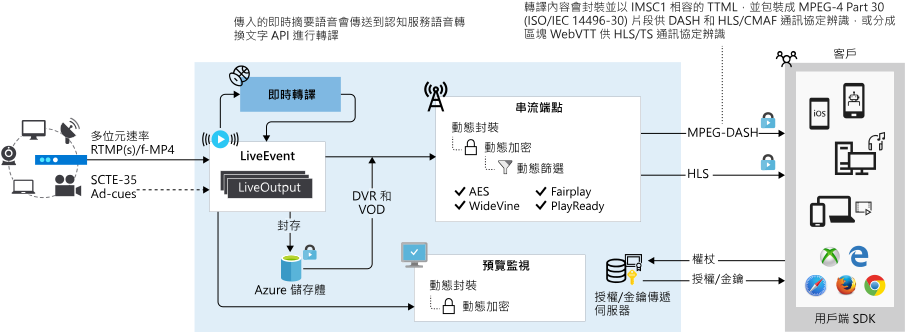

# <a name="dynamic-packaging"></a>動態封裝

Microsoft Azure Media Services 可用來針對數種用戶端技術 (例如 iOS 和 XBOX) 提供許多媒體來源檔案格式、媒體串流格式和內容保護格式。 這些用戶端各自使用不同的通訊協定，例如 iOS 需要 HTTP 即時串流 (HLS) 格式，而 Silverlight 與 Xbox 需要 Smooth Streaming。 如果您有一組調適性位元速率 （多位元速率） MP4 (ISO Base Media 14496-12) 檔案或一組調適性位元速率 Smooth Streaming 檔案，您想要提供給 HLS、 MPEG DASH 或 Smooth Streaming 的用戶端，您可以利用**動態封裝**。 封裝是無從驗證的視訊解析度、 支援 SD/HD/UHD-4 個。

在 Media Services[串流端點](streaming-endpoint-concept.md)代表可以直接向用戶端播放器應用程式，使用其中一種常見的資料流提供即時與隨選內容的動態 (-just-in-time) 封裝與原始服務媒體通訊協定 （HLS 或 DASH）。 動態封裝是一項功能在所有的標準**串流端點**（Standard 或 Premium）。 

善用**動態封裝**，您必須能夠**資產**與一組調適性位元速率 MP4 檔案和串流處理媒體服務動態封裝所需的組態檔。 取得這些檔案的方法之一，是使用媒體服務編碼您的夾層 (來源) 檔案。 若要讓影片中編碼的資產可供用戶端播放，您必須建立**串流定位器**並建置串流 Url。 然後，根據串流用戶端資訊清單 （HLS、 DASH 或 Smooth） 中指定的格式，您收到資料流中您所選擇的通訊協定。

因此，您只需要儲存及支付一種儲存格式之檔案的費用，媒體服務會根據用戶端的要求建置及提供適當的回應。 

在 Media Services 會使用動態封裝，是否您串流處理實況或點播。 

> [!NOTE]
> 目前您無法使用 Azure 入口網站管理 v3 資源。 請使用 [REST API](https://aka.ms/ams-v3-rest-ref)、[CLI](https://aka.ms/ams-v3-cli-ref) 或其中一個支援的 [SDK](media-services-apis-overview.md#sdks)。

## <a name="common-on-demand-workflow"></a>常見的依需求工作流程

以下是常見的媒體服務，串流工作流程使用動態封裝的位置。

1. 上傳輸入檔案 (稱為夾層檔)。 比方說，MP4、 MOV 或 MXF (如需支援格式清單，請參閱[媒體編碼器標準所支援的格式](media-encoder-standard-formats.md)。
2. 將夾層檔編碼為 H.264 MP4 自動調整位元速率集。
3. 發佈包含自適性位元速率 MP4 集的資產。 建立您發佈**串流定位器**。
4. 建立以不同格式 （HLS、 Dash 和 Smooth Streaming） 為目標的 Url。 **串流端點**會負責正確的資訊清單和這些不同的格式的要求提供服務。

下圖顯示使用動態封裝工作流程上隨選資料流。


### <a name="encode-to-adaptive-bitrate-mp4s"></a>編碼為調適性位元速率 mp4

如需[如何使用媒體服務將視訊編碼](encoding-concept.md)，請參閱下列範例：

* [從使用內建的預先設定的 HTTPS URL 編碼](job-input-from-http-how-to.md)
* [將本機檔案，使用內建的預設編碼](job-input-from-local-file-how-to.md)
* [建置自訂預設值為目標的特定案例或裝置需求](customize-encoder-presets-how-to.md)

如需媒體編碼器標準格式和轉碼器的清單，請參閱[格式和轉碼器](media-encoder-standard-formats.md)

## <a name="common-live-streaming-workflow"></a>常見即時串流工作流程

即時串流工作流程的步驟如下：

1. 建立 [即時事件](live-events-outputs-concept.md)。
1. 取得內嵌 URL，並設定您的內部部署編碼器，以使用 URL 來傳送發佈摘要。
1. 取得預覽 URL 並使用它來確認實際上已收到來自編碼器的輸入。
1. 建立新**資產**。
1. 建立 [即時輸出]  並使用您建立的資產名稱。<br/>**實況輸出**會將資料流封存到**資產**中。
1. 使用內建的**串流原則**類型來建立**串流定位器**。<br/>若您想要將內容加密，請檢閱[內容保護概觀](content-protection-overview.md)。
1. 列出**串流定位器**上的路徑，以取回要使用的 URL。
1. 取得您想要串流的來源**串流端點**主機名稱。
1. 建立以不同格式 （HLS、 Dash 和 Smooth Streaming） 為目標的 Url。 **串流端點**會負責正確的資訊清單和這些不同的格式的要求提供服務。

即時的事件可以是下列其中一種： 傳遞和即時編碼。 如需媒體服務 v3 中的即時資料流的詳細資訊，請參閱[即時串流概觀](live-streaming-overview.md)。

下圖顯示即時串流搭配動態封裝工作流程。



## <a name="delivery-protocols"></a>傳遞通訊協定

|Protocol|範例|
|---|---|
|HLS V4 |`https://amsv3account-usw22.streaming.media.azure.net/21b17732-0112-4d76-b526-763dcd843449/ignite.ism/manifest(format=m3u8-aapl)`|
|HLS V3 |`https://amsv3account-usw22.streaming.media.azure.net/21b17732-0112-4d76-b526-763dcd843449/ignite.ism/manifest(format=m3u8-aapl-v3)`|
|HLS CMAF| `https://amsv3account-usw22.streaming.media.azure.net/21b17732-0112-4d76-b526-763dcd843449/ignite.ism/manifest(format=m3u8-cmaf)`|
|MPEG DASH CSF| `https://amsv3account-usw22.streaming.media.azure.net/21b17732-0112-4d76-b526-763dcd843449/ignite.ism/manifest(format=mpd-time-csf)` |
|MPEG DASH CMAF|`https://amsv3account-usw22.streaming.media.azure.net/21b17732-0112-4d76-b526-763dcd843449/ignite.ism/manifest(format=mpd-time-cmaf)` |
|Smooth Streaming| `https://amsv3account-usw22.streaming.media.azure.net/21b17732-0112-4d76-b526-763dcd843449/ignite.ism/manifest`|

## <a name="video-codecs-supported-by-dynamic-packaging"></a>支援的動態封裝的視訊轉碼器

動態封裝支援 MP4 檔案，其中包含以編碼的視訊[H.264](https://en.m.wikipedia.org/wiki/H.264/MPEG-4_AVC) （mpeg-4 AVC 或 AVC1） [H.265](https://en.m.wikipedia.org/wiki/High_Efficiency_Video_Coding) (HEVC，hev1 或 hvc1)。

## <a name="audio-codecs-supported-by-dynamic-packaging"></a>動態封裝支援的音訊轉碼器

### <a name="mp4-files-support"></a>MP4 檔案支援

動態封裝支援包含以編碼的音訊的 MP4 檔案 

* [AAC](https://en.wikipedia.org/wiki/Advanced_Audio_Coding) (AAC-LC、 HE-AAC v1、 HE-AAC v2)
* [Dolby Digital Plus](https://en.wikipedia.org/wiki/Dolby_Digital_Plus)（增強 ac-3 或 E-AC3）
* Dolby Atmos
   
   適用於標準，例如 MPEG DASH 通訊協定，與一般串流格式 (CSF) 或一般媒體應用程式格式 (CMAF) 分散的 MP4，並透過 HTTP Live Streaming (HLS) 與 CMAF 支援 Dolby Atmos 內容的串流。

* [DTS](https://en.wikipedia.org/wiki/DTS_%28sound_system%29)

    DTS 轉碼器支援的 DASH CSF、 DASH CMAF、 HLS-M2TS 和 HLS CMAF 封裝格式如下：  

    * DTS 數位範圍陳述式 (dtsc)
    * DTS HD 高解析度和 DTS HD Master 音訊 (dtsh)
    * DTS Express (dtse)
    * DTS HD 不失真 （沒有核心） (dtsl)

### <a name="hls-support"></a>HLS 支援

動態封裝支援 HLS (第 4 版或更新版本) 有多個具有多個轉碼器和語言的音訊資料軌的資產。

### <a name="not-supported"></a>不支援

動態封裝不支援包含 [Dolby Digital](https://en.wikipedia.org/wiki/Dolby_Digital) (AC3) 音訊的檔案 (它是舊版的轉碼器)。

## <a name="dynamic-encryption"></a>動態加密

**動態加密**可讓您動態加密您的即時或點播內容，使用 AES-128 或三個主要數位版權管理 (DRM) 系統中任一個：Microsoft PlayReady、Google Widevine 和 Apple FairPlay。 媒體服務也提供服務，可傳遞 AES 金鑰和 DRM (PlayReady、Widevine 和 FairPlay) 授權給授權用戶端。 如需詳細資訊，請參閱 <<c0> [ 動態加密](content-protection-overview.md)。

## <a name="manifests"></a>資訊清單 
 
媒體服務支援 HLS、 MPEG DASH、 Smooth Streaming 通訊協定。 做為一部分**動態封裝**，串流用戶端資訊清單 （HLS 主要播放清單、 DASH Media Presentation Description (MPD)，和 Smooth Streaming） 動態產生的 URL 中的格式選取器為基礎。 請參閱中的傳遞通訊協定[本節](#delivery-protocols)。 

資訊清單檔案包含資料流中繼資料，例如： 追蹤類型 （音訊、 視訊或文字），追蹤名稱、 開始和結束時間、 位元速率 （品質）、 軌語言、 簡報視窗 （持續時間固定的滑動視窗） 中，視訊轉碼器 (FourCC)。 此檔案也會透過提供下一個可播放視訊片段及其位置的相關資訊，來指示播放程式擷取下一個片段。 片段 (或區段) 實際上是視訊內容的「區塊」。

### <a name="hls-master-playlist"></a>HLS 主要播放清單

以下是 HLS 資訊清單檔案的範例： 

```
#EXTM3U
#EXT-X-VERSION:4
#EXT-X-MEDIA:TYPE=AUDIO,GROUP-ID="audio",NAME="aac_eng_2_128041_2_1",LANGUAGE="eng",DEFAULT=YES,AUTOSELECT=YES,URI="QualityLevels(128041)/Manifest(aac_eng_2_128041_2_1,format=m3u8-aapl)"
#EXT-X-STREAM-INF:BANDWIDTH=536608,RESOLUTION=320x180,CODECS="avc1.64000d,mp4a.40.2",AUDIO="audio"
QualityLevels(381048)/Manifest(video,format=m3u8-aapl)
#EXT-X-I-FRAME-STREAM-INF:BANDWIDTH=536608,RESOLUTION=320x180,CODECS="avc1.64000d",URI="QualityLevels(381048)/Manifest(video,format=m3u8-aapl,type=keyframes)"
#EXT-X-STREAM-INF:BANDWIDTH=884544,RESOLUTION=480x270,CODECS="avc1.640015,mp4a.40.2",AUDIO="audio"
QualityLevels(721495)/Manifest(video,format=m3u8-aapl)
#EXT-X-I-FRAME-STREAM-INF:BANDWIDTH=884544,RESOLUTION=480x270,CODECS="avc1.640015",URI="QualityLevels(721495)/Manifest(video,format=m3u8-aapl,type=keyframes)"
#EXT-X-STREAM-INF:BANDWIDTH=1327398,RESOLUTION=640x360,CODECS="avc1.64001e,mp4a.40.2",AUDIO="audio"
QualityLevels(1154816)/Manifest(video,format=m3u8-aapl)
#EXT-X-I-FRAME-STREAM-INF:BANDWIDTH=1327398,RESOLUTION=640x360,CODECS="avc1.64001e",URI="QualityLevels(1154816)/Manifest(video,format=m3u8-aapl,type=keyframes)"
#EXT-X-STREAM-INF:BANDWIDTH=2413312,RESOLUTION=960x540,CODECS="avc1.64001f,mp4a.40.2",AUDIO="audio"
QualityLevels(2217354)/Manifest(video,format=m3u8-aapl)
#EXT-X-I-FRAME-STREAM-INF:BANDWIDTH=2413312,RESOLUTION=960x540,CODECS="avc1.64001f",URI="QualityLevels(2217354)/Manifest(video,format=m3u8-aapl,type=keyframes)"
#EXT-X-STREAM-INF:BANDWIDTH=3805760,RESOLUTION=1280x720,CODECS="avc1.640020,mp4a.40.2",AUDIO="audio"
QualityLevels(3579827)/Manifest(video,format=m3u8-aapl)
#EXT-X-I-FRAME-STREAM-INF:BANDWIDTH=3805760,RESOLUTION=1280x720,CODECS="avc1.640020",URI="QualityLevels(3579827)/Manifest(video,format=m3u8-aapl,type=keyframes)"
#EXT-X-STREAM-INF:BANDWIDTH=139017,CODECS="mp4a.40.2",AUDIO="audio"
QualityLevels(128041)/Manifest(aac_eng_2_128041_2_1,format=m3u8-aapl)
```

### <a name="dash-media-presentation-description-mpd"></a>DASH 媒體呈現描述 (MPD)

DASH 資訊清單的範例如下：

```xml
<?xml version="1.0" encoding="UTF-8"?>
<MPD xmlns="urn:mpeg:dash:schema:mpd:2011" xmlns:xsi="https://www.w3.org/2001/XMLSchema-instance" profiles="urn:mpeg:dash:profile:isoff-live:2011" type="static" mediaPresentationDuration="PT1M10.315S" minBufferTime="PT7S">
   <Period>
      <AdaptationSet id="1" group="5" profiles="ccff" bitstreamSwitching="false" segmentAlignment="true" contentType="audio" mimeType="audio/mp4" codecs="mp4a.40.2" lang="en">
         <SegmentTemplate timescale="10000000" media="QualityLevels($Bandwidth$)/Fragments(aac_eng_2_128041_2_1=$Time$,format=mpd-time-csf)" initialization="QualityLevels($Bandwidth$)/Fragments(aac_eng_2_128041_2_1=i,format=mpd-time-csf)">
            <SegmentTimeline>
               <S d="60160000" r="10" />
               <S d="41386666" />
            </SegmentTimeline>
         </SegmentTemplate>
         <Representation id="5_A_aac_eng_2_128041_2_1_1" bandwidth="128041" audioSamplingRate="48000" />
      </AdaptationSet>
      <AdaptationSet id="2" group="1" profiles="ccff" bitstreamSwitching="false" segmentAlignment="true" contentType="video" mimeType="video/mp4" codecs="avc1.640020" maxWidth="1280" maxHeight="720" startWithSAP="1">
         <SegmentTemplate timescale="10000000" media="QualityLevels($Bandwidth$)/Fragments(video=$Time$,format=mpd-time-csf)" initialization="QualityLevels($Bandwidth$)/Fragments(video=i,format=mpd-time-csf)">
            <SegmentTimeline>
               <S d="60060000" r="10" />
               <S d="42375666" />
            </SegmentTimeline>
         </SegmentTemplate>
         <Representation id="1_V_video_1" bandwidth="3579827" width="1280" height="720" />
         <Representation id="1_V_video_2" bandwidth="2217354" codecs="avc1.64001F" width="960" height="540" />
         <Representation id="1_V_video_3" bandwidth="1154816" codecs="avc1.64001E" width="640" height="360" />
         <Representation id="1_V_video_4" bandwidth="721495" codecs="avc1.640015" width="480" height="270" />
         <Representation id="1_V_video_5" bandwidth="381048" codecs="avc1.64000D" width="320" height="180" />
      </AdaptationSet>
   </Period>
</MPD>
```
### <a name="smooth-streaming"></a>Smooth Streaming

Smooth Streaming 資訊清單的範例如下：

```xml
<?xml version="1.0" encoding="UTF-8"?>
<SmoothStreamingMedia MajorVersion="2" MinorVersion="2" Duration="703146666" TimeScale="10000000">
   <StreamIndex Chunks="12" Type="audio" Url="QualityLevels({bitrate})/Fragments(aac_eng_2_128041_2_1={start time})" QualityLevels="1" Language="eng" Name="aac_eng_2_128041_2_1">
      <QualityLevel AudioTag="255" Index="0" BitsPerSample="16" Bitrate="128041" FourCC="AACL" CodecPrivateData="1190" Channels="2" PacketSize="4" SamplingRate="48000" />
      <c t="0" d="60160000" r="11" />
      <c d="41386666" />
   </StreamIndex>
   <StreamIndex Chunks="12" Type="video" Url="QualityLevels({bitrate})/Fragments(video={start time})" QualityLevels="5">
      <QualityLevel Index="0" Bitrate="3579827" FourCC="H264" MaxWidth="1280" MaxHeight="720" CodecPrivateData="0000000167640020ACD9405005BB011000003E90000EA600F18319600000000168EBECB22C" />
      <QualityLevel Index="1" Bitrate="2217354" FourCC="H264" MaxWidth="960" MaxHeight="540" CodecPrivateData="000000016764001FACD940F0117EF01100000303E90000EA600F1831960000000168EBECB22C" />
      <QualityLevel Index="2" Bitrate="1154816" FourCC="H264" MaxWidth="640" MaxHeight="360" CodecPrivateData="000000016764001EACD940A02FF9701100000303E90000EA600F162D960000000168EBECB22C" />
      <QualityLevel Index="3" Bitrate="721495" FourCC="H264" MaxWidth="480" MaxHeight="270" CodecPrivateData="0000000167640015ACD941E08FEB011000003E90000EA600F162D9600000000168EBECB22C" />
      <QualityLevel Index="4" Bitrate="381048" FourCC="H264" MaxWidth="320" MaxHeight="180" CodecPrivateData="000000016764000DACD941419F9F011000003E90000EA600F14299600000000168EBECB22C" />
      <c t="0" d="60060000" r="11" />
      <c d="42375666" />
   </StreamIndex>
</SmoothStreamingMedia>
```

## <a name="dynamic-manifest"></a>動態資訊清單

動態篩選用來控制播放軌、 格式、 位元速率，以及展示給玩家送出的時間範圍的數目。 如需詳細資訊，請參閱 <<c0> [ 預先篩選與動態封裝程式資訊清單](filters-dynamic-manifest-overview.md)。

## <a name="ask-questions-give-feedback-get-updates"></a>提出問題、提供意見反應、取得更新

請參閱 [Azure 媒體服務社群](media-services-community.md)文章，以了解詢問問題、提供意見反應及取得媒體服務相關更新的不同方式。

## <a name="next-steps"></a>後續步驟

[上傳、編碼、串流影片](stream-files-tutorial-with-api.md)

