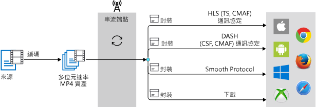

# 使用媒體服務編碼

Azure 媒體服務可讓您將高品質的數位媒體檔案編碼成調適性位元速率 MP4 檔案，因此可以在各種不同的瀏覽器和裝置上播放您的內容。 成功的媒體服務編碼作業建立的輸出資產與一組調適性位元速率 mp4 和串流處理組態檔。 組態檔包含.ism、.ismc、.mpi 和其他您不應該修改的檔案。 編碼作業完成後，您可以善用[動態封裝](dynamic-packaging-overview.md)和啟動資料流。

要在輸出中的視訊播放的用戶端可用的資產，您必須建立**串流定位器**並建置串流 Url。 然後，根據指定的格式資訊清單中，您的用戶端收到資料流他們選擇的通訊協定。

下圖顯示使用動態封裝工作流程上隨選資料流。

本主題會指導您如何使用媒體服務 v3 將內容編碼。

## 轉換和作業

若要使用媒體服務 v3 來編碼，您需要建立[轉換](https://docs.microsoft.com/rest/api/media/transforms) \(英文\) 和[作業](https://docs.microsoft.com/rest/api/media/jobs) \(英文\)。 轉換可定義編碼的設定和輸出配方，作業則是配方的執行個體。 如需詳細資訊，請參閱[轉換和作業](transforms-jobs-concept.md)

使用媒體服務編碼時，需使用預設來告訴編碼器應該如何處理輸入媒體檔案。 例如，您可以指定所編碼內容中需要的視訊解析度及/或音訊聲道數目。 

您可以使用依據業界最佳做法所建議的其中一個內建預設來快速開始，也可以選擇建置以特定案例或裝置需求為標的的自訂預設。 如需詳細資訊，請參閱[使用自訂轉換進行編碼](customize-encoder-presets-how-to.md)。 

從 2019 年 1 月開始，使用「媒體編碼器標準」來編碼以產生 MP4 檔案時，會產生新的 .mpi 檔案並將該檔案新增到輸出資產。 此 MPI 檔案的目的是用來改進[動態封裝](dynamic-packaging-overview.md)與串流處理案例的效能。

> [!NOTE]
> 您不應該修改或移除該 MPI 檔案，也不應該在您的服務中相依於此類檔案的存在與否。

## 內建預設

媒體服務目前支援下列內建編碼預設：  

### BuiltInStandardEncoderPreset 預設

[BuiltInStandardEncoderPreset](https://docs.microsoft.com/rest/api/media/transforms/createorupdate#builtinstandardencoderpreset) \(英文\) 是用來設定內建預設，以供使用標準編碼器為輸入視訊編碼時使用。 

目前支援的預設如下：

- **EncoderNamedPreset.AACGoodQualityAudio** - 會產生只包含立體聲音訊 (以 192 kbps 編碼) 的單一 MP4 檔案。
- **EncoderNamedPreset.AdaptiveStreaming** (建議)。 如需詳細資訊，請參閱[自動產生位元速率階梯](autogen-bitrate-ladder.md)。
- **EncoderNamedPreset.ContentAwareEncodingExperimental** -實驗性的預設內容感知的編碼公開 （expose)。 指定任何輸入的內容，服務會嘗試自動判斷最佳的圖層、 適當的位元速率與解析度設定為傳遞數目彈性資料流。 基礎演算法將會繼續隨著時間演進。 輸出會包含交錯的音訊和視訊的 MP4 的檔案。 如需詳細資訊，請參閱 <<c0> [ 感知內容的編碼預設值的實驗性](cae-experimental.md)。
- **EncoderNamedPreset.H264MultipleBitrate1080p** - 會產生一組 8 個對齊 GOP 的 MP4 檔案 (範圍從 6000 kbps 到 400 kbps) 和立體聲 AAC 音訊。 解析度起自 1080p，下至 360p。
- **EncoderNamedPreset.H264MultipleBitrate720p** - 會產生一組 6 個對齊 GOP 的 MP4 檔案 (範圍從 3400 kbps 到 400 kbps) 和立體聲 AAC 音訊。 解析度起自 720p，下至 360p。
- **EncoderNamedPreset.H264MultipleBitrateSD** - 會產生一組 5 個對齊 GOP 的 MP4 檔案 (範圍從 1600 kbps 到 400 kbps) 和立體聲 AAC 音訊。 解析度起自 480p，下至 360p。
- **EncoderNamedPreset.H264SingleBitrate1080p** -產生 MP4 檔案，其中影片以 6750 kbps 和圖片 1080年像素的高度，在 H.264 轉碼器編碼，而是立體聲的音訊以 64 kbps AAC-LC 轉碼器編碼。
- **EncoderNamedPreset.H264SingleBitrate720p** -產生視訊編碼的 H.264 轉碼器 4500 kbps 與圖片高度為 720 像素，而是立體聲的音訊以 64 kbps AAC-LC 轉碼器編碼的 MP4 檔案。
- **EncoderNamedPreset.H264SingleBitrateSD** -產生 MP4 檔案，其中影片以 2200 kbps 與圖片的高度 480 像素為單位的 H.264 轉碼器編碼，而是立體聲的音訊以 64 kbps AAC-LC 轉碼器編碼。

若要查看最新的預設值清單，請參閱[內建的預設設定，以便用來編碼視訊](https://docs.microsoft.com/rest/api/media/transforms/createorupdate#encodernamedpreset)。

若要查看如何使用預設值，請參閱[正在上傳、 編碼及串流檔案](stream-files-tutorial-with-api.md)。

### StandardEncoderPreset 預設

[StandardEncoderPreset](https://docs.microsoft.com/rest/api/media/transforms/createorupdate#standardencoderpreset) \(英文\) 能描述在使用標準編碼器為輸入視訊編碼時所要使用的設定。 在自訂轉換預設時，請使用此預設。 

#### 考量

在建立自訂的預設設定時，適用下列考量：

- 高度和寬度 AVC 內容上的所有值必須都是 4 的倍數。
- Azure 媒體服務 v3 中所有的編碼位元速率是每秒位元。 這是我們使用千位元/秒為單位的 v2 Api 與預設值不同。 比方說，如果 （kb/秒） 指定在 v2 中的位元速率為 128，v3 中它會設 128000 （位元/秒）。

#### 範例

「媒體服務」可完整支援自訂預設中的所有值，以滿足您的特定編碼需要和需求。 如需示範如何自訂編碼器預設值的範例，請參閱：

- [自訂預設使用.NET](customize-encoder-presets-how-to.md)
- [自訂預設使用 CLI](custom-preset-cli-howto.md)
- [自訂預設使用 REST](custom-preset-rest-howto.md)

## 在 v3 中調整編碼

若要調整媒體處理，請參閱[使用 CLI 進行調整](media-reserved-units-cli-how-to.md)。

## 後續步驟

* [從使用內建的預先設定的 HTTPS URL 編碼](job-input-from-http-how-to.md)
* [將本機檔案，使用內建的預設編碼](job-input-from-local-file-how-to.md)
* [建置自訂預設值為目標的特定案例或裝置需求](customize-encoder-presets-how-to.md)
* [使用媒體服務上傳、編碼和串流](stream-files-tutorial-with-api.md)
