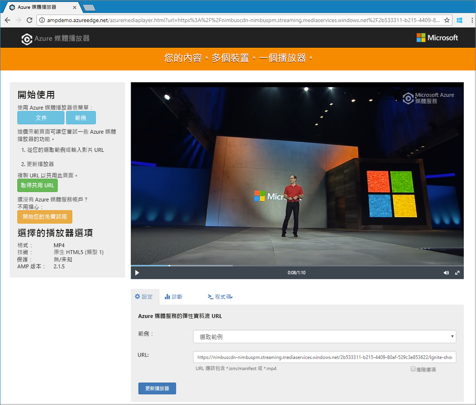

# <a name="quickstart-stream-video-files---net"></a>快速入門：串流視訊檔案 - .NET

此快速入門說明使用 Azure 媒體服務在各種不同的瀏覽器和裝置上編碼和開始串流視訊是多麼容易。 您可以使用 HTTP(S) URL、SAS URL 或 Azure Blob 儲存體中的檔案路徑來指定輸入內容。
此主題中的範例會將您透過 HTTPS URL 提供的內容編碼。 請注意，目前 AMS v3 不支援透過 HTTPS URL 的區塊傳送編碼。

完成快速入門時，您將能夠串流視訊。  



[!INCLUDE [quickstarts-free-trial-note](../../../includes/quickstarts-free-trial-note.md)]

## <a name="prerequisites"></a>必要條件

- 如果沒有安裝 Visual Studio，您可以取得 [Visual Studio Community 2017](https://www.visualstudio.com/thank-you-downloading-visual-studio/?sku=Community&rel=15)。
- [建立媒體服務帳戶](create-account-cli-how-to.md)。<br/>請務必記住您用於資源群組名稱和「媒體服務」帳戶名稱的值。
- 請依照[使用 Azure CLI 存取 Azure 媒體服務 API](access-api-cli-how-to.md) 中的步驟，並儲存認證。 您必須使用這些認證來存取 API。

## <a name="download-and-configure-the-sample"></a>下載並設定範例

使用以下命令將包含串流 .NET 範例的 GitHub 存放庫複製到您的機器：  

 ```bash
 git clone https://github.com/Azure-Samples/media-services-v3-dotnet-quickstarts.git
 ```

此範例位於 [EncodeAndStreamFiles](https://github.com/Azure-Samples/media-services-v3-dotnet-quickstarts/tree/master/AMSV3Quickstarts/EncodeAndStreamFiles) 資料夾。

在您下載的專案中開啟 [appsettings.json](https://github.com/Azure-Samples/media-services-v3-dotnet-quickstarts/blob/master/AMSV3Quickstarts/EncodeAndStreamFiles/appsettings.json)。 將值取代為從[存取 API](access-api-cli-how-to.md) 中取得的認證。

此範例會執行下列動作：

1. 建立**轉換** (首先，檢查指定的轉換是否存在)。 
2. 建立輸出**資產**，以作為編碼**作業**的輸出。
3. 建立以 HTTPS URL 為基礎的**作業**輸入。
4. 使用稍早建立的輸入和輸出提交編碼**作業**。
5. 檢查作業的狀態。
6. 建立**串流定位器**。
7. 建置串流 URL。

如需範例中的每個函式作用的相關說明，請檢查程式碼並查看[這個原始程式檔](https://github.com/Azure-Samples/media-services-v3-dotnet-quickstarts/blob/master/AMSV3Quickstarts/EncodeAndStreamFiles/Program.cs) \(英文\) 中的註解。

## <a name="run-the-sample-app"></a>執行範例應用程式

當您執行應用程式時，會顯示可以使用其他不同通訊協定播放該影片的 URL。 

1. 按下 Ctrl+F5 來執行 *EncodeAndStreamFiles* 應用程式。
2. 選擇 Apple 的 **HLS** 通訊協定 (結尾是 *manifest(format=m3u8-aapl)*) 並從主控台複製串流 URL。


在此範例的[原始程式碼](https://github.com/Azure-Samples/media-services-v3-dotnet-quickstarts/blob/master/AMSV3Quickstarts/EncodeAndStreamFiles/Program.cs)中，您可以看到建置 URL 的方式。 若要建置它，您需要串連串流端點主機名稱和串流定位器路徑。  

## <a name="test-with-azure-media-player"></a>使用 Azure 媒體播放器測試

本文使用 Azure 媒體播放器測試串流。 

> [!NOTE]
> 如果播放程式裝載在 HTTPS 網站上，請務必將 URL 更新為 "https"。

1. 開啟瀏覽器並巡覽至 [https://aka.ms/azuremediaplayer/](https://aka.ms/azuremediaplayer/)。
2. 在 [URL:] 方塊中，貼上您在執行應用程式時取得的其中一個串流 URL 值。 
 
     您可以貼上 HLS、Dash 或 Smooth 格式的 URL，Azure 媒體播放器將會切換至適當的串流通訊協定，以便在您的裝置上自動播放。
3. 按一下 [更新播放程式]。

Azure 媒體播放器可以用於測試，但不應用於生產環境。 

## <a name="clean-up-resources"></a>清除資源

如果您不再需要資源群組中的任何資源 (包含在此快速入門中建立的媒體服務和儲存體帳戶)，請將資源群組刪除。

執行下列 CLI 命令：

```azurecli
az group delete --name amsResourceGroup
```

## <a name="examine-the-code"></a>檢查程式碼

如需範例中的每個函式作用的相關說明，請檢查程式碼並查看[這個原始程式檔](https://github.com/Azure-Samples/media-services-v3-dotnet-quickstarts/blob/master/AMSV3Quickstarts/EncodeAndStreamFiles/Program.cs) \(英文\) 中的註解。

[上傳、編碼和串流檔案](stream-files-tutorial-with-api.md)教學課程提供更進階的串流範例與詳細說明。 

### <a name="job-error-codes"></a>作業錯誤碼

請參閱[錯誤碼](https://docs.microsoft.com/rest/api/media/jobs/get#joberrorcode)。

## <a name="multithreading"></a>多執行緒

Azure 媒體服務 v3 SDK 不是安全執行緒。 當使用多執行緒應用程式時，您應該為每個執行緒產生新的 AzureMediaServicesClient 物件。

## <a name="next-steps"></a>後續步驟

> [!div class="nextstepaction"]
> [教學課程：上傳、編碼和串流檔案](stream-files-tutorial-with-api.md)
