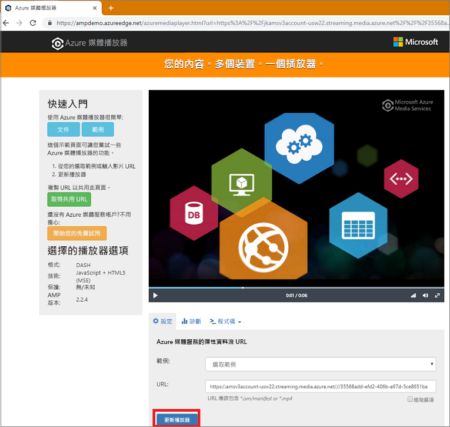

# <a name="tutorial-stream-video-files---nodejs"></a>教學課程：串流影片檔案 - Node.js

此教學課程說明使用 Azure 媒體服務在各種不同的瀏覽器和裝置上編碼和開始串流視訊是多麼容易。 您可以使用 HTTP(S) URL、SAS URL 或 Azure Blob 儲存體中的檔案路徑來指定輸入內容。

本文中的範例會將您透過 HTTPS URL 提供的內容編碼。 請注意，目前 AMS v3 不支援透過 HTTPS URL 的區塊傳送編碼。

完成教學課程時，您將能夠串流視訊。  



[!INCLUDE [quickstarts-free-trial-note](../../../includes/quickstarts-free-trial-note.md)]

## <a name="prerequisites"></a>必要條件

- 安裝 [Node.js](https://nodejs.org/en/download/)
- [建立媒體服務帳戶](create-account-cli-how-to.md)。<br/>請務必記住您用於資源群組名稱和「媒體服務」帳戶名稱的值。
- 請依照[使用 Azure CLI 存取 Azure 媒體服務 API](access-api-cli-how-to.md) 中的步驟，並儲存認證。 您必須使用這些認證來存取 API。

## <a name="download-and-configure-the-sample"></a>下載並設定範例

使用以下命令將包含串流 Node.js 範例的 GitHub 存放庫複製到您的機器：  

 ```bash
 git clone https://github.com/Azure-Samples/media-services-v3-node-tutorials.git
 ```

此範例位於 [StreamFilesSample](https://github.com/Azure-Samples/media-services-v3-node-tutorials/tree/master/AMSv3Samples/StreamFilesSample) 資料夾。

開啟所下載專案中的 [index.js](https://github.com/Azure-Samples/media-services-v3-node-tutorials/blob/master/AMSv3Samples/StreamFilesSample/index.js#L25)。 將 `endpoint config` 值取代為您從[存取 API](access-api-cli-how-to.md) 中取得的認證。

此範例會執行下列動作：

1. 建立**轉換** (首先，檢查指定的轉換是否存在)。 
2. 建立輸出**資產**，以作為編碼**作業**的輸出。
3. 建立以 HTTPS URL 為基礎的**作業**輸入。
4. 使用稍早建立的輸入和輸出提交編碼**作業**。
5. 檢查作業的狀態。
6. 建立**串流定位器**。
7. 建置串流 URL。

## <a name="run-the-sample-app"></a>執行範例應用程式

1. 應用程式會下載已編碼的檔案。 建立資料夾供您存放輸出檔案，並更新 [index.js](https://github.com/Azure-Samples/media-services-v3-node-tutorials/blob/master/AMSv3Samples/StreamFilesSample/index.js#L39)檔案中 **outputFolder** 變數的值。
1. 開啟**命令提示字元**、瀏覽至範例的目錄，然後執行下列命令。

    ```
    npm install 
    node index.js
    ```

執行完畢後，您應該會看到類似的輸出：


## <a name="test-with-azure-media-player"></a>使用 Azure 媒體播放器測試

本文使用 Azure 媒體播放器測試串流。 

> [!NOTE]
> 如果播放程式裝載在 HTTPS 網站上，請務必將 URL 更新為 "https"。

1. 開啟瀏覽器並巡覽至 [https://aka.ms/azuremediaplayer/](https://aka.ms/azuremediaplayer/)。
2. 在 [URL:]  方塊中，貼上您在執行應用程式時取得的其中一個串流 URL 值。 
 
     您可以貼上 HLS、Dash 或 Smooth 格式的 URL，Azure 媒體播放器將會切換至適當的串流通訊協定，以便在您的裝置上自動播放。
3. 按一下 [更新播放程式]  。

Azure 媒體播放器可以用於測試，但不應用於生產環境。 

## <a name="clean-up-resources"></a>清除資源

如果您不再需要資源群組中的任何資源 (包含在此教學課程中建立的媒體服務和儲存體帳戶)，請將資源群組刪除。

執行下列 CLI 命令：

```azurecli
az group delete --name amsResourceGroup
```

## <a name="see-also"></a>另請參閱

[作業錯誤碼](https://docs.microsoft.com/rest/api/media/jobs/get#joberrorcode)。

## <a name="next-steps"></a>後續步驟

> [!div class="nextstepaction"]
> [媒體服務概念](concepts-overview.md)
