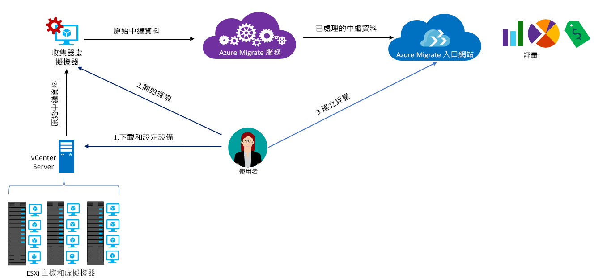

# 關於 Azure Migrate

Azure Migrate 服務會評估要移轉至 Azure 的內部部署工作負載。 此服務會評估內部部署機器的移轉適用性、執行以效能為依據的大小調整，並提供在 Azure 中執行內部部署機器的成本估計。 如果您正打算進行隨即移轉，或者正處於移轉的早期評估階段，此服務很適合您。 評估之後，您可以使用 [Azure Site Recovery](https://docs.microsoft.com/azure/site-recovery/site-recovery-overview) 和 [Azure 資料庫移轉服務](https://docs.microsoft.com/azure/dms/dms-overview)等服務，將機器移轉至 Azure。

## 為何使用 Azure Migrate？

Azure Migrate 可協助您：

- **評估 Azure 整備程度**：評估您的內部部署機器是否適合在 Azure 中執行。
- **取得大小建議**：根據內部部署 VM 的效能歷程記錄，取得 Azure VM 的大小建議。
- **預估每月成本**：取得在 Azure 中執行內部部署機器的估計成本。  
- **安心地移轉**：將內部部署機器的相依性視覺化，以建立您將一起評估和移轉的機器群組。

## 目前的限制

- 目前只能針對那些要移轉到 Azure VM 的內部部署 VMware 虛擬機器 (VM) 進行評估。 VMware VM 必須由 vCenter Server (5.5、6.0 或 6.5 版) 管理。
- 如果您想要評估 Hyper-V VM 和實體伺服器，請將 [Azure Site Recovery 部署規劃工具](http://aka.ms/asr-dp-hyperv-doc)用於 Hyper-V，對於實體機器則使用我們的[合作夥伴工具](https://azure.microsoft.com/migration/partners/)。
- 您可以在單一探索中探索多達 1500 個 VM，並在單一專案中探索多達 1500 個 VM。 此外，您還可以在單一評估中評估多達 1500 個 VM。
- 如果您想要探索較大的環境，您可以分割探索並建立多個專案。 [深入了解](how-to-scale-assessment.md)。 Azure Migrate 支援每個訂閱最多 20 個專案。
- Azure Migrate 只支援將受控磁碟用於進行移轉評估。
- 您只能在美國地理位置建立 Azure Migrate 專案。 這並不影響您對任何目標 Azure 位置規劃移轉的能力。 移轉專案的地理位置只會用來儲存在內部部署環境中發現的中繼資料。 [深入了解](https://docs.microsoft.com/azure/migrate/resources-faq#discovery-and-assessment) Azure Migrate 收集的中繼資料。 收集的中繼資料會儲存在所選 [Azure 地理位置](https://azure.microsoft.com/global-infrastructure/geographies/)中的其中一個區域：

**地理位置** | **區域**
--- | ---
美國 | 美國中西部、美國東部

## 我需要支付多少費用？

[深入了解](https://azure.microsoft.com/pricing/details/azure-migrate/) Azure Migrate 定價。

## 評估包含什麼？

您可以根據本身的需求自訂評估設定。 評估屬性彙整於下表中。

**屬性** | **詳細資料**
--- | ---
**目標位置** | 要作為移轉目的地的 Azure 位置。  Azure Migrate 目前支援 30 個區域。 [查看區域](https://azure.microsoft.com/global-infrastructure/services/)。 根據預設，目標區域會設定為美國西部 2。
**儲存體類型** | 您要在 Azure 中配置的磁碟類型。 當調整大小準則為「作為內部部署」時，即適用此屬性。 您可以將目標磁碟類型指定為進階受控磁碟 (預設值) 或標準受控磁碟。 若以效能為基礎調整大小，則會根據 VM 的效能資料自動建議磁碟大小。
**調整大小準則** | 您可以根據內部部署 VM 的「效能歷程記錄」來調整大小，或使用「作為內部部署」(預設值)，而不考量效能歷程記錄。
**Azure 供應項目** | 您所註冊的 [Azure 供應項目](https://azure.microsoft.com/support/legal/offer-details/)。 Azure Migrate 會據以預估成本。
**Azure Hybrid Benefit** | 您是否擁有軟體保證，以及是否符合 [Azure Hybrid Benefit](https://azure.microsoft.com/pricing/hybrid-use-benefit/) 的資格而享有折扣。
**保留執行個體** |  您在 Azure 中是否有[保留執行個體](https://azure.microsoft.com/pricing/reserved-vm-instances/)。 Azure Migrate 會據以預估成本。
**VM 運作時間** | VM 將在 Azure 中執行的持續時間。 成本估計會據以完成。
**定價層** | 目標 Azure VM 的[定價層 (基本/標準)](../virtual-machines/windows/sizes-general.md)。 例如，如果您打算移轉生產環境，您可以考慮使用標準層，這會提供低延遲的 VM，但成本可能較高。 另一方面，在測試環境中，則可使用延遲較高、成本較低的基本層。 預設會使用[標準](../virtual-machines/windows/sizes-general.md)層。
**效能歷程記錄** | 根據預設，Azure Migrate 會使用最後一天的效能歷程記錄 (95% 百分位數值) 來評估內部部署機器的效能。
**VM 系列** | 用來估計大小的 VM 系列。 例如，如果您不打算將生產環境移轉至 Azure 中的 A 系列虛擬機器，則可以從清單或系列排除 A 系列。 大小調整只會根據選取的系列執行。   
**緩和因數** | Azure Migrate 會在評估期間考量緩衝區 (緩和因數)。 此緩衝區適用於 VM 的機器使用量資料 (CPU、記憶體、磁碟和網路)。 緩和因數會考量各個問題，例如季節性使用量、簡短的效能歷程記錄，以及未來可能增加的使用量。   以 10 核心的 VM 為例，如果使用率為 20%，一般即相當於一個 2 核心的 VM。 但如果緩和因數為 2.0 x，則結果為 4 核心的 VM。 預設緩和設定為 1.3x。

## Azure Migrate 如何運作？

1.  您可建立 Azure Migrate 專案。
2.  Azure Migrate 會使用稱為收集器設備的內部部署 VM，探索您的內部部署機器相關資訊。 若要建立設備，您可下載開放虛擬化設備 (.ova) 格式的安裝檔案，然後將它匯入為內部部署 vCenter Sever 上的 VM。
3. 您會從 vCenter Server 連線至 VM，並在連線時為其指定新密碼。
4. 您會在 VM 上執行收集器以起始探索。
5. 收集器會使用 VMware PowerCLI Cmdlet 來收集 VM 中繼資料。 探索是無代理程式的，而且不會在 VMware 主機或 VM 上安裝任何項目。 所收集的中繼資料包含 VM 資訊 (核心、記憶體、磁碟、磁碟大小和網路介面卡。 它也會收集 VM 的效能資料，包括 CPU 和記憶體使用量、磁碟 IOPS、磁碟輸送量 (MBps) 以及網路輸出 (MBps)。
5.  中繼資料會推送至 Azure Migrate 專案。 您可以在 Azure 入口網站中檢視它。
6.  基於評估目的，您會將探索到的 VM 集合成群組。 例如，您可將執行相同應用程式的 VM 群組在一起。 如需更精確的群組，您可以使用相依性視覺效果來檢視特定機器的相依性，或檢視群組中所有機器的相依性並調整群組。
7.  群組定義之後，您會為其建立評估。
8.  評估完成後，您可以在入口網站中進行檢視，或以 Excel 格式進行下載。

  

## 連接埠需求為何？

下表摘要說明 Azure Migrate 通訊所需的連接埠。

元件 | 通訊對象 |  詳細資料
--- | --- |---
收集器  | Azure Migrate 服務 | 收集器會透過 SSL 連接埠 443 連線至服務。
收集器 | vCenter Server | 根據預設，收集器會連線到連接埠 443 上的 vCenter Server。 如果伺服器接聽不同的連接埠，請將其設定為收集器 VM 上的傳出連接埠。
內部部署 VM | Log Analytics 工作區 | [TCP 443] | [Microsoft Monitoring Agent (MMA)](../log-analytics/log-analytics-windows-agent.md) 會使用 TCP 連接埠 443 連線至 Log Analytics。 如果您使用相依性視覺效果，因而需要 MMA 代理程式時，您只需要此連接埠。

## 評估後會發生什麼事？

在評估內部部署機器之後，您可以使用一些工具來執行移轉：

- **Azure Site Recovery**：您可以使用 Azure Site Recovery 來移轉至 Azure。 若要這樣做，您必須[準備所需的 Azure 元件](../site-recovery/tutorial-prepare-azure.md)，包括儲存體帳戶和虛擬網路。 在內部部署中，您必須[準備 VMware 環境](../site-recovery/vmware-azure-tutorial-prepare-on-premises.md)。 在一切都準備就緒後，您設定並啟用對 Azure 的複寫，並移轉 VM。 [深入了解](../site-recovery/vmware-azure-tutorial.md)。
- **Azure 資料庫移轉**：如果您的內部部署機器正在執行 SQL Server、MySQL 或 Oracle 等資料庫，您可以使用 [Azure 資料庫移轉服務](../dms/dms-overview.md)將資料庫移轉至 Azure。

## 後續步驟

- [遵循教學課程](tutorial-assessment-vmware.md)以建立內部部署 VMware VM 的評估。
- 針對 Azure Migrate [檢閱相關常見問題](resources-faq.md)。
