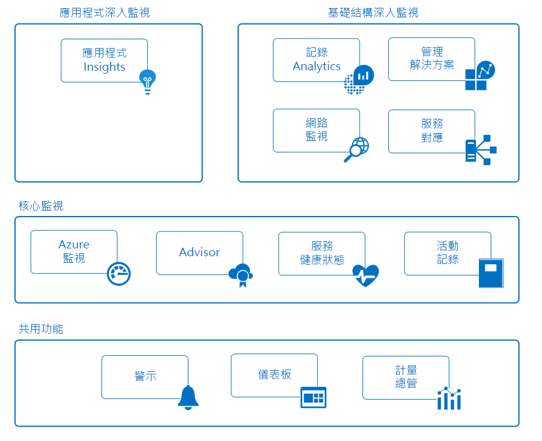

# 監視 Azure 應用程式和資源

監視係指收集和分析資料來判斷您商務應用程式及其相依資源之效能、健康情況和可用性的行為。 有效的監視策略可協助您了解您應用程式元件的詳細操作。 它也可藉由主動通知重大問題來協助您增加運作時間，以便您在這些問題發生之前予以解決。

Azure 包含多項服務，能在監視空間內個別執行特定的角色或工作。 這些服務可共同提供一套全面性解決方案，以便收集、分析來自您的應用程式和支援這些服務之 Azure 資源的遙測，並採取行動。 它們也可以用來監視重要的內部部署資源，以提供混合式監視環境。 了解可用的工具和資料是開發完整應用程式監視策略的第一步。

下圖顯示合作提供 Azure 資源監視功能之元件的概念檢視。 以下各節會說明這些元件，並提供詳細技術資訊的連結。

## 共用功能
核心和深層監視服務共用功能，該功能會提供下列功能。

### 警示
[Azure 警示](../monitoring-and-diagnostics/monitoring-overview-alerts.md)會主動通知您重大情況，並可能採取矯正措施。 警示規則可以使用來自各種來源 (包括計量和記錄) 的資料。 它們會使用[動作群組](../monitoring-and-diagnostics/monitoring-action-groups.md)，其中包含幾組獨特的收件人及回應警示的動作。 您可以根據需求，使用 Webhook 讓警示啟動外部動作，並與您的 ITSM 工具整合。

### 儀表板
您可以使用 [Azure 儀表板](../azure-portal/azure-portal-dashboards.md)，將不同類型的資料結合至 [Azure 入口網站](https://portal.azure.com)的單一窗格中。 然後，您就可以與其他 Azure 使用者共用儀表板。

例如，您可以建立結合下列各項的儀表板：
- 顯示計量圖表的圖格
- 活動記錄資料表
- 來自 Application Insights 的使用量圖表
- Log Analytics 中記錄搜尋的輸出

您也可以將 Log Analytics 資料匯出至 [Power BI](https://docs.microsoft.com/power-bi/)。 您可以在此處利用其他的視覺效果。 您也可以將資料提供給貴組織內部和外部的其他人員使用。

### 計量瀏覽器
[計量](../monitoring-and-diagnostics/monitoring-overview-metrics.md)是 Azure 資源所產生的數值，可協助您了解資源的作業與效能。 您可以使用計量瀏覽器，將計量傳送給 Log Analytics，以便與其他來源的資料一起分析。

## 核心監視
核心監視提供監視所有 Azure 資源所需的基本功能。 這些服務只需最基本的設定，並且會收集進階監視服務所使用的核心遙測資料。    

### Azure 監視器
[Azure 監視器](../monitoring-and-diagnostics/monitoring-overview-azure-monitor.md)會透過允許集合[計量](../monitoring-and-diagnostics/monitoring-overview-metrics.md)、[活動記錄](../monitoring-and-diagnostics/monitoring-overview-activity-logs.md)及[診斷記錄](../monitoring-and-diagnostics/monitoring-overview-of-diagnostic-logs.md)，來啟用 Azure 服務的核心監視功能。 例如，活動記錄會告訴您新資源的建立或修改時間。

系統會提供計量，這些計量可提供不同資源 (甚至是虛擬機器內的作業系統) 的效能統計資料。 您可以在 Azure 入口網站中使用其中一個總管檢視這項資料，並且根據這些計量建立警示。 Azure 監視器提供最快的計量管線 (5 分鐘降至 1 分鐘)，因此您應該將它用於講究時效性的警示和通知。

您也可以將這些計量和記錄傳送給 Azure Log Analytics 以了解趨勢和進行詳細分析，或是建立其他警示規則，根據該分析的結果主動向您通知重大問題。  

> [!NOTE]
> 目前不支援透過診斷設定將多維度計量傳送至 Log Analytics。 跨維度值所彙總的維度計量會匯出為扁平化單一維度計量。
>
> 「例如」：可以在每個佇列層級瀏覽並繪製事件中樞上的「內送郵件」計量。 不過，當您匯出至 Log Analytics 時，計量將會呈現為事件中樞內所有佇列的所有內送郵件。
>
>

### Azure 建議程式
[Azure Advisor](../advisor/advisor-overview.md) 會持續監視您的資源組態和使用量遙測。 接著，它會根據最佳做法，為您提供個人化建議。 依照這些建議操作將可協助您提升支援應用程式之資源的效能、安全性及可用性。

### 服務健康情況
您應用程式的健康情況取決於其相依的 Azure 服務。 [Azure 服務健康狀態](../service-health/service-health-overview.md)可識別任何可能影響您應用程式的 Azure 服務問題。 服務健康狀態也可協助您規劃排程維護。

### 活動記錄檔
[活動記錄](../monitoring-and-diagnostics/monitoring-overview-activity-logs.md)可提供 Azure 資源作業的相關資料。 此資訊包括：
- 資源的組態變更。
- 服務健康狀態事件。
- 更妥善利用資源的建議。
- 自動調整作業的相關資訊。

您可以在 Azure 入口網站中特定資源的頁面上檢視該資源的記錄。 或者，可以在 [活動記錄總管] 中檢視多項資源的記錄。

您也可以將活動記錄項目傳送到 Log Analytics。 您可以在這裡使用管理解決方案、虛擬機器上的代理程式及其他來源所收集到的資料來分析記錄。

## 深層監視服務
下列 Azure 服務提供收集和分析深層監視資料的豐富功能。 它們以核心監視功能為基礎，並且運用 Azure 中的通用功能。 它們透過所收集的資料提供強大的分析，為您提供應用程式和基礎結構的獨特深入解析。 它們可以在針對不同對象的案例內容中呈現資料。

## 深層應用程式監視
### Application Insights
您可以使用 [Azure Application Insights](http://azure.microsoft.com/documentation/services/application-insights) 來監視應用程式的可用性、效能及使用情況 (不論該應用程式是裝載在雲端還是內部部署環境)。

透過檢測您的應用程式以與 Application Insights 搭配運作，即可獲得深入解析及實作 DevOps 案例。 您可以快速識別和診斷錯誤，而不需要等待使用者回報錯誤。 有了所收集的資訊之後，您便可以針對應用程式的維護和改善，進行資訊充分的選擇。

Application Insights 具有廣泛的工具，能與它所收集的資料進行互動。 Application Insights 會將其資料儲存在一般存放庫中。 它可以利用共用功能，例如警示、儀表板，以及採用 Log Analytics 查詢語言的深入分析。

## 深層基礎結構監視
### Log Analytics
[Log Analytics](http://azure.microsoft.com/documentation/services/log-analytics) 在 Azure 監視功能中扮演一個中心角色，會從各種資源 (包括非 Microsoft 工具) 將資料收集到單一存放庫中。 您可以在此處使用強大的查詢語言來分析資料。

Application Insights 和 Azure 資訊安全中心會將其資料儲存在 Log Analytics 資料存放區中，並使用其分析引擎。 也會從「Azure 監視器」、管理解決方案，以及安裝在雲端或內部部署環境中虛擬機器上的代理程式收集資料。 此共用功能可協助您完全了解整個環境。

### 管理解決方案
[管理解決方案](../log-analytics/log-analytics-add-solutions.md)是幾組封裝的邏輯，可提供特定應用程式或服務的深入解析。 它們倚賴 Log Analytics 來儲存和分析所收集的監視資料。

您可以從 Microsoft 及合作夥伴取得管理解決方案，為各種 Azure 和第三方服務提供監視功能。 監視解決方案的範例包括：
* [容器監視](../log-analytics/log-analytics-containers.md)，可協助您檢視和管理您的容器主機。
* [Azure SQL 分析](../log-analytics/log-analytics-azure-sql.md)，可收集 Azure SQL 資料庫的效能計量並加以視覺化。

您可以在 Azure 入口網站中的 [監視器] 畫面底下，檢視所有可用的管理解決方案。

### 網路監視
無論在 Azure 或內部部署，皆有多個工具可一起用來監視網路的各個層面。  

[網路監看員](../network-watcher/network-watcher-monitoring-overview.md)可針對 Azure 中的各種不同網路案例，提供案例型監視和診斷。 它會將資料儲存在 Azure 計量和診斷中，以供進一步分析。 它會使用下列解決方案來監視您網路的各個層面。

[網路效能監控 (NPM)](https://blogs.msdn.microsoft.com/azuregov/2017/09/05/network-performance-monitor-general-availability/)是雲端式網路監視解決方案，可監視跨公用雲端、資料中心和內部部署環境的連線。

[ExpressRoute 監視](https://azure.microsoft.com/en-in/blog/monitoring-of-azure-expressroute-in-preview/)是可透過 Azure ExpressRoute 線路監視端對端連線能力和效能的 NPM 功能。

[DNS 分析](../log-analytics/log-analytics-dns.md)是根據您的 DNS 伺服器來提供安全性、效能和作業相關深入解析的解決方案。

[服務端點監視](../networking/network-monitoring-overview.md)會測試應用程式的連線能力，並跨內部部署、電訊廠商網路和雲端/私用資料中心偵測效能瓶頸。

### 服務對應
[服務對應](../operations-management-suite/operations-management-suite-service-map.md)可透過以虛擬機器的各種不同程序，以及與其他電腦和外部程序的相依性，來分析虛擬機器，為您提供 IaaS 環境的深入解析。 它會整合 Log Analytics 中的事件、效能資料和管理解決方案。 您即可在每部電腦的內容及其與您環境的其餘相關內容中檢視此資料。

服務對應類似於 [Application Insights 的應用程式對應](../application-insights/app-insights-app-map.md)。 它著重於支援您應用程式的基礎結構元件。

## 範例案例
以下是一些概要範例，說明如何針對不同的案例，使用 Azure 中的不同監視工具。

### 監視 Web 應用程式
請考量一個透過 Azure App Service、Azure 儲存體及 SQL 資料庫在 Azure 中部署的 Web 應用程式。 您可從在 Azure 入口網站中這些資源的頁面上存取[計量](../monitoring-and-diagnostics/monitoring-overview-metrics.md)和[活動記錄](../monitoring-and-diagnostics/monitoring-overview-activity-logs.md)開始著手。 您要尋找重要資訊，例如對應用程式的要求數目及平均回應時間。 您還要識別任何組態變更。

接著，移至入口網站中的 [監視]，一起檢視不同資源的計量和記錄。 在決定計量的標準參數時，您會[建立警示規則](../monitoring-and-diagnostics/monitoring-overview-unified-alerts.md)。 例如，在平均回應時間增加超過閾值時，這些規則會主動通知您。 為了快速檢視您應用程式的每日效能，您會建立 Azure 儀表板來顯示代表重要 KPI 之計量的圖表。

若要執行更深入的應用程式監視，您將需要[針對 Application Insights 進行設定](../application-insights/quick-monitor-portal.md)。 您現在可以收集可提供進一步應用程式作業與效能深入解析的其他資料。 Application Insights 會偵測您應用程式元件之間的基礎關聯性。 它允許透過[應用程式對應](../application-insights/app-insights-app-map.md)以視覺方式呈現這些關聯性，並搭配[端對端追蹤](../application-insights/app-insights-transaction-diagnostics.md)來診斷出問題發生所在的確切元件、相依性或例外狀況。

您會建立[可用性測試](../application-insights/app-insights-monitor-web-app-availability.md)，以主動從不同的區域測試您的應用程式。 為了協助您的開發人員，您會[啟用分析工具](../application-insights/enable-profiler-compute.md)，以便深入追蹤要求和任何例外狀況，直到特定一行程式碼為止。 為了更深入檢視您應用程式中使用的服務，您要新增 [SQL Analytics 解決方案](../log-analytics/log-analytics-azure-sql.md)，以收集 Log Analytics 中的其他資料。

在一段時間之後，您要決定針對網站效能降到低於閾值的期間，進行根本原因調查。 您可使用 Log Analytics 來撰寫查詢。 它可協助您將 Application Insights 所收集的使用情況和效能資料與支援您應用程式之所有 Azure 資源的設定和效能資料相互關聯。

### 監視虛擬機器
您在 Azure 中執行的虛擬機器混合了 Windows 和 Linux 虛擬機器。 您可使用 Azure 監視器來檢視[活動記錄](../monitoring-and-diagnostics/monitoring-overview-activity-logs.md)和[主機層級計量](../monitoring-and-diagnostics/monitoring-overview-metrics.md)。 您要將 [Azure 診斷擴充功能](../virtual-machines/linux/tutorial-monitoring.md#install-diagnostics-extension)新增至虛擬機器，以從客體作業系統收集計量。 接著，您要建立[警示規則](../monitoring-and-diagnostics/monitoring-overview-unified-alerts.md)，以在基本計量 (例如處理器使用率和記憶體) 超出閾值時主動通知您。

為了收集有關執行商務應用程式之虛擬機器的更多詳細資料，您會在每部機器上[建立 Log Analytics 工作區並啟用 VM 延伸模組](../log-analytics/log-analytics-quick-collect-azurevm.md)。 您會為應用程式設定[不同資料來源的集合](../log-analytics/log-analytics-data-sources.md)，然後[建立檢視](../log-analytics/log-analytics-view-designer.md)來針對其每日的作業與效能提出報告。 接著，您會[建立警示規則](../monitoring-and-diagnostics/monitoring-overview-unified-alerts.md)，以在收到特定錯誤事件時通知您。

為了持續監視所安裝代理程式的健康狀態，您要新增[代理程式健全狀況管理解決方案](../operations-management-suite/oms-solution-agenthealth.md)。 為了進一步深入了解應用程式，您要將[相依性代理程式](../operations-management-suite/operations-management-suite-service-map-configure.md)新增至虛擬機器，以將它們新增至[服務對應](../operations-management-suite/operations-management-suite-service-map.md)。 服務對應會探索重要的程序，並識別機器與其他服務之間的連線。

在系統回報中斷之後，您會使用「服務對應」來執行鑑識調查，以識別發生問題的特定機器。 然後，您可建立 [Log Analytics 資料的查詢](../log-analytics/log-analytics-log-search-new.md)，以在未來找出問題。 此外，您可建立警示規則，以在偵測到狀況時主動通知您。

## 後續步驟
深入了解：

* [Azure 監視器](https://azure.microsoft.com/services/monitor/)，以開始使用核心監視計量和警示。
* [Application Insights](https://azure.microsoft.com/documentation/services/application-insights/)，如果您正嘗試診斷 App Service Web 應用程式中的問題。
* [Log Analytics](https://azure.microsoft.com/documentation/services/log-analytics/)，以分析所收集的監視資料和記錄。
