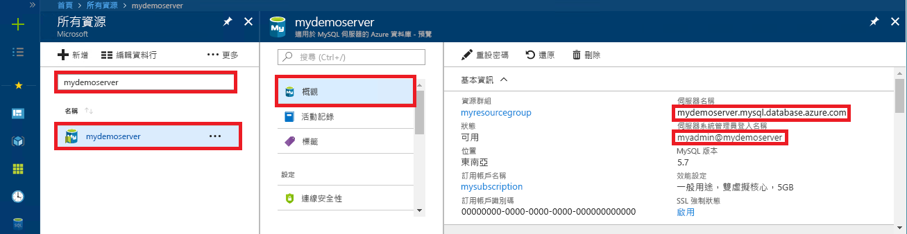

# <a name="azure-database-for-mysql-use-net-c-to-connect-and-query-data"></a>Azure Database for MySQL︰使用 .NET (C#) 來連線及查詢資料
本快速入門示範如何使用 C# 應用程式來連線到適用於 MySQL 的 Azure 資料庫。 它會顯示如何使用 SQL 陳述式來查詢、插入、更新和刪除資料庫中的資料。 本主題假設您已熟悉使用 C# 進行開發，但不熟悉適用於 MySQL 的 Azure 資料庫。

## <a name="prerequisites"></a>先決條件
本快速入門使用在以下任一指南中建立的資源作為起點︰
- [使用 Azure 入口網站建立適用於 MySQL 的 Azure 資料庫伺服器](./quickstart-create-mysql-server-database-using-azure-portal.md)
- [使用 Azure CLI 建立適用於 MySQL 的 Azure 資料庫伺服器](./quickstart-create-mysql-server-database-using-azure-cli.md)

您也需要：
- 安裝 [.NET](https://www.microsoft.com/net/download)。 請依照連結文章中的步驟，特別為您的平台 (Windows、Ubuntu Linux 或 macOS) 安裝 .NET。 
- 安裝 [Visual Studio](https://www.visualstudio.com/downloads/)。

## <a name="create-a-c-project"></a>建立 C# 專案
在命令提示字元中執行︰

```
mkdir AzureMySqlExample
cd AzureMySqlExample
dotnet new console
dotnet add package MySqlConnector
```

## <a name="get-connection-information"></a>取得連線資訊
取得連線到 Azure Database for MySQL 所需的連線資訊。 您需要完整的伺服器名稱和登入認證。

1. 登入 [Azure 入口網站](https://portal.azure.com/)。
2. 從 Azure 入口網站的左側功能表中，按一下 [所有資源]，然後搜尋您所建立的伺服器 (例如 **mydemoserver**)。
3. 按一下伺服器名稱。
4. 從伺服器的 [概觀] 面板，記下 [伺服器名稱] 和 [伺服器管理員登入名稱]。 如果您忘記密碼，您也可以從此面板重設密碼。
 

## <a name="connect-create-table-and-insert-data"></a>連線、建立資料表及插入資料
使用下列程式碼搭配 `CREATE TABLE` 和 `INSERT INTO` SQL 陳述式來連線及載入資料。 此程式碼使用 `MySqlConnection` 類別搭配 [OpenAsync()](https://docs.microsoft.com/dotnet/api/system.data.common.dbconnection.openasync#System_Data_Common_DbConnection_OpenAsync) 方法來建立 MySQL 連線。 然後，程式碼會使用 [CreateCommand()](https://docs.microsoft.com/dotnet/api/system.data.common.dbconnection.createcommand) 方法，設定 CommandText 屬性，並呼叫 [ExecuteNonQueryAsync()](https://docs.microsoft.com/dotnet/api/system.data.common.dbcommand.executenonqueryasync) 方法來執行資料庫命令。 

將 `Server`、`Database`、`UserID` 和 `Password` 參數取代為您在建立伺服器和資料庫時所指定的值。 

```csharp
using System;
using System.Threading.Tasks;
using MySql.Data.MySqlClient;

namespace AzureMySqlExample
{
    class MySqlCreate
    {
        static async Task Main(string[] args)
        {
            var builder = new MySqlConnectionStringBuilder
            {
                Server = "YOUR-SERVER.mysql.database.azure.com",
                Database = "YOUR-DATABASE",
                UserID = "USER@YOUR-SERVER",
                Password = "PASSWORD",
                SslMode = MySqlSslMode.Required,
            };

            using (var conn = new MySqlConnection(builder.ConnectionString))
            {
                Console.WriteLine("Opening connection");
                await conn.OpenAsync();

                using (var command = conn.CreateCommand())
                {
                    command.CommandText = "DROP TABLE IF EXISTS inventory;";
                    await command.ExecuteNonQueryAsync();
                    Console.WriteLine("Finished dropping table (if existed)");

                    command.CommandText = "CREATE TABLE inventory (id serial PRIMARY KEY, name VARCHAR(50), quantity INTEGER);";
                    await command.ExecuteNonQueryAsync();
                    Console.WriteLine("Finished creating table");

                    command.CommandText = @"INSERT INTO inventory (name, quantity) VALUES (@name1, @quantity1),
                        (@name2, @quantity2), (@name3, @quantity3);";
                    command.Parameters.AddWithValue("@name1", "banana");
                    command.Parameters.AddWithValue("@quantity1", 150);
                    command.Parameters.AddWithValue("@name2", "orange");
                    command.Parameters.AddWithValue("@quantity2", 154);
                    command.Parameters.AddWithValue("@name3", "apple");
                    command.Parameters.AddWithValue("@quantity3", 100);

                    int rowCount = await command.ExecuteNonQueryAsync();
                    Console.WriteLine(String.Format("Number of rows inserted={0}", rowCount));
                }

                // connection will be closed by the 'using' block
                Console.WriteLine("Closing connection");
            }

            Console.WriteLine("Press RETURN to exit");
            Console.ReadLine();
        }
    }
}
```

## <a name="read-data"></a>讀取資料

使用下列程式碼搭配 `SELECT` SQL 陳述式來連線和讀取資料。 此程式碼使用 `MySqlConnection` 類別搭配 [OpenAsync()](https://docs.microsoft.com/dotnet/api/system.data.common.dbconnection.openasync#System_Data_Common_DbConnection_OpenAsync) 方法來建立 MySQL 連線。 然後，程式碼會使用 [CreateCommand()](https://docs.microsoft.com/dotnet/api/system.data.common.dbconnection.createcommand) 和 [ExecuteReaderAsync()](https://docs.microsoft.com/dotnet/api/system.data.common.dbcommand.executereaderasync) 方法來執行資料庫命令。 接下來程式碼會使用 [ReadAsync()](https://docs.microsoft.com/dotnet/api/system.data.common.dbdatareader.readasync#System_Data_Common_DbDataReader_ReadAsync) 前往結果中的記錄。 接下來程式碼會使用 GetInt32 和 GetString 來剖析記錄中的值。

將 `Server`、`Database`、`UserID` 和 `Password` 參數取代為您在建立伺服器和資料庫時所指定的值。 

```csharp
using System;
using System.Threading.Tasks;
using MySql.Data.MySqlClient;

namespace AzureMySqlExample
{
    class MySqlRead
    {
        static async Task Main(string[] args)
        {
            var builder = new MySqlConnectionStringBuilder
            {
                Server = "YOUR-SERVER.mysql.database.azure.com",
                Database = "YOUR-DATABASE",
                UserID = "USER@YOUR-SERVER",
                Password = "PASSWORD",
                SslMode = MySqlSslMode.Required,
            };

            using (var conn = new MySqlConnection(builder.ConnectionString))
            {
                Console.WriteLine("Opening connection");
                await conn.OpenAsync();

                using (var command = conn.CreateCommand())
                {
                    command.CommandText = "SELECT * FROM inventory;";

                    using (var reader = await command.ExecuteReaderAsync())
                    {
                        while (await reader.ReadAsync())
                        {
                            Console.WriteLine(string.Format(
                                "Reading from table=({0}, {1}, {2})",
                                reader.GetInt32(0),
                                reader.GetString(1),
                                reader.GetInt32(2)));
                        }
                    }
                }

                Console.WriteLine("Closing connection");
            }

            Console.WriteLine("Press RETURN to exit");
            Console.ReadLine();
        }
    }
}
```

## <a name="update-data"></a>更新資料
使用下列程式碼搭配 `UPDATE` SQL 陳述式來連線和讀取資料。 此程式碼使用 `MySqlConnection` 類別搭配 [OpenAsync()](https://docs.microsoft.com/dotnet/api/system.data.common.dbconnection.openasync#System_Data_Common_DbConnection_OpenAsync) 方法來建立 MySQL 連線。 然後，程式碼會使用 [CreateCommand()](https://docs.microsoft.com/dotnet/api/system.data.common.dbconnection.createcommand) 方法，設定 CommandText 屬性，並呼叫 [ExecuteNonQueryAsync()](https://docs.microsoft.com/dotnet/api/system.data.common.dbcommand.executenonqueryasync) 方法來執行資料庫命令。 

將 `Server`、`Database`、`UserID` 和 `Password` 參數取代為您在建立伺服器和資料庫時所指定的值。 

```csharp
using System;
using System.Threading.Tasks;
using MySql.Data.MySqlClient;

namespace AzureMySqlExample
{
    class MySqlUpdate
    {
        static async Task Main(string[] args)
        {
            var builder = new MySqlConnectionStringBuilder
            {
                Server = "YOUR-SERVER.mysql.database.azure.com",
                Database = "YOUR-DATABASE",
                UserID = "USER@YOUR-SERVER",
                Password = "PASSWORD",
                SslMode = MySqlSslMode.Required,
            };

            using (var conn = new MySqlConnection(builder.ConnectionString))
            {
                Console.WriteLine("Opening connection");
                await conn.OpenAsync();

                using (var command = conn.CreateCommand())
                {
                    command.CommandText = "UPDATE inventory SET quantity = @quantity WHERE name = @name;";
                    command.Parameters.AddWithValue("@quantity", 200);
                    command.Parameters.AddWithValue("@name", "banana");

                    int rowCount = await command.ExecuteNonQueryAsync();
                    Console.WriteLine(String.Format("Number of rows updated={0}", rowCount));
                }

                Console.WriteLine("Closing connection");
            }

            Console.WriteLine("Press RETURN to exit");
            Console.ReadLine();
        }
    }
}
```

## <a name="delete-data"></a>刪除資料
使用下列程式碼搭配 `DELETE` SQL 陳述式來連線及刪除資料。 

此程式碼使用 `MySqlConnection` 類別搭配 [OpenAsync()](https://docs.microsoft.com/dotnet/api/system.data.common.dbconnection.openasync#System_Data_Common_DbConnection_OpenAsync) 方法來建立 MySQL 連線。 然後，程式碼會使用 [CreateCommand()](https://docs.microsoft.com/dotnet/api/system.data.common.dbconnection.createcommand) 方法，設定 CommandText 屬性，並呼叫 [ExecuteNonQueryAsync()](https://docs.microsoft.com/dotnet/api/system.data.common.dbcommand.executenonqueryasync) 方法來執行資料庫命令。 

將 `Server`、`Database`、`UserID` 和 `Password` 參數取代為您在建立伺服器和資料庫時所指定的值。 

```csharp
using System;
using System.Threading.Tasks;
using MySql.Data.MySqlClient;

namespace AzureMySqlExample
{
    class MySqlDelete
    {
        static async Task Main(string[] args)
        {
            var builder = new MySqlConnectionStringBuilder
            {
                Server = "YOUR-SERVER.mysql.database.azure.com",
                Database = "YOUR-DATABASE",
                UserID = "USER@YOUR-SERVER",
                Password = "PASSWORD",
                SslMode = MySqlSslMode.Required,
            };

            using (var conn = new MySqlConnection(builder.ConnectionString))
            {
                Console.WriteLine("Opening connection");
                await conn.OpenAsync();

                using (var command = conn.CreateCommand())
                {
                    command.CommandText = "DELETE FROM inventory WHERE name = @name;";
                    command.Parameters.AddWithValue("@name", "orange");

                    int rowCount = await command.ExecuteNonQueryAsync();
                    Console.WriteLine(String.Format("Number of rows deleted={0}", rowCount));
                }

                Console.WriteLine("Closing connection");
            }

            Console.WriteLine("Press RETURN to exit");
            Console.ReadLine();
        }
    }
}
```

## <a name="next-steps"></a>後續步驟
> [!div class="nextstepaction"]
> [使用傾印和還原來將 MySQL 資料庫移轉至適用於 MySQL 的 Azure 資料庫](concepts-migrate-dump-restore.md)
