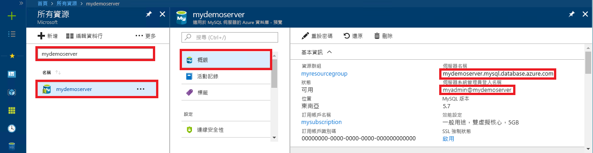
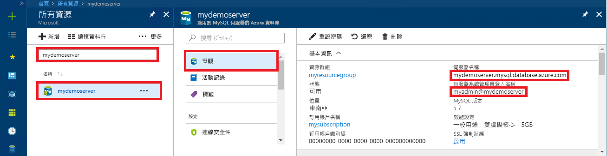

# <a name="quickstart-use-python-to-connect-and-query-data-with-azure-database-for-mysql"></a>快速入門：使用 Python 連線適用於 MySQL 的 Azure 資料庫並查詢資料
本快速入門示範如何使用 [Python](https://python.org) 連線至 Azure Database for MySQL。 您可以使用 SQL 陳述式查詢、插入、更新和刪除 Mac OS、Ubuntu Linux 和 Windows 平台的資料庫中的資料。 

本文假設您已熟悉使用 Python 進行開發，但不熟悉適用於 MySQL 的 Azure 資料庫。

## <a name="create-an-azure-database-for-mysql"></a>建立適用於 MySQL 的 Azure 資料庫 
依照下列指示，建立「適用於 MySQL 的 Azure 資料庫」伺服器和資料庫： 
- [使用 Azure 入口網站建立適用於 MySQL 的 Azure 資料庫伺服器](quickstart-create-mysql-server-database-using-azure-portal.md)，或 
- [使用 Azure CLI 建立適用於 MySQL 的 Azure 資料庫伺服器](quickstart-create-mysql-server-database-using-azure-cli.md) 

## <a name="install-python-and-the-mysql-connector"></a>安裝 Python 和 MySQL 連接器
使用下列步驟，在您的電腦上安裝 Python 和適用於 Python 的 MySQL 連接器： 

> [!NOTE]
> 本快速入門會使用原始 SQL 查詢方法連線至 MySQL。 如果您使用 Web 架構，請為這些架構使用建議的連接器，例如針對 Django 使用 [mysqlclient](https://pypi.org/project/mysqlclient/)。

1. 為您的作業系統下載並安裝 [Python 3.7 或更新版本](https://www.python.org/downloads/)。 請務必將 Python 新增至您的 `PATH`，因為 MySQL 連接器有此需要。
   
1. 開啟命令提示字元或 `bash` 殼層，並以大寫 V 參數執行 `python -V`，以檢查您的 Python 版本。
   
1. 最新版的 Python 中會包含 `pip` 套件安裝程式。 請執行 `pip install -U pip`，以將 `pip` 更新為最新版本。 
   
   若未安裝 `pip`，您可以使用 `get-pip.py` 加以下載並安裝。 如需詳細資訊，請參閱[安裝](https://pip.pypa.io/en/stable/installing/)。 
   
1. 使用 `pip` 安裝 Python 的 MySQL 連接器及其相依性：
   
   ```bash
   pip install mysql-connector-python
   ```
   
   您也可以從 [mysql.com](https://dev.mysql.com/downloads/connector/python/) 安裝 MySQL 的 Python 連接器。 若要深入了解 Python 的 MySQL 連接器，請參閱 [MySQL 連接器/Python 開發人員指南](https://dev.mysql.com/doc/connector-python/en/)。 

## <a name="get-connection-information"></a>取得連線資訊
從 Azure 入口網站取得連線至適用於 MySQL 的 Azure 資料庫所需的連線資訊。 您需要伺服器名稱、資料庫名稱和登入認證。

1. 登入 [Azure 入口網站](https://portal.azure.com/)。
   
1. 在入口網站的搜尋列中，搜尋並選取您所建立的「適用於 MySQL 的 Azure 資料庫」伺服器，例如 **mydemoserver**。
   
   
   
1. 在伺服器的 [概觀]  頁面上，記下 [伺服器名稱]  和 [伺服器管理員登入名稱]  。 如果您忘記密碼，您也可以從此頁面重設密碼。
   
   

## <a name="run-the-python-examples"></a>執行 Python 範例
針對本文中的每個程式碼範例：

1. 在文字編輯器中建立新的檔案。
1. 將程式碼範例新增至檔案。 在程式碼中，將 `<mydemoserver>`、`<myadmin>`、`<mypassword>` 和 `<mydatabase>` 預留位置取代為您的 MySQL 伺服器和資料庫的值。
1. 將副檔名為 *.py* 的檔案儲存到專案資料夾中，例如 *C:\pythonmysql\createtable.py* 或 */home/username/pythonmysql/createtable.py*。
1. 若要執行程式碼，請開啟命令提示字元或 `cd pythonmysql` 殼層，並將目錄切換至您的專案資料夾，例如 `bash`。 輸入後面接著檔案名稱的 `python` 命令 (例如 `python createtable.py`)，然後按 Enter 鍵。 
   
   > [!NOTE]
   > 在 Windows 上，如果找不到 *python.exe*，您可能需要將 Python 路徑新增至 PATH 環境變數中，或提供 *python.exe* 的完整路徑，例如 `C:\python27\python.exe createtable.py`。

## <a name="create-a-table-and-insert-data"></a>建立資料表及插入資料
使用下列程式碼搭配 **INSERT** SQL 陳述式連線至伺服器和資料庫、建立資料表，以並載入資料。 

程式碼會匯入 mysql.connector 程式庫，並使用 [connect()](https://dev.mysql.com/doc/connector-python/en/connector-python-api-mysql-connector-connect.html) 函式搭配 config 集合中的[引數](https://dev.mysql.com/doc/connector-python/en/connector-python-connectargs.html)連線至適用於 MySQL 的 Azure 資料庫。 此程式碼使用連線上的資料指標，而 [cursor.execute()](https://dev.mysql.com/doc/connector-python/en/connector-python-api-mysqlcursor-execute.html) 方法會對 MySQL 資料庫執行 SQL 查詢。 

```python
import mysql.connector
from mysql.connector import errorcode

# Obtain connection string information from the portal
config = {
  'host':'<mydemoserver>.mysql.database.azure.com',
  'user':'<myadmin>@<mydemoserver>',
  'password':'<mypassword>',
  'database':'<mydatabase>'
}

# Construct connection string
try:
   conn = mysql.connector.connect(**config)
   print("Connection established")
except mysql.connector.Error as err:
  if err.errno == errorcode.ER_ACCESS_DENIED_ERROR:
    print("Something is wrong with the user name or password")
  elif err.errno == errorcode.ER_BAD_DB_ERROR:
    print("Database does not exist")
  else:
    print(err)
else:
  cursor = conn.cursor()

  # Drop previous table of same name if one exists
  cursor.execute("DROP TABLE IF EXISTS inventory;")
  print("Finished dropping table (if existed).")

  # Create table
  cursor.execute("CREATE TABLE inventory (id serial PRIMARY KEY, name VARCHAR(50), quantity INTEGER);")
  print("Finished creating table.")

  # Insert some data into table
  cursor.execute("INSERT INTO inventory (name, quantity) VALUES (%s, %s);", ("banana", 150))
  print("Inserted",cursor.rowcount,"row(s) of data.")
  cursor.execute("INSERT INTO inventory (name, quantity) VALUES (%s, %s);", ("orange", 154))
  print("Inserted",cursor.rowcount,"row(s) of data.")
  cursor.execute("INSERT INTO inventory (name, quantity) VALUES (%s, %s);", ("apple", 100))
  print("Inserted",cursor.rowcount,"row(s) of data.")

  # Cleanup
  conn.commit()
  cursor.close()
  conn.close()
  print("Done.")
```

## <a name="read-data"></a>讀取資料
使用下列程式碼搭配 **SELECT** SQL 陳述式來連線和讀取資料。 

此程式碼會匯入 mysql.connector 程式庫，並使用 [connect()](https://dev.mysql.com/doc/connector-python/en/connector-python-api-mysql-connector-connect.html) 函式搭配 config 集合中的[引數](https://dev.mysql.com/doc/connector-python/en/connector-python-connectargs.html)連線至適用於 MySQL 的 Azure 資料庫。 此程式碼使用連線上的資料指標，而 [cursor.execute()](https://dev.mysql.com/doc/connector-python/en/connector-python-api-mysqlcursor-execute.html) 方法會對 MySQL 資料庫執行 SQL 查詢。 

此程式碼會使用 [fetchall()](https://dev.mysql.com/doc/connector-python/en/connector-python-api-mysqlcursor-fetchall.html) 方法來讀取資料列，並將結果集保存在集合資料列中，然後使用 `for` 迭代器對資料列執行迴圈。

```python
import mysql.connector
from mysql.connector import errorcode

# Obtain connection string information from the portal
config = {
  'host':'<mydemoserver>.mysql.database.azure.com',
  'user':'<myadmin>@<mydemoserver>',
  'password':'<mypassword>',
  'database':'<mydatabase>'
}

# Construct connection string
try:
   conn = mysql.connector.connect(**config)
   print("Connection established")
except mysql.connector.Error as err:
  if err.errno == errorcode.ER_ACCESS_DENIED_ERROR:
    print("Something is wrong with the user name or password")
  elif err.errno == errorcode.ER_BAD_DB_ERROR:
    print("Database does not exist")
  else:
    print(err)
else:
  cursor = conn.cursor()

  # Read data
  cursor.execute("SELECT * FROM inventory;")
  rows = cursor.fetchall()
  print("Read",cursor.rowcount,"row(s) of data.")

  # Print all rows
  for row in rows:
    print("Data row = (%s, %s, %s)" %(str(row[0]), str(row[1]), str(row[2])))

  # Cleanup
  conn.commit()
  cursor.close()
  conn.close()
  print("Done.")
```

## <a name="update-data"></a>更新資料
使用下列程式碼搭配 **UPDATE** SQL 陳述式來連線和更新資料。 

此程式碼會匯入 mysql.connector 程式庫，並使用 [connect()](https://dev.mysql.com/doc/connector-python/en/connector-python-api-mysql-connector-connect.html) 函式搭配 config 集合中的[引數](https://dev.mysql.com/doc/connector-python/en/connector-python-connectargs.html)連線至適用於 MySQL 的 Azure 資料庫。 此程式碼使用連線上的資料指標，而 [cursor.execute()](https://dev.mysql.com/doc/connector-python/en/connector-python-api-mysqlcursor-execute.html) 方法會對 MySQL 資料庫執行 SQL 查詢。 

```python
import mysql.connector
from mysql.connector import errorcode

# Obtain connection string information from the portal
config = {
  'host':'<mydemoserver>.mysql.database.azure.com',
  'user':'<myadmin>@<mydemoserver>',
  'password':'<mypassword>',
  'database':'<mydatabase>'
}

# Construct connection string
try:
   conn = mysql.connector.connect(**config)
   print("Connection established")
except mysql.connector.Error as err:
  if err.errno == errorcode.ER_ACCESS_DENIED_ERROR:
    print("Something is wrong with the user name or password")
  elif err.errno == errorcode.ER_BAD_DB_ERROR:
    print("Database does not exist")
  else:
    print(err)
else:
  cursor = conn.cursor()

  # Update a data row in the table
  cursor.execute("UPDATE inventory SET quantity = %s WHERE name = %s;", (200, "banana"))
  print("Updated",cursor.rowcount,"row(s) of data.")

  # Cleanup
  conn.commit()
  cursor.close()
  conn.close()
  print("Done.")
```

## <a name="delete-data"></a>刪除資料
使用下列程式碼搭配 **DELETE** SQL 陳述式來連線和移除資料。 

此程式碼會匯入 mysql.connector 程式庫，並使用 [connect()](https://dev.mysql.com/doc/connector-python/en/connector-python-api-mysql-connector-connect.html) 函式搭配 config 集合中的[引數](https://dev.mysql.com/doc/connector-python/en/connector-python-connectargs.html)連線至適用於 MySQL 的 Azure 資料庫。 此程式碼使用連線上的資料指標，而 [cursor.execute()](https://dev.mysql.com/doc/connector-python/en/connector-python-api-mysqlcursor-execute.html) 方法會對 MySQL 資料庫執行 SQL 查詢。 

```python
import mysql.connector
from mysql.connector import errorcode

# Obtain connection string information from the portal
config = {
  'host':'<mydemoserver>.mysql.database.azure.com',
  'user':'<myadmin>@<mydemoserver>',
  'password':'<mypassword>',
  'database':'<mydatabase>'
}

# Construct connection string
try:
   conn = mysql.connector.connect(**config)
   print("Connection established.")
except mysql.connector.Error as err:
  if err.errno == errorcode.ER_ACCESS_DENIED_ERROR:
    print("Something is wrong with the user name or password.")
  elif err.errno == errorcode.ER_BAD_DB_ERROR:
    print("Database does not exist.")
  else:
    print(err)
else:
  cursor = conn.cursor()

  # Delete a data row in the table
  cursor.execute("DELETE FROM inventory WHERE name=%(param1)s;", {'param1':"orange"})
  print("Deleted",cursor.rowcount,"row(s) of data.")

  # Cleanup
  conn.commit()
  cursor.close()
  conn.close()
  print("Done.")
```

## <a name="next-steps"></a>後續步驟
> [!div class="nextstepaction"]
> [使用匯出和匯入來移轉資料庫](./concepts-migrate-import-export.md)
