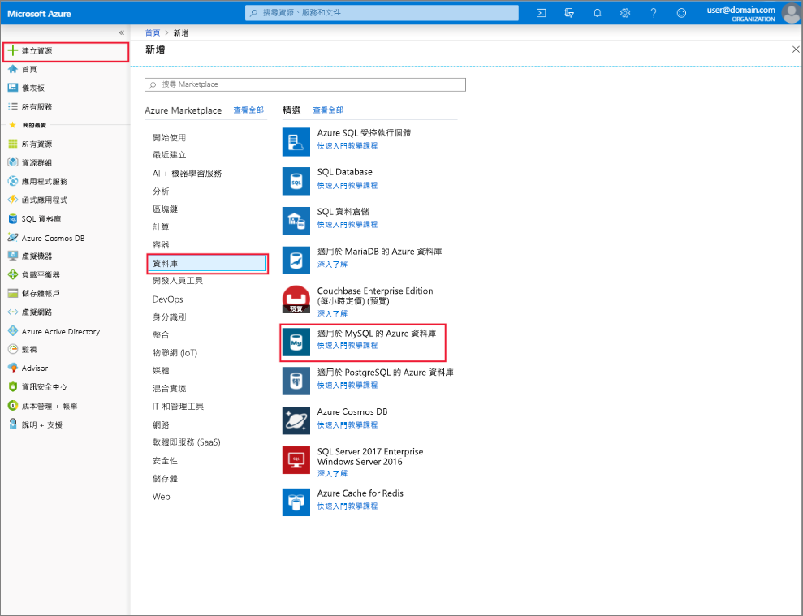

# 使用 Azure 入口網站建立和管理適用於 MySQL 的 Azure 資料庫伺服器
本主題說明如何快速建立新的適用於 MySQL 的 Azure 資料庫伺服器。 它也包含有關如何使用 Azure 入口網站來管理伺服器的資訊。 伺服器管理包括檢視伺服器詳細資料和資料庫、重設密碼、調整資源及刪除伺服器。

## 登入 Azure 入口網站
登入 [Azure 入口網站](https://portal.azure.com)。

## 建立適用於 MySQL 的 Azure 資料庫伺服器
請遵循下列步驟建立名為 "mydemoserver" 的「適用於 MySQL 的 Azure 資料庫」伺服器。

1. 按一下位於 Azure 入口網站左上角的 [建立資源] 按鈕。

2. 在 [新增] 頁面上，選取 [資料庫]，然後在 [資料庫] 頁面上選取 [適用於 MySQL 的 Azure 資料庫]。

    > 建立的「適用於 MySQL 的 Azure 資料庫」伺服器會有一組已定義的[計算和儲存體](./concepts-pricing-tiers.md)資源。 建立的資料庫位於 Azure 資源群組和「適用於 MySQL 的 Azure 資料庫」伺服器中。

   

3. 在「適用於 MySQL 的 Azure 資料庫」表單中填寫下列資訊︰

    | **表單欄位** | **欄位描述** |
    |----------------|-----------------------|
    | *伺服器名稱* | mydemoserver (伺服器名稱是全域唯一的) |
    | *訂用帳戶* | mysubscription (從下拉式功能表中選取) |
    | *資源群組* | myresourcegroup (建立新的資源群組，或使用現有的資源群組) |
    | *選取來源* | 空白 (建立空白的 MySQL 伺服器) |
    | *伺服器管理員登入* | myadmin (設定管理帳戶名稱) |
    | *密碼* | 設定管理帳戶密碼 |
    | *確認密碼* | 確認管理帳戶密碼 |
    | *位置* | 東南亞 (選取 [北歐] 或 [美國西部]) |
    | *版本* | 5.7 (選擇適用於 MySQL 的 Azure 資料庫伺服器版本) |

   

4. 按一下 [定價層] 指定新資料庫的服務層級和效能等級。 選取 [一般用途] 索引標籤。Gen 5、2 個虛擬核心、5 GB 和 7 天是**計算世代**、**虛擬核心**、**儲存體**和**備份保留期限**的預設值。 您可以讓這些滑桿保留原狀。 若要啟用異地備援儲存體中的伺服器備份，請從 [備份備援選項] 中選取 [異地備援]。

   

5. 按一下 [建立] 以佈建伺服器。 佈建需要幾分鐘的時間。

    > 選擇 [釘選到儀表板] 選項以輕鬆追蹤部署。

## 更新適用於 MySQL 的 Azure 資料庫伺服器
在布建新的伺服器之後, 使用者有數個選項可設定現有的伺服器, 包括重設系統管理員密碼、變更定價層, 以及藉由變更 vCore 或儲存體來相應增加或減少伺服器

### 變更系統管理員使用者密碼
1. 從伺服器 [概觀]，按一下 [重設密碼] 來顯示密碼重設視窗。

   

2. 在視窗中輸入新密碼並確認密碼，如下所示︰

   

3. 按一下 [確定] 儲存新密碼。

### 變更定價層
> [!NOTE]
> 調整僅支援從一般用途到記憶體優化的服務層級, 反之亦然。 請注意, 適用於 MySQL 的 Azure 資料庫不支援在伺服器建立後於基本定價層之間進行變更。
> 
1. 按一下 [設定] 底下的 [定價層]。
2. 選取您想要變更的**定價層**。

    

4. 按一下 [確定] 儲存變更。 

### 相應增加/減少 vCores

1. 按一下 [設定] 底下的 [定價層]。

2. 將滑桿移至所需的值來變更 [vCore] 設定。

    

3. 按一下 [確定] 儲存變更。

### 相應增加儲存體

1. 按一下 [設定] 底下的 [定價層]。

2. 將滑桿移至所需的值來變更 [儲存體] 設定。

    

3. 按一下 [確定] 儲存變更。

## 刪除適用於 MySQL 的 Azure 資料庫伺服器

1. 從伺服器 [概觀] 中，按一下 [刪除] 按鈕，開啟刪除確認提示。

    

2. 將伺服器的名稱輸入至輸入方塊中以便再次確認。

    

3. 按一下 [刪除]按鈕，確認刪除伺服器。 等待「已成功刪除 MySQL 伺服器」出現在通知列中。

## 列出「適用於 MySQL 的 Azure 資料庫」資料庫
從伺服器 [概觀] 中，向下捲動直到在底部看到資料庫圖格。 資料表中會列出伺服器中的所有資料庫。

   

## 顯示「適用於 MySQL 的 Azure 資料庫」伺服器的詳細資料
按一下位於 [設定] 下的 [屬性]檢視有關伺服器的詳細資訊。

## 後續步驟

[快速入門：使用 Azure 入口網站建立適用於 MySQL 的 Azure 資料庫伺服器](./quickstart-create-mysql-server-database-using-azure-portal.md)