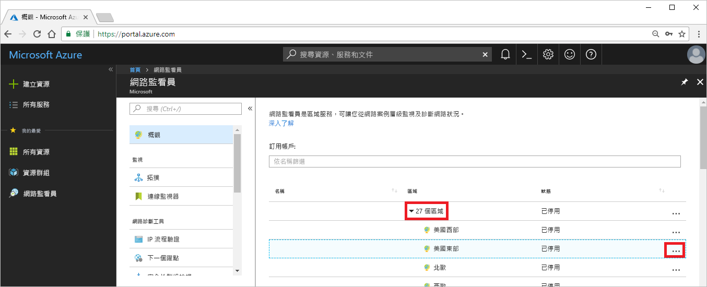

# 教學課程：使用 Azure 入口網站診斷虛擬機器網路路由問題

當您部署虛擬機器 (VM) 時，Azure 會為其建立數個預設路由。 您可以建立自訂路由來覆寫 Azure 的預設路由。 有時候，自訂路由可能會導致 VM 無法與其他資源通訊。 在本教學課程中，您了解如何：

> [!div class="checklist"]
> * 建立 VM
> * 使用網路監看員的下一個躍點功能測試與 URL 的通訊
> * 測試與 IP 位址的通訊
> * 診斷路由問題，並了解如何解決問題

如果您想要，也可以使用 [Azure CLI](diagnose-vm-network-routing-problem-cli.md) 或 [Azure PowerShell](diagnose-vm-network-routing-problem-powershell.md) 來診斷虛擬機器網路路由問題。

如果您沒有 Azure 訂用帳戶，請在開始前建立 [免費帳戶](https://azure.microsoft.com/free/?WT.mc_id=A261C142F) 。

## 登入 Azure

在 https://portal.azure.com 上登入 Azure 入口網站。

## 建立 VM

1. 選取 Azure 入口網站左上角的 [+ 建立資源]。
2. 選取 [計算]，然後選取 [Windows Server 2016 Datacenter] 或 [Ubuntu Server 17.10 VM]。
3. 輸入或選取下列資訊、接受其餘設定的預設值，然後選取 [確定]：

    |設定|值|
    |---|---|
    |Name|myVm|
    |使用者名稱| 輸入您選擇的使用者名稱。|
    |密碼| 輸入您選擇的密碼。 密碼長度至少必須有 12 個字元，而且符合[定義的複雜度需求](../virtual-machines/windows/faq.md?toc=%2fazure%2fnetwork-watcher%2ftoc.json#what-are-the-password-requirements-when-creating-a-vm)。|
    |訂用帳戶| 選取您的訂用帳戶。|
    |資源群組| 選取 [新建]，然後輸入 **myResourceGroup**。|
    |位置| 選取 [美國東部]|

4. 選取 VM 的大小，然後選取 [選取]。
5. 在 [設定] 底下，接受所有預設值，然後選取 [確定]。
6. 在 [摘要] 的 [建立] 底下，選取 [建立] 來開始部署 VM。 部署 VM 需要幾分鐘的時間。 等候虛擬機器完成部署，再繼續進行其餘步驟。

## 測試網路通訊

若要測試網路監看員的網路通訊，您必須先啟用至少一個 Azure 區域中的網路監看員，然後使用網路監看員的下一個躍點功能來測試通訊。

### 啟用網路監看員

如果您已啟用至少一個區域中的網路監看員，請跳至[使用下一個躍點](#use-next-hop)。

1. 在入口網站中，選取 [所有服務]。 在 [篩選] 方塊中，輸入*網路監看員*。 當結果中出現**網路監看員**時，請加以選取。
2. 選取 [區域]、展開它，然後選取 [美國東部] 右邊的 [...]，如下圖所示：

    

3. 選取 [啟用網路監看員]。

### 使用下一個躍點

Azure 會自動建立通往預設目的地的路由。 您可以建立覆寫預設路由的自訂路由。 有時候，自訂路由可能會導致通訊失敗。 使用網路監看員的下一個躍點功能，可判斷 Azure 用來路由流量的是哪一個路由。

1. 在 Azure 入口網站中的 [網路監看員] 下方，選取 [下一個躍點]。
2. 選取您的訂用帳戶，輸入或選取下列值，然後選取 [下一個躍點]，如下圖所示：

    |設定                  |值                                                   |
    |---------                |---------                                               |
    | 資源群組          | 選取 myResourceGroup                                 |
    | 虛擬機器         | 選取 myVm                                            |
    | Linux       | myvm (您的網路介面名稱可能會不同)。   |
    | 來源 IP 位址       | 10.0.0.4                                               |
    | 目的地 IP 位址  | 13.107.21.200 (www.bing.com 的其中一個位址)。 |

    

    幾秒之後，結果會通知您下一個躍點類型是 [網際網路]，而 [路由表識別碼] 是 [系統路由]。 此結果可讓您知道通往目的地的系統路由是有效的。

3. 將 [目的地 IP 位址] 變更為 172.31.0.100，然後再次選取 [下一個躍點]。 傳回的結果會通知您 [下個躍點類型] 是 [無]，而 [路由表識別碼] 也是 [系統路由]。 此結果可讓您知道，雖然通往目的地的系統路由是有效的，但沒有下一個躍點可將流量路由至目的地。

## 檢視路由的詳細資料

1. 若要進一步分析路由，請檢閱網路介面的有效路由。 在入口網站頂端的 [搜尋] 方塊中輸入 myvm (或任何您檢查的網路介面名稱)。 當 **myvm** 出現在搜尋結果中時，選取它。
2. 在 [支援與疑難排解] 底下選取 [有效路由]，如下圖所示︰

    

    當您透過[使用下一個躍點](#use-next-hop)中的 13.107.21.200 來執行測試時，位址前置詞為 0.0.0.0/0 的路由會用來將流量路由至該位址，因為沒有其他路由包含此位址。 根據預設，如果位址並未指定在另一個路由的位址前置詞中，則會路由至網際網路。

    然而，當您使用 172.31.0.100 執行測試時，結果會通知您已沒有下一個躍點類型。 如同上一張圖所示，雖然有通往 172.16.0.0/12 前置詞的預設路由，且其中包含 172.31.0.100 位址，但 [下一個躍點類型] 是 [無]。 Azure 會建立通往 172.16.0.0/12 的預設路由，但不會指定下一個躍點類型，除非有理由這麼做。 例如，如果您將 172.16.0.0/12 位址範圍新增至虛擬網路的位址空間，則 Azure 會將此路由的 [下一個躍點類型] 變更為 [虛擬網路]。 執行檢查後就會將 [虛擬網路] 顯示為 [下一個躍點類型]。

## 清除資源

當不再需要資源群組時，請將資源群組及其包含的所有資源刪除：

1. 在入口網站頂端的 [搜尋] 方塊中，輸入 myResourceGroup。 當您在搜尋結果中看到 myResourceGroup 時，請加以選取。
2. 選取 [刪除資源群組]。
3. 針對 [輸入資源群組名稱:] 輸入 myResourceGroup，然後選取 [刪除]。

## 後續步驟

在本教學課程中，您已建立 VM 並診斷來自 VM 的網路路由。 您已了解 Azure 會建立數個預設路由及測試通往兩個不同目的地的路由。 深入了解[Azure 中的路由](../virtual-network/virtual-networks-udr-overview.md?toc=%2fazure%2fnetwork-watcher%2ftoc.json)以及如何[建立自訂路由](../virtual-network/manage-route-table.md?toc=%2fazure%2fnetwork-watcher%2ftoc.json#create-a-route)。

針對輸出 VM 連線，您也可以使用網路監看員的[連線疑難排解](network-watcher-connectivity-portal.md)功能，來決定延遲、VM 與端點之間所允許和拒絕的網路流量，以及用於端點的路由。 了解如何使用網路監看員的連線監視功能，來監視一段時間中 VM 與端點 (例如 IP 位址或 URL) 之間的通訊情形。

> [!div class="nextstepaction"]
> [監視網路連線](connection-monitor.md)