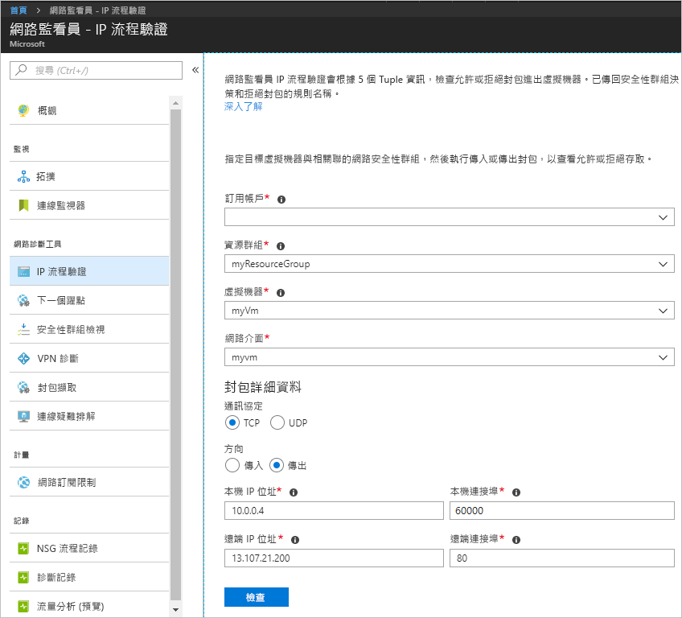
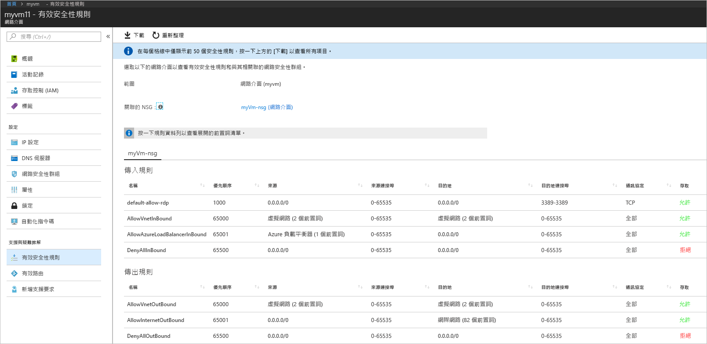
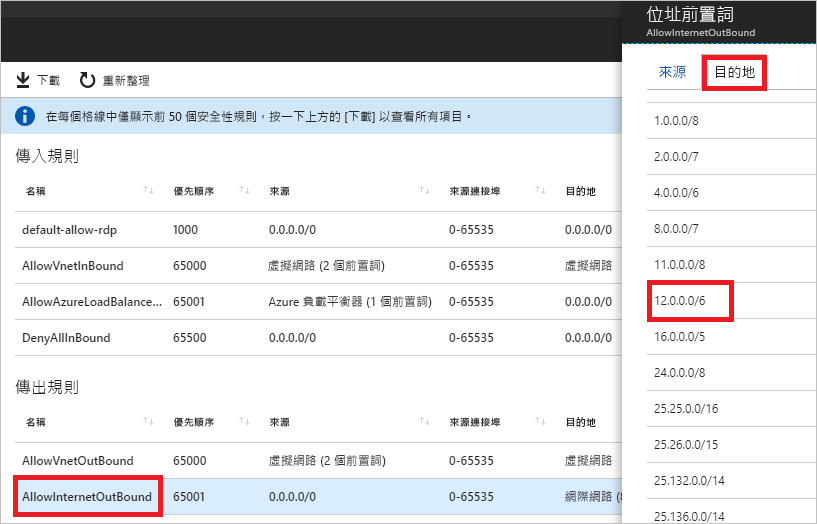

# 快速入門：使用 Azure 入口網站診斷虛擬機器網路流量篩選問題

本快速入門中，您可部署虛擬機器 (VM)，然後檢查送至 IP 位址和 URL 以及來自 IP 位址的通訊。 您可判斷通訊失敗的原因及其解決方式。

如果您沒有 Azure 訂用帳戶，請在開始前建立 [免費帳戶](https://azure.microsoft.com/free/?WT.mc_id=A261C142F) 。

## 登入 Azure

在 https://portal.azure.com 上登入 Azure 入口網站。

## 建立 VM

1. 選取 Azure 入口網站左上角的 [+ 建立資源]。
2. 選取 [計算]，然後選取 [Windows Server 2016 Datacenter] 或 [Ubuntu Server 17.10 VM]。
3. 輸入或選取下列資訊、接受其餘設定的預設值，然後選取 [確定]：

    |設定|值|
    |---|---|
    |Name|myVm|
    |使用者名稱| 輸入您選擇的使用者名稱。|
    |密碼| 輸入您選擇的密碼。 密碼長度至少必須有 12 個字元，而且符合[定義的複雜度需求](../virtual-machines/windows/faq.md?toc=%2fazure%2fnetwork-watcher%2ftoc.json#what-are-the-password-requirements-when-creating-a-vm)。|
    |訂用帳戶| 選取您的訂用帳戶。|
    |資源群組| 選取 [新建]，然後輸入 **myResourceGroup**。|
    |位置| 選取 [美國東部]|

4. 選取 VM 的大小，然後選取 [選取]。
5. 在 [設定] 底下，接受所有預設值，然後選取 [確定]。
6. 在 [摘要] 的 [建立] 底下，選取 [建立] 來開始部署 VM。 部署 VM 需要幾分鐘的時間。 等候虛擬機器完成部署，再繼續進行其餘步驟。

## 測試網路通訊

若要測試網路監看員的網路通訊，請先在至少一個 Azure 地區啟用網路監看員，然後使用網路監看員的 IP 流量驗證功能。

### 啟用網路監看員

如果您已經在至少一個地區啟用網路監看員，請跳至[使用 IP 流程驗證](#use-ip-flow-verify)。

1. 在入口網站中，選取 [所有服務]。 在 [篩選條件] 方塊中，輸入*網路監看員*。 當結果中出現**網路監看員**時，請加以選取。
2. 在美國東部地區啟用網路監看員，因為這是前一個步驟中部署 VM 的區域。 選取 [地區]、展開它，然後選取 [美國東部] 右邊的 [...]，如下圖所示：

    

3. 選取 [啟用網路監看員]。

### 使用 IP 流量驗證

根據預設，當您建立 VM 時，Azure 會允許及拒絕 VM 的雙向網路流量。 您稍後可能會覆寫 Azure 的預設值，並允許或拒絕其他類型的流量。

1. 在入口網站中，選取 [所有服務]。 在 [篩選條件] 方塊的 [所有服務] 中，輸入 [網路監看員]。 當結果中出現**網路監看員**時，請加以選取。
2. 在 [網路診斷工具] 底下，選取 [IP 流量驗證]。
3. 選取您的訂用帳戶，輸入或選取下列值，然後選取 [檢查]，如下圖所示：

    |設定            |值                                                                                              |
    |---------          |---------                                                                                          |
    | 資源群組    | 選取 myResourceGroup                                                                            |
    | 虛擬機器   | 選取 myVm                                                                                       |
    | Linux | myvm - 當您建立的 VM 不同時，入口網站所建立的網路介面名稱。 |
    | 通訊協定          | TCP                                                                                               |
    | 方向         | 輸出                                                                                          |
    | 本機 IP 位址  | 10.0.0.4                                                                                          |
    | 本機連接埠      | 60000                                                                                                |
    | 遠端 IP 位址 | 13.107.21.200 (www.bing.com 的其中一個位址)。                                             |
    | 遠端連接埠       | 80                                                                                                |

    

    幾秒之後，傳回的結果會通知您，因為名為 **AllowInternetOutbound** 的安全性規則而允許存取。 在執行檢查之前，如果您在美國東部地區以外的地區中有現有的網路監看員，則在執行檢查時，網路監看員會自動在美國東部地區建立網路監看員。
4. 再次完成步驟 3，但是將 [遠端 IP 位址] 變更為 **172.31.0.100**。 傳回的結果會通知您，因為名為 **DefaultOutboundDenyAll** 的安全性規則而拒絕存取。
5. 再次完成步驟 3，但是將 [方向] 變更為 [輸入]、[本機連接埠] 變更為 [80]，以及將 [遠端連接埠] 變更為 [60000]。 傳回的結果會通知您，因為名為 **DefaultInboundDenyAll** 的安全性規則而拒絕存取。

既然您已知道哪些安全性規則允許或拒絕 VM 的流量，即可判斷如何解決問題。

## 檢視安全性規則的詳細資料

1. 若要判斷[使用 IP 流量驗證](#use-ip-flow-verify)的步驟 3-5 中的規則允許或拒絕通訊，請檢閱 VM 中網路介面的有效安全性規則。 在入口網站頂端的搜尋方塊中，輸入 myvm。 當搜尋結果中出現 **myvm** (或任何您的網路介面名稱) 網路介面時，請加以選取。
2. 在 [支援與疑難排解] 底下選取 [有效安全性規則]，如下圖所示︰

    

    在[使用 IP 流量驗證](#use-ip-flow-verify)的步驟 3 中，您已了解因為 **AllowInternetOutbound** 規則而允許通訊的原因。 您可以在上一張圖中看到規則的 [目的地] 是 **Internet**。 雖然並不清楚 13.107.21.200 (您在[使用 IP 流量驗證](#use-ip-flow-verify)的步驟 3 中測試的位址) 與 **Internet** 有何關連。
3. 選取 [AllowInternetOutBound] 規則，然後選取 [目的地]，如下圖所示：

    

    清單中有一個前置詞是 **12.0.0.0/6**，其中包含 IP 位址的 12.0.0.1-15.255.255.254 範圍。 因為 13.107.21.200 在該位址範圍內，所以 **AllowInternetOutBound** 規則允許輸出流量。 此外，步驟 2 的圖片中並未顯示任何會覆寫此規則的較高優先順序 (數字較小) 規則。 關閉 [位址首碼] 方塊。 若要拒絕送至 13.107.21.200 的輸出通訊，您可以新增具有較高優先順序的安全性規則，以拒絕連接埠 80 輸出至此 IP 位址。
4. 當您在[使用 IP 流量驗證](#use-ip-flow-verify)的步驟 4 中執行送至 172.131.0.100 的輸出檢查時，您已了解 **DefaultOutboundDenyAll** 規則拒絕通訊。 該規則等同於步驟 2 圖片中顯示的 **DenyAllOutBound** 規則，其將 **0.0.0.0/0** 指定為 [目的地]。 此規則會拒絕送至 172.131.0.100 的輸出通訊，因為此位址不在圖中所示的任何其他 [輸出規則] 的 [目的地] 中。 若要允許輸出通訊，您可以新增較高優先順序的安全性規則，以允許針對 172.131.0.100 位址輸出至通訊埠 80 的流量。
5. 當您在[使用 IP 流量驗證](#use-ip-flow-verify)的步驟 5 中執行來自 172.131.0.100 的輸入檢查時，您已了解 **DefaultInboundDenyAll** 規則拒絕通訊。 該規則等同於步驟 2 圖片中顯示的 **DenyAllInBound** 規則。 系統會強制執行 **DenyAllInBound** 規則，因為沒有其他較高優先順序的規則存在，可允許連接埠 80 從 172.31.0.100 輸入至 VM。 若要允許輸入通訊，您可以新增較高優先順序的安全性規則，以允許通訊埠 80 從 172.31.0.100 輸入。

本快速入門中的檢查已測試 Azure 組態。 如果檢查傳回預期的結果，但仍有網路問題，請確定您的 VM 與您正在通訊的端點之間沒有防火牆，而且您的 VM 中的作業系統沒有允許或拒絕通訊的防火牆。

## 清除資源

當不再需要資源群組時，請將資源群組及其包含的所有資源刪除：

1. 在入口網站頂端的 [搜尋] 方塊中，輸入 myResourceGroup。 當您在搜尋結果中看到 myResourceGroup 時，請加以選取。
2. 選取 [刪除資源群組]。
3. 針對 [輸入資源群組名稱:] 輸入 myResourceGroup，然後選取 [刪除]。

## 後續步驟

在本快速入門中，您已建立 VM 並診斷出輸入和輸出網路流量篩選條件。 您已了解網路安全性群組規則允許或拒絕 VM 的雙向流量。 深入了解[安全性規則](../virtual-network/security-overview.md?toc=%2fazure%2fnetwork-watcher%2ftoc.json)以及如何[建立安全性規則](../virtual-network/manage-network-security-group.md?toc=%2fazure%2fnetwork-watcher%2ftoc.json#create-a-security-rule)。

即使採用適當的網路流量篩選條件，VM 的通訊仍可能因為路由組態而失敗。 若要了解如何診斷 VM 網路路由問題，請參閱[診斷 VM 路由問題](diagnose-vm-network-routing-problem.md)，或若要透過一項工具來診斷輸出路由、延遲和流量篩選問題，請參閱[連線疑難排解](network-watcher-connectivity-portal.md)。