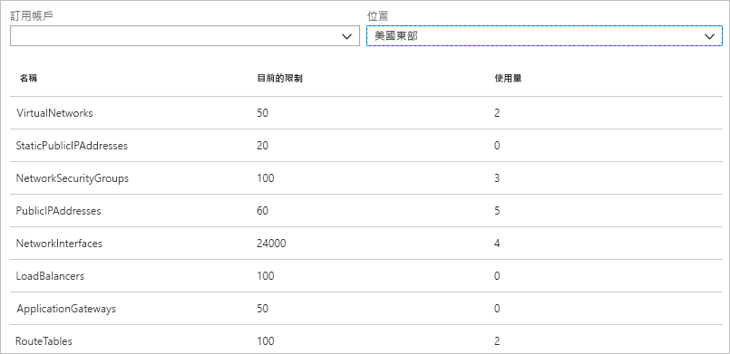

# 什麼是 Azure 網路監看員？

Azure 網路監看員提供了相關工具，可對 Azure 虛擬網路中的資源進行監視、診斷、檢視計量，以及啟用或停用記錄。

## 監視

### 監視虛擬機器與端點之間的通訊

端點可以是另一個虛擬機器 (VM)、完整網域名稱 (FQDN)、統一資源識別項 (URI) 或 IPv4 位址。 *連線監視器*功能可定期監視 VM 與端點之間的存取性、延遲和網路拓撲變更，並對您發出通知。 例如，您可能會有與資料庫伺服器 VM 通訊的 Web 伺服器 VM。 您的組織中可能會有您不認識的人將自訂路由或網路安全性規則套用至 Web 伺服器或資料庫伺服器 VM 或子網路。

如果端點變得無法連線，連線疑難排解會通知其原因。 可能的原因包括 DNS 名稱解析問題，VM 作業系統內的 CPU、記憶體或防火牆有問題，或是自訂路由的躍點類型、VM 的安全性規則或輸出連線的子網路有問題。 深入了解 Azure 中的[安全性規則](../virtual-network/security-overview.md?toc=%2fazure%2fnetwork-watcher%2ftoc.json#security-rules)和[路由躍點類型](../virtual-network/virtual-networks-udr-overview.md?toc=%2fazure%2fnetwork-watcher%2ftoc.json)。

連線監視器也會提供在一段時間內觀察到的最小、平均和最大延遲。 在了解連線的延遲後，您或許就能藉由將 Azure 資源移至不同的 Azure 區域，而減少延遲。 深入了解如何判斷 [Azure 區域與網際網路服務提供者之間的相對延遲](#determine-relative-latencies-between-azure-regions-and-internet-service-providers)，以及如何使用[連線監視器](connection-monitor.md)來監視 VM 與端點之間的通訊。 如果您想要在某個時間點測試連線，而非在一段時間內監視連線，您可以比照使用連線監視器的方式，來使用[連線疑難排解](#connection-troubleshoot)功能。

網路效能監視器是雲端式的混合網路監視解決方案，可協助您監視網路基礎結構中多個端點間的網路效能。 也可協助您監視服務和應用程式端點的網路連線能力，以及監視 Azure ExpressRoute 的效能。 網路效能監視器會偵測網路問題，例如流量黑洞、路由錯誤，以及傳統網路監視方法無法偵測的問題。 此解決方案會在違反網路連結的臨界值時產生警示並通知您。 它可確實而及時地偵測網路效能問題，並將問題的來源限縮於特定網路區段或裝置。 深入了解[網路效能監視器](../log-analytics/log-analytics-network-performance-monitor.md?toc=%2fazure%2fnetwork-watcher%2ftoc.json)。

### 檢視虛擬網路中的資源及其關聯性

當資源新增至虛擬網路後，就會變得難以了解有哪些資源位於虛擬網路中及其彼此間有何關聯。 *拓撲*功能可讓您為虛擬網路中的資源以及資源之間的關聯性產生視覺化圖表。 下圖顯示虛擬網路的範例拓撲圖表，其中包含三個子網路、兩個 VM、網路介面、公用 IP 位址、網路安全性群組、路由表，以及這些資源之間的關聯性：

您可以下載 svg 格式、可供編輯的圖片版本。 深入了解[拓撲檢視](view-network-topology.md)。

## 診斷

### 診斷進出於 VM 的網路流量篩選問題

當您部署 VM 時，Azure 會將數個預設安全性規則套用至 VM，以允許或拒絕進出於 VM 的流量。 您可以覆寫 Azure 的預設規則，或建立其他規則。 在某些時候，VM 可能會因為安全性規則而變得無法與其他資源通訊。 *IP 流量驗證*功能可讓您指定來源和目的地 IPv4 位址、連接埠、通訊協定 (TCP 或 UDP)，以及流量方向 (輸入或輸出)。 然後，IP 流量驗證會測試通訊，並在連線成功或失敗時通知您。 如果連線失敗，IP 流量驗證會指出允許或拒絕通訊的安全性規則，以便您解決問題。 透過完成[診斷虛擬機器網路流量篩選問題](diagnose-vm-network-traffic-filtering-problem.md)教學課程，來深入了解 IP 流量驗證。

### 診斷來自 VM 的網路路由問題

當您建立虛擬網路時，Azure 會為網路流量建立數個預設輸出路由。 所有資源 (例如在虛擬網路中部署的 VM) 的輸出流量都會根據 Azure 的預設路由進行路由傳送。 您可以覆寫 Azure 的預設路由，或建立其他路由。 您可能會發現 VM 因特定的路徑而無法再與其他資源通訊。 *下一個躍點*功能可讓您指定來源和目的地 IPv4 位址。 接著，下一個躍點會測試通訊，並向您指出用來路由流量的何種類型的下一個躍點。 其後，您可以移除、變更或新增路由，以解決路由問題。 深入了解[下一個躍點](diagnose-vm-network-routing-problem.md)功能。

### 診斷來自 VM 的輸出連線

*測試疑難排解*功能可讓您測試不同 VM 之間的連線、FQDN、URI 或 IPv4 位址。 此測試會傳回使用[連線監視器](#connection-monitor)功能時傳回的類似資訊，但會測試某個時間點的連線，而不是像連線監視器一樣監視連線一段時間。 深入了解如何使用[連線疑難排解](network-watcher-connectivity-overview.md)對連線進行疑難排解。

### 擷取進出於 VM 的封包

進階篩選選項和微調控制項 (例如能夠設定時間和大小限制) 可讓您靈活擷取資料。 擷取的資料可以儲存在 Azure 儲存體中以及 (或) VM 的磁碟上。 接著，您可以使用數個標準網路擷取分析工具來分析擷取檔案。 深入了解[封包擷取](network-watcher-packet-capture-overview.md)。

### 對 Azure 虛擬網路閘道和連線進行疑難排解

虛擬網路閘道可提供內部部署資源與 Azure 虛擬網路之間的連線。 監視閘道器及其連線，對於確保通訊不中斷至關重要。 *VPN 診斷*功能可讓您診斷閘道與連線。 「VPN 診斷」可診斷閘道或閘道連線的健全狀況，並向您指出閘道和閘道連線是否可供使用。 如果閘道或連線無法使用，VPN 診斷將會為您說明其原因，以便解決問題。 透過完成[診斷網路之間的通訊問題](diagnose-communication-problem-between-networks.md)教學課程，來深入了解 VPN。

### 判斷 Azure 區域和網際網路服務提供者之間的相對延遲

您可以查詢網路監看員，以取得 Azure 區域和各個網際網路服務提供者之間的延遲資訊。 當您得知 Azure 區域與各個網際網路服務提供者之間的延遲後，您就可以部署 Azure 資源，以最佳化網路回應時間。 深入了解[相對延遲](view-relative-latencies.md)。

### 檢視網路介面的安全性規則

網路介面的有效安全性規則，是所有對網路介面和網路介面所在的子網路套用的安全性規則的組合。  *安全性群組檢視*功能可為您顯示所有對網路介面和網路介面所在的子網路套用的安全性規則，以及兩者的彙總。 了解對網路介面套用了哪些規則後，您將可新增、移除或變更規則 (如果這些允許或拒絕您想要變更的流量)。 深入了解[安全性群組檢視](network-watcher-security-group-view-overview.md)。

## 度量

您可以在 Azure 訂用帳戶和區域內建立的網路資源數目有其[限制](../azure-subscription-service-limits.md?toc=%2fazure%2fnetwork-watcher%2ftoc.json#azure-resource-manager-virtual-networking-limits)。 當您達到限制時，即無法在訂用帳戶或區域內建立更多資源。 *網路訂用帳戶限制*功能可概略歸納出您在訂用帳戶和區域中已部署的各種網路資源數目，以及各項資源的限制。 下圖顯示範例訂用帳戶在美東地區已部署之網路資源的部分輸出：

在規劃未來的資源部署時，這項資訊會很有幫助。

## 記錄檔

### 分析網路安全性群組的輸入或輸出流量

網路安全性群組 (NSG) 會允許或拒絕 VM 中某個網路介面的輸入和輸出流量。 *NSG 流量記錄*功能可讓您記錄來源和目的地 IP 位址、連接埠、通訊協定，以及 NSG 是否允許或拒絕流量。 您可以使用多種工具來分析記錄，例如 PowerBI 和*流量分析*功能。 流量分析可針對寫入至 NSG 流量記錄的資料提供豐富的視覺效果。 下圖顯示流量分析從 NSG 流量記錄資料呈現的資訊和視覺效果的部分資訊：

透過完成[記錄來往虛擬機器的網路流量](network-watcher-nsg-flow-logging-portal.md)教學課程，以深入了解 NSG 流程記錄及如何實作[流量分析](traffic-analytics.md)。

### 檢視網路資源的診斷記錄

您可以啟用 Azure 網路資源的診斷記錄，例如網路安全性群組、公用 IP 位址、負載平衡器、虛擬網路閘道，以及應用程式閘道。 *診斷記錄*功能提供單一介面，可為任何會產生診斷記錄的現有網路資源啟用和停用網路資源診斷記錄。 您可以使用 Microsoft Power BI 和 Azure Log Analytics 等工具來檢視診斷記錄。 若要深入了解如何分析 Azure 網路診斷記錄，請參閱 [Log Analytics 中的 Azure 網路解決方案](../log-analytics/log-analytics-azure-networking-analytics.md?toc=%2fazure%2fnetwork-watcher%2ftoc.json)。

## 後續步驟

現在您已經大致了解 Azure 網路監看員。 若要開始使用網路監看員，請使用 IP 流量驗證來診斷虛擬機器常見的輸入和輸出通訊問題。 若想了解其作法，請參閱[診斷虛擬機器網路流量篩選問題](diagnose-vm-network-traffic-filtering-problem.md)快速入門。
