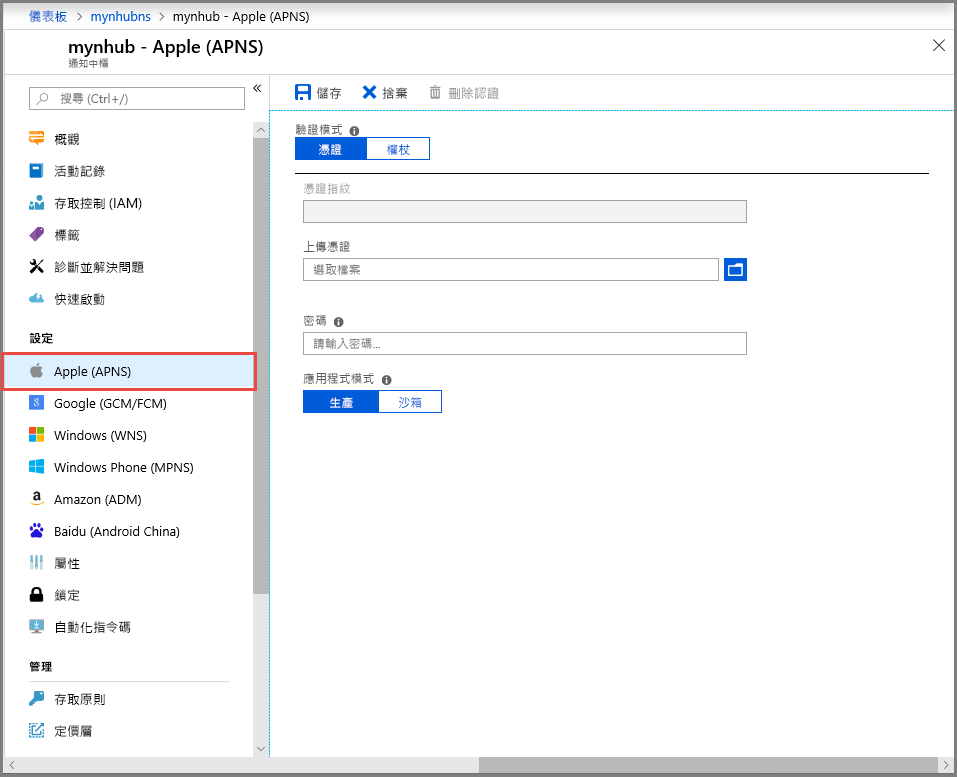
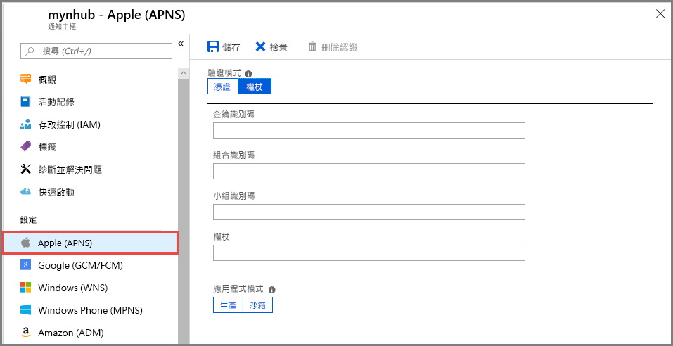

# 在 Azure 入口網站中設定通知中樞的 Apple Push Notification Service (APNS) 設定
這篇文章會示範如何使用 Azure 入口網站設定 Azure 通知中樞的 Apple Push Notification Service (APNS) 設定。 

## 必要條件
如果你尚未创建通知中心，现在请创建一个。 有关详细信息，请参阅[在 Azure 门户中创建 Azure 通知中心](create-notification-hub-portal.md)。 

## 設定 Apple 推播通知服務

下列程序可讓您針對通知中樞的 Apple Push Notification Service (APNS) 設定步驟：

1. 在 Azure 入口網站中，在**通知中樞**頁面上，選取**Apple (APNS)** 左側功能表上。

1. 对于“身份验证模式”，请选择“证书”或“令牌”。

   a. 如果选择“证书”：
   * 选择“文件”图标，然后选择要上传的“.p12”文件。
   * 輸入密碼。
   * 選取 [沙箱] 模式。 或者，若要将推送通知发送给从应用商店中购买了你的应用的用户，请选择“生产”模式。

     

   b. 如果选择“令牌”：

   * 輸入的值**金鑰識別碼**，**套件組合識別碼**，**小組識別碼**，以及**語彙基元**。
   * 選取 [沙箱] 模式。 或者，若要将推送通知发送给从应用商店中购买了你的应用的用户，请选择“生产”模式。

     

## 後續步驟
如需教學課程逐步解說將通知推送到 iOS 裝置，請參閱下列文章：[使用通知中心和 APNS 将通知推送到 iOS 设备](notification-hubs-ios-apple-push-notification-apns-get-started.md)
