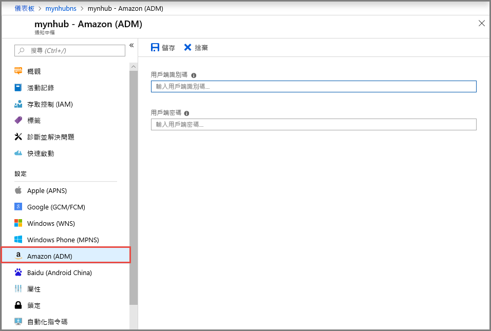
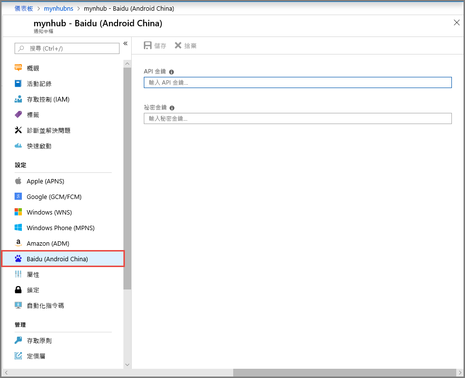

# 在 Azure 入口網站中使用平台通知系統設定來設定 Azure 通知中樞 
Azure 通知中樞提供易於使用且相應放大的推播引擎，可讓您從任何後端 (雲端或內部部署) 傳送通知到任何平台 (iOS、Android、Windows、Kindle、Baidu 等)。 如需該服務的詳細資訊，請參閱[什麼是 Azure 通知中樞？](notification-hubs-push-notification-overview.md)。

請[使用 Azure 入口網站建立 Azure 通知中樞](create-notification-hub-portal.md) (如果您還未建立)。 在本快速入門中，您會了解如何使用平台通知系統 (PNS) 設定在 Azure 入口網站中設定通知中樞。

## Apple Push Notification Service (APNS)
1. 在 Azure 入口網站中的 [通知中樞] 頁面上，於左側功能表上的 [設定] 底下選取 [Apple (APNS)]。
2. 如果您選取 [憑證]，並執行下列動作：
    1. 選取 [檔案] 圖示，然後選取要上傳的 **.p12** 檔案。 
    2. 指定 [密碼]。
    3. 選取 [沙箱] 模式。 只有在您想傳送推播通知給從市集購買 App 的使用者時，才使用 [生產] 模式。

        
3. 如果您選取 [權杖]，並遵循下列步驟： 
    1. 輸入 [金鑰識別碼]、[搭售方案識別碼]、[小組識別碼] 和 [權杖] 的值。
    2. 選取 [沙箱] 模式。 只有在您想傳送推播通知給從市集購買 App 的使用者時，才使用 [生產] 模式。

        

如需如何使用 Azure 通知中樞和 Apple Push Notification Service (APNS) 將通知推送至 iOS 裝置的完整教學課程，請參閱[此教學課程](notification-hubs-ios-apple-push-notification-apns-get-started.md)。

## Google Firebase 雲端傳訊 (FCM)
1. 在 Azure 入口網站中的 [通知中樞] 頁面上，於左側功能表上的 [設定] 底下選取 [Google (GCM/FCM)]。 
2. 針對您稍早儲存的 FCM 專案，貼上**伺服器金鑰**。 
3. 在工具列上選取 [儲存]。 

    
4. 您會看到警示中的訊息表示已成功更新通知中樞。 [儲存] 按鈕已停用。 

如需如何使用 Azure 通知中樞和 Google Firebase 雲端傳訊將通知推送至 Android 裝置的完整教學課程，請參閱[此教學課程](notification-hubs-android-push-notification-google-fcm-get-started.md)。

## Windows 推播通知服務 (WNS)
1. 在 Azure 入口網站中的 [通知中樞] 頁面上，於左側功能表上的 [設定] 底下選取 [Windows (WNS)]。
2. 輸入 [套件 SID] 和 [安全性金鑰] 的值。
3. 在工具列上選取 [儲存]。

    

如需如何將通知推送至 Windows 裝置上執行中通用 Windows 平台 (UWP) 應用程式的完整教學課程，請參閱[此教學課程](notification-hubs-windows-store-dotnet-get-started-wns-push-notification.md)。

## Windows Phone - Microsoft 推播通知服務
1. 在 Azure 入口網站中的 [通知中樞] 頁面上，選取 [設定] 底下的 [Windows Phone (MPNS)]。
2. 如果您想要啟用未經驗證的推送，請選取 [啟用未經驗證的推送]，然後選取工具列上的 [儲存]。

    
3. 如果您想要使用**已驗證**的推送，請遵循下列步驟：
    1. 在工具列上選取 [上傳憑證]。
    2. 選取 [檔案] 圖示並選取憑證檔案。
    3. 輸入憑證的 [密碼]。 
    4. 選取 [確定] 以關閉 [上傳憑證] 頁面。 
    5. 在 [Windows Phone (MPNS)] 頁面上，選取工具列上的 [儲存]。

如需如何使用 Microsoft 推播通知服務 (MPNS) 將通知推送至 Windows Phone 8 應用程式的完整教學課程，請參閱[此教學課程](notification-hubs-windows-mobile-push-notifications-mpns.md)。
      
## Amazon 裝置傳訊 (ADM)
1. 在 Azure 入口網站中的 [通知中樞] 頁面上，於左側功能表上的 [設定] 底下選取 [Amazon (ADM)]。
2. 輸入 [用戶端識別碼] 和 [用戶端祕密] 的值。
3. 在工具列上選取 [儲存]。
    
    

如需如何對 Kindle 應用程式使用 Azure 通知中樞推播通知的完整教學課程，請參閱[此教學課程](notification-hubs-kindle-amazon-adm-push-notification.md)。

## 百度 (Android China)
1. 在 Azure 入口網站中的 [通知中樞] 頁面上，於左側功能表上的 [設定] 底下選取 [百度 (Android China)]。 
2. 在百度雲推送專案中，輸入從百度主控台取得的 **API 金鑰**。 
3. 在百度雲推送專案中，輸入從百度主控台取得的**祕密金鑰**。 
4. 在工具列上選取 [儲存]。 

    
4. 您會看到警示中的訊息表示已成功更新通知中樞。 [儲存] 按鈕已停用。 

如需如何使用 Azure 通知中樞和百度雲推送來推送通知的完整教學課程，請參閱[此教學課程](notification-hubs-baidu-china-android-notifications-get-started.md)。

## 後續步驟
在本快速入門中，您已了解如何在 Azure 入口網站中為通知中樞設定不同的平台通知系統。 

如需將通知推送至這些不同平台的完整逐步指示，請參閱**教學課程**一節中的教學課程。

- [使用 Azure 通知中樞和 Apple Push Notification Service (APNS) 將通知推送至 iOS 裝置](notification-hubs-ios-apple-push-notification-apns-get-started.md)。
- [使用 Azure 通知中樞和 Google Firebase 雲端通訊將通知推送至 Android 裝置](notification-hubs-android-push-notification-google-fcm-get-started.md)。
- [將通知推送至 Windows 裝置上正在執行的通用 Windows 平台 (UWP) 應用程式](notification-hubs-windows-store-dotnet-get-started-wns-push-notification.md)。
- [使用 Microsoft 推播通知服務 (MPNS) 將通知推送至 Windows Phone 8 應用程式](notification-hubs-windows-mobile-push-notifications-mpns.md)。
- [將通知推送至 Kindle 應用程式](notification-hubs-kindle-amazon-adm-push-notification.md)。
- [使用 Azure 通知中樞和百度雲推送來推送通知](notification-hubs-baidu-china-android-notifications-get-started.md)。
