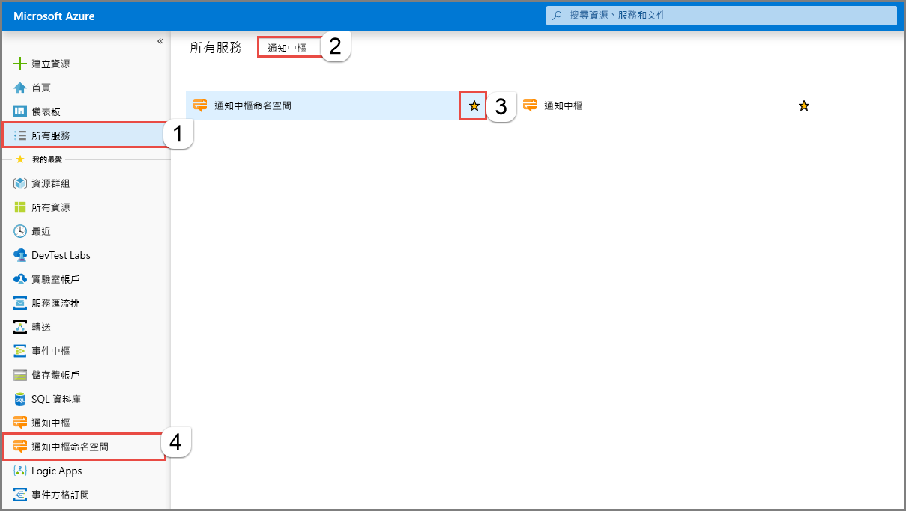
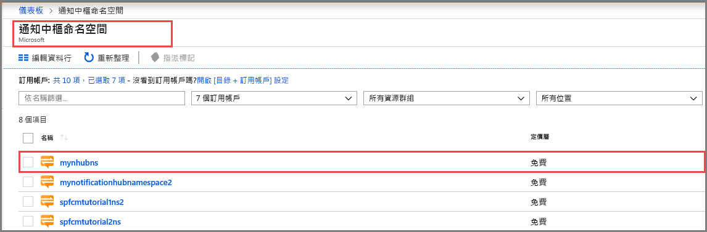
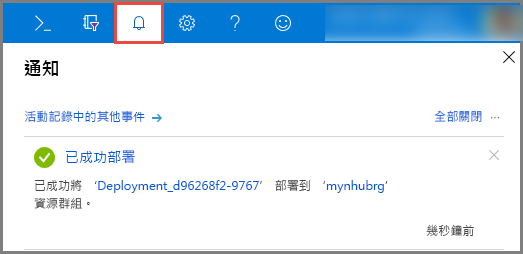
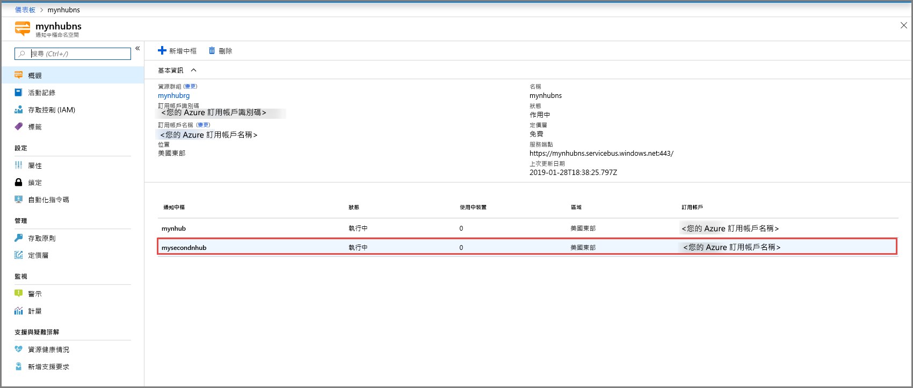
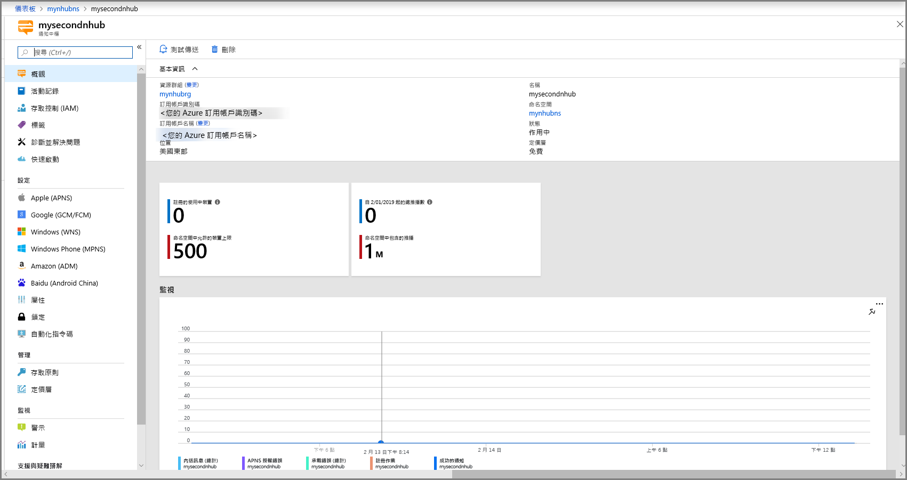

# 在 Azure 入口網站中建立 Azure 通知中樞 
Azure 通知中樞提供易於使用且相應放大的推播引擎，可讓您從任何後端 (雲端或內部部署) 傳送通知到任何平台 (iOS、Android、Windows、Kindle、Baidu 等)。 如需該服務的詳細資訊，請參閱[什麼是 Azure 通知中樞？](notification-hubs-push-notification-overview.md)。

在本快速入門中，您會在 Azure 入口網站建立通知中樞。 第一節會提供相關步驟讓您建立通知中樞命名空間以及該命名空間中的中樞。 第二節會提供相關步驟讓您在現有通知中樞命名空間中建立通知中樞。 

## 建立命名空間和通知中樞
在本節中，您會建立命名空間以及命名空間中的中樞。 

[!INCLUDE [notification-hubs-portal-create-new-hub](../../includes/notification-hubs-portal-create-new-hub.md)]

## 在現有命名空間中建立通知中樞
在本節中，您會在現有命名空間中建立通知中樞。 

1. 登入 [Azure 入口網站](https://portal.azure.com)。
2. 選取左側功能表上的 [所有服務]，搜尋**通知中樞**，選取 [通知中樞命名空間] 旁的**星號** (`*`)，以將其新增至左側功能表上的 [我的最愛] 區段。 選取 [通知中樞命名空間]。 

      
3. 在 [通知中樞命名空間] 頁面上，從清單中選取您的命名空間。 

      
1. 在 [通知中樞命名空間] 頁面上，選取工具列上的 [新增中樞]。 

      ![通知中樞命名空間 - [新增中樞] 按鈕](./media/create-notification-hub-portal/add-hub-button.png)
4. 在 [新增通知中樞] 頁面上，輸入通知中樞的名稱，然後選取 [確定]。

      ![[新增通知中樞] 頁面 -> 輸入中樞的名稱](./media/create-notification-hub-portal/new-notification-hub-page.png)
4. 選取頂端的 [通知] (鈴鐺圖示) 以查看新中樞的部署狀態。 選取右上角的 **X** 來關閉通知視窗。 

      
5. 重新整理 [通知中樞命名空間] 網頁，以在清單中查看您的新中樞。 

      
6. 選取您的**通知中樞**以查看通知中樞的首頁。 

      

## 後續步驟
在本快速入門中，您已建立通知中樞。 若要了解如何使用平台通知系統 (PNS) 設定來設定中樞，請參閱[使用 PNS 設定來設定通知中樞](configure-notification-hub-portal-pns-settings.md)。 