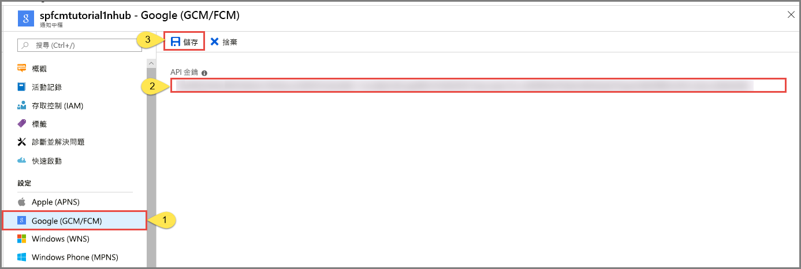

# <a name="tutorial-push-notifications-to-android-devices-by-using-azure-notification-hubs-and-google-firebase-cloud-messaging"></a>教學課程：使用 Azure 通知中樞和 Google Firebase 雲端通訊將通知推送至 Android 裝置

[!INCLUDE [notification-hubs-selector-get-started](../../includes/notification-hubs-selector-get-started.md)]

本教學課程說明如何使用 Azure 通知中樞和 Firebase 雲端通訊 (FCM)，將通知推送至 Android 應用程式。 在本教學課程中，您會建立空白的 Android 應用程式，其可使用 Firebase 雲端通訊 (FCM) 接收推播通知。

您可以[從 GitHub](https://github.com/Azure/azure-notificationhubs-android/tree/master/samples/FCMTutorialApp) 下載本教學課程的完整程式碼。

在本教學課程中，您會執行下列步驟：

> [!div class="checklist"]
> * 建立 Android Studio 專案。
> * 建立支援 Firebase 雲端通訊的 Firebase 專案。
> * 建立中樞。
> * 將應用程式連線至中樞。
> * 測試應用程式。

## <a name="prerequisites"></a>必要條件

若要完成此教學課程，您必須具備有效的 Azure 帳戶。 如果您沒有帳戶，只需要幾分鐘的時間就可以建立免費試用帳戶。 如需詳細資料，請參閱 [Azure 免費試用](https://azure.microsoft.com/free/)。 

您也需要下列項目： 

* 最新版的 [Android Studio](https://go.microsoft.com/fwlink/?LinkId=389797)
* 適用於 Firebase 雲端通訊的 Android 2.3 或更新版本
* 適用於 Firebase 雲端通訊的 Google Repository 修訂版本 27 或更新版本
* 適用於 Firebase 雲端通訊的 Google Play Services 9.0.2 或更新版本

完成本教學課程是進行 Android app 所有其他通知中樞教學課程的先決條件。

## <a name="create-an-android-studio-project"></a>建立 Android Studio 專案

1. 啟動 Android Studio。
2. 選取 [檔案]  ，指向 [新增]  ，然後選取 [新增專案]  。 
2. 在 [選擇您的專案]  頁面上，選取 [空的活動]  ，然後選取 [下一步]  。 
3. 在 [設定您的專案]  頁面上，採取下列步驟： 
    1. 輸入應用程式的名稱。
    2. 指定要用來儲存專案檔的位置。 
    3. 選取 [完成]  。 

        

## <a name="create-a-firebase-project-that-supports-fcm"></a>建立支援 FCM 的 Firebase 專案

[!INCLUDE [notification-hubs-enable-firebase-cloud-messaging](../../includes/notification-hubs-enable-firebase-cloud-messaging.md)]

## <a name="configure-a-hub"></a>設定中樞

[!INCLUDE [notification-hubs-portal-create-new-hub](../../includes/notification-hubs-portal-create-new-hub.md)]

### <a name="configure-firebase-cloud-messaging-settings-for-the-hub"></a>設定中樞的 Firebase 雲端通訊設定

1. 在左窗格的 [設定]  下方，選取 [Google (GCM/FCM)]  。 
2. 針對您稍早儲存的 FCM 專案，輸入其**伺服器金鑰**。 
3. 在工具列上，選取 [儲存]  。 

    
4. Azure 入口網站會在警示中顯示訊息來指出中樞的更新已成功。 [儲存]  按鈕已停用。 

您的中樞現在已設定為與 Firebase 雲端通訊搭配使用。 您也擁有了所需的連接字串，而可將通知傳送給裝置並註冊應用程式來接收通知。

## <a id="connecting-app"></a>將您的應用程式連接到通知中樞

### <a name="add-google-play-services-to-the-project"></a>新增 Google Play 服務至專案

1. 在 Android Studio 中，選取功能表上的 [工具]  ，然後選取 [SDK 管理員]  。 
2. 選取您專案中使用的 Android SDK 目標版本。 然後選取 [顯示套件詳細資料]  。 

    
3. 如果尚未安裝 [Google API]  ，請加以選取。

    
4. 切換到 [SDK 工具]  索引標籤。如果您尚未安裝 Google Play Services，請選取 [Google Play Services]  ，如下圖所示。 然後選取 [套用]  來安裝。 請注意在稍後步驟中使用的 SDK 路徑。

    
3. 如果您看到 [確認變更]  對話方塊，請選取 [確定]  。 元件安裝程式會安裝要求的元件。 在元件安裝完成後選取 [完成]  。
4. 選取 [確定]  以關閉 [新專案的設定]  對話方塊。  
1. 開啟 AndroidManifest.xml 檔案，然後在「應用程式」  標籤中新增下列標籤。

    ```xml
    <meta-data android:name="com.google.android.gms.version"
         android:value="@integer/google_play_services_version" />
    ```


### <a name="add-azure-notification-hubs-libraries"></a>新增 Azure 通知中樞程式庫

1. 在應用程式的 Build.Gradle 檔案中，於 [相依性] 區段中新增下列幾行。

    ```gradle
    implementation 'com.microsoft.azure:notification-hubs-android-sdk:0.6@aar'
    ```

2. 將下列存放庫新增到 dependencies 區段之後。

    ```gradle
    repositories {
        maven {
            url "https://dl.bintray.com/microsoftazuremobile/SDK"
        }
    }
    ```

### <a name="add-google-firebase-support"></a>新增 Google Firebase 支援

1. 在應用程式的 Build.Gradle 檔案中，於 [相依性]  區段中新增下列幾行 (如果還沒有這幾行程式碼的話)。 

    ```gradle
    implementation 'com.google.firebase:firebase-core:16.0.8'
    implementation 'com.google.firebase:firebase-messaging:17.3.4'
    ```

2. 在檔案結尾處新增下列外掛程式 (如果尚未存在的話)。 

    ```gradle
    apply plugin: 'com.google.gms.google-services'
    ```
3. 在工具列上選取 [立即同步]  。

### <a name="update-the-androidmanifestxml-file"></a>更新 AndroidManifest.xml 檔案

1. 在收到 FCM 註冊權杖後，請將其用來[向 Azure 通知中樞註冊](notification-hubs-push-notification-registration-management.md)。 您可以使用名為 `RegistrationIntentService` 的 `IntentService` 在背景支援此註冊。 此服務也會重新整理 FCM 註冊權杖。 您也可以建立名為 `FirebaseService` 的類別作為 `FirebaseMessagingService` 的子類別，並覆寫 `onMessageReceived` 方法以接收並處理通知。 

    將下列服務定義新增至 AndroidManifest.xml 檔案的 `<application>` 標籤內。

    ```xml
    <service
        android:name=".RegistrationIntentService"
        android:exported="false">
    </service>
    <service
        android:name=".FirebaseService"
        android:exported="false">
        <intent-filter>
            <action android:name="com.google.firebase.MESSAGING_EVENT" />
        </intent-filter>
    </service>
    ```
3. 在 `</application>` 標籤下面新增下列必要的 FCM 相關權限。

    ```xml
    <uses-permission android:name="android.permission.INTERNET"/>
    <uses-permission android:name="android.permission.GET_ACCOUNTS"/>
    <uses-permission android:name="com.google.android.c2dm.permission.RECEIVE" />
    ```

### <a name="add-code"></a>新增程式碼

1. 在 [專案檢視] 中，展開 [app]   > [src]   > [main]   > [java]  。 以滑鼠右鍵按一下 **java** 底下您的套件資料夾，並選取 [新增]  ，然後選取 [Java 類別]  。 輸入 **NotificationSettings** 作為名稱，然後選取 [確定]  。

    請務必在 `NotificationSettings` 類別的下列程式碼中更新這三個預留位置：

   * **HubListenConnectionString**：中樞的 **DefaultListenAccessSignature** 連接字串。 在 [Azure 入口網站]上的中樞內按一下 [存取原則]  ，即可複製該連接字串。
   * **HubName**︰使用出現在 [Azure 入口網站]中樞頁面中的中樞名稱。

     `NotificationSettings` 程式碼︰

        ```java
        public class NotificationSettings {
            public static String HubName = "<Your HubName>";
            public static String HubListenConnectionString = "<Enter your DefaultListenSharedAccessSignature connection string>";
        }
        ```

     > [!IMPORTANT]
     > 請輸入中樞的**名稱**和 **DefaultListenSharedAccessSignature**，再繼續進行。 

2. 將另一個新類別新增至名為 `RegistrationIntentService`的專案。 此類別會實作 `IntentService` 介面。 此類別也會處理[重新整理 GCM 權杖](https://developers.google.com/instance-id/guides/android-implementation#refresh_tokens)和[向通知中樞註冊](notification-hubs-push-notification-registration-management.md)的作業。

    針對此類別使用下列程式碼。

    ```java
    import android.app.IntentService;
    import android.content.Intent;
    import android.content.SharedPreferences;
    import android.preference.PreferenceManager;
    import android.util.Log;
    import com.google.android.gms.tasks.OnSuccessListener;
    import com.google.firebase.iid.FirebaseInstanceId;
    import com.google.firebase.iid.InstanceIdResult;
    import com.microsoft.windowsazure.messaging.NotificationHub;
    import java.util.concurrent.TimeUnit;

    public class RegistrationIntentService extends IntentService {

        private static final String TAG = "RegIntentService";
        String FCM_token = null;

        private NotificationHub hub;

        public RegistrationIntentService() {
            super(TAG);
        }

        @Override
        protected void onHandleIntent(Intent intent) {

            SharedPreferences sharedPreferences = PreferenceManager.getDefaultSharedPreferences(this);
            String resultString = null;
            String regID = null;
            String storedToken = null;

            try {
                FirebaseInstanceId.getInstance().getInstanceId().addOnSuccessListener(new OnSuccessListener<InstanceIdResult>() { 
                    @Override 
                    public void onSuccess(InstanceIdResult instanceIdResult) { 
                        FCM_token = instanceIdResult.getToken(); 
                        Log.d(TAG, "FCM Registration Token: " + FCM_token); 
                    } 
                }); 
                TimeUnit.SECONDS.sleep(1);

                // Storing the registration ID that indicates whether the generated token has been
                // sent to your server. If it is not stored, send the token to your server.
                // Otherwise, your server should have already received the token.
                if (((regID=sharedPreferences.getString("registrationID", null)) == null)){

                    NotificationHub hub = new NotificationHub(NotificationSettings.HubName,
                            NotificationSettings.HubListenConnectionString, this);
                    Log.d(TAG, "Attempting a new registration with NH using FCM token : " + FCM_token);
                    regID = hub.register(FCM_token).getRegistrationId();

                    // If you want to use tags...
                    // Refer to : https://azure.microsoft.com/documentation/articles/notification-hubs-routing-tag-expressions/
                    // regID = hub.register(token, "tag1,tag2").getRegistrationId();

                    resultString = "New NH Registration Successfully - RegId : " + regID;
                    Log.d(TAG, resultString);

                    sharedPreferences.edit().putString("registrationID", regID ).apply();
                    sharedPreferences.edit().putString("FCMtoken", FCM_token ).apply();
                }

                // Check to see if the token has been compromised and needs refreshing.
                else if ((storedToken=sharedPreferences.getString("FCMtoken", "")) != FCM_token) {

                    NotificationHub hub = new NotificationHub(NotificationSettings.HubName,
                            NotificationSettings.HubListenConnectionString, this);
                    Log.d(TAG, "NH Registration refreshing with token : " + FCM_token);
                    regID = hub.register(FCM_token).getRegistrationId();

                    // If you want to use tags...
                    // Refer to : https://azure.microsoft.com/documentation/articles/notification-hubs-routing-tag-expressions/
                    // regID = hub.register(token, "tag1,tag2").getRegistrationId();

                    resultString = "New NH Registration Successfully - RegId : " + regID;
                    Log.d(TAG, resultString);

                    sharedPreferences.edit().putString("registrationID", regID ).apply();
                    sharedPreferences.edit().putString("FCMtoken", FCM_token ).apply();
                }

                else {
                    resultString = "Previously Registered Successfully - RegId : " + regID;
                }
            } catch (Exception e) {
                Log.e(TAG, resultString="Failed to complete registration", e);
                // If an exception happens while fetching the new token or updating registration data
                // on a third-party server, this ensures that we'll attempt the update at a later time.
            }

            // Notify UI that registration has completed.
            if (MainActivity.isVisible) {
                MainActivity.mainActivity.ToastNotify(resultString);
            }
        }
    }
    ```

3. 在 `MainActivity` 類別中，在類別宣告上面新增下列 `import` 陳述式。

    ```java
    import com.google.android.gms.common.ConnectionResult;
    import com.google.android.gms.common.GoogleApiAvailability;
    import android.content.Intent;
    import android.util.Log;
    import android.widget.TextView;
    import android.widget.Toast;
    ```

4. 在類別的最上方新增下列成員。 您會使用這些欄位來[檢查 Google 所建議的 Google Play 服務可用性](https://developers.google.com/android/guides/setup#ensure_devices_have_the_google_play_services_apk)。

    ```java
    public static MainActivity mainActivity;
    public static Boolean isVisible = false;
    private static final String TAG = "MainActivity";
    private static final int PLAY_SERVICES_RESOLUTION_REQUEST = 9000;
    ```

5. 在 `MainActivity` 類別中，新增下列方法以檢查 Google Play 服務的可用性。

    ```java
    /**
    * Check the device to make sure it has the Google Play Services APK. If
    * it doesn't, display a dialog box that enables  users to download the APK from
    * the Google Play Store or enable it in the device's system settings.
    */

    private boolean checkPlayServices() {
        GoogleApiAvailability apiAvailability = GoogleApiAvailability.getInstance();
        int resultCode = apiAvailability.isGooglePlayServicesAvailable(this);
        if (resultCode != ConnectionResult.SUCCESS) {
            if (apiAvailability.isUserResolvableError(resultCode)) {
                apiAvailability.getErrorDialog(this, resultCode, PLAY_SERVICES_RESOLUTION_REQUEST)
                        .show();
            } else {
                Log.i(TAG, "This device is not supported by Google Play Services.");
                ToastNotify("This device is not supported by Google Play Services.");
                finish();
            }
            return false;
        }
        return true;
    }
    ```

6. 在 `MainActivity` 類別中加入下列程式碼，以在呼叫 `IntentService` 之前檢查 Google Play 服務，進而取得 FCM 註冊權杖並向中樞註冊：

    ```java
    public void registerWithNotificationHubs()
    {
        if (checkPlayServices()) {
            // Start IntentService to register this application with FCM.
            Intent intent = new Intent(this, RegistrationIntentService.class);
            startService(intent);
        }
    }
    ```

7. 在 `MainActivity` 類別的 `OnCreate` 方法中，加入下列程式碼以便在活動建立時開始註冊程序：

    ```java
    @Override
    protected void onCreate(Bundle savedInstanceState) {
        super.onCreate(savedInstanceState);
        setContentView(R.layout.activity_main);

        mainActivity = this;
        registerWithNotificationHubs();
        FirebaseService.createChannelAndHandleNotifications(getApplicationContext());
    }
    ```

8. 為了驗證應用程式狀態及報告您的應用程式狀態，請將上述其他方法新增至 `MainActivity`：

    ```java
    @Override
    protected void onStart() {
        super.onStart();
        isVisible = true;
    }

    @Override
    protected void onPause() {
        super.onPause();
        isVisible = false;
    }

    @Override
    protected void onResume() {
        super.onResume();
        isVisible = true;
    }

    @Override
    protected void onStop() {
        super.onStop();
        isVisible = false;
    }

    public void ToastNotify(final String notificationMessage) {
        runOnUiThread(new Runnable() {
            @Override
            public void run() {
                Toast.makeText(MainActivity.this, notificationMessage, Toast.LENGTH_LONG).show();
                TextView helloText = (TextView) findViewById(R.id.text_hello);
                helloText.setText(notificationMessage);
            }
        });
    }
    ```

9. `ToastNotify` 方法會使用 *"Hello World"* `TextView` 控制項持續在應用程式中報告狀態和通知。 在 **res** > **layout** > **activity_main.xml** 配置中，為該控制項新增下列識別碼。

    ```java
    android:id="@+id/text_hello"
    ```

    

10. 接下來，您會為 AndroidManifest.xml 中所定義的接收者新增子類別。 將另一個新類別新增至名為 `FirebaseService`的專案。

11. 在 `FirebaseService.java` 頂端新增下列 import 陳述式：

    ```java
    import com.google.firebase.messaging.FirebaseMessagingService;
    import com.google.firebase.messaging.RemoteMessage;
    import android.util.Log;
    import android.app.NotificationChannel;
    import android.app.NotificationManager;
    import android.app.PendingIntent;
    import android.content.Context;
    import android.content.Intent;
    import android.media.RingtoneManager;
    import android.net.Uri;
    import android.os.Build;
    import android.os.Bundle;
    import androidx.core.app.NotificationCompat;
    ```

12. 在 `FirebaseService` 類別中新增下列程式碼，使其成為 `FirebaseMessagingService` 的子類別。

    此程式碼會覆寫 `onMessageReceived` 方法，並報告所收到的通知。 它也會使用 `sendNotification()` 方法，將推播通知傳送給 Android 通知管理員。 當應用程式並未執行卻收到通知時，請呼叫 `sendNotification()` 方法。

    ```java
    public class FirebaseService extends FirebaseMessagingService
    {
        private String TAG = "FirebaseService";
    
        public static final String NOTIFICATION_CHANNEL_ID = "nh-demo-channel-id";
        public static final String NOTIFICATION_CHANNEL_NAME = "Notification Hubs Demo Channel";
        public static final String NOTIFICATION_CHANNEL_DESCRIPTION = "Notification Hubs Demo Channel";
    
        public static final int NOTIFICATION_ID = 1;
        private NotificationManager mNotificationManager;
        NotificationCompat.Builder builder;
        static Context ctx;
    
        @Override
        public void onMessageReceived(RemoteMessage remoteMessage) {
            // ...
    
            // TODO(developer): Handle FCM messages here.
            // Not getting messages here? See why this may be: https://goo.gl/39bRNJ
            Log.d(TAG, "From: " + remoteMessage.getFrom());
    
            String nhMessage;
            // Check if message contains a notification payload.
            if (remoteMessage.getNotification() != null) {
                Log.d(TAG, "Message Notification Body: " + remoteMessage.getNotification().getBody());
    
                nhMessage = remoteMessage.getNotification().getBody();
            }
            else {
                nhMessage = remoteMessage.getData().values().iterator().next();
            }
    
            // Also if you intend on generating your own notifications as a result of a received FCM
            // message, here is where that should be initiated. See sendNotification method below.
            if (MainActivity.isVisible) {
                MainActivity.mainActivity.ToastNotify(nhMessage);
            }
            sendNotification(nhMessage);
        }
    
        private void sendNotification(String msg) {
    
            Intent intent = new Intent(ctx, MainActivity.class);
            intent.addFlags(Intent.FLAG_ACTIVITY_CLEAR_TOP);
    
            mNotificationManager = (NotificationManager)
                    ctx.getSystemService(Context.NOTIFICATION_SERVICE);
    
            PendingIntent contentIntent = PendingIntent.getActivity(ctx, 0,
                    intent, PendingIntent.FLAG_ONE_SHOT);
    
            Uri defaultSoundUri = RingtoneManager.getDefaultUri(RingtoneManager.TYPE_NOTIFICATION);
            NotificationCompat.Builder notificationBuilder = new NotificationCompat.Builder(
                    ctx,
                    NOTIFICATION_CHANNEL_ID)
                    .setContentText(msg)
                    .setPriority(NotificationCompat.PRIORITY_HIGH)
                    .setSmallIcon(android.R.drawable.ic_popup_reminder)
                    .setBadgeIconType(NotificationCompat.BADGE_ICON_SMALL);
    
            notificationBuilder.setContentIntent(contentIntent);
            mNotificationManager.notify(NOTIFICATION_ID, notificationBuilder.build());
        }
    
        public static void createChannelAndHandleNotifications(Context context) {
            ctx = context;
    
            if (Build.VERSION.SDK_INT >= Build.VERSION_CODES.O) {
                NotificationChannel channel = new NotificationChannel(
                        NOTIFICATION_CHANNEL_ID,
                        NOTIFICATION_CHANNEL_NAME,
                        NotificationManager.IMPORTANCE_HIGH);
                channel.setDescription(NOTIFICATION_CHANNEL_DESCRIPTION);
                channel.setShowBadge(true);
    
                NotificationManager notificationManager = context.getSystemService(NotificationManager.class);
                notificationManager.createNotificationChannel(channel);
             }
        }
    }
    ```

13. 在 Android Studio 的功能表列上，選取 [建置]   > [重新建置專案]  ，來確保程式碼中未沒有任何錯誤。 如果您收到有關 `ic_launcher` 圖示的錯誤，請移除 AndroidManifest.xml 檔案中的下列陳述式： 

    ```
        android:icon="@mipmap/ic_launcher"
    ```
14. 確定您有可供執行應用程式的虛擬裝置。 如果沒有，請如下所示加以新增：
    1. 
    2. 

15. 在您所選的裝置上執行應用程式，並確認該應用程式已向中樞註冊成功。

    > [!NOTE]
    > 註冊可能會在初始啟動期間失敗，直到呼叫執行個體識別碼服務的 `onTokenRefresh()` 方法為止。 重新整理作業應該會起始向通知中樞註冊的作業並且會成功。

    

## <a name="test-send-notification-from-the-notification-hub"></a>進行從通知中樞傳送通知的測試

您可以採取下列步驟，從 [Azure 入口網站]傳送推播通知：

1. 在 Azure 入口網站中，於中樞的 [通知中樞] 頁面上，選取 [疑難排解]  區段中的 [測試傳送]  。
3. 針對 [平台]  ，選取 [Android]  。
4. 選取 [傳送]  。  您尚未在 Android 裝置上執行行動應用程式，所以不會在裝置上看到通知。 在您執行行動應用程式後，請再次選取 [傳送]  按鈕，以查看通知訊息。
5. 在底部的清單中查看作業的結果。

    
6. 您會在裝置上看到通知訊息。 

    
    

[!INCLUDE [notification-hubs-sending-notifications-from-the-portal](../../includes/notification-hubs-sending-notifications-from-the-portal.md)]

### <a name="run-the-mobile-app-on-emulator"></a>在模擬器上執行行動應用程式
在模擬器內測試推播通知之前，請先確定您的模擬器映像支援您為應用程式選擇的 Google API 層級。 如果您的映像不支援原生 Google API，您可能會遇到 **SERVICE\_NOT\_AVAILABLE** 例外狀況。

此外，請確定已將 Google 帳戶新增至執行中模擬器的 [設定]   > [帳戶]  下方。 否則，嘗試向 FCM 註冊可能會導致 **AUTHENTICATION\_FAILED** 例外狀況。

## <a name="next-steps"></a>後續步驟
在本教學課程中，您已使用 Firebase 雲端通訊將通知廣播至所有向服務註冊的 Android 裝置。 若想了解如何將通知推送至特定裝置，請繼續進行下列教學課程：

> [!div class="nextstepaction"]
>[教學課程：將通知推播至特定的 Android 裝置](push-notifications-android-specific-devices-firebase-cloud-messaging.md)

<!-- Images. -->

<!-- URLs. -->
[Get started with push notifications in Mobile Services]: ../mobile-services-javascript-backend-android-get-started-push.md  
[Mobile Services Android SDK]: https://go.microsoft.com/fwLink/?LinkID=280126&clcid=0x409
[Referencing a library project]: https://go.microsoft.com/fwlink/?LinkId=389800
[Notification Hubs Guidance]: notification-hubs-push-notification-overview.md
[Azure 入口網站]: https://portal.azure.com
