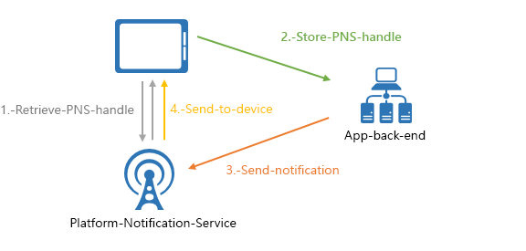
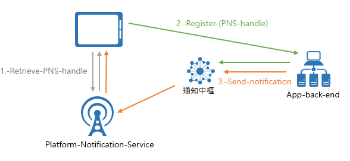

# 什麼是 Azure 通知中樞？
Azure 通知中樞提供易於使用且相應放大的推播引擎，可讓您從任何後端 (雲端或內部部署) 傳送通知到任何平台 (iOS、Android、Windows、Kindle、Baidu 等)。 通知中樞很適合企業和消費者案例。 以下是一些範例案例：

- 傳送即時新聞通知給數百萬人，且延遲時間很低。
- 將位置型折價券傳送給感興趣的使用者區段。
- 將事件相關通知傳送給媒體/運動/財金/遊戲應用程式的使用者或群組。
- 將促銷內容推播到應用程式，來與客戶互動及行銷。
- 對使用者發送企業事件通知，例如新訊息和工作項目。
- 傳送 Multi-Factor Authentication 的程式碼。

## 什麼是推播通知？
推播通知是一種由應用程式對使用者發出的通訊形式，通常會以快顯視窗或對話方塊來對行動應用程式的使用者發出某些他們想要之資訊的通知。 使用者通常可以選擇檢視或關閉訊息。 選擇前者會開啟傳送通知的行動應用程式。

推播通知是很重要的功能，對於消費者應用程式來說，可提高應用程式的參與和使用率，對於企業應用程式來說，則可傳送最新的企業資訊。 此功能是最佳的應用程式對使用者通訊，因為它不會過度耗用行動裝置的電量、可讓通知傳送者保有彈性，並且可在對應的應用程式未執行時使用。

如需幾個熱門平台推播通知的詳細資訊，請參閱以下主題： 
* [iOS](https://developer.apple.com/notifications/)
* [Android](https://developer.android.com/guide/topics/ui/notifiers/notifications.html)
* [Windows](http://msdn.microsoft.com/library/windows/apps/hh779725.aspx)

## 推播通知如何運作？
推播通知可透過名為「平台通知系統 (PNS)」的平台特定基礎結構來傳遞。 它們可提供推播準系統功能，以所提供的控制代碼傳遞訊息至裝置，且沒有通用介面。 若要將通知傳送給 iOS、Android 和 Windows 版應用程式上的所有客戶，開發人員必須使用 Apple 推播通知服務 (APNS)、Firebase Cloud Messaging (FCM) 和 Windows 通知服務 (WNS)。

概括而言，以下是推播功能的運作方式︰

1. 用戶端應用程式決定要接收通知。 因此，它與對應的 PNS 連絡以擷取其唯一且暫時的推播控制代碼。 控制代碼的類型視系統而定 (例如，WNS 有 URI 而 APNS 有權杖)。
2. 用戶端應用程式會將此控制代碼儲存在應用程式後端或提供者。
3. 若要傳送推播通知，應用程式後端必須使用控制代碼連絡 PNS，以將特定的用戶端應用程式定為目標。
4. PNS 會將通知轉送至控制代碼所指定的裝置。

## 推播通知的挑戰
PNS 的功能強大， 但很多部分都必須由應用程式開發人員處理，即使是實作普通推播通知的案例，例如對不同客層的使用者廣播推播通知。

推播通知需要的基礎結構複雜，且與應用程式主要商務邏輯無關。 基礎結構方面的某些挑戰包括︰

- **平台相依性**
    - 後端必須有複雜且難以維護之取決於平台的邏輯，才能將通知傳送給各種平台上的裝置，因為 PNS 並未統一。
- **調整**
    - 根據 PNS 準則，在每次啟動應用程式時，都必須重新整理裝置權杖。 後端會處理大量的流量以及資料庫的存取權，都只是為了讓權杖保持最新狀態。 當裝置數目增加至數億和數十億時，建立及維護此基礎結構的成本將會很可觀。
    - 大部分的 PNS 並不支援廣播至多個裝置。 對百萬個裝置的一個簡單廣播就會產生百萬個 PNS 呼叫。 想要擴增這種數量的流量卻又要將延遲降到最低並非易事。
- **路由** 
    - 雖然 PNS 提供了將訊息傳送至裝置的方法，但大部分應用程式通知都是以使用者或相關群組為目標。 這表示後端必須維護登錄，以將裝置關聯到相關群組、使用者、屬性等。這項額外工作將導致應用程式的上市時程延宕和維護成本提高。

## 為何要使用 Azure 通知中樞？
通知中樞消除在應用程式後端您需自行處理的所有推播通知相關複雜事項。 其多平台、可相應放大的推播通知基礎結構可減少推播相關編碼，並簡化您的後端。 使用通知中樞時，裝置只需負責向中樞註冊其 PNS 控制代碼，而由後端負責將訊息傳送給使用者或相關群組，如下圖所示︰

通知中樞是立即可用的推播引擎，其具有下列優勢︰

- **跨平台**
    - 支援所有主要的推播平台，包括 iOS、Android、Windows、Kindle 和百度。
    - 具有通用介面，可以平台特定或平台無關的格式推播至所有平台，但不必進行平台特定工作。
    - 集中在一個位置管理裝置控制代碼。
- **跨後端**
    - 雲端或內部部署
    - .NET、Node.js、Java 等
- **豐富的傳遞模式集**
    - 廣播到一個或多個平台︰只要單一 API 呼叫，您就可以立即跨平台廣播到數百萬個裝置。
    - 推播到裝置︰您可以將通知目標鎖定為個別裝置。
    - 推播到使用者︰標記和範本功能可協助您觸達某位使用者的所有跨平台裝置。
    - 以動態標記推播至區段︰標記功能可協助您將裝置分區段，並根據需求推播至這些區段，不論是要傳送給一個區段或一個運算式的區段 (例如，作用中 AND 居住地西雅圖 NOT 新的使用者)。 不必侷限於發行/訂閱模式，您可以隨時隨地更新裝置的標記。
    - 當地語系化的推播︰範本功能可協助您實現當地語系化，又不影響後端程式碼。
    - 無訊息推播︰您可以將無訊息通知傳送至裝置，並觸發它們完成特定提取或動作，以啟用推播到提取模式。
    - 排定推播︰您可以排程在任何時間傳送通知。
    - 直接推播：您可以略過向通知中樞服務註冊裝置，而直接批次推播至裝置控制代碼清單。
    - 個人化推播︰裝置推播變數可協助您以自訂的索引鍵/值組傳送裝置特定的個人化推播通知。
- **豐富的遙測**
    - 您可以在 Azure 入口網站或以程式設計方式取得一般的推播、裝置、錯誤和作業遙測。
    - 每個訊息遙測會追蹤每個推播，從您的初始要求呼叫，至通知中樞服務成功地批次處理推出推播。
    - 平台通知系統意見反應會傳送平台通知系統的所有意見反應，以協助偵錯。
- **延展性** 
    - 將快速訊息傳送至數百萬個裝置，而不需要經過重新架構或裝置分區化程序。
- **安全性**
    - 共用存取密碼 (SAS) 或同盟驗證。

## 與 App Service Mobile Apps 整合
為了在 Azure 服務間促進完美且統一的體驗， [App Service Mobile Apps](../app-service-mobile/app-service-mobile-value-prop.md) 具備使用通知中樞提供推播通知的內建支援。 
  [App Service Mobile Apps](../app-service-mobile/app-service-mobile-value-prop.md) 具有高擴充性且可供全球使用，是專為企業開發人員與系統整合人員設計的行動應用程式開發平台，能提供一組豐富的功能給行動應用程式開發人員。

Mobile Apps 開發人員可以使用下列流程來利用通知中樞：

1. 擷取裝置 PNS 控制代碼
2. 透過便利的 Mobile Apps Client SDK 註冊 API，使用通知中樞註冊裝置

    > [!NOTE]
    > 請注意，Mobile Apps 會基於安全性考量，去除註冊上的所有標籤。 直接從後端使用通知中樞，將標籤關聯至裝置。
1. 從 App 後端使用通知中樞傳送通知

以下是透過此註冊為開發人員帶來的一些便利性：

- **Mobile Apps 用戶端 SDK**︰這些多平台 SDK 提供簡單的 API 來進行註冊，然後會自動與連結到行動 App 的通知中樞聯繫。 開發人員不需要透過通知中樞認證進行挖掘，以及使用其他服務。
    - *推播給使用者*：SDK 會使用 Mobile Apps 驗證的使用者識別碼自動標記指定的裝置，以啟用推播至使用者案例。
    - *推播至裝置*：SDK 會自動使用 Mobile Apps 安裝識別碼做為 GUID 來向通知中樞註冊，省去開發人員維護多個服務 GUID 的麻煩。
- **安裝模式**：Mobile Apps 會使用通知中樞的最新推送模型，來呈現 JSON 安裝中所有與裝置相關聯的推送屬性，其會與推播通知密切合作且易於使用。
- **彈性**：即使已就地整合，開發人員一律還是可以選擇直接使用通知中樞。
- **[Azure 入口網站](https://portal.azure.com)中的整合式體驗**：Mobile Apps 中會以視覺化方式呈現以功能形式出現的推送，而開發人員可以透過 Mobile Apps 輕鬆使用相關聯的通知中樞。

## 後續步驟

按照[教學課程：推播通知至行動應用程式](notification-hubs-android-push-notification-google-fcm-get-started.md)中的步驟，開始建立及使用通知中樞。 

[0]: ./media/notification-hubs-overview/registration-diagram.png

[1]: ./media/notification-hubs-overview/notification-hub-diagram.png

[How customers are using Notification Hubs]: http://azure.microsoft.com/services/notification-hubs

[Notification Hubs tutorials and guides]: http://azure.microsoft.com/documentation/services/notification-hubs

[iOS]: http://azure.microsoft.com/documentation/articles/notification-hubs-ios-get-started

[Android]: http://azure.microsoft.com/documentation/articles/notification-hubs-android-get-started

[Windows Universal]: http://azure.microsoft.com/documentation/articles/notification-hubs-windows-store-dotnet-get-started

[Windows Phone]: http://azure.microsoft.com/documentation/articles/notification-hubs-windows-phone-get-started

[Kindle]: http://azure.microsoft.com/documentation/articles/notification-hubs-kindle-get-started

[Xamarin.iOS]: http://azure.microsoft.com/documentation/articles/partner-xamarin-notification-hubs-ios-get-started

[Xamarin.Android]: http://azure.microsoft.com/documentation/articles/partner-xamarin-notification-hubs-android-get-started

[Microsoft.WindowsAzure.Messaging.NotificationHub]: http://msdn.microsoft.com/library/microsoft.windowsazure.messaging.notificationhub.aspx

[Microsoft.ServiceBus.Notifications]: http://msdn.microsoft.com/library/microsoft.servicebus.notifications.aspx

[App Service Mobile Apps]: https://azure.microsoft.com/documentation/articles/app-service-mobile-value-prop/

[templates]: notification-hubs-templates-cross-platform-push-messages.md

[Azure portal]: https://portal.azure.com

[tags]: (http://msdn.microsoft.com/library/azure/dn530749.aspx)
