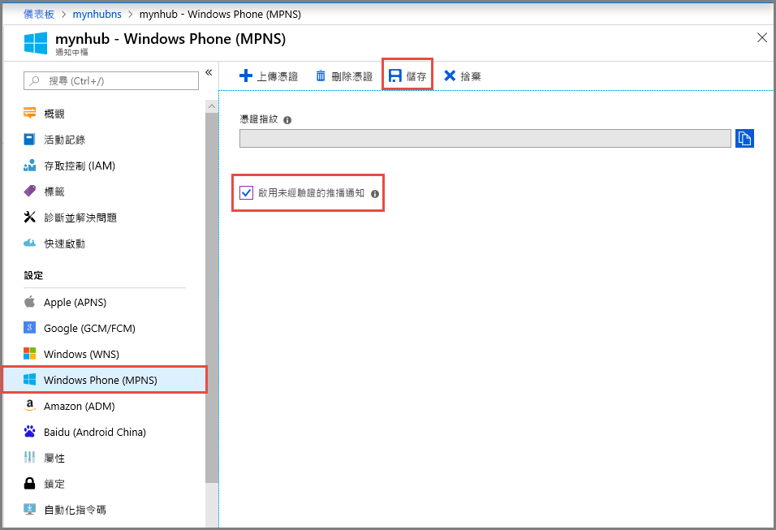

# 教學課程：使用 Azure 通知中樞將通知推送至 Windows Phone 應用程式
[!INCLUDE [notification-hubs-selector-get-started](../../includes/notification-hubs-selector-get-started.md)]

本教學課程說明如何使用 Azure 通知中樞，將推播通知傳送至 Windows Phone 8 或 Windows Phone 8.1 Silverlight 應用程式。 如果您的目標是 Windows Phone 8.1 (非 Silverlight)，請參閱本教學課程的 [Windows 通用](notification-hubs-windows-store-dotnet-get-started-wns-push-notification.md)版本。

在本教學課程中，您將使用 Microsoft 推播通知服務 (MPNS)，建立可接收推播通知的空白 Windows Phone 8 應用程式。 在建立應用程式之後，您即可使用通知中樞，將推播通知廣播到所有執行您的應用程式的裝置。

> [!NOTE]
> 通知中樞 Windows Phone SDK 不支援將 Windows 推播通知服務 (WNS) 與 Windows Phone 8.1 Silverlight app 搭配使用。 若要將 WNS (而非 MPNS) 與 Windows Phone 8.1 Silverlight app 搭配使用，請遵循使用 REST API 的 [通知中樞 - Windows Phone Silverlight 教學課程]。

在本教學課程中，您了解如何： 

> [!div class="checklist"]
> * 建立通知中樞
> * 建立 Windows Phone 應用程式
> * 進行傳送通知的測試 

## 先決條件

- **Azure 訂用帳戶**。 如果您沒有 Azure 訂用帳戶，請在開始前建立[免費帳戶](https://azure.microsoft.com/free/)。
- [具有行動裝置應用程式開發元件的 Visual Studio 2015 Express](https://www.visualstudio.com/vs/older-downloads/)

完成本教學課程是 Windows Phone 8 應用程式所有其他通知中樞教學課程的先決條件。

## 建立您的通知中樞
[!INCLUDE [notification-hubs-portal-create-new-hub](../../includes/notification-hubs-portal-create-new-hub.md)]

### 設定 Windows Phone (MPNS) 設定
1. 選取 [通知設定] 下的 [Windows Phone] \(MPNS\)。
2. 選取 [啟用驗證推播]。
3. 在工具列上選取 [儲存]。

    

    現在已建立並設定您的中樞，以傳送未經驗證的 Windows Phone 通知。

    > [!NOTE]
    > 本教學課程使用處於未通過驗證模式的 MPNS。 MPNS 未通過驗證模式內含您可傳送至每個通道的通知限制。 通知中樞可讓您上傳憑證，以支援 [MPNS 驗證模式](http://msdn.microsoft.com/library/windowsphone/develop/ff941099.aspx) 。

## 建立 Windows Phone 應用程式
在本節中，您會建立向您的通知中樞註冊的 Windows Phone 應用程式。 

1. 在 Visual Studio 中建立新的 Windows Phone 8 應用程式。 
   
    ![Visual Studio - 新增專案 - Windows Phone 應用程式][13]
   
    在 Visual Studio 2013 Update 2 或更新版本中，您必須改為建立 Windows Phone Silverlight 應用程式。
   
    ![Visual Studio - 新增專案 - 空白應用程式 - Windows Phone Silverlight][11]
2. 在 Visual Studio 中，以滑鼠右鍵按一下方案，然後按一下 [管理 NuGet 封裝] 。
3. 搜尋 `WindowsAzure.Messaging.Managed`，然後按一下 [安裝] 並接受使用條款。
   
    ![Visual Studio - NuGet 封裝管理員][20]
4. 開啟 App.xaml.cs 檔案，並新增下列 `using` 陳述式：
   
        using Microsoft.Phone.Notification;
        using Microsoft.WindowsAzure.Messaging;
5. 在 App.xaml.cs 中 **Application_Launching** 方法的頂端新增下列程式碼：
   
        private void Application_Launching(object sender, LaunchingEventArgs e)
        {

            var channel = HttpNotificationChannel.Find("MyPushChannel");
            if (channel == null)
            {
                channel = new HttpNotificationChannel("MyPushChannel");
                channel.Open();
                channel.BindToShellToast();
            }
       
            channel.ChannelUriUpdated += new EventHandler<NotificationChannelUriEventArgs>(async (o, args) =>
            {
                var hub = new NotificationHub("<hub name>", "<connection string>");
                var result = await hub.RegisterNativeAsync(args.ChannelUri.ToString());
       
                System.Windows.Deployment.Current.Dispatcher.BeginInvoke(() =>
                {
                    MessageBox.Show("Registration :" + result.RegistrationId, "Registered", MessageBoxButton.OK);
                });
            });
        }
   
   > [!NOTE]
   > **MyPushChannel** 值是一個索引，用來查閱 [HttpNotificationChannel](https://msdn.microsoft.com/library/windows/apps/microsoft.phone.notification.httpnotificationchannel.aspx) 集合中的現有通道。 如果集合中沒有任何項目，請以該名稱建立新的項目。
   > 
   > 
   
    插入您的中樞名稱，以及您在上一節中記下的連接字串 **DefaultListenSharedAccessSignature**。
    此程式碼會從 MPNS 中擷取 app 的通道 URI，然後向您的通知中樞註冊該通道 URI。 它也保證每次啟動應用程式時，便會在通知中樞中註冊通道 URI。
   
   > [!NOTE]
   > 本教學課程將傳送快顯通知給裝置。 傳送磚通知時，您必須在通道上改為呼叫 **BindToShellTile** 方法。 若要同時支援快顯和圖格通知，請呼叫 **BindToShellTile** 和 **BindToShellToast**。
   > 
   > 
6. 在 [方案總管] 中，展開 [屬性]、開啟 `WMAppManifest.xml` 檔案、按一下 [功能] 索引標籤，然後確定已核取 [ID_CAP_PUSH_NOTIFICATION] 功能。 您的應用程式現在已可接收推播通知。 
   
    ![Visual Studio - Windows Phone 應用程式功能][14]    
7. 按 `F5` 鍵以執行應用程式。
   
    註冊訊息會顯示在應用程式中。
8. 關閉應用程式，或切換至首頁。 
   
   > [!NOTE]
   > 若要接收快顯推播通知，應用程式不得在前景執行。

## 進行傳送通知的測試 

1. 在 Azure 入口網站中，切換至 [概觀] 索引標籤。
2. 選取 [測試傳送]。

    
3. 在 [測試傳送] 視窗中，採取下列步驟：

    1. 針對 [平台]，選取 [Windows Phone]。 
    2. 針對 [通知類型]，選取 [快顯通知]。 
    3. 選取 [傳送]
    4. 在視窗底部的清單中，選取 [結果]。 

            
4. 在 Windows Phone 模擬器或 Windows Phone 上，確認您可看到通知訊息。 

    

## 後續步驟
在此簡單範例中，您會將推播通知廣播到所有 Windows Phone 8 裝置。 繼續進行下列教學課程，以了解如何將通知推送至特定裝置：

> [!div class="nextstepaction"]
>[將通知推送至特定裝置](notification-hubs-windows-phone-push-xplat-segmented-mpns-notification.md)

<!-- Images. -->
[6]: ./media/notification-hubs-windows-phone-get-started/notification-hub-create-console-app.png
[7]: ./media/notification-hubs-windows-phone-get-started/notification-hub-create-from-portal.png
[8]: ./media/notification-hubs-windows-phone-get-started/notification-hub-create-from-portal2.png
[9]: ./media/notification-hubs-windows-phone-get-started/notification-hub-select-from-portal.png
[10]: ./media/notification-hubs-windows-phone-get-started/notification-hub-select-from-portal2.png
[11]: ./media/notification-hubs-windows-phone-get-started/notification-hub-create-wp-silverlight-app.png
[12]: ./media/notification-hubs-windows-phone-get-started/notification-hub-connection-strings.png

[13]: ./media/notification-hubs-windows-phone-get-started/notification-hub-create-wp-app.png
[14]: ./media/notification-hubs-windows-phone-get-started/mobile-app-enable-push-wp8.png
[15]: ./media/notification-hubs-windows-phone-get-started/notification-hub-pushauth.png
[20]: ./media/notification-hubs-windows-phone-get-started/notification-hub-windows-universal-app-install-package.png
[213]: ./media/notification-hubs-windows-phone-get-started/notification-hub-create-console-app.png

<!-- URLs. -->
[Notification Hubs Guidance]: http://msdn.microsoft.com/library/jj927170.aspx
[MPNS authenticated mode]: http://msdn.microsoft.com/library/windowsphone/develop/ff941099(v=vs.105).aspx
[Use Notification Hubs to push notifications to users]: notification-hubs-aspnet-backend-windows-dotnet-wns-notification.md
[Use Notification Hubs to send breaking news]: notification-hubs-windows-phone-push-xplat-segmented-mpns-notification.md
[toast catalog]: http://msdn.microsoft.com/library/windowsphone/develop/jj662938(v=vs.105).aspx
[tile catalog]: http://msdn.microsoft.com/library/windowsphone/develop/hh202948(v=vs.105).aspx
[通知中樞 - Windows Phone Silverlight 教學課程]: https://github.com/Azure/azure-notificationhubs-samples/tree/master/PushToSLPhoneApp

