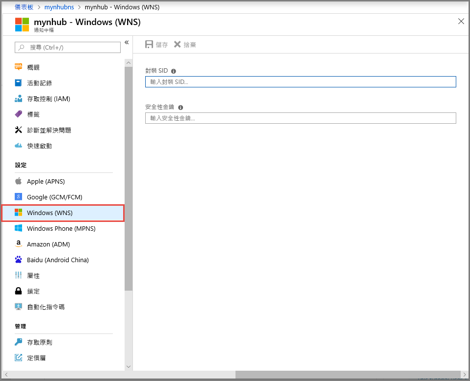

# <a name="tutorial-send-notifications-to-universal-windows-platform-apps-by-using-azure-notification-hubs"></a>教學課程：使用 Azure 通知中樞將通知傳送至通用 Windows 平台應用程式

[!INCLUDE [notification-hubs-selector-get-started](../../includes/notification-hubs-selector-get-started.md)]

在本教學課程中，您會使用 Azure 通知中樞將推播通知傳送至通用 Windows 平台 (UWP) 應用程式。 您會使用 Windows 推播通知服務 (WNS)，建立可接收推播通知的空白 Windows 市集應用程式。 接著，使用通知中樞將推播通知廣播到所有執行您應用程式的裝置。

> [!NOTE]
> 您可以在 [GitHub](https://github.com/Azure/azure-notificationhubs-samples/tree/master/dotnet/GetStartedWindowsUniversal) 上找到本教學課程的完整程式碼。

請執行下列步驟：

> [!div class="checklist"]
> * 在 Windows 市集中建立應用程式
> * 建立通知中樞
> * 在 Windows 應用程式中建立範例
> * 傳送測試通知

## <a name="prerequisites"></a>必要條件

- **Azure 訂用帳戶**。 如果您沒有 Azure 訂用帳戶，請在開始前建立[免費 Azure 帳戶](https://azure.microsoft.com/free/?WT.mc_id=A261C142F)。
- [Microsoft Visual Studio Community 2015](https://www.visualstudio.com/products/visual-studio-community-vs) 或更新版本。
- [已安裝 UWP 應用程式開發工具](https://msdn.microsoft.com/windows/uwp/get-started/get-set-up)
- 有效的 Windows 市集帳戶
- 確認已啟用 [從應用程式和其他傳送者取得通知] 設定。 
    - 在電腦上啟動 [設定] 視窗。
    - 選取 [系統] 圖格。
    - 從左側功能表中選取 [通知與動作]。 
    - 確認已啟用 [從應用程式和其他傳送者取得通知] 設定。 如果未啟用，請加以啟用。 

完成本教學課程是參加 UWP 應用程式所有其他通知中樞教學課程的先決條件。

## <a name="create-an-app-in-windows-store"></a>在 Windows 市集中建立應用程式

若要傳送推播通知給 Windows UWP 應用程式，將您的應用程式與 Windows 市集產生關聯。 接著設定您的通知中樞，以便與 WNS 進行整合。

1. 瀏覽至 [Windows 開發人員中心](https://partner.microsoft.com/en-us/dashboard/windows/first-run-experience)，並使用 Microsoft 帳戶登入，然後選取 [建立新的應用程式]。

    
2. 輸入您的應用程式名稱，然後選取 [保留產品名稱]。 這麼做會為您的應用程式建立新的 Windows 市集註冊。

    
3. 展開 [應用程式管理]，然後依序選取 [WNS/MPNS] 和 [線上服務網站]。 登入您的 Microsoft 帳戶。 **[應用程式註冊入口網站]** 會在新的索引標籤中開啟。或者，您可以直接瀏覽至 [應用程式註冊入口網站](https://apps.dev.microsoft.com) 並選取您的應用程式名稱，以取得此頁面。

    
4. 請記下 [應用程式密碼] 和 [套件安全性識別碼] \(SID\)。

    >[!WARNING]
    >應用程式密碼與封裝 SID 是重要的安全性認證。 請勿與任何人共用這些值，或與您的應用程式一起散發密碼。

## <a name="create-a-notification-hub"></a>建立通知中樞

[!INCLUDE [notification-hubs-portal-create-new-hub](../../includes/notification-hubs-portal-create-new-hub.md)]

### <a name="configure-wns-settings-for-the-hub"></a>設定中樞的 WNS 設定

1. 在 [通知設定] 類別中選取 [Windows (WNS)]。
2. 輸入您在上一節記下的 [套件 SID] 和 [安全性金鑰] 值。
3. 按一下工具列的 [儲存]  。

    

您的通知中樞現在已設定成使用 WNS。 您已擁有可用來註冊應用程式和傳送通知的連接字串。

## <a name="create-a-sample-windows-app"></a>在 Windows 應用程式中建立範例

1. 在 Visual Studio 中，開啟 [檔案] 功能表，選取 [新增]，然後選取 [專案]。
2. 在 [新增專案] 對話方塊中，完成下列步驟：

    1. 展開 **Visual C#**。
    2. 選取 [Windows 通用]。
    3. 選取 [空白應用程式] \(通用 Windows\)。
    4. 輸入專案的 [名稱]  。
    5. 選取 [確定] 。

        ![[新增專案] 對話方塊](./media/notification-hubs-windows-store-dotnet-get-started/new-project-dialog.png)
3. 接受**目標**和**最小**平台版本的預設值，然後選取 [確定]。
4. 在 [方案總管] 中，以滑鼠右鍵按一下 Windows 市集應用程式專案，然後依序選取 [市集] 和 [將應用程式與市集建立關聯]。 隨即顯示 [將您的應用程式與 Windows 市集建立關聯]  精靈。
5. 在此精靈中，使用您的 Microsoft 帳戶登入。
6. 選取您在步驟 2 中註冊的應用程式，選取 [下一步]，然後選取 [關聯]。 這麼做會將所需的 Windows 市集註冊資訊新增至應用程式資訊清單。
7. 在 Visual Studio 中，以滑鼠右鍵按一下方案，然後選取 [管理 NuGet 套件] 。 [管理 NuGet 套件] 視窗隨即開啟。
8. 在搜尋方塊中，輸入 **WindowsAzure.Messaging.Managed**，選取 [安裝] 並接受使用條款。

    ![[管理 NuGet 套件] 視窗][20]

    此動作會使用 [Microsoft.Azure.NotificationHubs NuGet 套件](https://www.nuget.org/packages/Microsoft.Azure.NotificationHubs)來下載、安裝及新增對 Windows 適用之 Azure 通知程式庫的參考。
9. 開啟 `App.xaml.cs` 專案檔案，並新增下列陳述式：

    ```csharp
    using Windows.Networking.PushNotifications;
    using Microsoft.WindowsAzure.Messaging;
    using Windows.UI.Popups;
    ```

10. 在專案的 `App.xaml.cs` 檔案中，找出 `App` 類別，然後新增下列 `InitNotificationsAsync` 方法定義：

    ```csharp
    private async void InitNotificationsAsync()
    {
        var channel = await PushNotificationChannelManager.CreatePushNotificationChannelForApplicationAsync();

        var hub = new NotificationHub("<your hub name>", "<Your DefaultListenSharedAccessSignature connection string>");
        var result = await hub.RegisterNativeAsync(channel.Uri);

        // Displays the registration ID so you know it was successful
        if (result.RegistrationId != null)
        {
            var dialog = new MessageDialog("Registration successful: " + result.RegistrationId);
            dialog.Commands.Add(new UICommand("OK"));
            await dialog.ShowAsync();
        }
    }
    ```

    此程式碼會從 WNS 中擷取應用程式的通道 URI，然後向您的通知中樞註冊該通道 URI。

    >[!NOTE]
    > 使用 Azure 入口網站中顯示的通知中樞名稱，取代 `hub name` 預留位置。 此外，使用您在上一節中從通知中樞的 [存取原則] 頁面取得的 `DefaultListenSharedAccessSignature` 連接字串，取代連接字串預留位置。

11. 在 `App.xaml.cs` 中的 `OnLaunched` 事件處理常式頂端，將下列呼叫新增至新的 `InitNotificationsAsync` 方法：

    ```csharp
    InitNotificationsAsync();
    ```

    此動作會保證每次啟動應用程式時，通道 URI 便會在通知中樞中註冊。

12. 按鍵盤的 **F5** 鍵以執行應用程式。 包含註冊金鑰的對話方塊將會顯示。 按一下 [確定] 以關閉對話方塊。

    

您的應用程式現在已能夠接收快顯通知。

## <a name="send-test-notifications"></a>傳送測試通知

在 [Azure 入口網站](https://portal.azure.com/)中傳送通知，即可在應用程式中快速測試通知的接收。

1. 在 Azure 入口網站中，切換至 [概觀] 索引標籤，然後在工具列上選取 [測試傳送]。

    
2. 在 [測試傳送] 視窗中，執行下列動作：
    1. 針對 [平台]，選取 [Windows]。
    2. 針對 [通知類型]，選取 [快顯通知]。
    3. 選取 [傳送]。

        ![[傳送測試] 窗格](./media/notification-hubs-windows-store-dotnet-get-started/notification-hub-test-send-wns.png)
3. 在視窗底部的 [結果] 清單中，檢視傳送作業的結果。 您也會看到警示訊息。

    
4. 您會看見通知訊息：在您的桌上型電腦上**測試訊息**。

    

## <a name="next-steps"></a>後續步驟
您已使用入口網站或主控台應用程式，將廣播通知傳送至您的所有 Windows 裝置。 若想了解如何將通知推送至特定裝置，請繼續進行下列教學課程：

> [!div class="nextstepaction"]
>[將通知推送至特定裝置](
notification-hubs-windows-notification-dotnet-push-xplat-segmented-wns.md)

<!-- Images. -->
[13]: ./media/notification-hubs-windows-store-dotnet-get-started/notification-hub-create-console-app.png
[14]: ./media/notification-hubs-windows-store-dotnet-get-started/notification-hub-windows-toast.png
[19]: ./media/notification-hubs-windows-store-dotnet-get-started/notification-hub-windows-reg.png
[20]: ./media/notification-hubs-windows-store-dotnet-get-started/notification-hub-windows-universal-app-install-package.png

<!-- URLs. -->
[Use Notification Hubs to push notifications to users]: notification-hubs-aspnet-backend-windows-dotnet-wns-notification.md
[Use Notification Hubs to send breaking news]: notification-hubs-windows-notification-dotnet-push-xplat-segmented-wns.md
[toast catalog]: https://msdn.microsoft.com/library/windows/apps/hh761494.aspx
[tile catalog]: https://msdn.microsoft.com/library/windows/apps/hh761491.aspx
[badge overview]: https://msdn.microsoft.com/library/windows/apps/hh779719.aspx
