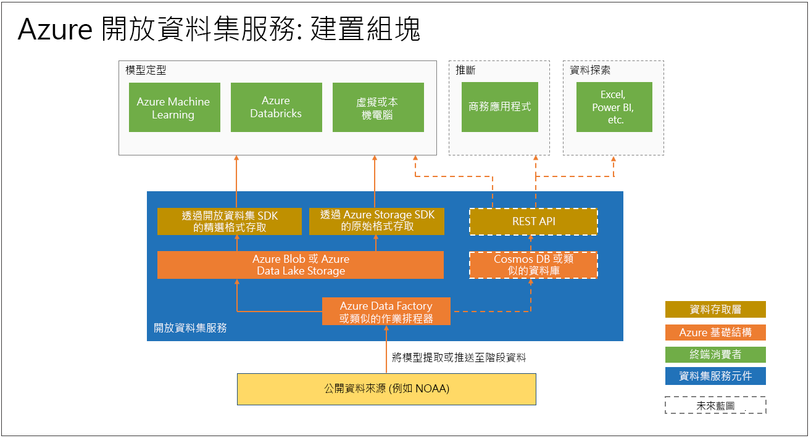

# 什麼是 Azure 開放資料集 (預覽)，以及如何使用它們？

[Azure 開放資料集](https://azure.microsoft.com/services/open-datasets/)是策劃的公用資料集，您可以使用這些公用資料集，將案例專有的功能新增至機器學習解決方案，以獲得更準確的模型。 開放資料集位於 Microsoft Azure 的雲端，而且立即可供 Azure Databricks、機器學習服務和 Machine Learning Studio 使用。 您也可以透過 API 存取資料集，並在其他產品 (例如 Power BI 和 Azure Data Factory) 中使用它們。

資料集包含用於天氣、人口普查、假日、公共安全和位置的公用領域資料，可協助您將機器學習模型定型並擴充預測性解決方案。 您也可以在 Azure 開放資料集上共用公用資料集。 

## 經過策劃、準備的資料集
Azure 開放資料集中經過策劃的開放式公用資料集已針對機器學習工作流程的取用進行最佳化。 

資料科學家通常會花費大部分的時間在清除和準備資料以進行進階分析。 開放資料集會複製到 Azure 雲端進行前置處理，以節省時間。 資料會定期從來源 (例如，透過 FTP 連線至美國國家海洋與大氣層管理局 (NOAA)) 提取、剖析成結構化格式，然後使用最接近的天氣觀測站的郵遞區號或位置等功能適當地擴充。

資料集在 Azure 中與雲端運算共同裝載，讓存取和操作更容易。  

以下是可用資料集的範例。 

### 天氣資料
 
|Dataset         | Notebooks     | 說明                                    |
|----------------|---------------|------------------------------------------------|
|[NOAA 整合式地面資料 (ISD)](https://azure.microsoft.com/services/open-datasets/catalog/noaa-integrated-surface-data/) \(英文\) | [Azure Notebooks](https://azure.microsoft.com/services/open-datasets/catalog/noaa-integrated-surface-data/?tab=data-access#AzureNotebooks)   [Azure Databricks](https://azure.microsoft.com/services/open-datasets/catalog/noaa-integrated-surface-data/?tab=data-access#AzureDatabricks) | 來自 NOAA 的全球每小時天氣資料，北美、歐洲、澳大利亞和亞洲部分地區的空間覆蓋率最高。 每日更新。 |
|[NOAA 全球預測系統 (GFS)](https://azure.microsoft.com/services/open-datasets/catalog/noaa-global-forecast-system/) | [Azure Notebooks](https://azure.microsoft.com/services/open-datasets/catalog/noaa-global-forecast-system/?tab=data-access#AzureNotebooks)   [Azure Databricks](https://azure.microsoft.com/services/open-datasets/catalog/noaa-global-forecast-system/?tab=data-access#AzureDatabricks) | 來自 NOAA 的 15 天美國每小時天氣預測資料。 每日更新。 |

### 行事曆資料

|Dataset         | Notebooks     | 說明                                    |
|----------------|---------------|------------------------------------------------|
|[國定假日](https://azure.microsoft.com/services/open-datasets/catalog/public-holidays/) \(英文\) | [Azure Notebooks](https://azure.microsoft.com/services/open-datasets/catalog/public-holidays/?tab=data-access#AzureNotebooks)   [Azure Databricks](https://azure.microsoft.com/services/open-datasets/catalog/public-holidays/?tab=data-access#AzureDatabricks) | 1970 年到 2099 年的全球國定假日資料，涵蓋 41 個國家/地區。 包含國家/地區，以及大多數人是否帶薪休假。 |

## 資料集的存取  
您可以使用 Azure 帳戶，利用程式碼或透過 Azure 服務介面來存取開放資料集。 資料會與 Azure 雲端運算資源共置，以便用於機器學習解決方案。  

開放資料集提供 Azure Notebooks 與 Azure Databricks 筆記本，可用來將資料連線至 Azure Machine Learning 服務與 Azure Databricks。 您也可以透過 Python SDK 存取資料集。 

不過，您不需要有 Azure 帳戶，就可以存取開放資料集；無論是否有 Spark，都可以從任何 Python 環境存取開放資料集。

## 要求或參與資料集

如果找不到想要的資料，請寄電子郵件給我們，以[要求資料集](mailto:aod@microsoft.com?Subject=Request%20dataset%3A%20%3Creplace%20with%20dataset%20name%3E&Body=%0AYour%20name%20and%20institution%3A%20%0A%0ADataset%20name%3A%0A%20%0ADataset%20description%3A%20%0A%3Cfill%20in%20a%20brief%20description%20and%20share%20any%20web%20links%20of%20the%20dataset%3E%20%0A%0ADataset%20size%3A%20%0A%3Chow%20much%20space%20does%20the%20dataset%20need%20today%20and%20how%20much%20is%20it%20expected%20to%20grow%20each%20year%3E%20%0A%0ADataset%20file%20formats%3A%20%0A%3Ccurrent%20dataset%20file%20formats%2C%20and%20optionally%2C%20any%20formats%20that%20the%20dataset%20must%20be%20transformed%20to%20for%20easy%20access%3E%0A%0ALicense%3A%20%0A%3Cwhat%20is%20the%20license%20or%20terms%20and%20conditions%20governing%20the%20distribution%20of%20this%20dataset%3E%0A%0AUse%20cases%3A%20%0A%3CExplain%20some%20common%20use%20of%20the%20dataset.%20E.g.%20weather%20dataset%20can%20be%20useful%20in%20demand%20forecasting%20and%20predictive%20maintenance%20scenarios%3E%20%0A%0AAny%20additional%20information%20you%20want%20us%20to%20know%3A%0A)或[參與資料集](mailto:aod@microsoft.com?Subject=Contribute%20dataset%3A%20%3Creplace%20with%20dataset%20name%3E&Body=%0AYour%20name%20and%20institution%3A%20%0A%0ADataset%20name%3A%0A%20%0ADataset%20description%3A%20%0A%3Cfill%20in%20a%20brief%20description%20and%20share%20any%20web%20links%20of%20the%20dataset%3E%20%0A%0ADataset%20size%3A%20%0A%3Chow%20much%20space%20does%20the%20dataset%20need%20today%20and%20how%20much%20is%20it%20expected%20to%20grow%20each%20year%3E%20%0A%0ADataset%20file%20formats%3A%20%0A%3Ccurrent%20dataset%20file%20formats%2C%20and%20optionally%2C%20any%20formats%20that%20the%20dataset%20must%20be%20transformed%20to%20for%20easy%20access%3E%0A%0ALicense%3A%20%0A%3Cwhat%20is%20the%20license%20or%20terms%20and%20conditions%20governing%20the%20distribution%20of%20this%20dataset%3E%0A%0AUse%20cases%3A%20%0A%3CExplain%20some%20common%20use%20of%20the%20dataset.%20E.g.%20weather%20dataset%20can%20be%20useful%20in%20demand%20forecasting%20and%20predictive%20maintenance%20scenarios%3E%20%0A%0AAny%20additional%20information%20you%20want%20us%20to%20know%3A%0A)。 

## 後續步驟
* [範例筆記本](samples.md)
* [教學課程：含紐約計程車資料的迴歸模型](tutorial-opendatasets-automl.md)
* [適用於開放資料集的 Python SDK](https://aka.ms/open-datasets-api)
